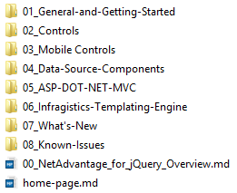
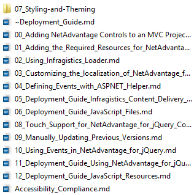
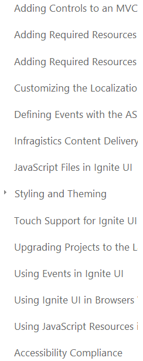
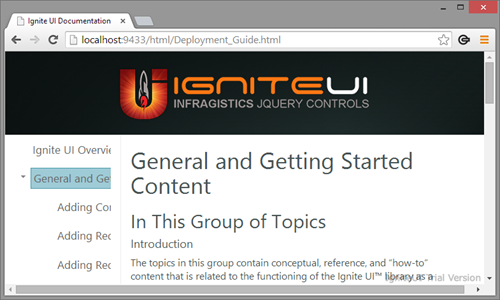

# Table of Contents Naming Conventions

## Summary

The help topic system uses files and folders directly off the file system to generate the table of contents for the help viewer. Folders generate hierarchy in the tree and topic files generate end-nodes. There are also some special case files and naming conventions that the system uses to allow you to correctly name table of contents nodes and control the ordering.

> **Note:** The home-page is excluded from the Table of Contents structure as well as the ordering process that follows, it is just there because "There must always be a... home page!" 

## Source to Result Comparison

The following images show how the files and folders are organized on the
file system and how the table of contents looks based off the structure.

### Files and Folders on the File System

### Table of Contents in the Help Viewer

## Naming Conventions

Every leaf node in the table of contents takes its link from the respective file name normalized to "lower case and dashes" for online and the text from the H1 title of the topic (the initial `# Topic title` line in the content). This title must always be present.

Every folder (parent) node takes its link and text from the file name of its [Landing Page](#parent-files-aka-landing-pages) in the same way. Folder names **are not used for ToC text** so it's a good idea to keep them as short and to the point as possible to maintain a relatively short physical path. This is especially crucial on topic section with deep hierarchy and depends on the repository clone location.

### Topic title to node text cleanup
Many topic titles end with clarification in brackets with relevant controls and features. Those are good for search optimization, but far from ideal for a tree where those are already clearly visible under the respective control/feature node. So to avoid repetition and keep the tree nodes shorter, such clarifications are omitted during generation. 

For example the title "API Reference **(igDialog)**" will only be reflected as **"API Reference"** in the ToC.

## Sorting

When alphabetical sorting does not suit your needs you'll need rename
the files and folders using a numerical prefix in order to allow them to
show up in the appropriate order.

Notice how in this example the **Styling and Theming** node shows up in
the middle of the list in the help viewer even though it appears at the
top of the list in the file system.

Tripwire uses the numerical prefix to conduct the ordering of nodes as
is generates the table of contents JavaScript array.

**Note:** All naming prefixes are stripped off the file names before
publishing.

### Files and Folders on the File System

### Table of Contents in the Help Viewer

## Parent Files (aka 'Landing Pages')

Each parent node is associated to a page. Often these pages are known as
'landing pages'. While the concept of a landing page is suspect, **each
parent node must link to a file**. The way to designate which file is
the parent's page is to prefix the file name with a tilde (`~`).

Notice how the file `~Deployment_Guide.md` is mapped to
`Deployment_Guide.html` when clicking on the parent `General
and Getting Started` node.

### Files and Folders on the File System

### Table of Contents in the Help Viewer

## Linked files
There are some odd cases where topic doesn't make sense in a shared folder, yet it applies to multiple controls/sections and should be presented in each. For these cases, a `*.link` file can be used to point the generation process to another file that should be reused. The link file's only content should be a relative path to the target file:
> *"help-topics/topics/04_Data-Sources/OLAP/02_Xmla/02_Config/03_Configuring_the_Tabular_View.link":*
>
> ../../01_Flat/03_Configuring_the_Tabular_View.md

In this case the link file would point to the "help-topics/topics/04_Data-Sources/OLAP/01_Flat/03_Configuring_the_Tabular_View.md" and a link to this topic will be added in both sections.

The title and file name of the target are used for the node (so all linked nodes point to the same physical file in the end), but the ordering prefix of the `.link` file counts for the ordering in each separate case.
