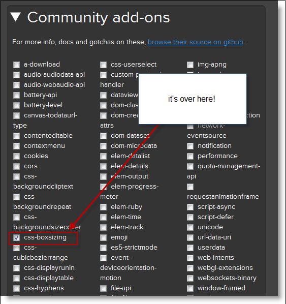

<!--
|metadata|
{
    "fileName": "adding-the-required-resources-for-netadvantage-for-jquery",
    "controlName": [],
    "tags": []
}
|metadata|
-->

# Adding Required Resources Manually

## Topic Overview

### Purpose
This topic explains how to add the required JavaScript resources in Ignite UI™ without using the *Infragistics*®  *Loader*.

### In this topic

This topic contains the following sections:

- [Introduction](#introduction)
- [Requirements](#requirements)
- [Steps](#steps)
- [Related Content](#related-content)

###  Introduction
This procedure shows you how to add manually all required resources (CSS and JavaScript files) to work with the Ignite UI. Following this procedure you will add minified CSS and JavaScript files, which are recommended when you need to reduce the amount of data shared across the web.

The names of the JavaScript files containing the combined scripts for all of Ignite UI are as follows:

-  ` infragistics.core.js`: shared dependencies (required)

-   `infragistics.lob.js`: all line-of-business controls

-   `infragistics.dv.js`: all data visualization controls

They can be found in the `js` folder (the root folder for the JavaScript files in the Ignite UI program installation).There is also a combined script version of the localization resources named, and it resides in the `i18n` folder.

With the exception of the debug version all JavaScript files are minified. The non-minified files are used for debugging purposes. They expose the same folder structure as the minified files and have the same file names. The non-minified files are shipped in a .zip archive called `infragistics.jquery.debug.zip`.

You have a choice to use the combined JavaScript files or the Infragistics loader. The loader pulls separate modules from the modules folder.

- `infragistics.ui.CONTROL_NAME.js`
- `infragistics.ui.CONTROL_NAME.CONTROL_FEATURE.js`

For reference on all scripts required for each control, refer to the [JavaScript Files in Ignite UI](Deployment-Guide-JavaScript-Files.html) topic.

> **Note:** Localization scripts must be referenced before the actual JavaScript files in the page code.

##  Requirements

To complete the procedure, you need the following:

-   A project with any Web application
-   Ignite UI installed
-   [jQuery](http://jquery.com/) core library 1.4.4 version or above
-   [jQuery UI](http://jqueryui.com/) library 1.8.11 or above
-   [Modernizr](http://modernizr.com/) open-source JavaScript library 2.5.2 or above

> **Note:** See a complete list describing which framework versions are supported with each release of Ignite UI at [http://www.infragistics.com/help/supported-environments](http://www.infragistics.com/help/supported-environments).

##  Steps

### Step 1: Add required Infragistics resources.

Copy the resources from the installation directory.

1. The Ignite UI™ resources files are located in the installed directory within the `js` and `css` folder.

	

2. Copy the `css` folder to the `Styles` folder of your Web application.

3. Copy the scripts folder from `js` to the Scripts folder of your Web application.

> **Note**: This procedure assumes you have the styles and scripts directories in your Web application, where you store your CSS and JavaScript files respectively.

### Step ​2: Download and add other required resources.

For development purposes, there are three JavaScript files that should be included in a website: jQuery, jQuery UI, and Modernizr JavaScript file.

Copy the Modernizr JavaScript file.

1. Download the JavaScript library.
2. Copy the downloaded JavaScript file to the Scripts folder of your Web application.

> **Note**: Modernizr JavaScript library is used to detect the current browser features and should be included before all other resources (`css` and `js`).

> **Note**: For IE7 support, customized version of Modernizr `js` file should be created.

There is a requirement with `css-boxsizing`, which is not included in the default packaging for Modernizr. For the purpose you should navigate to the download section of Modernizr site: [http://www.modernizr.com/download/](http://www.modernizr.com/download/)

You should make sure that `css-boxsizing` (from Community add-ons) is checked and then you need to click the Generate button to create a custom build.

#### Copy the JQuery JavaScript file.

1. Download the JavaScript library.

2. Copy the downloaded JavaScript file to the `Scripts` folder of your Web application.

#### Copy the JQuery UI JavaScript file and JQuery UI base theme.

1. Download the JavaScript library.
2. Unzip the downloaded file in your file system and open the folder.
3. Open the `js` folder and copy the downloaded JQuery UI JavaScript file to the Scripts folder of your Web application.
4. Locate the themes folder, inside the development-bundle folder of the unzipped folder.
5. Copy the base folder to your themes folder in your Web application.

> Note: Your `themes` folder is located inside the `Styles` folder of your Web application. If you cannot find it, create the folder.

##  Related Content

### Topics
The following topics provide additional information related to this topic.

- [JavaScript Files in Ignite UI](Deployment-Guide-JavaScript-Files.html): This topic is a reference to the JavaScript files required to work with the controls included in Ignite UI™.
- [Using JavaScript Resources in Ignite UI](Deployment-Guide-JavaScript-Resources.html): This topic explains how to manage the required resources to work with the Ignite UI within a Web application.
- [Styling and Theming Ignite UI](Deployment-Guide-Styling-and-Theming.html): Instructions on setting up your application for design time, options for using CSS in production and an overview on creating or customizing a theme.
- [Infragistics Content Delivery Network (CDN) for Ignite UI](Deployment-Guide-Infragistics-Content-Delivery-Network%28CDN%29.html): This topic explains how to manage the required resources to work with the Ignite UI using Infragistics Loader.

### Resources
The following material (available outside the Infragistics family of content) provides additional information related to this topic.

- [Modernizr](http://modernizr.com/)
- [jQuery](http://jquery.com/)
- [jQuery UI](http://jqueryui.com/)
