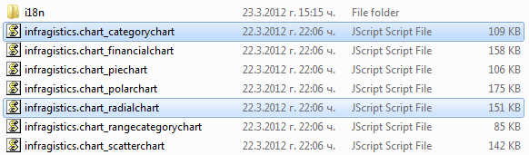

<!--
|metadata|
{
    "fileName": "using-infragistics-loader",
    "controlName": [],
    "tags": []
}
|metadata|
-->

# Adding Required Resources Automatically with the Infragistics Loader

## Topic Overview

### Purpose

This topic explains how to manage the required resources in Ignite UI™ using the *Infragistics*® *Loader*.

#### In this topic

This topic contains the following sections:

-   [Infragistics Loader Overview](#overview)
-   [Initialization of Infragistics Loader](#initialization)
-   [Loading resources with Infragistics Loader](#loading)
-   [Referencing localization resources using the Infragistics Loader](#referencing)
-   [Regional settings using Infragistics Loader](#regional)
-   [Related Content](#related)

#### <a id="overview"></a> Infragistics Loader Overview

The Infragistics loader is used to load scripts and styles modules. It is introduced in Volume 2012.2.

When using the combined JavaScript files, you include all minified and combined scripts for an entire group of controls. If you want to add the resources needed for separate controls you can use Infragistics loader for the purpose.

You should specify the CssPath and ScriptPath: Script and CSS path relative to the page that instantiates the loader and add the loader in jQuery with a Path:

```
{IG Resources root}/js/infragistics.loader.js
```

to your application:

> **Note:** If you initialize a control through MVC Wrappers, all dependent resources are loaded automatically.

**In ASPX:**

```csharp
<script src="{IG Resources root}/js/infragistics.loader.js"></script>
    <%= Html.Infragistics()
        .Loader()
        .ScriptPath("{IG Resources root}/js/")
        .CssPath("{IG Resources root}/css/")
        .Render()    %>
```

### <a id="initialization"></a>Initialization of Infragistics Loader

There are the following basic ways to initialize Infragistics Loader:

1.  **Load resources on demand with separate initialization**

	If resources are specified during loader instantiation, the files start loading right away. If not, it is necessary to defer instantiating widgets to the loader’s callback to ensure that all JavaScript files are available.
	
	**In JavaScript:**
	
	```js
	$.ig.loader({
	    scriptPath: '{IG Resources root}/js/',
	    cssPath: '{IG Resources root}/css/'
	});  
	// separate initializations                   
	$.ig.loader('igGrid.Paging.Updating', 
	     function () {
	     // Create a couple of igGrids 
	        $("#grid1").igGrid({
	            virtualization: false,
	            autoGenerateColumns: true,
	            jQueryTemplating: false,
	```

2.  **Initialize and use the ready option which takes a function that is to be called when all resources are loaded.**

	**In JavaScript:**
	
	```js
	$.ig.loader({       
	  scriptPath: '{IG Resources root}/js/',
	  cssPath: '{IG Resources root}/css/',
	  resources: 'igGrid.*,igTree',
	  ready: function () { 
	    // THIS FUNCTION WILL BE CALLED WHEN ALL RESOURCES ARE LOADED
	  } 
	});  
	```

3.  **Initializing Infragistics loader separately.**

	**In JavaScript:**
	
	```js
	$.ig.loader({
	    scriptPath: '{IG Resources root}/js/',
	    cssPath: '{IG Resources root}/css/',
	    resources: 'igGrid.Sorting.Filtering'
	});
                 
	$.ig.loader(function () {
	    // Create a couple of igGrids 
	    $("#grid1").igGrid({
	        virtualization: false,
	        autoGenerateColumns: true,        
	        . . .
		});
	});
	```

4.  **Initializing using chained methods.**

	**In JavaScript:**
	
	```js
	$.ig.loader().load('igGrid.*', function () {}).load('igTree', function() {});
	```

#### <a id="loading"></a>Loading resources with Infragistics Loader

The main ways to load resources are listed below.

1.  Load single resource.

	As shown in the code below, you must provide the path to required CSS and JavaScript files and declare which resources the loader will fetch for the page. This code snippet loads the igGrid control with the Sorting feature.
	
	> **Note**: If you initialize a control through MVC Wrappers, all dependent resources are loaded automatically.
	
	**In JavaScript:**
	
	```js
	<script type="text/javascript">
	    $.ig.loader({
	        scriptPath: "{IG Resources root}/js/",
	        cssPath: "{IG Resources root}/css/",
	        resources: "igGrid.Sorting"
	    });
	    $.ig.loader(function () {
	        $("#grid1").igGrid({
	            autoGenerateColumns: false,
	            columns: [. . .],
	            dataSource: adventureWorks,
	            features: [{
					name: "Sorting",
	                type: "local",
	                mode: "multiple"
	            }]
	        });
	    });
	</script> 
	```

2.  Load multiple resources.

	Comma separated list of resources to load.
	
	For example: `igTree,igVideoPlayer,igGrid.Paging`.
	
	**In JavaScript:**
	
	```js
	$.ig.loader({
	    scriptPath: '{IG Resources root}/js/',
	    cssPath: '{IG Resources root}/css/',
	    resources: 'igGrid,igTree'
	});
	```
	
	Modular widgets, such as igGrid, allow linking features with a `.` (dot).
	
	If you want to load `categorychart` and `radialchart` scripts, include the code snippet below.
	
	
	
	**In JavaScript:**
	
	```js
	$.ig.loader({
	    scriptPath: "{IG Resources root}/js/",
	    cssPath: "{IG Resources root}/css/",
	    resources: "igDataChart.Category.Radial"
	});
	```

3.  Load all resources.

	To load all modules of a widget use `*`. Ex: `igGrid.*`. Thus you can load all the scripts related with the control.
	
	**In JavaScript:**
	
	```js
	$.ig.loader({
	    scriptPath: '{IG Resources root}/js/',
	    cssPath: '{IG Resources root}/css/',
	    resources: 'igHierarchicalGrid.*'
	});
	```

4.  Loading external resources

	To load external resources you should specify relative path to the `js` files, separated by comma:
	
	**In JavaScript:**
	
	```js
	$.ig.loader({
	    scriptPath: '{IG Resources root}/js/',
	    cssPath: '{IG Resources root}/css/',
	    resources: "igGrid.*, 
	        extensions/infragistics.datasource.knockoutjs.js, 
	        extensions/infragistics.ui.grid.knockout-extensions.js"
	});
	```

### <a id="referencing"></a>Referencing Resources Using the Infragistics Loader

Localization of the widgets is controlled by the locale option.

In the products the following locales are currently supported:

1.  English(en)
2.  Japanese(ja)
3.  Bulgarian(bg)
4.  Russian(ru)
5.  German (de)
6.  Spanish (es)
7.  French (fr)

In the English version of the product en resources are merged with the widget code. In Japanese version `ja` resources are merged with the widget code. When these locales are set, then the files are not requested by the loader in each respective version.

The loader can also automatically detect the language of the browser’s UI and switch to this locale. It is controlled by the `autoDetectLocale` option, which is set to `false` by default. If `autoDetectLocale` is set and locale is set, the locale option takes precedence.

### <a id="regional"></a>Regional settings using Infragistics Loader

Regional settings are supported by such controls as editors. The loader automatically loads regional settings inferring it from locale option or from auto detection of the browser UI.

To force the loader to load some other regional setting, the regional option needs to be used.

These settings are compliant with the standard for regional settings and can be either 2 characters, or 5 characters long. All regional files can be found in folder

```
{IG Resources root}/js/modules/i18n/regional/
```

**In JavaScript:**

```js
$.ig.loader({
    scriptPath: '{IG Resources root}/js/',
    cssPath: '{IG Resources root}/css/',
    resources: 'igHierarchicalGrid.*',
    locale: “bg”,
    regional :”en-GB”
});
```

> **Note:** When the jQuery UI date picker widget is configured to be used with the Infragistics editors, it is necessary to do separate setting for the datepicker’s regional settings.

 **jquery-ui-i18n.min.js** **must be referenced on the page.**

Regional setting needs to be specified:

```
$.datepicker.setDefaults($.datepicker.regional['ru']);
```

When setting regional settings for editors the following file must be referenced on the page:

```
infragistics.ui.regional-i18n.js
```

Accepted values for regional option are the ending of the files in the regional folder. They are the same as the standard ones supported by jQuery:

- af (South Africa)
- ar (Arabic)
- az (Azerbaijan, Latin)
- bg (Bulgaria)
- bs (Bosnia)
- ca (Catalan)
- cs (Czech)
- da (Denmark)
- de (Germany)
- el (Greece)
- en-GB (English, United Kingdom)
- es (Spain)
- et (Estonia)
- fa (Farsi, Iran)
- fi (Finland)
- fo (Faroe)
- fr-CH (French, Switzerland)
- fr (France)
- he (Hebrew, Israel)
- hr (Croatia)
- hu (Hungary)
- hy (Armenia)
- id (Indonesia)
- is (Iceland)
- it (Italy)
- ja (Japan)
- ko (Korea)
- lt (Lithuania)
- lv (Latvia)
- ms (Malaysia)
- nl (Dutch, Netherlands)
- no (Norway)
- pl (Poland)
- pt-BR (Brazil)
- ro (Romania)
- ru (Russia)
- sk (Slovakia)
- sl (Slovenia)
- sq (Albania)
- sr (Cyrillic, Serbia)
- sr-SR (Latin, Serbia)
- sv (Sweden)
- ta (Tamil, India)
- th (Thailand)
- tr (Turkey)
- uk (Ukraine)
- vi (Vietnam)
- zh-CN (PRC, China)
- zh-HK (Hong Kong SAR PRC, China)
- zh-TW (Taiwan, China)

## Infragistics Loader Resources Reference

#### Infragistics Loader Resources Reference Chart

The following table lists Infragistics Loader valid resource strings.

<table class="table table-striped">
	<thead>
		<tr>
			<th>Module</th>
			<th>Infragistics Loader Resource Strings</th>
		</tr>
	</thead>
	<tbody>
		<tr>
			<td>igCombo</td>
			<td>igCombo</td>
		</tr>
		<tr>
			<td>igDataSource</td>
			<td>igDataSource</td>
		</tr>
		<tr>
			<td>igDataChart</td>
			<td>
				igDataChart
				
				<h4>Features</h4>
				<p>Features can be chained together in one string with a period `.` separating each feature, e.g. `igDataChart.Category.Financial`.</p>
				<p>To include all the features use:</p>

				<ul>
					igDataChart.\*
					<ul>
						<li>Category</li>
						<li>Financial</li>
						<li>Polar</li>
						<li>Radial</li>
						<li>RangeCategory</li>
						<li>Scatter</li>
					</ul>
				</ul>
			</td>
		</tr>
		<tr>
			<td>igDialog</td>
			<td>igDialog</td>
		</tr>
		<tr>
			<td>igEditors</td>
			<td>igEditors</td>
		</tr>
		<tr>
			<td>igGrid</td>
			<td>igGrid

			<h4>Features:</h4>
			<p>Features can be chained together in one string with a period `.` separating each feature, e.g. `igGrid.Paging.Sorting`.</p>
			<p>To include all the features use `igGrid.*`.</p>

			<ul>
				<li>igGrid.\*
					<ul>
						<li> ColumnMoving </li>
						<li> FeatureChooser </li>
						<li> Filtering </li>
						<li> GroupBy </li>
						<li> Hiding </li>
						<li> MergedCells </li>
						<li> Paging </li>
						<li> Resizing </li>
						<li> RowSelectors </li>
						<li> Selection </li>
						<li> Sorting </li>
						<li> Summaries </li>
						<li> MultiColumnHeaders </li>
						<li> Tooltips </li>
						<li> Updating </li>
					</ul>
				</li>
			</ul>

			</td>
		</tr>
		<tr>
			<td>igHierarchicalGrid</td>
			<td>igHierarchicalGrid

				<h4>Features:</h4>
				<p>Features can be chained together in one string with a period `.` separating each feature, e.g. `igHierarchicalGrid.Paging.Sorting`.</p>
				
				<p>To include all the features use `igHierarchicalGrid.*`.</p>
				
				<ul>
					<li>igHierarchicalGrid.\*
						<ul>
							<li>ColumnMoving</li>
							<li>FeatureChooser</li>
							<li>Filtering</li>
							<li>GroupBy</li>
							<li>Hiding</li>
							<li>MergedCells</li>
							<li>Paging</li>
							<li>Resizing</li>
							<li>RowSelectors</li>
							<li>Selection</li>
							<li>Sorting</li>
							<li>Summaries</li>
							<li>MultiColumnHeaders</li>
							<li>Tooltips</li>
							<li>Updating</li>
						</ul>
					</li>
				</ul>

			</td>
		</tr>
		<tr>
			<td>igHtmlEditor</td>
			<td>igHtmlEditor</td>
		</tr>
		<tr>
			<td>igMap</td>
			<td>igMap</td>
		</tr>
		<tr>
			<td>igOlapDataSource</td>
			<td>igOlapDataSource</td>
		</tr>
		<tr>
			<td>igPieChart</td>
			<td>igPieChart</td>
		</tr>
		<tr>
			<td>igPivotGrid</td>
			<td>igPivotGrid</td>
		</tr>
		<tr>
			<td>igRating</td>
			<td>igRating</td>
		</tr>
		<tr>
			<td>igReportViewer</td>
			<td>igReportViewer</td>
		</tr>
		<tr>
			<td>igTemplating</td>
			<td>igTemplating</td>
		</tr>
		<tr>
			<td>igTree</td>
			<td>igTree</td>
		</tr>
		<tr>
			<td>igUpload</td>
			<td>igUpload</td>
		</tr>
		<tr>
			<td>igVideoPlayer</td>
			<td>igVideoPlayer</td>
		</tr>
	</tbody>
</table>

## <a id="related"></a> Related Content

### Topics

The following topics provide additional information related to this topic.

- [JavaScript Files in Ignite UI](Deployment-Guide-JavaScript-Files.html): This topic is a reference to the JavaScript files required to work with the controls included in Ignite UI™.
- [Infragistics Content Delivery Network (CDN) for Ignite  UI](Deployment-Guide-Infragistics-Content-Delivery-Network%28CDN%29.html): Instructions on using Infragistics Content Delivery Network (CDN) in Ignite UI.
- [Adding Required Resources Manually](Adding-the-Required-Resources-for-NetAdvantage-for-jQuery.html): This topic explains the new organization of JavaScript resources in Ignite UI™
- [Using JavaScript Resources in Ignite UI](Deployment-Guide-JavaScript-Resources.html): This topic explains how to manage the required resources to work with the Ignite UI within a Web application.
