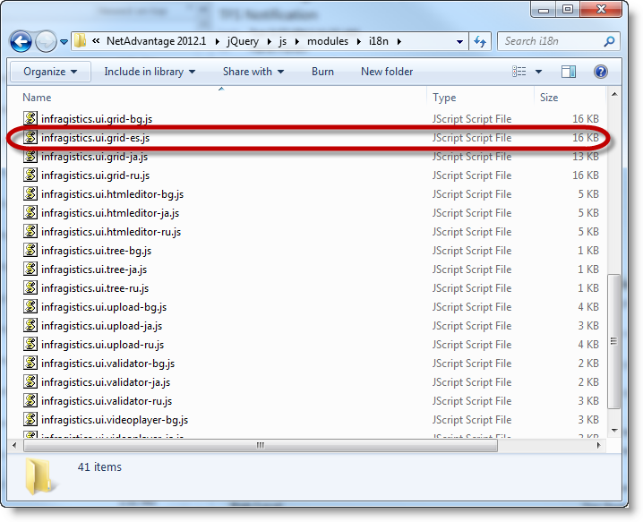

<!--
|metadata|
{
    "fileName": "customizing-the-localization-of-netadvantage-for-jquery-controls",
    "controlName": [],
    "tags": []
}
|metadata|
-->

# Customizing the Localization of Ignite UI Controls

##Topic Overview

### Purpose

This topic explains how to localize the Ignite UI™ controls in your language of choice.

### Required Background

The following table lists the topics required as a prerequisite to understanding this topic.

[Using JavaScript Resources in Ignite UI](Deployment-Guide-JavaScript-Resources.html) : This topic describes Ignite UI folder structure, how to use Infragistics loader and how to manually reference controls.

### In this topic

This topic contains the following sections:

-   [Introduction](#Introduction)
-   [Control Localization Files Reference](#Localization)
   -   [Introduction](#subIntroduction)
    -   [Control localization reference summary](#LocalizationSummary)
-   [Walkthrough: Localizing igGridPaging](#Walkthrough)
   -   [Introduction](#WalkthroughIntroduction)
    -   [Preview](#Preview)
    -   [Requirements](#Requirements)
    -   [Overview](#Overview)
    -   [Steps](#Steps)
-   [Related Content](#RelatedContent)


##<a id="Introduction"></a>Introduction


### Introduction to localizing Ignite UI controls

Currently we ship jQuery controls in the following languages:

-   English
-   Japanese
-   Russian
-   Bulgarian
-   German
-   French
-   Spanish 

This means that in order to get localized version of controls for one of these languages you need to set locale property of Infragistics loader or include the localization file `infragistics-<locale>.js` where `<locale>` is one of the following: en, ja, ru, bg, de, fr, es.

>**Note:**  Infragistics loader cannot be used to load custom localization files.


>**Note:**  We have two redistributable packages, one is for English and one is for Japanese. In English, redistributable package `infragistics-en.js` is not available. Its localization strings are contained inside the controls code at the beginning of the file. In Japanese, redistributable package `infragistics-ja.js` is not available. Its localization strings are contained inside the controls code at the beginning of the file.

If you want to set another language you need to follow a different procedure:

-   Localize the control
   -   Locate localization files. You can find localization files in `<IgniteUI_Install_Folder>\js\modules\i18n`, where <IgniteUI_Install_Folder> points by default to `%%InstallPath%%`

-   To localize control which you want to use make a copy of `*-ru.js` file for the control you want to localize and rename it to `*-<language>.js ` where <language> is two character code of your language.

-   Include the localized file in your project. Include the file you just created into your project. This way, the control will use the strings from your file. This approach will work with Infragistics loader no matter what you’ve set for the locale property.

>**Note:**  This guide assumes that you have installed English redistributable package. In this case you will not have `infragistics-en.js`. That’s why we will use `infragistics-ru.js`. If you feel uncomfortable with that you can get the Japanese redistributable and get the `infragistics-en.js` file from there.


##<a id="Localization"></a>Control Localization Files Reference


### <a id="subIntroduction"></a>Introduction

This section describes the available localization files for Ignite UI controls. You can find these files under the *<IgniteUI_Install_Folder>\js\modules\i18n* folder, where <IgniteUI_Install_Folder> points to the directory where you installed the Ignite UI product.

###<a id="LocalizationSummary"></a> Control localization reference summary

The following table summarizes localization files for Ignite UI controls.

<table class="table">
	<thead>
		<tr>
			<th>Control</th>
			<th>Script Name</th>
		</tr>
	</thead>
	<tbody>
		<tr>
			<td>igChart</td>
			<td>infragistics.dvcommonwidget-ru.js</td>
		</tr>
		<tr>
			<td>igCombo</td>
			<td>infragistics.ui.combo-ru.js</td>
		</tr>
		<tr>
			<td>igDataSource</td>
			<td>infragistics.dataSource-ru.js</td>
		</tr>
		<tr>
			<td>igDialog</td>
			<td>infragistics.ui.dialog-ru.js</td>
		</tr>
		<tr>
			<td>igEditors</td>
			<td>infragistics.ui.editors-ru.js</td>
		</tr>
	</tbody>
</table>

    
>**Note:**  The `igDatePicker` depends on the jQuery UI Datepicker control, that's why it also requires `jquery.ui.datepicker-*.js` localization file which can be found in the jQuery UI redistributable package on their web site.

<table class="table">
	<thead>
		<tr>
			<th>Control</th>
			<th>Script Name</th>
		</tr>
	</thead>
	<tbody>
		<tr>
			<td>igGrid</td>
			<td>infragistics.ui.grid-ru.js</td>
		</tr>
		<tr>
			<td>igHtmlEditor</td>
			<td>infragistics.ui.tree-ru.js</td>
		</tr>
		<tr>
			<td>igUpload</td>
			<td>infragistics.ui.upload-ru.js</td>
		</tr>
		<tr>
			<td>igValidator</td>
			<td>infragistics.ui.validator-ru.js</td>
		</tr>
		<tr>
			<td>igVideoPlayer</td>
			<td>infragistics.ui.videoplayer-ru.js</td>
		</tr>
	</tbody>
</table>   

##<a id="Walkthrough"></a>Walkthrough: Localizing igGridPaging

### <a id="WalkthroughIntroduction"></a>Introduction

This procedure will guide you to the process of localizing `igGridPaging`. For the demonstration purposes we will use Spanish localization.

###<a id="Preview"></a> Preview

The following screenshot is a preview of the final result.


### <a id="Requirements"></a>Requirements

To complete the procedure, you need an installation of Ignite UI %%ProductVersionShort%% (English redistributable).

>**Note**:  We assume that the installation path is `%%InstallPath%%`

###<a id="Overview"></a> Overview

This topic takes you step-by-step toward localizing `igGridPaging`. The following is a conceptual overview of the process:

​1. [Making a copy of infragistics.ui.grid-ru.js and renaming it to infragistics.ui.grid-es.js](#copy_localization_file)

​2. [Localizing infragistics.ui.grid-es.js](#localize_file)

​3. [Including localized file along with the script references in your project](#include_localized_file)

### <a id="Steps"></a>Steps

The following steps demonstrate how to localize x control.

1. <a id="copy_localization_file"></a> Making a copy of `infragistics.ui.grid-ru.js` and renaming it to `infragistics.ui.grid-es.js`

	Copy `%%InstallPath%%\js\modules\i18n\infragistics.ui.grid-ru.js` to `%%InstallPath%%\js\modules\i18n\infragistics.ui.grid-es.js`
	
	The result is shown in the following screenshot:
	
	

2. <a id="localize_file"></a> Localizing infragistics.ui.grid-es.js

	Open file `%%InstallPath%%\j\smodulesi18n\infragistics.ui.grid-es.js` with text editor and translate `igGridPaging` section strings into your language. In our case this is Spanish.
	
	>**Note:**  `infragistics.ui.grid-es.js` contains localization strings for all `igGrid` features, so you do not have to translate the whole file if you do not need to use all `igGrid` features.
	
	**In JavaScript:**
	
	```js
	$.ig.GridPaging = $.ig.GridPaging || {};
	          $.extend( $.ig.GridPaging , {
	          locale : {
	              pageSizeDropDownLabel: "Muestreme los registros",
	              pageSizeDropDownTrailingLabel: "registros",
	              nextPageLabelText: "siguienta",
	              prevPageLabelText: "anterior",
	              firstPageLabelText: "",
	              lastPageLabelText: "",
	              currentPageDropDownLeadingLabel: "Pg",
	              currentPageDropDownTrailingLabel: "de ${count}",
	              currentPageDropDownTooltip: "Elija índice de página",
	              pageSizeDropDownTooltip: "Elija el número de registros por página",
	              pagerRecordsLabelTooltip: "Rango de registros actual",
	              prevPageTooltip: "Vaya a la página siguiente",
	              nextPageTooltip: "Vaya a la página anterior",
	              firstPageTooltip: "Vaya a la página primera",
	              lastPageTooltip: "Vaya a la página última",
	              pageTooltipFormat: "página ${index}",
	              pagerRecordsLabelTemplate: "${startRecord} - ${endRecord} de ${recordCount} registros"
	              }
	          });
	```              

3. <a id="include_localized_file"></a> Including localized file along with the script references in your project

	Create an HTML file to test the result. In the HTML file include the necessary files for `igGridPaging` as shown in the screenshot below.
	
	**In HTML:**
	
	```html
	<script src="../scripts/modernizr.min.js"></script>
	<script src="../scripts/jquery.min.js"></script>
	<script src="../scripts/jquery-ui.min.js"></script>
	<script src="../../js/modules/i18n/infragistics.ui.grid-es.js"></script>
	<script src="../../js/infragistics.loader.js"></script>
	```
              
##<a id="RelatedContent"></a>Related Content

### Topics

The following topics provide additional information related to this topic.

- [Deployment Guide](Deployment-Guide.html): This topic describes how to deploy Ignite UI controls.

- [JavaScript Files in Ignite UI](Deployment-Guide-JavaScript-Files.html) : This topic lists all JavaScript files in Ignite UI.


 

 


