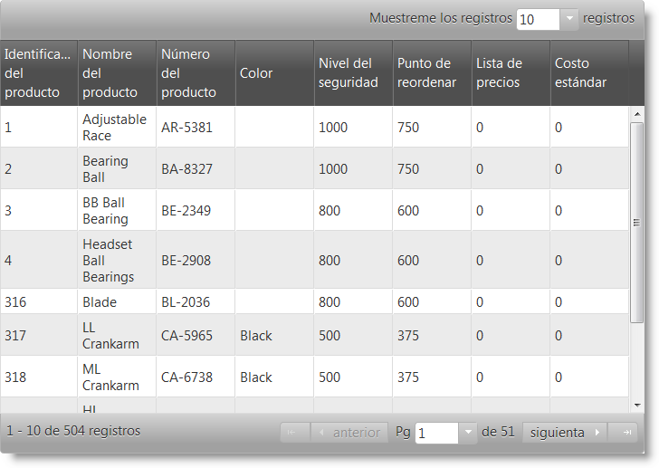

<!--
|metadata|
{
    "fileName": "customizing-the-localization-of-netadvantage-for-jquery-controls",
    "controlName": [],
    "tags": []
}
|metadata|
-->

# Customizing the Localization of %%ProductName%% Controls

##Topic Overview

### Purpose

This topic explains how to localize the %%ProductName%%™ controls in your language of choice.

### Required Background

The following table lists the topics required as a prerequisite to understanding this topic.

[Using JavaScript Resources in %%ProductName%%](Deployment-Guide-JavaScript-Resources.html) : This topic describes %%ProductName%% folder structure, how to use Infragistics loader and how to manually reference controls.

### In this topic

This topic contains the following sections:

-   [Introduction](#Introduction)
-   [Control Localization Files Reference](#Localization)
   -   [Introduction](#subIntroduction)
    -   [Control localization reference summary](#LocalizationSummary)
- [Setting language, locale and regional options](#set)
- [Changing language and regional settings](#change)
	- [Changing language](#change-locale)
	- [Changing regional](#change-regional)
-   [Walkthrough: Localizing igGridPaging](#Walkthrough)
-   [Walkthrough: Changing language and locale runtime for all controls on the page](#Walkthrough2)
   -   [Introduction](#WalkthroughIntroduction)
    -   [Preview](#Preview)
    -   [Requirements](#Requirements)
    -   [Overview](#Overview)
    -   [Steps](#Steps)
-   [Related Content](#RelatedContent)


##<a id="Introduction"></a>Introduction


### Introduction to localizing %%ProductName%% controls

Currently we ship jQuery controls in the following languages:

-   English
-   Japanese
-   Russian
-   Bulgarian
-   German
-   French
-   Spanish 

In order to localize controls for one of these languages you need to load the related locale files either via the Infragistics loader or by referencing the localization file `infragistics-<locale>.js` where `<locale>` is one of the following: en, ja, ru, bg, de, fr, es.
Once the desired locales are loaded you can specify which one should be applied globally or per control.
To set globbally the prefered language you can set $.ig.util.language before initializing the controls:

**In JavaScript:**
	
```js
	$.ig.util.language = language;
```

Additionally each localizable control has a `language` property, which determines the language that it will use when loaded.
Note that if this property is set it will take precedence over the globally set language for the particular control.

>**Note:**  We have two redistributable packages, one is for English and one is for Japanese. In English, redistributable package `infragistics-en.js` is not available. Its localization strings are contained inside the controls code at the beginning of the file. In Japanese, redistributable package `infragistics-ja.js` is not available. Its localization strings are contained inside the controls code at the beginning of the file.

>**Note:**  When English locale resources are loaded, they are used by default. If the English locale resources are not loaded on the page, then the first loaded resources are the default choice for locale resources. Also keep in mind that in the English redistributable package, English localization strings are part of the product files, therefore are always loaded for this package.

>**Note:**  The default regional setting is "en-US", but if this one is not loaded on the page the last loaded regional settings are used as default regional settings.

If you want to set a custom language you need to follow a different procedure:

-   Localize the control
   -   Locate localization files. You can find localization files in `<IgniteUI_Install_Folder>\js\modules\i18n`, where <IgniteUI_Install_Folder> points by default to `%%InstallPath%%`

-   To localize control which you want to use make a copy of `*-ru.js` file for the control you want to localize and rename it to `*-<language>.js ` where <language> is two character code of your language.

-   Include the localized file in your project. Include the file you just created into your project. This way, the control will use the strings from your file. This approach will work with Infragistics loader no matter what you’ve set for the locale property.

>**Note:**  This guide assumes that you have installed English redistributable package. In this case you will not have `infragistics-en.js`. That’s why we will use `infragistics-ru.js`. If you feel uncomfortable with that you can get the Japanese redistributable and get the `infragistics-en.js` file from there.

## <a id="Localization"></a>Control Localization Files Reference


### <a id="subIntroduction"></a>Introduction

This section describes the available localization files for %%ProductName%% controls. You can find these files under the *<IgniteUI_Install_Folder>\js\modules\i18n* folder, where <IgniteUI_Install_Folder> points to the directory where you installed the %%ProductName%% product.

###<a id="LocalizationSummary"></a> Control localization reference summary

The following table summarizes localization files for %%ProductName%% controls.

<table class="table">
	<thead>
		<tr>
			<th>Control</th>
			<th>Script Name</th>
		</tr>
	</thead>
	<tbody>
		<tr>
			<td>igChart</td>
			<td>infragistics.dvcommonwidget-ru.js</td>
		</tr>
		<tr>
			<td>igCombo</td>
			<td>infragistics.ui.combo-ru.js</td>
		</tr>
		<tr>
			<td>igDataSource</td>
			<td>infragistics.dataSource-ru.js</td>
		</tr>
		<tr>
			<td>igDialog</td>
			<td>infragistics.ui.dialog-ru.js</td>
		</tr>
		<tr>
			<td>igEditors</td>
			<td>infragistics.ui.editors-ru.js</td>
		</tr>
	</tbody>
</table>

    
>**Note:**  The `igDatePicker` depends on the jQuery UI Datepicker control, that's why it also requires `jquery.ui.datepicker-*.js` localization file which can be found in the jQuery UI redistributable package on their web site.

<table class="table">
	<thead>
		<tr>
			<th>Control</th>
			<th>Script Name</th>
		</tr>
	</thead>
	<tbody>
		<tr>
			<td>igGrid</td>
			<td>infragistics.ui.grid-ru.js</td>
		</tr>
		<tr>
			<td>igHtmlEditor</td>
			<td>infragistics.ui.tree-ru.js</td>
		</tr>
		<tr>
			<td>igUpload</td>
			<td>infragistics.ui.upload-ru.js</td>
		</tr>
		<tr>
			<td>igValidator</td>
			<td>infragistics.ui.validator-ru.js</td>
		</tr>
		<tr>
			<td>igVideoPlayer</td>
			<td>infragistics.ui.videoplayer-ru.js</td>
		</tr>
	</tbody>
</table>

# <a id="set"></a> Setting `language`, `locale` and `regional` options

The controls `language`, `regional` and `locale` options can be set in both JavaScript and ASP.NET MVC. 

**In JavaScript:**
```js
	$("#combo").igCombo({
			language: "en",
			regional:"en-GB",
			locale: {
				dropDownButtonTitle: 'New drop down title'
			}
    	    		dataSource: colors,
                    	textKey: "Name",
                    	valueKey: "Name",
                    	width: "200px"
        });
```
When using IgniteUI MVC Wrappers `locale` option,which is of type object, for igGrid, igTreeGrid and igHierarachicalGrid can be set vie both lambda expression and string. For all other controls is set only via string.

**In Razor:**

igTreeGrid - `locale` option set with lambda expressions
```csharp
@(Html.Infragistics().TreeGrid(Model)
        .ID("treegrid1")
        .Width("100%")
		.Language("en")
		.Regional("en-GB")
		.Locale(l =>l.ExpandTooltipText("New Expand Tooltip").CollapseTooltipText("New Collapse Tooltip"))
        .AutoGenerateColumns(false)
        .PrimaryKey("ID")
        .ChildDataKey("Files")
        .RenderExpansionIndicatorColumn(true)
        .InitialExpandDepth(1)
        .Columns(column =>
            {
                column.For(x => x.ID).Hidden(true);
                column.For(x => x.Name).HeaderText("Name").Width("30%");
                column.For(x => x.DateModified).HeaderText("Date Modified").Width("20%");
                column.For(x => x.Type).HeaderText("Type").Width("20%");
                column.For(x => x.Size).HeaderText("Size in KB").Width("20%");
            })
        .DataBind()
        .Render()
    )
```
igTreeGrid - `locale` option set with string
```csharp
@(Html.Infragistics().TreeGrid(Model)
        .ID("treegrid1")
        .Width("100%")
		.Language("en")
		.Regional("en-GB")
		.Locale("{expandTooltipText: 'New Expand Tooltip', collapseTooltipText: 'New Collapse Tooltip' }")
        .AutoGenerateColumns(false)
        .PrimaryKey("ID")
        .ChildDataKey("Files")
        .RenderExpansionIndicatorColumn(true)
        .InitialExpandDepth(1)
        .Columns(column =>
            {
                column.For(x => x.ID).Hidden(true);
                column.For(x => x.Name).HeaderText("Name").Width("30%");
                column.For(x => x.DateModified).HeaderText("Date Modified").Width("20%");
                column.For(x => x.Type).HeaderText("Type").Width("20%");
                column.For(x => x.Size).HeaderText("Size in KB").Width("20%");
            })
        .DataBind()
        .Render()
    )
```

# <a id="change"></a> Changing language and regional settings

## <a id="change-locale"></a> Changing language

The controls' language can be set via the `language` option and can be changed runtime in one of the following ways:
- Globally for all Ignite UI widgets on the page via the util changeGlobalLanguage function.

	**In JavaScript:**
	
	```js
		$.ig.util.changeGlobalLanguage("ru");
	```
- Per control via setting the control's `language` option.

	**In JavaScript:**
	
	```js
		grid.igGrid("option", "language", "ru");
	```

>**Note:** The related localization file for the language that you want to set will need to be loaded on the page beforehand.

## <a id="change-regional"></a> Changing regional

The regional settings of the control can be set via the `regional` option and can be set in one of the following ways:

- Globally for all Ignite UI widgets on the page via the util changeGlobalRegional function.

	**In JavaScript:**
	
	```js
		$.ig.util.changeGlobalRegional("ru");
	```
- Per control via setting the control's `language` option.

	**In JavaScript:**
	
	```js
		grid.igGrid("option", "regional", "ru");
	```
>**Note:** The igGrid control also allows setting regional settings per column. This allows different columns to have different regional formatting of the data.

**In JavaScript:**
		
```js
grid.igGrid({
	columns: [
		{ headerText: "Price", key: "Price", dataType: "number", width: "200px", regional: "en" },
		{ headerText: "Date", key: "Date", dataType: "date", width: "200px", regional: "ru" }
		]
});
```

## <a id="Walkthrough"></a>Walkthrough: Localizing igGridPaging with custom locale

### <a id="WalkthroughIntroduction"></a>Introduction

This procedure will guide you to the process of localizing `igGridPaging`. For the demonstration purposes we will use Spanish localization.

###<a id="Preview"></a> Preview

The following screenshot is a preview of the final result.



### <a id="Requirements"></a>Requirements

To complete the procedure, you need an installation of %%ProductName%% %%ProductVersionShort%% (English redistributable).

>**Note**:  We assume that the installation path is `%%InstallPath%%`

###<a id="Overview"></a> Overview

This topic takes you step-by-step toward localizing `igGridPaging`. The following is a conceptual overview of the process:

​1. [Making a copy of infragistics.ui.grid-ru.js and renaming it to infragistics.ui.grid-es.js](#copy_localization_file)

​2. [Localizing infragistics.ui.grid-es.js](#localize_file)

​3. [Including localized file along with the script references in your project](#include_localized_file)

### <a id="Steps"></a>Steps

The following steps demonstrate how to localize x control.

1. <a id="copy_localization_file"></a> Making a copy of `infragistics.ui.grid-ru.js` and renaming it to `infragistics.ui.grid-es.js`

	Copy `%%InstallPath%%\js\modules\i18n\infragistics.ui.grid-ru.js` to `%%InstallPath%%\js\modules\i18n\infragistics.ui.grid-es.js`
	
	The result is shown in the following screenshot:
	
	

2. <a id="localize_file"></a> Localizing infragistics.ui.grid-es.js

	Open file `%%InstallPath%%\js\modules\i18n\infragistics.ui.grid-es.js` with text editor and translate `igGridPaging` section strings into your language. In our case this is Spanish.
	
	>**Note:**  `infragistics.ui.grid-es.js` contains localization strings for all `igGrid` features, so you do not have to translate the whole file if you do not need to use all `igGrid` features.
	
	**In JavaScript:**
	
	```js
	$.ig.locale.es.GridPaging = {
			optionChangeNotSupported: "{optionName} no se puede editar tras la inicialización. Su valor debe establecerse durante la inicialización.",
			pageSizeDropDownLabel: "Mostrar ",
			pageSizeDropDownTrailingLabel: "registros",
			nextPageLabelText: "siguiente",
			prevPageLabelText: "anterior",
			firstPageLabelText: "",
			lastPageLabelText: "",
			currentPageDropDownLeadingLabel: "Pág",
			currentPageDropDownTrailingLabel: "de ${count}",
			currentPageDropDownTooltip: "Elegir índice de páginas",
			pageSizeDropDownTooltip: "Elegir número de registros por página",
			pagerRecordsLabelTooltip: "Intervalo de registros actuales",
			prevPageTooltip: "ir a la página anterior",
			nextPageTooltip: "ir a la página siguiente",
			firstPageTooltip: "ir a la primera página",
			lastPageTooltip: "ir a la última página",
			pageTooltipFormat: "página ${index}",
			pagerRecordsLabelTemplate: "${startRecord} - ${endRecord} de ${recordCount} registros",
			invalidPageIndex: "Índice de página no válido: debería ser igual o superior a 0 e inferior al número de página"
	};
	```              

3. <a id="include_localized_file"></a> Including localized file along with the script references in your project

	Create an HTML file to test the result. In the HTML file include the necessary files for `igGridPaging` as shown in the screenshot below.
	
	**In HTML:**
	
	```html
	<script src="../scripts/modernizr.min.js"></script>
	<script src="../scripts/jquery.min.js"></script>
	<script src="../scripts/jquery-ui.min.js"></script>
	<script src="../../js/modules/i18n/infragistics.ui.grid-es.js"></script>
	<script src="../../js/infragistics.loader.js"></script>
	```
## <a id="Walkthrough2"></a>Walkthrough: Changing language and locale runtime for all controls on the page

The following procedure will guide you to the proccess of changing the language and regional settings globally for all controls on the page.

### <a id="Steps"></a>Steps

1. Load all locale and regional resources using the igLoader.

**In JavaScript:**
	
```js
	$.ig.loader({
		scriptPath: 'http://localhost/igniteui/js/',
		cssPath: 'http://localhost/igniteui/css/',
		resources: 'igGrid.*, igEditors, igCombo',
		locale: 'en, ja, bg, ru',
		regional: 'en, ja, bg, ru'
	});
```

2. Initialize localazable components - igGrid, igEditors, igCombo.

**In JavaScript:**
	
```js
	$.ig.loader(function () {
		$("#grid1").igGrid({
			dataSource: northwindEmployees,
			primaryKey: "ID",
			width: "100%",
			height: "400px",
			autoCommit: true,
			autoGenerateColumns: false,
			columns: [
					{ headerText: "Employee ID", key: "ID", dataType: "number", hidden: true},					
					{ headerText: "Name", key: "Name", dataType: "string" },
					{ headerText: "Title", key: "Title", dataType: "string" },
					{ headerText: "Phone", key: "Phone", dataType: "string" },
					{ headerText: "HireDate", key: "HireDate", dataType: "date", format: "date" },
					{ headerText: "Value", key: "Value", dataType: "number", format: "currency" }
				],
			features: [
				{
					name: "Updating"
				},
				{
					name: "Filtering",
					mode: "simple"
				},
				{
					name: "Sorting"
				},
				{
					name: "GroupBy"
				},
				{
					name: "Summaries"
				},
				{
					name: "Hiding"
				},
				{
					name: "Paging"
				},
				{ 
					name: "Selection"
				}					
				]
			});
			var colors = [{
                    "Name": "Black"
                  }, {
                    "Name": "Blue"
                  }, {
                    "Name": "Brown"
                  }, {
                    "Name": "Red"
                  }, {
                    "Name": "White"
                  }, {
                    "Name": "Yellow"
                  }];
 
            $("#combo1").igCombo({
                  dataSource: colors,
                  textKey: "Name",
                  valueKey: "Name",
                  width: "200px"
            });
			
			$("#currencyEditor").igCurrencyEditor({
                         width: 200,
						 buttonType: "spin"
            });
			
			$("#numericEditor").igNumericEditor({
                         width: 200
            });

	})
```
3. Create a drop-downs for selecting the different locale and regional settings. On change use the $.ig.util.changeGlobalRegional and $.ig.util.changeGlobalRegional methods to apply the selection for all components on the page.

**In JavaScript:**
	
```js
		$("#globalLanguageSelect").igCombo({
				dataSource:[
				{ Name: "English", Value:"en"},
				{ Name: "Japanesse", Value: "ja"},
				{ Name: "Bulgarian", Value: "bg"},
				{ Name: "Rusian", Value: "ru"}],
					textKey: "Name",
					valueKey: "Value",
					selectionChanged: function(e, ui){					
						$.ig.util.changeGlobalLanguage( ui.items[0].value);
					}
			});

			$("#globalRegionalSelect").igCombo({
				dataSource:[
				{ Name: "US", Value:"en-US"},
				{ Name: "GB", Value: "en-GB"},
				{ Name: "BG", Value: "bg"},
				{ Name: "RU", Value: "ru"}],
				textKey: "Name",
				valueKey: "Value",
				selectionChanged: function(e, ui){					
					$.ig.util.changeGlobalRegional( ui.items[0].value);
				}
			});
```


##<a id="RelatedContent"></a>Related Content

### Topics

The following topics provide additional information related to this topic.

- [General and Getting Started](Getting-Started.html): This topic describes how to deploy %%ProductName%% controls.

- [JavaScript Files in %%ProductName%%](Deployment-Guide-JavaScript-Files.html) : This topic lists all JavaScript files in %%ProductName%%.


 

 


