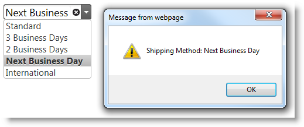

<!--
|metadata|
{
    "fileName": "defining-events-with-aspnet-helper",
    "controlName": [],
    "tags": []
}
|metadata|
-->

# Defining Events with the ASP.NET MVC Helper


##Topic Overview


#### Purpose

This topic demonstrates how to define a client event handler using the ASP.NET MVC helper. While the provided example uses the `igCombo`™ `selectionChanged` event, the same approach is used for all components’ ASP.NET MVC helpers that support it(all Line of Bussiness components' ASP.NET MVC helpers).

#### Required background

The following topics are prerequisites to understanding this topic:


- [Adding Controls to an MVC Project](Adding-NetAdvantage-Controls-to-an-MVC-Project.html): This topic explains how to get started with Ignite UI® components by adding them to an ASP.NET MVC application.

- [Using Events in Ignite UI](Using-Events-in-NetAdvantage-for-jQuery.html): This topic demonstrates how to handle events raised by Ignite UI controls. Also included is an explanation of the differences between binding events on initialization and after initialization.


##Defining an Event Handler – Conceptual Overview


### Defining an event handler summary

Step 1 is optional and provides a basic ASP.NET MVC View to use when getting started. You can also use an existing ASP.NET MVC helper implementation and follow the procedure starting with step 2. Once you configured the initial ASP.NET MVC helper, you must define a function, known as an event handler, for handling the event logic. Next use the `AddClientEvent` method to attach the event. The first method argument accepts the string name of the event’s option and the second accepts the string name of the event handler function.

While this approach serves the majority of use cases, the second argument of the `AddClientEvent` method also accepts a string of JavaScript code to execute as well as a string representing the full JavaScript function as demonstrated in step 2 without the script element tags.

### Requirements

The requirement for completing this procedure is an ASP.NET MVC application configured with the Infragistics assemblies.

## Steps

Following are the general conceptual steps for defining an event handler with an ASP.NET MVC helper.

1. Instantiating a control with the ASP.NET MVC helper.

2. Defining a JavaScript function to handle the event.

3. Configuring the event on the ASP.NET MVC helper.

##Defining an Event Handler – Procedure

### Introduction

This procedure explains how to configure a JavaScript function as an event handler using the ASP.NET MVC helper. The example shows how to handle the `igCombo` `selectionChanged` event to display an alert with the selected text.

### Preview

The following screenshot is a preview of the final result.



### Prerequisites

To complete the procedure, you need the following:

-   An ASP.NET MVC application configured with the required Ignite UI resources
-   A controller and action method configured to return a View

### Overview

Following is a conceptual overview of the process: ​

1. Instantiating a control using the ASP.NET MVC Helper

2. Defining a JavaScript function to handle the event

3. Configuring the event on the ASP.NET MVC helper

### Steps

The following steps demonstrate how to configure the `igCombo`’s ASP.NET MVC Helper to handle the `selectionChanged` event on the client.


1. Instantiate a control using the ASP.NET MVC Helper.

	**If adding an event** **to an existing ASP.NET MVC helper implementation, see step 2.** If starting without an existing ASP.NET MVC helper implementation, copy the below code into your project containing an *igCombo* instantiated with the ASP.NET MVC helper.
	
	**In ASPX:**
	
	```csharp
	<%@ Page Language="C#" Inherits="System.Web.Mvc.ViewPage<IEnumerable<ShipMethod>>" %>
	<%@ Import Namespace="Infragistics.Web.Mvc" %>
	<!DOCTYPE html>
	<html>
	<head>
	    <title></title>
	    <link href="<%= Url.Content("~/infragistics/css/themes/infragistics/infragistics.theme.css") %>" rel="stylesheet" />
	    <link href="<%= Url.Content("~/infragistics/css/structure/infragistics.css") %>" rel="stylesheet" />
	    <script src="<%= Url.Content("~/js/jquery.js") %>"></script>
	    <script src="<%= Url.Content("~/js/jquery-ui.js") %>"></script>
	    <script src="<%= Url.Content("~/js/modernizr.js") %>"></script>
	    <script src="<%= Url.Content("~/infragistics/js/infragistics.core.js") %>"></script>
	    <script src="<%= Url.Content("~/infragistics/js/infragistics.lob.js") %>"></script>
	</head>
	<body>
	    <%= Html.Infragistics().Combo()
	        .DataSource(Model)
	        .TextKey("DisplayText")
	        .ValueKey("Value")
	        .AddClientEvent("selectionChanged", "comboSelectionChanged")
	        .Render()
	    %>
	</body>
	</html>
	```
	
	**In C#:**
	
	```csharp
	using System.Collections.Generic;
	using System.Web.Mvc;
	public class HomeController : Controller
	{
	    public ActionResult Index()
	    {
	        List<ShipMethod> shipMethods = new List<ShipMethod>
	        {
	            new ShipMethod{DisplayText="Standard", Value=0},
	            new ShipMethod{DisplayText="3 Business Days", Value=1},
	            new ShipMethod{DisplayText="2 Business Days", Value=2},
	            new ShipMethod{DisplayText="Next Business Day", Value=3},
	            new ShipMethod{DisplayText="International", Value=4},
	        };
	        return View(shipMethods);
	    }
	}
	```

2. Define a JavaScript function to handle the event.

	Define a JavaScript function to handle the event and supply it with standard jQuery UI event arguments.

	**In ASPX:**

    ```csharp
    <script>
        function comboSelectionChanged(e, ui) {
            alert("Shipping Method: " + ui.items[0].text);
        }
    </script>
    ```

3. Configure the event on the ASP.NET MVC helper.

	Configure the ASP.NET MVC helper to call the JavaScript function when the event is fired.

	**In ASPX:**

    ```csharp
    <%= Html.Infragistics().Combo()
        .DataSource(Model)
        .TextKey("DisplayText")
        .ValueKey("Value")
        .AddClientEvent("selectionChanged", "comboSelectionChanged")
        .Render()
    %>
    ```

>**Note:** For the first parameter of the *AddClientEvent* method, do not confuse the option name of the event for the string used when binding with the jQuery event API, e.g. `on`, `delegate`, and `live`. The string that should be entered as the argument for the `AddClientEvent` method is the name of the option used to configure the event when instantiating with the jQuery UI widget in JavaScript. 

##Related Content

### Topics

The following topic provides additional information related to this topic.

- [Using Events in Ignite UI](Using-Events-in-NetAdvantage-for-jQuery.html): This topic demonstrates how to handle events raised by Ignite UI controls. Also included is an explanation of the differences between binding events on initialization and after initialization.


 

 


