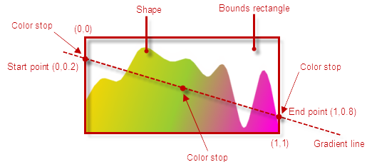

<!--
|metadata|
{
    "fileName": "using-gradient-colors-in-data-visualizations",
    "controlName": "Doughnut Chart, igBarcode, igBulletGraph, igDataChart, igFunnelChart, igLinearGauge",
    "tags": ["Data Presentation","How Do I","Styling","Theming"]
}
|metadata|
-->

# Using Gradient Colors in Data Visualizations


##Topic Overview

#### Purpose

This topic explains how to apply gradient colors to the data visuals in Ignite UI™ controls. This capability is supported for the following data visualization controls:

-   [igBulletGraph](igBulletGraph.html)™
-   [igDataChart](igDataChart-Landing-Page.html)™
-   [igLinearGauge](igLinearGauge.html)™

#### Required background

The following topics are prerequisites to understanding this topic:

####Concept

-   Color gradient
-   CSS *background-image* property

####Topics

[Styling and Theming in Ignite UI](Deployment-Guide-Styling-and-Theming.html): This topic provides instructions on setting up your application for design time, options for using CSS in production and an overview on creating or customizing a theme.

[Adding igDataChart](igDataChart-Adding.html): This topic demonstrates how to add the igDataChart control to a page and bind it to data.

####External Resources


[Color Gradient](http://en.wikipedia.org/wiki/Color_gradient): A Wikipedia article explaining the concept color gradients.

[CSS linear-gradient](https://developer.mozilla.org/en-US/docs/Web/CSS/linear-gradient): An article explaining the `linear-gradient()` CSS function.


#### In this topic

-   [Introduction](#_Introduction)
    -   [Gradient colors configuration summary](#_Gradient_colors_configuration_summary)
    -   [Supported gradient types](#_Supported_gradient_types)
    -   [Gradient colors configuration summary chart](#_Gradient_colors_configuration_summary_chart)
-   [Configuring Linear Color Gradients](#_Configuring_Linear_Color_Gradients)
-   [Configuring Gradient Colors Through the API](#_Configuring_Gradient_Colors_Through_the_API)
    -   [Overview](#_Overview)
    -   [Property settings](#_Property_settings)
    -   [Example](#_Example)
-   [Configuring Gradient Colors Through CSS Classes](#_Configuring_Gradient_Colors_Through_CSS_Classes)
    -   [Overview](#_Overview_CSS)
    -   [Example](#_Example_CSS)
-   [CSS Classes Reference](#_CSS_Classes_Reference)
    -   [Introduction](#_CSS_Classes_Reference_Introduction)
    -   [igBulletGraph](#_igBulletGraph)
    -   [igDataChart](#_igDataChart)
    -   [igLinearGauge](#_igLinearGauge)
-   [Related Content](#_Related_Content)
    -   [Topics](#_Topics)
    -   [Samples](#_Samples)


##<a id="_Introduction"></a>Introduction

####<a id="_Gradient_colors_configuration_summary"></a> Gradient colors configuration summary

Linear color gradients can be applied to the fill and the outline of the visual objects in data visualization controls.


Gradient colors are configured through the color-related properties of the supported components. This includes specifying the gradient type (e.g. linear) and the color stops. The rest of the configuration properties are specific for each effect type.

####<a id="_Supported_gradient_types"></a> Supported gradient types

Currently, only linear gradients are supported.

####<a id="_Gradient_colors_configuration_summary_chart"></a> Gradient colors configuration summary chart

The following table summarizes the possible approaches to configuring gradient colors in data visualizations. 

<table class="table table-striped">
    <thead>
        <tr>
            <th>
In order to configure gradient colors:
            </th>
            <th>
Do this:
            </th>
            <th>
Supported controls
            </th>
        </tr>
    </thead>
    <tbody>
        <tr>
            <td>
Through the API
            </td>
            <td>
Set the color-gradient-related properties of the visual element.
            </td>
            <td>
                <ul>
                    <li>
igBulletGraph
                    </li>

                    <li>
igDataChart
                    </li>

                    <li>
igLinearGauge
                    </li>
                </ul>
            </td>
        </tr>

        <tr>
            <td>
Through CSS
            </td>
            <td>
Specify the gradient type for the background-image property for the specified CSS classes.
            </td>
            <td>
                <ul>
                    <li>
igBulletGraph
                    </li>

                    <li>
igDataChart
                    </li>

                    <li>
igLinearGauge
                    </li>
                </ul>
            </td>
        </tr>
    </tbody>
</table>


##<a id="_Configuring_Linear_Color_Gradients"></a>Configuring Linear Color Gradients


####Linear gradient colors configuration summary

The main configurable aspects of a linear color gradient effect are its type, direction, and color flow.

####Configuring the gradient direction

The default gradient direction is top to bottom, therefore if a custom direction is not specified, the color at offset 0 will be positioned at the top of the figure and the color at offset 1 will be at its bottom. In order to change the gradient direction, start and end point must be specified. The start and end points are the points you want the gradient to start and end at. Both the x- and y- axis coordinates for these points must be in the range 0÷1 where (0, 0) is the top-left corner of a figure’s bounds rectangle and (1, 1) is the bottom-right corner.

#### Configuring the gradient color flow

In addition to the gradient type, two or more gradient stops must be configured. Each gradient stop must specify a color and an offset from the start point of the gradient, indicating where the color is to be positioned along the imaginary gradient line representing the gradient color flow. The default bearing of the gradient line is vertical with downward direction, i.e. the Start point has co-ordinates are (0,0) and the End point co-ordinates (0,1). More than two gradient stops can be used to achieve custom spreads of the gradient colors.

The following picture shows how the shape of an *igDataChart* area series is filled with a linear color gradient with a custom angle and illustrates the concepts mentioned above.



Gradient colors can be configured either through the series API or (for some controls) through CSS classes.

>**Note:** If the color is specified both through the API and the CSS classes, the API settings take precedence and will render the respective CSS classes ineffective.


##<a id="_Configuring_Gradient_Colors_Through_the_API"></a>Configuring Gradient Colors Through the API


####<a id="_Overview"></a> Overview

Configuring a gradient color though the API is done by setting a JavaScript object specifying a gradient to one of the brush-/color-related properties of the controls that support gradients.

####<a id="_Property_settings"></a> Property settings

The following table maps the configurable aspects of the visual elements related to gradient colors to the property settings that manage them.

<table class="table table-striped">
    <thead>
        <tr>
            <th>
In order to configure:
            </th>

            <th>
Use this property:
            </th>

            <th>
And set it to:
            </th>
        </tr>
    </thead>
    <tbody>
        

        <tr>
            <td>
Gradient type
            </td>

            <td>
type
            </td>

            <td>
The desired gradient type, e.g. “linearGradient”.
            </td>
        </tr>

        <tr>
            <td rowspan="2">
Gradient direction
            </td>

            <td>
startPoint
            </td>

            <td>
The x,y coordinates of the starting point of the gradient line relative to the top-left corner of the bounds rectangle of the figure, presented as decimal fractions of 1, e.g. { x: 0, y: .2 }.
            </td>
        </tr>

        <tr>
            <td>
endPoint
            </td>

            <td>
The x,y coordinates of the ending point of the gradient line relative to the top left edge of the bounds rectangle of the figure, presented as decimal fractions of 1, e.g. { x: 1, y: .8 }.
            </td>
        </tr>

        <tr>
            <td>
Gradient color flow
            </td>

            <td>
colorStops
            </td>

            <td>
An array of the desired color stops, each specifying a color and an offset for the color.
            </td>
        </tr>
    </tbody>
</table>


####<a id="_Example"></a> Example

The screenshot below demonstrates how an area series in the igDataChart control looks as a result of applying the following gradient color settings for the series:

Property | Value
---|---
type | “linearGradient”
startPoint | { x: 0, y: .2 }
endPoint | { x: 1, y: .8 }
colorStops | [{ color: "#FFD800", offset: 0 }, { color: "#FF00DC", offset: 1}]


Following is the code that implements this example.

**In JavaScript:**

```js
…
brush: {
    type: "linearGradient",
    colorStops: [{
        color: "#FFD800", //orange
        offset: 0
    },
    {
        color: "#FF00DC", //pink
        offset: 1
    }],
    startPoint: { x: 0, y: .2 },
    endPoint: { x: 1, y: .8 }
}
```


##<a id="_Configuring_Gradient_Colors_Through_CSS_Classes"></a>Configuring Gradient Colors Through CSS Classes


#### <a id="_Overview_CSS"></a>Overview

Some of the Ignite UI data visualization controls support setting the gradient colors for some of their color-related properties through CSS. In order to specify a gradient color via CSS, you need to create a CSS rule that targets a specified class and sets the background-image property of the visual element to a function specifying the gradient (e.g. linear-gradient). If a CSS gradient color is specified together with a solid color CSS setting, the gradient color setting will take precedence.

>**Note:** If the color is specified both through the API and the CSS
classes, the API settings take precedence and will render the respective
CSS classes ineffective.

#### <a id="_Example_CSS"></a>Example

The screenshot below demonstrates a *igDataChart* control in which the first series is configured through CSS with the following settings:

Configurable aspect | Setting
---|---
Gradient type | Linear
Gradient direction | Left-to-right
Gradient color flow | Evenly distributed from left to right: red, orange, yellow, green, blue, indigo, and violet


Following is the code that implements this example.

**In CSS:**

```css
.ui-chart-fill-palette-1 {
    background-image: linear-gradient(to right, red, orange, yellow, green, blue, indigo, violet);
}
```


##<a id="_CSS_Classes_Reference"></a>CSS Classes Reference


####<a id="_CSS_Classes_Reference_Introduction"></a> Introduction

The tables below provide reference information for the CSS classes used for configuring gradient colors in data visualizations. The classes are control-specific. They are listed in alphabetical order.

####<a id="_igBulletGraph"></a> *igBulletGraph*

CSS class | Details
---|---
ui-bulletgraph-backing-fill | Color-gradient for the fill of the background (the backing) of the bullet graph
ui-bulletgraph-backing-outline | Color gradient for the outline of the background (the backing) of the bullet graph
ui-bulletgraph-minortick-fill | Color gradient for the fill the minor tick marks of the bullet graph
ui-bulletgraph-minortick-outline | Color gradient for the outline of the minor tick marks of the bullet graph
ui-bulletgraph-range-fill-palette-1  to  ui-bulletgraph-range-fill-palette-n | The n-th color gradient in the palette used for filling the bullet graph’s ranges
ui-bulletgraph-range-outline-palette-1  to  ui-bulletgraph-range-outline-palette-n | The n-th color gradient in the palette used for the outlines of the bullet graph’s ranges
ui-bulletgraph-targetvalue-fill | Color gradient for the fill of the comparative measure marker (aka. “the target value”) bar of the bullet graph
ui-bulletgraph-targetvalue-outline | Color gradient for the outline of the comparative measure marker (aka. “the target value”) bar of the bullet graph
ui-bulletgraph-tick-fill | Color gradient for the fill the major tick marks of the bullet graph
ui-bulletgraph-tick-outline | Color gradient for the outline of the major tick marks of the bullet graph
ui-bulletgraph-value-fill | Color gradient for the fill of the performance bar (aka. ” the value bar”) of the bullet graph
ui-bulletgraph-value-outline | Color gradient for the outline of the performance bar (aka. “the value bar”) of the bullet graph


####<a id="_igDataChart"></a> *igDataChart*

CSS class | Details
---|---
ui-chart-fill-palette-1  to  .ui-chart-fill-palette-n | The n-th color gradient in the palette used for filling the chart series’ shapes
ui-chart-outline-palette-1  to  .ui-chart-outline-palette-n | The n-th color gradient in the palette used for the outlines of the chart series’ shapes


####<a id="_igLinearGauge"></a> *igLinearGauge*

CSS class | Details
---|---
ui-lineargauge-backing-fill | Color gradient for the fill of the background (the backing) of the linear gauge
ui-lineargauge-backing-outline | Color gradient for the outline of the background (the backing) of the linear gauge
ui-  lineargauge-minortick-fill | Color gradient for the fill the minor tick marks of the linear gauge
ui-  lineargauge-minortick-outline | Color gradient for the outline of the minor tick marks of the linear gauge
ui-lineargauge-tick-fill | Color gradient for the fill the major tick marks of the linear gauge
ui-  lineargauge-tick-outline | Color gradient for the outline of the major tick marks of the linear gauge
ui-lineargauge-needle-fill | Color gradient for the fill of the needle of the linear gauge
ui-lineargauge-needle-outline | Color gradient for the outline of the needle of the linear gauge
ui-lineargauge-range-fill-palette-1  to  ui-lineargauge-range-fill-palette-n | The n-th color gradient in the palette used for filling the linear gauge’s ranges
ui-lineargauge-range-outline-palette-1  to  ui-lineargauge-range-outline-palette-n | The n-th color gradient in the palette used for the outlines of the linear gauge’s ranges


##<a id="_Related_Content"></a>Related Content


####<a id="_Topics"></a> Topics

The following topics provides additional information related to this topic.

- [Styling igDataChart](igDataChart-Styling-Themes.html): This topic demonstrates how to apply styles and themes to the igDataChart control.


####<a id="_Samples"></a> Samples

The following samples provides additional information related to this topic.


- [Chart Fill Gradients](%%SamplesUrl%%/data-chart/chart-fill-gradients): This sample demonstrates using linear gradient colors in the igDataChart control.

