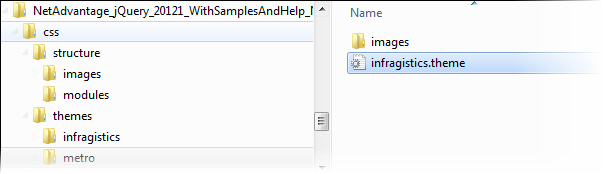
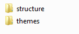
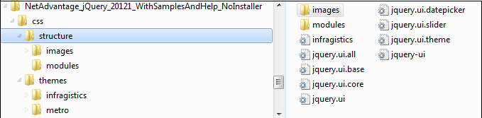
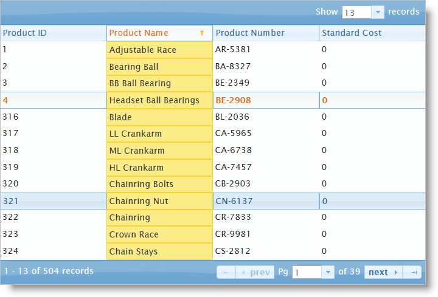
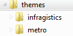
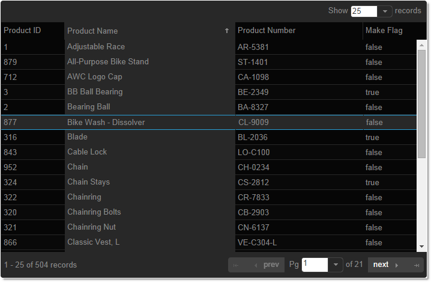

<!--
|metadata|
{
    "fileName": "deployment-guide-styling-and-theming",
    "controlName": "",
    "tags": []
}
|metadata|
-->

# Styling and Theming

##Topic Overview

#### Purpose

This topic provides instructions on setting up your application for design time, options for using CSS in production and an overview on creating or customizing a theme.

#### In This Topic

This topic contains the following sections:

-   [Styling and Theming %%ProductName%%](#_Styling_and_Theming_IgniteUI)
-   [Adding Required Themes in Your Application](#_Adding_Required_Themes_in_Your_Application)
-   [Infragistics Themes](#Infragistics_Themes)
-   [Using Infragistics Loader for Adding a Theme in Your Application](#_Using_Infragistics_Loader_for_Adding_a_Theme_in_Your_Application)
-   [Using Theme Roller](#_Using_Theme_Roller)
-   [Using Bootstrap Theme Generator](#Using_Bootstrap_Theme_Generator)
-   [Using CDN](#_Using_CDN)
-   [Related Content](#_Related_Content)


##<a id="_Styling_and_Theming_IgniteUI"></a>Styling and Theming %%ProductName%%


#### Overview

%%ProductName%%™ utilizes the jQuery UI CSS Framework for styling and theming purposes. *Infragistics*, *Infragistics 2012*, *metro* and *iOS* are jQuery UI themes provided by Infragistics for use in your application. The default Twitter Bootstrap theme along with three custom ones – *Yeti*, *Superhero* and *Flatly*, compiled for usage with jQuery UI and %%ProductName%% controls are also available. This document shows how to setup your application for design time and overviews, how to create or customize a theme, and provides options for using %%ProductName%% CSS in production.

#### Organization of CSS resources

Provided with %%ProductName%% is a set of combined and minified themes for use in a production environment. These minified versions reduce the readability of the CSS but in production allow for faster download of resources across the network.

CSS files are reorganized in the structure described below:

-   The themes folder content is moved to css folder.

Each theme’s css ends with **theme.css** extension.



-   The base directory is css and can be found under {IG Resources root}.

It contains a structure and a themes folder.



Under structure directory there are the following folders and structures:

-   Images

**css\structure\images**

-   modules - all of the widget specific files are under modules. They reference images from one level up: `../images/IMAGE_NAME.gif`.

	`css\structure\modules`

-   combined css file that is named infragistics.css.

	`css\structure\infragistics.css`

During combining process all of the image references were corrected to reference the image folder off of the current location:

```
images/IMAGE_NAME.gif
```




##<a id="_Adding_Required_Themes_in_Your_Application"></a>Adding Required Themes in Your Application


#### Introduction

All the themes are located in the installed directory within the `css` folder.

If you have chosen the typical installation of %%ProductName%% %%ProductVersionShort%%, you can find the css resources under the path below:

```
%%InstallPath%%\css
```

To add the themes to your application, copy the **whole** css folder (including **‘structure’** and ‘themes’ directories) into your site’s file location.

Custom Bootstrap themes exported from the Bootstrap Theme Generator web application should be copied to the ‘themes’ subdirectory.

Note: When using Infragistics Loader, the folder structure must be preserved. Thus the loader will work as expected. If some of the themes are not used they can be deleted, but the structure should remain the same.

The following screenshot represents the folder structure.


## Overview

This topic takes you step-by-step toward adding the required themes in your website. The following is a conceptual overview of the process:

1. Including the Infragistics theme file in the code.
2. Including the Infragistics structure file in the code.

#### Steps

The following steps demonstrate how to add the required themes in your website.


1.  Include the Infragistics theme file in the code.:

	The following code snippet includes the Infragistics theme in your file.

	**In HTML:**

	```html
	<link href="{IG Resources root}/css/themes/infragistics/infragistics.theme.css" rel="stylesheet" type="text/css" />
	```

	**In ASPX:**

	```csharp
	<%@ Import Namespace="Infragistics.Web.Mvc" %>
	<!DOCTYPE html>
	<html>
	<head id="Head1" runat="server">
	<link href="<%= Url.Content("{IG Resources root}/css/themes/infragistics/infragistics.theme.css ") %>” rel="stylesheet" type="text/css" />
	```

2. Include the Infragistics structure file in the code.

	The following code snippet includes the Infragistics structure file in your file.

	**In HTML:**

	```html
	<link href="{IG Resources root}/css/structure/infragistics.css"      rel="stylesheet" type="text/css" />
	```

	**In ASPX:**

	```csharp
	<link href="<%= Url.Content("{IG Resources root}/css/structure/infragistics.css") %>”      rel="stylesheet" type="text/css" />
	```

##<a id="Infragistics_Themes"></a>Infragistics Themes


#### Themes overview

Infragistics offers the following themes you can include in your website:

-   Infragistics Theme
-   Infragistics 2012 Theme
-   Metro Theme
-   iOS Theme 
-   Bootstrap Themes
    -   Default
    -   Superhero
    -   Yeti
    -   Flatly

When using a theme other than the provided ones, *Infragistics* widgets have some additional styling points that may need customization to achieve a complete design depending on the widget’s enabled features and theme. Themes obtained from the Bootstrap Theme Generator web application are full-fledged and can be used without additional customization.

#### Infragistics Theme

The *Infragistics* theme is a custom theme which includes all of the styles usually found in a jQuery UI theme. This theme may be replaced by a different theme but for the jQuery widgets to display correctly, a reference to the file `{IG Resources root}\css\structure\infragistics.css` is required.

#### Metro Theme

*Metro* theme is implementation of the clean, modern and fast Metro design language. This theme may be replaced by a different theme but for the jQuery widgets to display correctly, a reference to the file `{IG Resources root}\css\structure\infragistics.css` is required.

#### iOS Theme

The *iOS* theme is implementation of the well-known iOS look and feel. This theme may be replaced by a different theme but for the jQuery widgets to display correctly, a reference to the file `{IG Resources root}\css\structure\infragistics.css` is required.

#### Bootstrap Themes

The Bootstrap themes for jQuery UI and %%ProductName%% are generated from the popular Bootstrap themes with the same names. The careful process of utilizing their look and feel for a theme following the jQuery UI CSS framework conventions has been automated with the Bootstrap Theme Generator web application. It provides the functionality of exporting almost every Bootstrap theme available in LESS for styling %%ProductName%% and jQuery UI widgets. A reference to the file `{IG Resources root}\css\structure\infragistics.css` is required.

##<a  id="_Using_Infragistics_Loader_for_Adding_a_Theme_in_Your_Application"></a>Using Infragistics Loader for Adding a Theme in Your Application

### Using Infragistics Loader summary

For setting cssPath and scriptPath options you should set a path, which is relative to the page that instantiates the loader.

**In Javascript:**

```js
$.ig.loader({
            scriptPath: '{IG Resources root}/js/',
            cssPath: '{IG Resources root}/css/',
            resources: 'igCombo'
       });
```

For setting different theme you can use the **theme** option, as in the code snippet below.

**In Javascript:**

```js
$.ig.loader({
            scriptPath: "{IG Resources root}/js/",
            cssPath: "{IG Resources root}/css/",
            resources: "igGrid.*",
            theme: "metro"
      });
```

For more information regarding the Infragistics loader, refer to the topic [Using JavaScript Resouces in %%ProductName%%](Deployment-Guide-JavaScript-Resources.html).

> **Note:** For custom themes use the name of the theme’s directory.


##<a id="_Using_Theme_Roller"></a>Using Theme Roller


#### Introduction

ThemeRoller is a tool provided by jQuery UI which facilitates the creation of custom themes that are compatible with jQuery UI widgets. Many pre-built themes can be downloaded and incorporated into your website. The Infragistics jQuery widgets support the use of ThemeRoller themes.

In addition to incorporating individual themes, the jQuery UI [Theme Switcher](http://docs.jquery.com/UI/Theming/ThemeSwitcher) widget can be used to dynamically change pre-built jQuery UI themes dynamically in the browser.

> **Note:** The Infragistics Theme and Metro Theme cannot be used in conjunction with other ThemeRoller themes because `infragistics.theme.css`, as well as any other css with final overrides, is not compatible with ThemeRoller. When application uses ThemeRoller, then the only permitted CSS file is `jquery.ui.theme.css`. To fix this through the loader, can set the theme option to "" (empty string). That way the loader will not attempt to load the default theme (which is `infragistics` for the jQuery widgets).

#### Preview

The following screenshot is a preview of the final result.



#### Steps

The following steps demonstrate how to add Redmond theme in your application.

1. Add *Redmond* theme to your themes directory

	- Go to the [Theme Roller](http://jqueryui.com/themeroller/) website and click the Gallery tab to find a theme to download.
	- Click Download next to the Redmond theme and once the download completes, unzip the compressed folder to the file system.
	- In the zip file, there is a directory named css. Inside this directory is a folder with the name of the theme, redmond.
	- Drag this directory into the themes directory of your website.

	

2. Update the CSS links to replace the *Infragistics* theme with the *Redmond* theme

	1. Add CSS reference to Redmond theme.

		**In HTML:**
		
		```html
		<link href="/css/themes/redmond/jquery-ui-1.8.13.custom.css" rel="stylesheet" type="text/css" />
		```
		
		**In ASPX:**
		
		```csharp
		<%@ Import Namespace="Infragistics.Web.Mvc" %>
		<!DOCTYPE html>
		<html>
		<head runat="server">
		<link href="<%= Url.Content("~css/themes/redmond/jquery-ui-1.8.13.custom.css") %>” rel="stylesheet" type="text/css" />
		```

	2. Add CSS reference to structure theme.

		**In HTML:**
		
		```html
		<link href="/css/structure/infragistics.css" rel="stylesheet" type="text/css" />
		```
		
		**In ASPX:**
		
		```csharp
		<link href="<%= Url.Content("~css/structure/infragistics.css") %>" rel="stylesheet" type="text/css" />
		```

##<a id="Using_Bootstrap_Theme_Generator"></a>Using Bootstrap Theme Generator

The Bootstrap Theme Generator is a web tool provided by Infragistics which facilitates the export of themes created for the Bootstrap CSS framework to themes usable by %%ProductName%% and jQuery UI widgets. In addition it allows for customization of every property of the theme and displays previews showing the end result.

### Overview
This topic takes you step-by-step toward using the Bootstrap Theme Generator for exporting Bootstrap themes and adding them to your website. The following is a conceptual overview of the process:

1. Downloading the LESS file of the chosen Bootstrap theme.
2. Passing the LESS file through the Bootstrap Theme Generator.
3. Updating the CSS links to replace the Infragistics Theme with the chosen theme.
4. Verifying the result.

### Preview

The following screenshot is a preview of the final result with the premise that the chosen theme is *Cyborg*.



### Steps
The following steps demonstrate how to export and add a Bootstrap theme in your application.

1. **Downloading the LESS file of the chosen Bootstrap theme**
	1. Go to the [Bootswatch](http://bootswatch.com/) website and click the Themes button to open the list of themes available for download. Choose a theme and click it to go to its page.
	2. Click the Download button and choose ‘variables.less’ from the dropdown. This file is what the Bootstrap Theme Generator uses to create the theme.
2. **Passing the LESS file through the [Bootstrap Theme Generator](%%SamplesUrl%%/bootstrap-theme-generator)**
	1. Go to the [Bootstrap Theme Generator website](%%SamplesUrl%%/bootstrap-theme-generator).
	2. Click on the ‘Start by uploading your LESS’ button.
	3. Click on the ‘Upload & Finish’ button and select the ‘variables.less’ from the file chooser. Alternatively you can use the ‘Upload & Customize’ which will allow you to use the further customize the theme before downloading.
	4. After processing the theme a download button will appear. Click and choose the option for downloading the complete theme.
3. **Updating the CSS links to replace the Infragistics Theme with the chosen theme**
	1. Unzip the downloaded file and drag the directory it contains into the themes directory of your website.
		
	2. Add CSS reference to the exported theme. The code samples below assume the chosen theme is Cyborg and the theme folder has the same name.
	
	**In HTML:**
	```html
	<link href="/css/themes/cyborg/infragistics.theme.css" rel="stylesheet" type="text/css" />
	```
	**In ASPX:**
	```csharp
	<%@ Import Namespace="Infragistics.Web.Mvc" %>
	<!DOCTYPE html>
	<html>
	<head runat="server">
	<link href="<%= Url.Content("~css/themes/cyborg/infragistics.theme.css") %>” rel="stylesheet" type="text/css" />                                
	```
	3. Add CSS reference to structure theme.
	
	**In HTML:**
	```html
	<link href="/css/structure/infragistics.css" rel="stylesheet" type="text/css" />
	```
	**In ASPX:**
	```csharp
	<link href="<%= Url.Content("~css/structure/infragistics.css") %>” rel="stylesheet" type="text/css" />
	```
4. **To verify the result, run the web page**
	
	Run the page and verify the `igGrid` renders with the chosen theme.


##<a id="_Using_CDN"></a>Using CDN

#### Infragistics Content Deliver Network (CDN)

All listed themes are hosted on the Infragistics CDN.

The benefits of using a CDN are numerous. For more information, refer to the dedicated help topic Infragistics Content Delivery Network (CDN) for %%ProductName%%. For more information on referencing files from the CDN, see the [Infragistics Content Delivery Network (CDN) for %%ProductName%%](Deployment-Guide-Infragistics-Content-Delivery-Network%28CDN%29.html) topic.

**In HTML:**

```html
<link href="http://cdn-na.infragistics.com/igniteui/%%ProductVersion%%/latest/css/themes/infragistics/infragistics.theme.css" rel="stylesheet" type="text/css" />

<link href="http://cdn-na.infragistics.com/igniteui/%%ProductVersion%%/latest/css/structure/infragistics.css" rel="stylesheet" type="text/css" />
```


##<a id="_Related_Content"></a>Related Content


#### Topics

The following topics provide additional information related to this topic.


- [JavaScript Files in %%ProductName%%](Deployment-Guide-JavaScript-Files.html): This topic is a reference to the JavaScript files required to work with the controls included in %%ProductName%%™.

- [Using JavaScript Resouces in %%ProductName%%](Deployment-Guide-JavaScript-Resources.html): This topic explains how to manage the required resources to work with the %%ProductName%% within a Web application.

- [Infragistics Content Delivery Network (CDN) for %%ProductName%%](Deployment-Guide-Infragistics-Content-Delivery-Network%28CDN%29.html): Instructions on using Infragistics Content Delivery Network (CDN) in %%ProductName%%.

- [Using Gradient Colors in Data Visualizations](Using-Gradient-Colors-in-Data-Visualizations.html): This topic explains how to apply gradient colors to the data visuals in %%ProductName%%™ controls.

- [Applying the New Style (*igDataChart*)](igDataChart-New-Default-Style.html): This topic explains how to apply the new chart style and provides an overview of the changes it makes to the chart look.

- [Using %%ProductName%% with Bootstrap](Using-Ignite-UI-with-Bootstrap.html) : This topic explains how %%ProductName%% and Bootstrap work together


 

 


