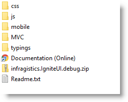

<!--
|metadata|
{
    "fileName": "deployment-guide-styling-and-theming",
    "controlName": "",
    "tags": []
}
|metadata|
-->

# Styling and Theming

##Topic Overview

#### Purpose

This topic provides instructions on setting up your application for design time, options for using CSS in production and an overview on creating or customizing a theme.

#### In This Topic

This topic contains the following sections:

-   [Styling and Theming Ignite UI](#_Styling_and_Theming_IgniteUI)
-   [Adding Required Themes in Your Application](#_Adding_Required_Themes_in_Your_Application)
-   [Infragistics Themes](#Infragistics_Themes)
-   [Using Infragistics Loader for Adding a Theme in Your Application](#_Using_Infragistics_Loader_for_Adding_a_Theme_in_Your_Application)
-   [Using Theme Roller](#_Using_Theme_Roller)
-   [Using CDN](#_Using_CDN)
-   [Related Content](#_Related_Content)


##<a id="_Styling_and_Theming_IgniteUI"></a>Styling and Theming Ignite UI


#### Overview

Ignite UI™ utilizes the jQuery UI CSS Framework for styling and theming purposes. *Infragistics* and *metro* are jQuery UI themes provided by Infragistics for use in your application. This document shows how to setup your application for design time and overviews, how to create or customize a theme, and provides options for using Ignite UI CSS in production.

#### Organization of CSS resources

Provided with Ignite UI is a set of combined and minified themes for use in a production environment. These minified versions reduce the readability of the CSS but in production allow for faster download of resources across the network.

CSS files are reorganized in the structure described below:

-   The themes folder content is moved to css folder.

Each theme’s css ends with **theme.css** extension.


-   The base directory is css and can be found under {IG Resources root}.

It contains a structure and a themes folder.


Under structure directory there are the following folders and structures:

-   Images

**css\structure\images**

-   modules - all of the widget specific files are under modules. They reference images from one level up: `../images/IMAGE_NAME.gif`.

	`css\structure\modules`

-   combined css file that is named infragistics.css.

	`css\structure\infragistics.css`

During combining process all of the image references were corrected to reference the image folder off of the current location:

```
images/ IMAGE_NAME.gif
```


##<a id="_Adding_Required_Themes_in_Your_Application"></a>Adding Required Themes in Your Application


#### Introduction

The Infragistics and Metro themes are located in the installed directory within the `css` folder.

If you have chosen the typical installation of Ignite UI %%ProductVersionShort%%, you can find the css resources under the path below:

```
%%InstallPath%%\css
```

To add the themes to your application, copy the **whole** css folder (including ‘**structure’** and ‘themes directories) into your site’s file location.

Note: When using Infragistics Loader, the folder structure must be preserved. Thus the loader will work as expected. If some of the themes are not used they can be deleted, but the structure should remain the same.

The following screenshot represents the folder structure.



## Overview

This topic takes you step-by-step toward adding the required themes in your website. The following is a conceptual overview of the process:

1. Including the Infragistics theme file in the code.
2. Including the Infragistics structure file in the code.

#### Steps

The following steps demonstrate how to add the required themes in your website.


1.  Include the Infragistics theme file in the code.:

	The following code snippet includes the Infragistics theme in your file.

	**In HTML:**

	```html
	<link href="{IG Resources root}/css/themes/infragistics/infragistics.theme.css"      rel="stylesheet" type="text/css" />
	```

	**In ASPX:**

	```csharp
	<%@ Import Namespace="Infragistics.Web.Mvc" %>
	<!DOCTYPE html>
	<html>
	<head id="Head1" runat="server">
	<link href="<%= Url.Content("{IG Resources root}/css/themes/infragistics/infragistics.theme.css ") %>”      rel="stylesheet" type="text/css" />
	```

2. Include the Infragistics structure file in the code.

	The following code snippet includes the Infragistics structure file in your file.

	**In HTML:**

	```html
	<link href="{IG Resources root}/css/structure/infragistics.css"      rel="stylesheet" type="text/css" />
	```

	**In ASPX:**

	```csharp
	<link href="<%= Url.Content("{IG Resources root}/css/structure/infragistics.css") %>”      rel="stylesheet" type="text/css" />
	```

##<a id="Infragistics_Themes"></a>Infragistics Themes


#### Infragistics and Metro themes overview

Infragistics offers the following themes you can include in your website:

-   Infragistics Theme
-   Metro Theme

When using a theme other than Infragistics or Metro theme, *Infragistics* widgets have some additional styling points that may need customization to achieve a complete design depending on the widget’s enabled features and theme.

#### Infragistics Theme

The *Infragistics* theme is a custom theme which includes all of the styles usually found in a jQuery UI theme. This theme may be replaced by a different theme but for the jQuery widgets to display correctly, a reference to the file     `{IG Resources     root}\css\structure\infragistics.css` is required.

#### Metro Theme

*Metro* theme is implementation of the clean, modern and fast Metro design language. This theme may be replaced by a different theme but for the jQuery widgets to display correctly, a reference to the file `{IG     Resources root}\css\structure\infragistics.css` is required.


##<a  id="_Using_Infragistics_Loader_for_Adding_a_Theme_in_Your_Application"></a>Using Infragistics Loader for Adding a Theme in Your Application

### Using Infragistics Loader summary

For setting cssPath and scriptPath options you should set a path, which is relative to the page that instantiates the loader.

**In Javascript:**

```js
$.ig.loader({
            scriptPath: '{IG Resources root}/js/',
            cssPath: '{IG Resources root}/css/',
            resources: 'igCombo'
       });
```

For setting different theme you can use the **theme** option, as in the code snippet below.

**In Javascript:**

```js
$.ig.loader({
            scriptPath: "{IG Resources root}/js/",
            cssPath: "{IG Resources root}/css/",
            resources: "igGrid.*",
            theme: "metro"
      });
```

For more information regarding the Infragistics loader, refer to the topics Using JavaScript Resouces in Ignite UI.


##<a id="_Using_Theme_Roller"></a>Using Theme Roller


#### Introduction

ThemeRoller is a tool provided by jQuery UI which facilitates the creation of custom themes that are compatible with jQuery UI widgets. Many pre-built themes can be downloaded and incorporated into your website. The Infragistics jQuery widgets support the use of ThemeRoller themes.

In addition to incorporating individual themes, the jQuery UI [Theme Switcher](http://docs.jquery.com/UI/Theming/ThemeSwitcher) widget can be used to dynamically change pre-built jQuery UI themes dynamically in the browser.

>**Note :** The Infragistics Theme and Metro Theme cannot be used in conjunction with other ThemeRoller themes because `infragistics.theme.css`, as well as any other css with final overrides, is not compatible with ThemeRoller. When application uses ThemeRoller, then the only permitted CSS file is `jquery.ui.theme.css`. To fix this through the loader, can set the theme option to "" (empty string). That way the loader will not attempt to load the default theme (which is `infragistics` for the jQuery widgets).

#### Preview

The following screenshot is a preview of the final result.


#### Steps

The following steps demonstrate how to add Redmond theme in your application.

<ol>

<li> Add *Redmond* theme to your themes directory

<ul>
 <li>Go to the [Theme Roller](http://jqueryui.com/themeroller/) website
    and click the Gallery tab to find a theme to download.
 <li>Click Download next to the Redmond theme and once the download
    completes, unzip the compressed folder to the file system.
 <li>In the zip file, there is a directory named css. Inside this
    directory is a folder with the name of the theme, redmond.
 <li>Drag this directory into the themes directory of your website.
</ul>


<li>Update the CSS links to replace the *Infragistics* theme with the *Redmond* theme </ul>

Add CSS reference to Redmond theme.

**In HTML:**

```html
<link href="/css/themes/redmond/jquery-ui-1.8.13.custom.css"      rel="stylesheet" type="text/css" />
```

**In ASPX:**

```csharp
<%@ Import Namespace="Infragistics.Web.Mvc" %>
<!DOCTYPE html>
<html>
<head runat="server">
<link href="<%= Url.Content("~css/themes/redmond/jquery-ui-1.8.13.custom.css") %>”      rel="stylesheet" type="text/css" />
```

Add CSS reference to structure theme.

**In HTML:**

```html
<link href="/css/structure/infragistics.css" rel="stylesheet" type="text/css" />
```

**In ASPX:**

```csharp
<link href="<%= Url.Content("~css/structure/infragistics.css") %>" rel="stylesheet" type="text/css" />
```

##<a id="_Using_CDN"></a>Using CDN

#### Infragistics Content Deliver Network (CDN)

The *Infragistics* and *Metro* themes are hosted on the Infragistics CDN.

The benefits of using a CDN are numerous. For more information, refer to the dedicated help topic Infragistics Content Delivery Network (CDN) for Ignite UI. For more information on referencing files from the CDN, see the [Infragistics Content Delivery Network (CDN) for Ignite UI](Deployment-Guide-Infragistics-Content-Delivery-Network%28CDN%29.html) topic.

**In HTML:**

```html
<link href="http://cdn-na.infragistics.com/jquery/%%ProductVersionCondensed%%/latest/css/themes/infragistics/infragistics.theme.css" rel="stylesheet" type="text/css" />

<link href="http://cdn-na.infragistics.com/jquery/%%ProductVersionCondensed%%/latest/css/structure/infragistics.css" rel="stylesheet" type="text/css" />
```


##<a id="_Related_Content"></a>Related Content


#### Topics

The following topics provide additional information related to this topic.


- [JavaScript Files in Ignite UI](Deployment-Guide-JavaScript-Files.html): This topic is a reference to the JavaScript files required to work with the controls included in Ignite UI™.

- [Using JavaScript Resouces in Ignite UI](Deployment-Guide-JavaScript-Resources.html): This topic explains how to manage the required resources to work with the Ignite UI within a Web application.

- [Infragistics Content Delivery Network (CDN) for Ignite UI](Deployment-Guide-Infragistics-Content-Delivery-Network%28CDN%29.html): Instructions on using Infragistics Content Delivery Network (CDN) in Ignite UI.

- [Using Gradient Colors in Data Visualizations](Using-Gradient-Colors-in-Data-Visualizations.html): This topic explains how to apply gradient colors to the data visuals in Ignite UI™ controls.

- [Applying the New Style (*igDataChart*)](igDataChart-New-Default-Style.html): This topic explains how to apply the new chart style and provides an overview of the changes it makes to the chart look.


 

 


