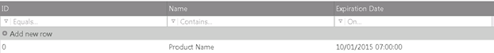
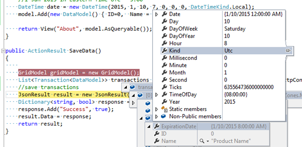

<!--
|metadata|
{
    "fileName": "Using-IgniteUI-controls-in-different-time-zones",
    "controlName": [],
    "tags": []
}
|metadata|
-->

# Using %%ProductName%% controls in different time zones

##Introduction
Users of a web application are often in a different time zone than the web server and in some circumstances you may want to render the server-based date values adjusted to the client's time zone. In this topic you learn to customize the `enableUTCDates` property in the `igGrid`, `igDatePicker` and `igDateEditor` to display and edit date values that reflect the client's time zone.

##Configuring Client-Side Dates

When enabled, the `EnableUTCDates` option allows dates to be formatted as UTC dates on the client side. As a date value is received from the server it goes through a formatter function to display the date. If `enableUTCDates` is set to false, the final result returns date values via the standard date object methods (getFullYear(), getMonth(), getDate(),getHours() etc.) and if set to true UTC equivalents ( getUTCFullYear(), getUTCMonth(), getUTCDate(), getUTCHours() etc.) are used. Therefore, when the option is enabled the dates received from the server are converted to UTC. 
 
There are some distinctive behaviors to consider when used with specific controls.

##igGrid/igHierarchicalGrid
 
There are two possible scenarios where the enableUTCDates option is relevant.

-	When the dates are created on a remote backend where they could be created in a different timezone than the client. (In this case to have consistent values shown on all client machines the `enableUTCDates` option should be enabled.)
-	When the dates are created locally on the client (local data source) and need to be displayed in the local time zone.

It is important to note that the igGrid/igHierarchicalGrid take the timezone offset of the server into account when:

-	The data source is processed via their respective MVC Wrappers ( set via the Model for example)
-	 The data source is remote and the `GridDataSourceAction` attribute is used on the remote method. 
In those cases the time zone offset is added to the data source in the form of metadata. For example:

```
"Metadata": {
                "timezoneOffset": 7200000,
                "timezoneOffsets": {
                    "0": {
                        "ExpirationDate": 7200000
                    },
                    "1": {
                        "ExpirationDate": 7200000
                    },
                    ...
                    }

```

As the different dates may have a different type (UTC or Local) the specific date values for each row have their specific offset send as part of the metadata as demonstrated above.
>**Note:** If the data source contains information on the timezone offset of the server, that offset is always taken into consideration when rendering the date on the client. Therefore when the grid is instantiated via the MVC wrapper the EnableUTCDates option is enabled by default, otherwise the option is disabled by default.

###Practical Example:
Consider the following scenario:

-	A website is hosted in US (Eastern Time UTC - 5:00). In it there's an igGrid showing a column with date values. The date values are created in the US time zone and are formatted as follows: "dd/MM/yyyy HH:mm:ss".
-	A client from Singapore (UTC + 8:00) is viewing and interacting with the website.
-	EnableUTCDate is enabled and the timezone offset is available in the data source

The date is created in local time on the server, for example:
```
//10 Jan 2015 7:00 AM in Eastern Time UTC -5:00 
DateTime date = new DateTime(2015, 1, 10, 7, 0, 0, 0, DateTimeKind.Local);  

```
A user in Singapore will see the exact same time displayed in the grid cell:


As will any other user from any other time zone in the world. The displayed date will always be the same as the one sent from the server.

This is achieved by adding the time zone offset of the server to the date and getting the date's UTC representation. 

Here's what exactly happens in the upper example:

We have a date in Eastern Time 1 Jan 2015. That date needs to be parsed to Json, it will be send in the form of Ticks. The timezoneOffset of the server will be - 18000000 ticks (- 5:00 hours).
 So the json data will look like this:
 
 ```
 {
    "Records": [{
        "ID": 0,
        "Name": "Name0",
        "ExpirationDate": "\/Date(1420866000000)\/"
    }],
    "TotalRecordsCount": 0,
    "Metadata": {
        "timezoneOffset": -18000000,
        "timezoneOffsets": {
            "0": {
                "ExpirationDate": -18000000
            }
        }
    }
}
 ```
When creating the date object on the client the timezone offset from the server is added to the original ticks from the data source and a new date object is created from those ticks(in JavaScript the date object is always created in local time). Then that value is formatted to UTC due to the EnableUTCDate option being enabled.

 The original date send from the server, converted in local time would be Jan 10 2015 20:00:00 (13 hours difference), we add to that the time zone offset of the server ( - 5:00:00 )  and format the result to UTC (- 8:00:00) and we get the display value of *Jan 10 2015 7:00*.
 
When adding/updating a dates the new value will be stored in UTC. For example, if the user in Singapore updates the value from 10/01/2015 07:00:00 to 10/01/2015 08:00:00, the date value that will be send as part of the update transaction will be the value in UTC, so the send value will be 10/01/2015 08:00:00 in UTC (not in local time).
So after updating the value and saving the changes to the server, the value received on the server is 10/01/2015 08:00:00 in UTC. 



##igDatePicker and igDateEditor

The editors behave in a slightly different way since they're not databound controls. They don't take the server's offset into consideration. They directly pass the value set via the MVC Wrapper to the client.

When `EnableUTCDates` is used they'll convert that value directly to UTC without considering the timezone offset of the server. Since the editors are not data bound controls they don't apply any additional data manipulation on the applied values like the igGrid.

Consider the following scenario:

-	The data comes from a backend that is in UTC + 2:00
-	The client is in UTC - 5:00 
-	`EnableUTCDate` is enabled 

The value is set via the model:

```
@Html.Infragistics().DatePickerFor(m => m.ExpirationDate).EnableUTCDates(true)...
```
If a date with 11:00 AM is send on the client the value of the control will be directly be set to 11 am via the generated javascript:

```
value: new Date(x, x, x, 11, x, x, x );
```
When a new date is created on the client it will always be created in local time, however since enableUTCDates is set that date will be converted to UTC. So the end result will be: 11:00 AM + 5:00 (due to the timezone offset on the client) = 4:00 PM

In the case of the editors if you aim to have consistent values the send dates from the server need to be always in UTC since the server timezone offset is not taken into account. Similarly when posting the values from the client to the server you'll receive the date in UTC which you can then convert to the server's local time if needed.
