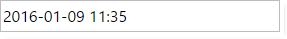

<!--
|metadata|
{
    "fileName": "Using-IgniteUI-controls-in-different-time-zones",
    "controlName": [],
    "tags": []
}
|metadata|
-->

# Using %%ProductName%% controls in different time zones

## Introduction
Users of a web application are often in a different time zone than the web server and in some circumstances you may want to render the server-based date values adjusted to the client's time zone or with specific time offset. It also important to properly format dates while transferring them between server and client. In this topic you learn to customize properties of the `igGrid`, `igDatePicker` and `igDateEditor` to control the display and edit of date values for clients  in different time zones.

## Configuring Client-Side Dates

When enabled for the `igGrid`, the `EnableUTCDates` option allows dates to be formatted as UTC dates on the client side. As a date value is received from the server it goes through a formatter function to display the date. If `enableUTCDates` is set to false, the final result returns date values via the standard date object methods (getFullYear(), getMonth(), getDate(),getHours() etc.) and if set to true UTC equivalents ( getUTCFullYear(), getUTCMonth(), getUTCDate(), getUTCHours() etc.) are used. Therefore, when the option is enabled the dates received from the server are converted to UTC.

The `igDateEditor` and `igDatePicker` rely primarily on `displayTimeOffset` to format dates on the client while `enableUTCDates` affects the serialization format for stand-alone editors.

## igGrid/igHierarchicalGrid
 
There are two possible scenarios where the enableUTCDates option is relevant.

-	When the dates are created on a remote backend where they could be created in a different timezone than the client. (In this case to have consistent values shown on all client machines the [`enableUTCDates`](%%jQueryApiUrl%%/ui.igdateeditor#options:enableUTCDates) option should be enabled.)
-	When the dates are created locally on the client (local data source) and need to be displayed in the local time zone.

It is important to note that the igGrid/igHierarchicalGrid take the timezone offset of the server into account when:

-	The data source is processed via their respective MVC Wrappers ( set via the Model for example)
-	The data source is remote and the `GridDataSourceAction` attribute is used on the remote method. 
In those cases the time zone offset is added to the data source in the form of metadata. For example:

```js
"Metadata": {
                "timezoneOffset": 7200000,
                "timezoneOffsets": {
                    "0": {
                        "ExpirationDate": 7200000
                    },
                    "1": {
                        "ExpirationDate": 7200000
                    },
                    ...
                    }

```

As the different dates may have a different type (UTC or Local) the specific date values for each row have their specific offset send as part of the metadata as demonstrated above.
>**Note:** If the data source contains information on the timezone offset of the server, that offset is always taken into consideration when rendering the date on the client. Therefore when the grid is instantiated via the MVC wrapper the EnableUTCDates option is enabled by default, otherwise the option is disabled by default.

### Practical Example:
Consider the following scenario:

-	A website is hosted in US (Eastern Time UTC - 5:00). In it there's an igGrid showing a column with date values. The date values are created in the US time zone and are formatted as follows: "dd/MM/yyyy HH:mm:ss".
-	A client from Singapore (UTC + 8:00) is viewing and interacting with the website.
-	EnableUTCDate is enabled and the timezone offset is available in the data source

The date is created in local time on the server, for example:
```csharp
//10 Jan 2015 7:00 AM in Eastern Time UTC -5:00 
DateTime date = new DateTime(2015, 1, 10, 7, 0, 0, 0, DateTimeKind.Local);  

```
A user in Singapore will see the exact same time displayed in the grid cell:


As will any other user from any other time zone in the world. The displayed date will always be the same as the one sent from the server.

This is achieved by adding the time zone offset of the server to the date and getting the date's UTC representation. 

Here's what exactly happens in the upper example:

We have a date in Eastern Time 1 Jan 2015. That date needs to be parsed to Json, it will be send in the form of Ticks. The timezoneOffset of the server will be - 18000000 ticks (- 5:00 hours).
 So the json data will look like this:
 
 ```js
 {
    "Records": [{
        "ID": 0,
        "Name": "Name0",
        "ExpirationDate": "\/Date(1420866000000)\/"
    }],
    "TotalRecordsCount": 0,
    "Metadata": {
        "timezoneOffset": -18000000,
        "timezoneOffsets": {
            "0": {
                "ExpirationDate": -18000000
            }
        }
    }
}
 ```
When creating the date object on the client the timezone offset from the server is added to the original ticks from the data source and a new date object is created from those ticks(in JavaScript the date object is always created in local time). Then that value is formatted to UTC due to the EnableUTCDate option being enabled.

 The original date send from the server, converted in local time would be Jan 10 2015 20:00:00 (13 hours difference), we add to that the time zone offset of the server ( - 5:00:00 )  and format the result to UTC (- 8:00:00) and we get the display value of *Jan 10 2015 7:00*.
 
When adding/updating a dates the new value will be stored in UTC. For example, if the user in Singapore updates the value from 10/01/2015 07:00:00 to 10/01/2015 08:00:00, the date value that will be send as part of the update transaction will be the value in UTC, so the send value will be 10/01/2015 08:00:00 in UTC (not in local time).
So after updating the value and saving the changes to the server, the value received on the server is 10/01/2015 08:00:00 in UTC. 


## igDatePicker and igDateEditor

The `igDateEditor` and `igDatePicker` offer several options to properly handle dates in the different time zones. The properties below describe how both editors show dates and how they serialize them, in order to be transferred correctly.
-	[`displayTimeOffset`](%%jQueryApiUrl%%/ui.igdateeditor#options:displayTimeOffset) - Gets/sets time zone offset from UTC, in minutes. The client date values are displayed with this offset instead of the local one, which are automatically transformed by the client browser. If you want to display UTC dates, then the value needs to be set to 0.
-	[`enableUTCDates`](%%jQueryApiUrl%%/ui.igdateeditor#options:enableUTCDates) -  Enables/Disables serializing client date as UTC ISO 8061 string instead of using the local time and zone values. The option is only applied in "date" [`dataMode`](%%jQueryApiUrl%%/ui.igdateeditor#options:dataMode).

	For example 10:00 AM from a client with local offset of 5 hours ahead of GMT will be serialized as: "2016-11-11T10:00:00+05:00" with the option default 'false' value. If set to "true" the date will use the ISO UTC format: "2016-11-11T05:00:00Z".

> **Note:** The functionality of the `enableUTCDates` has changed since 17.1.
> 
> For more information of how you can migrate editors, configured with enableUTCDates option, from 16.2 to 17.1 follow the [Migrating date handling in 17.1](igDateEditor-migrating-date-handling-in-17-1.html) document.

Client `igDateEditor`/`igDatePicker` widgets can serialize the date either in UTC format or containing local time and offset based on the `enableUTCDates` option. Both values refer to the same point in time, however one also carries additional information for the client and depending on the server platform it can make a difference when parsing submitted values. For example in .NET [`DateTimeOffset`](https://msdn.microsoft.com/en-us/library/system.datetimeoffset(v=vs.110).aspx) allows handling the client offset separately.

Since the JavaScript `Date` always converts the initial value to local time discarding any time zone offset in the process, it is always recommended to set UTC standard values for the `igDateEditor` and `igDatePicker`, especially when [`displayTimeOffset`](%%jQueryApiUrl%%/ui.igdateeditor#options:displayTimeOffset) option is defined, otherwise values with specific or ambiguous time zone could map to unpredictable times depending on the user agent local zone. 

If the ASP.NET MVC wrapper of the date editor and date picker is used, then it sends the date serialized only using the UTC format. In addition to the UTC serialized date, set as a value to the client widget, the MVC wrapper also sets the [`displayTimeOffset`](%%jQueryApiUrl%%/ui.igdateeditor#options:displayTimeOffset) option by default. This is true even if no value is provided as the offset is extracted form the server local time. If the value provided has an offset (of `DateTimeOffset` type) or the `DisplayTimeOffset` is set as MVC wrapper option, then that value is sent to the client instead.

The following examples will demonstrate how MVC wrapper and client widget works, when [`displayTimeOffset`](%%jQueryApiUrl%%/ui.igdateeditor#options:displayTimeOffset) and [`enableUTCDates`](%%jQueryApiUrl%%/ui.igdateeditor#options:enableUTCDates) options are used.

### Default Behavior

Let's define in MVC a date editor, with the following configuration and set the value in the server in "Central Europe Standard Time", which is GMT+01:00. Let's assume the client browser is in the "FLE Standard Time", which is GMT+02:00. The same result will be valid for the date picker.

```csharp
@(Html.Infragistics()
	.DateEditor()
	.Value(new DateTime(2016, 1, 9, 10, 55, 55))
	.ID("StartHour")
	.EnableUTCDates(true)
	.DateInputFormat("dd/MM/yyyy HH:mm")
	.DateDisplayFormat("yyyy-MM-dd HH:mm")
	.PlaceHolder("Select start hour")
	.Width(280)
	.Render())
```

In that case the hour is 10 AM, and because the time zone is GMT+01:00, then the MVC wrapper will transform that value to UTC, in the following format: 2016-01-09T09:35:55.0000000Z. In addition it will add displayTimeOffset of 60 minutes. This is what will be rendered by the wrapper in the response:

```js
$('#StartHour').igDateEditor({
	value: '2016-01-09T09:35:55.0000000Z',
	displayTimeOffset: 60,
	enableUTCDates: true,
	dateInputFormat: 'dd/MM/yyyy HH:mm',
	dateDisplayFormat: 'yyyy-MM-dd HH:mm',
	placeHolder: 'Select start hour',
	width: '280' });
```

The above configuration will render the following value in the editor:


### Ignoring server offset and displaying the specific client one

From the example above, it can be seen that when we define a server hour in the editor MVC wrapper, in the client we will always see that server hour, ignoring the client time zone offset. This is the default behavior, if we want each of the clients to display the time in their time zones, then we need to set the [`displayTimeOffset`](%%jQueryApiUrl%%/ui.igdateeditor#options:displayTimeOffset) wrapper option to `null`. Using the previous example and setting the option, on the client the `displayTimeOffset` option will be ignored and the time will show according the specific time zone:

```csharp
@(Html.Infragistics()
	.DateEditor()
	.Value(new DateTime(2016, 1, 9, 10, 55, 55))
	.ID("StartHour")
	.EnableUTCDates(true)
	.DisplayTimeOffset(null)
	.DateInputFormat("dd/MM/yyyy HH:mm")
	.DateDisplayFormat("yyyy-MM-dd HH:mm")
	.PlaceHolder("Select start hour")
	.Width(280)
	.Render())
```

```js
$('#StartHour').igDateEditor({
	value: '2016-01-09T09:35:55.0000000Z',
	displayTimeOffset: null,
	enableUTCDates: true,
	dateInputFormat: 'dd/MM/yyyy HH:mm',
	dateDisplayFormat: 'yyyy-MM-dd HH:mm',
	placeHolder: 'Select start hour',
	width: '280' });
```

The above configuration will render the following value in the editor, if our time is "FLE Standard Time", which is GMT+02:00:



### Configuring EnableUTCDates option

As mentioned earlier setting the `EnableUTCDates` in the wrapper only affects the way the client-widget serializes the date. When enabled like the previous example, the value the editor would submit will be '2016-01-09T09:35:55.000Z', which is the same the MVC wrapper has sent to the client. This allows for a standardized communication between client and server.
If we decide to change the MVC wrapper setting:

```csharp
@(Html.Infragistics()
	.DateEditor()
	.Value(new DateTime(2016, 1, 9, 10, 55, 55))
	.ID("StartHour")
	.EnableUTCDates(false)
	.DisplayTimeOffset(null)
	.DateInputFormat("dd/MM/yyyy HH:mm")
	.DateDisplayFormat("yyyy-MM-dd HH:mm")
	.PlaceHolder("Select start hour")
	.Width(280)
	.Render())
```

Then the submitted value will be formatted as local time and offset. And because our client is GMT+02:00, then the result will be: '2016-01-09T11:35:55+02:00'.

### Configuring DisplayTimeOffset option

If we decide to display a date in "Russian Standard Time", GMT+03:00, then what we need is to define the appropriate offset from UTC time, in minutes:

```js
@(Html.Infragistics()
	.DateEditor()
	.Value(new DateTime(2016, 1, 9, 10, 55, 55))
	.ID("StartHour")
	.EnableUTCDates(true)
	.DisplayTimeOffset(180)
	.DateInputFormat("dd/MM/yyyy HH:mm")
	.DateDisplayFormat("yyyy-MM-dd HH:mm")
	.PlaceHolder("Select start hour")
	.Width(280)
	.Render())

```

The MVC wrapper will render the following `igDateEditor` widget configuration:

```js
$('#StartHour').igDateEditor({
	value: '2016-01-09T09:35:55.0000000Z',
	displayTimeOffset: 180,
	enableUTCDates: true,
	dateInputFormat: 'dd/MM/yyyy HH:mm',
	dateDisplayFormat: 'yyyy-MM-dd HH:mm',
	placeHolder: 'Select start hour',
	width: '280' });
```
The result on the browser will be:


> **Note:** Keep in mind that the `displayTimeOffset` is a static value that can't account for Daylight Saving. For that reason, if targeting a specific zone rather than just offset, the back end logic should check if the target date falls under DST to provide the correct offset value for the specific date. With .NET the `DisplayTimeOffset` type can be used and can also be handled automatically by the MVC editor wrappers.