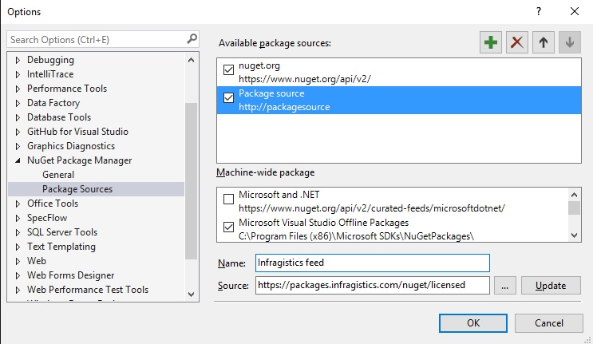

<!--
|metadata|
{
    "fileName": "Using-Ignite-UI-NuGet-Packages",
    "controlName": [],
    "tags": ["NuGet"]
}
|metadata|
-->
# Using Ignite UI NuGet packages

NuGet is a powerful ecosystem of tools and services. It was introduced in 2010 as an open source package manager for the Microsoft development platform including .NET.  NuGet is the easiest way to improve and automate your development practices.

When you install a package via NuGet, it copies the library files to your solution and automatically updates your project. That means adding references, changing config files, replacing old version script files, etc.
NuGet is available since Visual Studio 2010 and since Visual Studio 2012, it is included by default. On more information on how to get going with it, read the official [NuGet documentation](http://docs.nuget.org/ndocs/guides/install-nuget).

Infragistics Ignite UI controls are available to explore as a NuGet package and this is the easiest and the fastest way to install the Infragistics files and assemblies required for your project.
There are two approaches to start using the NuGet packages. We suggest you to set up and use our private NuGet feed hosted on  [https://packages.infragistics.com/nuget/licensed](https://packages.infragistics.com/nuget/licensed) which will keep you up to date with all the NuGet packages Infragistics provide. Using this approach you will be able to get the latest version of the packages each time you create a new project or restore the packages of an existing one.
The alternative approach to the Ignite UI NuGet packages is to install them locally by running the NuGet installer. The installer will automatically create a local feed named “Infragistics (Local)”, which will display all the Ignite UI NuGet packages that are available. During the installation if you leave the product key field empty, the installer will install the trial version of the packages. Have in mind that if you choose this way of working with the Ignite UI NuGet packages you will have to install a later version of the packages manually if you want to update the assemblies you use to the latest version available. 

## Installing Ignite UI packages from the online private feed

The first step is to add the Infragistics feed as a package source. To do that, the user needs to go to Tools/Options/Package Sources.

Add a new package source using Add new source button and name it Infragistics feed (in fact, you can name it however you want). Set the Source to [*https://packages.infragistics.com/nuget/licensed*](https://packages.infragistics.com/nuget/licensed) and click OK to save the source.

After that you have several ways to add references to the packages. The most "visual" way is to right click on the project and select "Manage Nuget Packages".

Inside the NuGet packages manager dialog you will need to select "Infragistics feed" as your Package Source and you will get prompted for a user/password where you will need to use your infragistics.com credentials:

If you check the "Remember my password" checkbox the credentials will be stored in Windows and you will be able to manage them from the Credential Manager. After authenticating you will get a list of the packages that are available to install. When you pick a package, you get the required assemblies installed in the project and the packages.config is updated with the installed packages.

## Installing Ignite UI packages from the local feed

There are two ways to install the Ignite UI NuGet package to your project, using the GUI or using the console, and we will follow both procedures below. All the steps and screenshots are taken in Visual Studio 2015 but if you are using an older version of Visual Studio, the differences are negligible. Don't worry if you haven't used NuGet before as this example will guide you step-by-step through the procedure.

 1. First create a new Ignite UI Web Application project. You can name it IgniteUIProject.

 2. Select Empty project.

 3. After your project is created, your Solution Explorer will look like this:
 
 At the moment, your project contains only the three default nodes: Properties, References and Web.config.

 
### Installing Ignite UI packages via GUI

To install the Ignite UI NuGet package using the GUI, you should right-click on the project name and select Manage NuGet Packages… from the context menu.
 

This will open the **Manage NuGet Packages** view. In this view you can see all the packages that are available for you to use in your project.

Now you should change the package source to **Infragistics (Local)**.

Navigate to the Browse tab and you will see the list of available Infragistics Ignite UI NuGet packages. 

When you select a package, you will see more information of it in the right panel. The most important information in this panel is the list of dependencies for the selected package. Those are assemblies that will be installed automatically to your project and you don`t have to worry about those. 

Click the Install button and the selected package will be added to your project. 

### Installing Ignite UI packages via Package Manager Console

Here we will describe how you can add Ignite UI package using the Package Manager Console. Using the Console may be a bit faster as you do not need to search for the package that you want to install.

To show the Console, navigate to **Tools** in the Visual Studio`s menu and after hovering **NuGet Package Manager**, select **Package Manager Console**.

The **Package Manager Console** will be shown at the bottom of the screen and you just need to enter “Install-Package *name_of_the_package*” to initiate the installation. For example, if you want to install “IgniteUI.MVC”, you must enter Install-Package IgniteUI.MVC and the manager will install this assembly and all the assemblies it depends on. Note that in the console you should select Infragistics(local) from the Package source drop down.

When the installation is finished, you will see a message in the Console that your Ignite UI package is successfully added to the project.
 

## What is installed by the Ignite UI NuGet package

If you install the Ignite UI package a JavaScript and Content folder will be added to your project. Those folders will contain the Infragistics JS and CSS resources. If you choose to install one of the MVC packages, you will also see that the needed assemblies will be added to the references.

## Uninstalling the Ignite UI NuGet packages

You can uninstall any of the assemblies installed with the package. This can be done either using the GUI or the Package Manager Console. You can use any of the approaches no matter if you`ve installed the package via the GUI or via the Console. 

To remove an assembly right-click the project again and select **Manage NuGet Packages**. The view is opened and is showing all the installed assemblies. Select the one you want to uninstall and click the **Uninstall** button.

Have in mind that this will uninstall only the assemblies you`ve selected and all other assemblies that were installed with the package as dependencies will be preserved. 

In addition, you won`t be able to uninstall an assembly if another one depends on it. For example, if you have installed **IgniteUI.MVC** to your project and for some reason try to uninstall IgniteUI which was installed as a dependency, you will see an error saying you are not able to uninstall it because another assembly depends on it. If you want to uninstall it, you must first uninstall all the assemblies that depend on it. 

To uninstall an assembly through the Console, enter “Uninstall-Package *name_of_the_package*”. For example, Uninstall-Package IgniteUI.MVC. 

The Ignite UI  NuGet packages will boost your productivity and they are the fastest way to start creating your next high-performance application.
