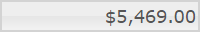
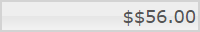

<!--
|metadata|
{
    "fileName": "igcurrencyeditor-igcurrencyeditor-overview",
    "controlName": "igEditors",
    "tags": ["Getting Started"]
}
|metadata|
-->

# igCurrencyEditor Overview


The Ignite UI™ currency editor, or `igCurrencyEditor`, is a control that renders an input field which only accepts numeric digits, formatted as various currency types. The `igCurrencyEditor` control supports localization, by recognizing different regional options exposed from the browser.

As the user interacts with the control the visual appearance is updated to give immediate feedback. Once the editor loses focus, a value-dependent positive or negative pattern is applied to the control, along with adding the appropriate currency sign.

The `igCurrencyEditor` control exposes a rich client-side API, which may be configured to work with any server technology. While the Ignite UI™ controls are server-agnostic, the control does feature wrappers specific for the Microsoft® ASP.NET MVC Framework to configure the control with the .NET™ language of your choice.

The `igCurrencyEditor` control may be extensively styled giving you an opportunity to provide a completely different look and feel for the control as opposed to the default style. Styling options include using your own styles as well as styles from jQuery UI’s ThemeRoller.

Figure 1: The `igCurrencyEditor` formatted for American currency



[igCurrencyEditor Options Sample](%%SamplesUrl%%/editors/currency-editor)

## Features

The `igCurrencyEditor` includes the following characteristics:

-   Overall theme support
-   Validation
-   Localization
-   JavaScript Client API
-   ASP.NET MVC wrapper
-   Min/Max Value


`igCurrencyEditor` inherits the `igNumericEditor` options, but it has some unique properties of its own. For example you can use the `currencySymbol` option to change the displayed currency symbol. A full list of the `igCurrencyEditor` can be found in the [igCurrencyEditor jQuery API](%%jQueryApiUrl%%/ui.igCurrencyEditor).

Similarly to the `igNumericEditor` the `igCurrencyEditor` have a negative pattern. The `currencyNegativePattern` option defines the display mode pattern for negative numeric values.It looks like this:
`currencyNegativePattern: '$(n)'`
The "$" character represents `currencySymbol` and the "n" character represents the value of number. The "-" and "()" characters are static part of pattern.

Unlike the numeric editor, the currency one has a positive pattern. The `currencyPositivePattern` option defines the display mode pattern for positive numeric values. The "$" character represents the `currencySymbol` and the "n" character represents the value of number. Using these two characters, you can build custom patterns to best suit your needs.

```js
$('#currencyEditor').igCurrencyEditor({
	currencyPositivePattern:'$$n'
});
```


## Adding igCurrencyEditor to a Web Page

1.  To get started, include the required and localized resources for your application. Details on which resources to include are found in the [Using JavaScript Resources in Ignite UI](Deployment-Guide-JavaScript-Resources.html) help topic.
2.  On your HTML page or ASP.NET MVC View, reference the required JavaScript files, CSS files, and ASP.NET MVC assemblies.

    **In HTML:**

    ```html
    <link type="text/css" href="/css/themes/infragistics/infragistics.theme.css" rel="stylesheet" />
    <link type="text/css" href="/css/structure/infragistics.css" rel="stylesheet" />
    <script type="text/javascript" src="/Scripts/jquery.min.js"></script>
    <script type="text/javascript" src="/Scripts/jquery-ui.min.js"></script>
    <script type="text/javascript" src="/Scripts/Samples/infragistics.core.js"></script>
	<script type="text/javascript" src="/Scripts/Samples/infragistics.lob.js"></script>
    ```

	**In Razor:**

    ```csharp
    @using Infragistics.Web.Mvc;

    <link type="text/css" href="@Url.Content("~/css/themes/infragistics/infragistics.theme.css")" rel="stylesheet" />
    <link type="text/css" href="@Url.Content("~/css/structure/infragistics.css")" rel="stylesheet" />

    <script type="text/javascript" src="@Url.Content("~/Scripts/jquery.min.js")"></script>
    <script type="text/javascript" src="@Url.Content("~/Scripts/jquery-ui.min.js")"></script>
    <script type="text/javascript" src="@Url.Content("~/Scripts/Samples/infragistics.core.js")"></script>
	<script type="text/javascript" src="@Url.Content("~/Scripts/Samples/infragistics.lob.js")"></script>
    <script type="text/javascript" src="@Url.Content("~/Scripts/Samples/modules/i18n/regional/infragistics.ui.regional-en.js")"></script>
    ```

3.  For jQuery implementations create an INPUT, DIV or SPAN as the target element in HTML. This step is optional for ASP.NET MVC implementations as the MVC wrapper creates the containing element for you.    

    **In HTML:**

    ```html
    <input id="currencyEditor" />
    ```

4.  Once the above setup is complete, initialize the numeric editor.

    > **Note:** For the ASP.NET MVC Views, the `Render` method must be called after all other options are set.

    **In Javascript:**

    ```js
    <script type="text/javascript">
         $('#currencyEditor').igCurrencyEditor();
    </script>
    ```

	**In Razor:**

    ```csharp
    @(Html.Infragistics().CurrencyEditor()
       .ID("currencyEditor")
       .Render())
    ```

5.  Run the web page to view the basic setup of the `igCurrencyEditor` control.

## Related Links

-   [Currency Editor Sample](%%SamplesUrl%%/editors/currency-editor)
-   [Ignite UI Overview](NetAdvantage-for-jQuery-Overview.html)
-   [Using JavaScript Resources in Ignite UI](Deployment-Guide-JavaScript-Resources.html)

 

 


