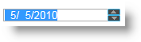

<!--
|metadata|
{
    "fileName": "igdateeditor-overview",
    "controlName": "igEditors",
    "tags": ["Editing","Getting Started"]
}
|metadata|
-->

# igDateEditor Overview


The Ignite UI™ date editor, or `igDateEditor`, is a control that renders an input field which allows users to edit date formatted data. The `igDateEditor` control supports localization, by recognizing different regional options exposed from the browser.

The `igDateEditor` control exposes a rich client-side API, which may be configured the work with any server technology. While the Ignite UI™ controls are server-agnostic, the control does feature wrappers specific for the Microsoft® ASP.NET MVC Framework to configure the control with the .NET™ language of your choice.

The `igDateEditor` control may be extensively styled giving you an opportunity to provide a completely different look and feel for the control as opposed to the default style. Styling options include using your own styles as well as styles from jQuery UI’s ThemeRoller.

Figure 1: The `igDateEditor` rendered to the user



[Date and Time Formats](%%SamplesUrl%%/editors/date-and-time-formats)

## Features

The `igDateEditor` includes the following characteristics:

-   Overall theme support
-   Validation
-   Defining custom input format
-   Defining custom display format
-   Set Min/Max value
-   Localization
-   JavaScript Client API
-   ASP.NET MVC wrapper

## Adding igDateEditor to a Web Page

1.  To get started, include the required and localized resources for your application. Details on which resources to include can be found in the [Using JavaScript Resources in  Ignite UI](Deployment-Guide-JavaScript-Resources.html) help topic.
2.  On your HTML page or ASP.NET MVC View, reference the required JavaScript files, CSS files, and ASP.NET MVC assemblies.

    **In HTML:**

    ```html
    <link type="text/css" href="/css/themes/infragistics/infragistics.theme.css" rel="stylesheet" />
    <link type="text/css" href="/css/structure/infragistics.css" rel="stylesheet" />
    <script type="text/javascript" src="/Scripts/jquery.min.js"></script>
    <script type="text/javascript" src="/Scripts/jquery-ui.min.js"></script>
    <script type="text/javascript" src="/Scripts/Samples/infragistics.core.js"></script>
	<script type="text/javascript" src="/Scripts/Samples/infragistics.lob.js"></script>
    ```

    **In ASPX:**

    ```csharp
    <%@ Import Namespace="Infragistics.Web.Mvc" %>

    <link type="text/css" href="<%= Url.Content("~/css/themes/infragistics/infragistics.theme.css") %>"rel="stylesheet" />
    <link type="text/css" href="<%= Url.Content("~/css/structure/infragistics.css") %>"rel="stylesheet" />

    <script type="text/javascript" src="<%= Url.Content("~/Scripts/jquery.min.js")%>"></script>
    <script type="text/javascript" src="<%= Url.Content("~/Scripts/jquery-ui.min.js")%>"></script>
    <script type="text/javascript" src="<%= Url.Content("~/Scripts/Samples/infragistics.core.js")%>"></script>
	<script type="text/javascript" src="<%= Url.Content("~/Scripts/Samples/infragistics.lob.js")%>"></script>
    <script type="text/javascript" src="<%= Url.Content("~/Scripts/Samples/modules/i18n/regional/infragistics.ui.regional-en.js")%>"></script>
    ```

    **In Razor:**

    ```csharp
    @using Infragistics.Web.Mvc;

    <link type="text/css" href="@Url.Content("~/css/themes/infragistics/infragistics.theme.css")" rel="stylesheet" />
    <link type="text/css" href="@Url.Content("~/css/structure/infragistics.css")" rel="stylesheet" />

    <script type="text/javascript" src="@Url.Content("~/Scripts/jquery-1.4.4.min.js")"></script>
    <script type="text/javascript" src="@Url.Content("~/Scripts/jquery-ui.min.js")"></script>
    <script type="text/javascript" src="@Url.Content("~/Scripts/Samples/infragistics.core.js")"></script>
	<script type="text/javascript" src="@Url.Content("~/Scripts/Samples/infragistics.lob.js")"></script>
    <script type="text/javascript" src="@Url.Content("~/Scripts/Samples/modules/i18n/regional/infragistics.ui.regional-en.js")"></script>
    ```

3.  For jQuery implementations create an INPUT, TD, DIV or SPAN as the target element in HTML. This step is optional for ASP.NET MVC implementations as the MVC wrapper creates the containing element for you.

    **In HTML:**

    ```html
    <input id="dateEditor" type="text" />
    ```

4. Once the above setup is complete, initialize the date editor and set needed options, such as `width`, `nullText`, `mask` etc.

    > **Note:** For the ASP.NET MVC Views, the `Render` method must be called after all other options are set.

    **In Javascript:**

    ```js
    <script type="text/javascript">
          $('#dateEditor').igDateEditor({
              button: 'spin',
              minValue: new Date(1900, 0, 1),
              maxValue: new Date(2200, 11, 31),
              width: 195,
              nullText: 'Enter date'
          });
    </script>
    ```

    **In ASPX:**

     ```csharp
     <%= Html.Infragistics().DateTimeEditor()
                  .ID("dateEditor")
                  .ButtonType(TextEditorButtonType.Spin)
                  .MinValue(new DateTime(1900, 1, 1))
                  .MaxValue(new DateTime(2200, 12, 31))
                  .NullText("Enter date")
                  .Render()%>
     ```

    **In Razor:**

    ```csharp
    @(Html.Infragistics().DateTimeEditor()
                 .ID("dateEditor")
                 .ButtonType(TextEditorButtonType.Spin)
                 .MinValue(new DateTime(1900, 1, 1))
                 .MaxValue(new DateTime(2200, 12, 31))
                 .NullText("Enter date")
                 .Render())
    ```

5.  Run the web page to view the basic setup of the `igDateEditor` control.

## Related Links

-   [Date and Time Formats](%%SamplesUrl%%/editors/date-and-time-formats) 
-   [Ignite UI Overview](NetAdvantage-for-jQuery-Overview.html)
-   [Using JavaScript Resources in Ignite UI](Deployment-Guide-JavaScript-Resources.html)

 

 


