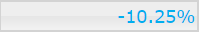

<!--
|metadata|
{
    "fileName": "igpercenteditor-styling-and-theming",
    "controlName": "igEditors",
    "tags": ["Editing","Styling","Theming"]
}
|metadata|
-->

# igPercentEditor Styling and Theming


The `igPercentEditor` control is jQuery-based control that extends `igNumericEditor` and exposes a number of options for styling. To customize style of your percent editor you can use different themes or apply custom CSS rules to the control. 

The Ignite UI package comes with a number of jQuery UI and Bootstrap themes. Bootstrap support also includes generating and customizing your own bootstrap themes - see [Styling and Theming](Deployment-Guide-Styling-and-Theming.html) for details. All of the themes will style all controls including the editors on the page.

## Using ThemeRoller

As the `igPercentEditor` control uses the jQuery UI CSS framewrok it can also be fully styled using the [jQuery UI ThemeRoller](http://jqueryui.com/themeroller/) where you can customize your own theme or choose from a gallery of available ones. These themes replace the ones that come by default with Ignite UI.

Percent editor using the UI Darkness theme:


## Custom styling

Your CSS may include style overrides for many more elements of the percent editor. For a full list of available classes see the [API Reference Theming classes](%%jQueryApiUrl%%/ui.igNumericEditor#theming). Styles can be applied both by overriding the global classes applied to all editors or by targeting specific elements by ID or other specific trait to allow for more per-control customization.

The default color for a negative value in the `igPercentEditor` is red. Here is an example how to change this color:

```html
<style>
.ui-igedit-negative
{
	color: #00aeef;
}
</style>
```



## Related Topics  

-   [igNumericEditor Overview](igNumericEditor-Overview.html)

 

 


