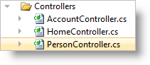

<!--
|metadata|
{
    "fileName": "configuring-asp.net-mvc-validation",
    "controlName": [],
    "tags": []
}
|metadata|
-->

# Configuring ASP.NET MVC Validation


##Topic Overview


### Purpose

Starting with a form consisting of Ignite UI editor controls, this topic demonstrates how to create the form and validate the form with data annotations. It also shows how to configure an ASP.NET MVC ValidationMessage to further customize the layout of validation text.

### Required background

####Concepts

-   ASP.NET MVC Data Annotation Validators
-   Using igEditors and igCombo with their ASP.NET MVC Helpers

####Topics

-	[Adding Controls to an MVC Project](Adding-NetAdvantage-Controls-to-an-MVC-Project.html): To accomplish the basics of setting up an ASP.NET MVC application with Ignite UI scripts, CSS, and assemblies.

-	[igTextEditor Overview](igTextEditor-Overview.html) : To familiarize you with the basics of using the igTextEditor in ASP.NET MVC

-	[igNumericEditor Overview](igNumericEditor-Overview.html): To familiarize you with the basics of using the igNumericEditor in ASP.NET MVC

-	[Getting Started with igCombo](igCombo-Getting-Started.html): To familiarize you with the basics of using the igCombo in ASP.NET MVC

####External Resources

-   [Validation with the Data Annotation Validators](http://www.asp.net/mvc/tutorials/older-versions/models-%28data%29/validation-with-the-data-annotation-validators-cs)

### In this topic

This topic contains the following sections:

-   [Configuring ASP.NET MVC Data Annotation Validation](#_Configuring_MVC_Data_Annotation_Validation)
    -   [Introduction](#_Introduction)
    -   [Preview](#_Preview)
    -   [Requirements](#_Requirements)
    -   [Overview](#_Requirements_Overview)
    -   [Steps](#_Steps)
-   [Related Content](#_Related_Content)
    -   [Topics](#_Topics)
    -   [Samples](#_Samples)

##<a id="_Configuring_MVC_Data_Annotation_Validation"></a>Configuring ASP.NET MVC Data Annotation Validation


### <a id="_Introduction"></a>Introduction

In this procedure, you create and configure a Person model for ASP.NET MVC Data Annotation Validation using Ignite UI controls.

### <a id="_Preview"></a>Preview

The following screenshot is a preview of the final result.


###<a id="_Requirements"></a> Requirements

To complete the procedure, you need the an ASP.NET MVC Project with the following:

-   The required Ignite UI JavaScript and CSS files
-   The Infragistics.Web.Mvc.dll assembly referenced

###<a id="_Requirements_Overview"></a> Overview

This topic takes you step-by-step toward creating a model with data annotations. The following is a conceptual overview of the process:

1.  Creating a Person class
2.  Creating the Controller and View
3.  Adding Data Annotation Validators
4.  Configuring Validation Messages (Optional)

### <a id="_Steps"></a>Steps

The following steps demonstrate how to configure data annotation validation for Ignite UI controls.


​**1.Create a Person class**

1. Add a Person class

	Add a Person class to your Models folder.
	
	

2. Create class members

	Open the Person.cs file and add the following members to the class:
	
	**In C#:**
	
	```csharp
	public class Person
	{
	    public string Name { get; set; }
	    public int Age { get; set; }
	    public string Email { get; set; }
	    public string Group { get; set; }
	}
	```

3. Create a member for data

	The `igCombo`™ in the View needs data in order to display the dropdown. For the purposes of this example, define a member called AvailableGroups on the Person object to supply data to the combo. The Person class should now look like this:
	
	**In C#:**
	
	```csharp
	public class Person
	{
	    public string Name { get; set; }
	    public int Age { get; set; }
	    public string Email { get; set; }
	    public string Group { get; set; }
	    public string[] AvailableGroups
	    {
	        get
	        {
	            return new string[] { "Family", "Friends", "Colleagues" };
	        }
	    }
	}
	```

​**2.Add the Controller and View**

1. Create a PersonController

	Create a new controller in the Controllers folder of your ASP.NET MVC application named PersonController.cs
	
	

2. Create the ActionMethods

	Add two ActionMethods to the Controller for the purposes of creating a Person: one for the initial request and one for the POST.
	
	**In C#:**
	
	```csharp
	public class PersonController : Controller
	{
	    //
	    // GET: /Person/Create
	    public ActionResult Create()
	    {
	        var person = new Person();
	        return View(person);
	    }
	    //
	    // POST: /Person/Create
	    [HttpPost]
	    public ActionResult Create(Person person)
	    {
	        return View(person);
	    }
	}
	```

3. Create the View

	Create a strongly-typed View named Create and use the Person class as the Model.
	
	
	
	**In ASPX:**
	
	```csharp
	<%@ Page Title="" Language="C#" Inherits="System.Web.Mvc.ViewPage<DataAnnotationValidation.Models.Person>" %>
	<%@ Import Namespace="Infragistics.Web.Mvc" %>
	```

4. Add the JavaScript and CSS references.

	In this example, use the combined JavaScript and CSS files referenced locally in the ASP.NET MVC application.
	
	**In ASPX:**
	
	```csharp
	<link href="/Content/css/themes/infragistics/infragistics.theme.css" rel="stylesheet" type="text/css" />
	<link href="/Content/css/structure/infragistics.css" rel="stylesheet" type="text/css" />
	<script src="/Scripts/jquery.js" type="text/javascript"></script>
	<script src="/Scripts/jquery-ui.js" type="text/javascript"></script>
	<script src="/Scripts/js/infragistics.core.js" type="text/javascript"></script><script src="/Scripts/js/infragistics.lob.js" type="text/javascript"></script>
	```

5. Create a form for the Person object.

	In the aspx markup, create labels for each member of the Person class. Additionally, instantiate the appropriate editors for each member as indicated in the code example. Notice how the combo uses both the Model.Group property as well as the Model.AvailableGroups property. Your View should now look like this:
	
	**In ASPX:**
	
	```csharp
	<% using (Html.BeginForm()) %>
	<% { %>
	    <p>
	        <%= Html.LabelFor(m => m.Name) %>
	        <%= Html.Infragistics()
	            .TextEditorFor(m => m.Name)
	            .Render() %>
	    </p>
	    <p>
	        <%= Html.LabelFor(m => m.Age) %>
	        <%= Html.Infragistics()
	            .NumericEditorFor(m => m.Age)
	            .Render() %>
        </p>
        <p>
            <%= Html.LabelFor(m => m.Email) %>
            <%= Html.Infragistics()
                .TextEditorFor(m => m.Email)
                .Render() %>
        </p>
        <p>
            <%= Html.LabelFor(m => m.Group) %>
            <%= Html.Infragistics()
                .ComboFor(m => m.Group)
                .DataSource(Model.AvailableGroups)
                .DataBind()
                .Render() %>
        </p>
        <p>
            <input type="submit" value="Create" />
        </p>
    <% } %>
    ```

6. Run the sample.

	Run the sample and navigate to /person/create. The form displays with all of the editors.
	
	
	
	Once you have finished the above steps, the code of your View should look like this:
	
	**In ASPX:**
	
	```csharp
	<%@ Page Title="" Language="C#" MasterPageFile="~/Views/Shared/Site.Master" Inherits="System.Web.Mvc.ViewPage<DataAnnotationValidation.Models.Person>" %>
	<%@ Import Namespace="Infragistics.Web.Mvc" %>
	<asp:content id="Content2" contentplaceholderid="MainContent" runat="server">
	    <h2>Create</h2>
	    <link href="/Content/css/themes/infragistics/infragistics.theme.css" rel="stylesheet"
	        type="text/css" />
	    <link href="/Content/css/structure/infragistics.css" rel="stylesheet" type="text/css" />
	    <script src="/Scripts/jquery.js" type="text/javascript"></script>
	    <script src="/Scripts/jquery-ui.js" type="text/javascript"></script>
	    <script src="/Scripts/js/infragistics.core.js" type="text/javascript"></script>    <script src="/Scripts/js/infragistics.lob.js" type="text/javascript"></script>
	    
	    <% using (Html.BeginForm()) %>
	    <% { %>
	        <p>
	            <%= Html.LabelFor(m => m.Name) %>
	            <%= Html.Infragistics()
	                .TextEditorFor(m => m.Name)
	                .Render() %>
	        </p>
	        <p>
	            <%= Html.LabelFor(m => m.Age) %>
	            <%= Html.Infragistics()
	                .NumericEditorFor(m => m.Age)
	                .Render() %>
	        </p>
	        <p>
	            <%= Html.LabelFor(m => m.Email) %>
	            <%= Html.Infragistics()
	                .TextEditorFor(m => m.Email)
	                .Render() %>
	        </p>
	        <p>
	            <%= Html.LabelFor(m => m.Group) %>
	            <%= Html.Infragistics()
	                .ComboFor(m => m.Group)
	                .DataSource(Model.AvailableGroups)
	                .DataBind()
	                .Render() %>
	        </p>
	        <p>
	            <input type="submit" value="Create" />
	        </p>
	    <% } %>
	</asp:content>
	```

​**3**. **Add Data Annotation Validators**

1. Import the System.ComponentModel.DataAnnotations namespace.

	The next step is to implement the validators. On the Person class, import the System.ComponentModel.DataAnnotations namespace.
	
	**In C#:**
	
	```csharp
	using System.ComponentModel.DataAnnotations;
	```

2. Add required field validation.

	In the Person class, add required field validators and error messages to each member. These validators ensure that each member decorated with the attribute are entered in the form.
	
	**In C#:**
	
	```csharp
	[Required(ErrorMessage="Name Required")]
	public string Name { get; set; }
	[Required(ErrorMessage = "Age Required")]
	public int Age { get; set; }    
	[Required(ErrorMessage = "Email Required")]
	public string Email { get; set; }
	[Required(ErrorMessage = "Group Required")]
	public string Group { get; set; }
	```

3. Add a length validator to the Name field.

	Similar to the required validator, a length validator should be added to the Name field to limit the amount of characters that can be entered.
	
	**In C#:**
	
	```csharp
	[Required(ErrorMessage = "Name Required")]
	[StringLength(50, ErrorMessage = "Must be under 50 characters")]
	public string Name { get; set; }
	```

4. Add a range validator to the Age field.

	Add a range validator to limit the minimum and maximum values for a number field.
	
	**In C#:**
	
	```csharp
	[Required(ErrorMessage = "Age Required")]
	[Range(1, 120, ErrorMessage = "Age must be between 1 and 120")]
	public int Age { get; set; }
	```

5. Add a regular expression validator to the Email field.

	This regular expression verifies that the input meets the pattern of a normal email address.
	
	**In C#:**
	
	```csharp
	[Required(ErrorMessage = "Email Required")]
	[RegularExpression("^[a-z0-9_+-]+(.[a-z0-9_+-]+)*@[a-z0-9-]+(.[a-z0-9-]+)*.([a-z]{2,4})$", ErrorMessage = "Not a valid email")]
	public string Email { get; set; }
	```
	
	The Person code should look like the following when all Data Annotation Validators have been added.
	
	**In C#:**
	
	```csharp
	using System.ComponentModel.DataAnnotations;
	namespace DataAnnotationValidation.Models
	{
	    public class Person
	    {
	        [Required(ErrorMessage = "Name Required")]
	        [StringLength(50, ErrorMessage = "Must be under 50 characters")]
	        public string Name { get; set; }
	        [Required(ErrorMessage = "Age Required")]
	        [Range(1, 120, ErrorMessage = "Age must be between 1 and 120")]
	        public int Age { get; set; }
	        [Required(ErrorMessage = "Email Required")]
	        [RegularExpression("^[a-z0-9_+-]+(.[a-z0-9_+-]+)*@[a-z0-9-]+(.[a-z0-9-]+)*.([a-z]{2,4})$", ErrorMessage = "Not a valid email")]
	        public string Email { get; set; }
	        [Required(ErrorMessage = "Group Required")]
	        public string Group { get; set; }
	        public string[] AvailableGroups
	        {
	            get
	            {
	                return new string[] { "Family", "Friends", "Colleagues" };
	            }
	        }
	    }
	}
	```

6. Run the sample.

	You can see that the validators fire and also prevent the form from submitting. Also the length validator on the Name field prevents the user from typing more than 50 characters. Additionally, the numeric editor will change values to the closest valid value upon losing focus by default.
	
	

​**4. Configure Validation Messages (Optional)**

1. Add validation messages to the View.

	For a less cluttered appearance, you can use ASP.NET Validation Messages and the validation message will appear in those messages as opposed to right next to the input field. Add validation messages for each member in the View.
	
	**In ASPX:**
	
	```csharp
	<p>
	    <%= Html.LabelFor(m => m.Name) %>
	    <%= Html.Infragistics()
	        .TextEditorFor(m => m.Name)
	        .Render() %>
	    <%= Html.ValidationMessageFor(m => m.Name) %>
	</p>
	<p>
	    <%= Html.LabelFor(m => m.Age) %>
	    <%= Html.Infragistics()
	        .NumericEditorFor(m => m.Age)
	        .Render() %>
	    <%= Html.ValidationMessageFor(m => m.Age)%>
	</p>
	<p>
	    <%= Html.LabelFor(m => m.Email) %>
	    <%= Html.Infragistics()
	        .TextEditorFor(m => m.Email)
	        .Render() %>
	    <%= Html.ValidationMessageFor(m => m.Email)%>
	</p>
	<p>
	    <%= Html.LabelFor(m => m.Group) %>
	    <%= Html.Infragistics()
	        .ComboFor(m => m.Group)
	        .DataSource(Model.AvailableGroups)
	        .DataBind()
	        .Render() %>
	    <%= Html.ValidationMessageFor(m => m.Group)%>
	</p>
	```

2. Run the sample.

	Now the validation appears to the right of each input field.
	
	


##<a id="_Related_Content"></a>Related Content


### <a id="_Topics"></a>Topics

The following topics provide additional information related to this topic.


-	[Configuring igEditors at Runtime](Configuring-igEditors-at-Runtime.html) : To learn more about using editors at runtime including important information regarding how the ASP.NET MVC Helpers render the controls.


###<a id="_Samples"></a> Samples

The following samples provide additional information related to this topic.


-	[Data Annotation Validation](%%SamplesUrl%%/editors/data-annotation-validation): This sample shows data annotation validation when a submit button is pressed.
