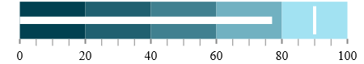
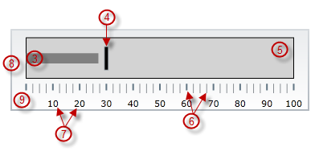
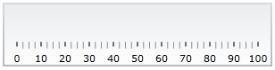

<!--
|metadata|
{
    "fileName": "igbulletgraph-overview",
    "controlName": "igBulletGraph",
    "tags": ["API","Charting","Data Presentation","Getting Started","How Do I"]
}
|metadata|
-->

# igBulletGraph Overview

## Topic Overview

#### Purpose

This topic provides conceptual information about the `igBulletGraph`™ control including its main features, minimum requirements, and user functionality.

#### Required background

The following concept is required for understanding this topic.

-   [Bullet graph](http://www.perceptualedge.com/articles/misc/Bullet_Graph_Design_Spec.pdf)

#### In this topic

This topic contains the following sections:

-   [**Introduction**](#Introduction)
    -   [igBulletGraph summary](#summary)
-   [**Main Features**](#main-features)
-   [**Logical areas and Configurable Visual Elements Summary**](#areas-elements)
    -   [Logical areas](#logical-areas)
    -   [Configurable visual elements](#configurable-visual-elements)
-   [**Configurable Visual Elements and Related Properties**](#configurable-visual-elements-properties)
    -   [Configurable visual elements and related properties summary](#configurable-visual-elements-properties-summary)
    -   [Scale](#scale)
    -   [Performance bar](#performance-bar)
    -   [Comparative marker](#comparative-marker)
    -   [Comparative ranges](#comparative-ranges)
    -   [Background](#background)
    -   [Tooltips](#tooltips)
-   [**Default Configuration**](#default-configuration)
-   [**Requirements**](#requirements)
-   [**Related Content**](#related-countent)
    -   [Topics](#related-topics)
    -   [Samples](#related-samples)
    -   [Resource](#related-resource)

## Introduction

#### igBulletGraph summary

The `igBulletGraph` control is an **Ignite UI**™ control which allows for visualizing data in the form of a bullet graph. Linear by design, it provides a simple and concise view of a primary measure or measures compared against a scale and, optionally, some other measure.

The igBulletGraph control provides you with the ability to create attractive data presentations, replacing meters and gauges that are used on dashboards with simple yet straightforward and clear bar charts. A bullet graph is one of the most effective and efficient ways to present progress towards goals, good/better/best ranges, or compare multiple measurements in as little horizontal or vertical space as possible.

##  Main Features

The features of igBulletGraph include configurable orientation and direction, configurable visual elements and tooltips, and more. The control has also a built-in support for animated transitions.

### Configurable orientation and direction

The igBulletGraph control exposes an API for setting the state of its scale’s orientation and direction, so that the look of the graph can be largely customized. (For details, see the [Configuring the Orientation and Direction (*igBulletGraph*)](igBulletGraph-Configuring-the-Orientation-and-Direction.html) topic.)

### Configurable visual elements

Each of the [visual elements](igBulletGraph-Overview.html#configurable-visual-elements-properties-summary) of the bullet graph can be configured in several aspects. (For details, see [Configurable Visual Elements of *igBulletGraph* and Related Properties](#configurable-visual-elements-properties).)

### Animated transitions

The igBulletGraph control provides built-in support for animation by its [transitionDuration](%%jQueryApiUrl%%/ui.igBulletGraph#options) property. The animation effect occurs on loading the control as well as when the value of any of its properties is changed. By default, animated transitions are disabled. Providing a value in milliseconds for the transitionDuration property of the control determines the timeframe for swiping the control into view by smoothly visualizing all its visual elements through a slide effect (from bottom-left to top-right). Setting the value to 0 disables the animated transition. For a sample, demonstrating the animation transition effect, see the [Animated Transitions](%%SamplesUrl%%/bullet-graph/animated-transitions) sample.

### Support for tooltips

The built-in tooltips of the igBulletGraph control show the values used to create the performance bars, the target value or the values, corresponding to the different ranges respectively. They are initially styled in accordance with the default look of the control, but their look can be customized by templates. By default, tooltips are disabled. (For details, see [Configuring the Tooltips (*igBulletGraph*)](igBulletGraph-Configuring-the-Tooltips.html))

##  Logical areas and Configurable Visual Elements Summary

###  Logical areas

The user-visible area of the igBulletGraph control is logically divided into a Graph area and a Reserved area.

Horizontal orientation | Vertical orientation
---------------------- | --------------------
 | 

-   Reserved area (1) – This area spreads:
    -   Along the scale – the Reserved area begins either at the edge of the control) and ends at the edge of the control.
    -   Across the scale:
        -   In horizontal orientation: the Reserved area begins at the bottom edge of the control and spreads upward as much as the height of the numbering labels is (depending on the size and the other formatting of the font used in the labels)
        -   In vertical orientation: the Reserved area begins at the left edge of the control and spreads to the right as much as the width of the numbering labels is (depending on how large the numbers of the measurements of the scale are and the size and the other formatting of the font used in the labels).

The main purpose of the Reserved area is to provide enough space for the numbering labels of the scale at any orientation – horizontal or vertical (The Reserved area automatically re-sizes when the orientation changes in order to accommodate the specific space requirements for displaying the numbering labels in each of the orientations: in horizontal orientation, the area has to fit the labels’ height and in vertical orientation – their maximum width.) This doesn’t mean that you must necessarily place the numbering labels in the Reserved area: actually, you can position the label row anywhere across-the-scale within the [Graph area](igBulletGraph-Overview.html#areas-elements). However, even if you place the label row outside Reserved area, this will have no bearing on the spread and location of the Reserved area itself – it remains where it is, automatically defined through the height/width (depending on the orientation) of the numbering labels.

Another aspect in which the Reserved area is significant is the fact that its inner edge specifies the beginning edge of the [Graph area](igBulletGraph-Overview.html#areas-elements) in the across-the-scale dimension. This is important, because this edge serves as a reference mark for the extent-related properties that position some [visual elements](igBulletGraph-Overview.html#configurable-visual-elements-properties-summary) across the scale. (Positive values for these properties – the most common case – position the visual elements inside the [Graph area](igBulletGraph-Overview.html#areas-elements) and negative values – inside the Reserved area.)

-   Graph area (2) – The area for displaying the performance bars, the tick marks, the ranges, and, optionally, the numbering labels of the bullet graph. All extent-related properties for these visual elements (except for labels) are measured against its edges. The Graph area serves not as a placeholder but as a frame of reference for positioning the scale inside the control (More precisely, for positioning the [visual elements](igBulletGraph-Overview.html#configurable-visual-elements-properties-summary) of the scale).

Spread of the Graph area:

-   Along the scale – the Graph area begins at the starting edge of the control (the left edge at horizontal orientation or bottom edge at vertical orientation) and ends at its ending edge (the right edge at horizontal orientation or top edge at vertical orientation). Both the starting and ending positions of the scale are measured against the starting edge of the Graph area.
-   Across the scale – the Graph area begins at the edge of the [Reserved area](igBulletGraph-Overview.html#areas-elements) (this is the bottom edge of the Graph area at horizontal orientation or its left edge at vertical orientation). The edge of the Graph area that borders with the Reserved area serves as reference point for the extent-related properties of some of the visual elements of the scale (for positioning these elements across the scale).

###  Configurable visual elements

The `igBulletGraph` control features the following visual elements (See the picture below.):

-   Performance bar (3) – This is the primary measure displayed by the control and is visualized as a bar.
-   Comparative marker (4) – A measure which the performance bar measure compares against. It is visualized as a marker that runs perpendicular to the orientation of the performance bar.
-   Comparative range(s) (5) – The ranges are visual elements that highlight a specified range of values on a scale. Their purpose is to visually communicate the qualitative state of the performance bar measure, illustrating at the same times the degree to which it resides within that state.
-   Tick marks (6) –The tick marks serve as a visual division of the scale into intervals in order to increase the readability of the bullet graph.
    -   Major tick marks – The major tick marks are used as primary delimiters on the scale. The frequency they appear at, their extents and style can be controlled by setting the corresponding properties.
    -   Minor tick marks – The minor tick marks represent helper tick marks, which might be used to additionally improve the readability of the scale and can be customized in a way similar to the major ones.
-   Scale labels (7) – The labels indicate the measures on the scale.
-   Border (8) – The line visually delimiting the dimensions of the control.
-   Background (9) – The background on which visual elements is placed is configurable in terms of color.

-   Tooltips – show the values used to create the performance bars, the target value or the values, corresponding to the different ranges  respectively.

## Configurable Visual Elements and Related Properties

### Configurable visual elements and related properties summary

There are several specific aspects in which each element can be configured.

The following table provides an overview of the configurable aspects of the visual elements of the *igBulletGraph* control. Further details about the configurable aspects with illustrations and the properties that configure them are available, for each visual element, in the blocks that follow the table:

<table class="table">
	<thead>
		<tr>
			<th>Visual element</th>
			<th>Main configurable aspects</th>
		</tr>
	</thead>
	<tbody>
		<tr>
			<td>[Scale](#scale)</td>
			<td>
				<ul>
				<li>Position</li>
				<li>Tick marks</li>
				<li>Labels</li>
				</ul>
			</td>
		</tr>
		<tr>
			<td>[Performance bar](#performance-bar)</td>
			<td>
				<ul>
				<li>Value indicated</li>
				<li>Width and position</li>
				<li>Look-and-feel</li>
				</ul>
			</td>
		</tr>
		<tr>
			<td>[Comparative marker](#comparative-marker)</td>
			<td>
				<ul>
				<li>Value indicated</li>
				<li>Width</li>
				<li>Look-and-feel</li>
				</ul>
			</td>
		</tr>
		<tr>
			<td>[Comparative ranges](#comparative-ranges)</td>
			<td>
				<ul>
				<li>Number (of ranges in the graph)</li>
				<li>Length, width, and position</li>
				<li>Look-and-feel</li>
				</ul>
			</td>
		</tr>
		<tr>
			<td>[Background](#background)</td>
			<td>
				<ul>
				<li>Size and position</li>
				<li>Look-and-feel</li>
				</ul>
			</td>
		</tr>
		<tr>
			<td>[Tooltips](#tooltips)</td>
			<td>
				<ul>
				<li>Display delay</li>
				</ul>
			</td>
		</tr>
	</tbody>
</table>

### Scale

The following pictures illustrate the scale-related extents, listed in the table below.

Extent positioning the scale within the Graph area | Extents configuring the position of the labels
---|---
 | 

Extents configuring the major tick marks along the scale | Extents configuring the major tick marks across the scale
-----------|--------------
 | 

|Extents configuring the minor tick marks across the scale|
|-------------|
||

The following table maps the configurable aspects related to the scale of the bullet graph to the `igBulletGraph` properties that manage them.

<table class="table table-bordered">
	<tbody>
		<tr>
            <th colspan="4">
Configurable aspects
			</th>
            <th>
Property
			</th>
            <th>
Default value
			</th>
        </tr>
        <tr>
            <th rowspan="2" colspan="4">
**Position**
			</th>
            <td>
[scaleStartExtent](%%jQueryApiUrl%%/ui.igBulletGraph#options:scaleStartExtent)
			</td>
            <td>
0.05
			</td>
        </tr>
        <tr>
            <td>
[scaleEndExtent](%%jQueryApiUrl%%/ui.igBulletGraph#options:scaleEndExtent)
			</td>
            <td>
0.95
			</td>
        </tr>
        <tr>
            <th rowspan="2" colspan="2">
**Range and Values**
			</th>
            <th colspan="2">
**Max value**
			</th>
            <td>
[minimumValue](%%jQueryApiUrl%%/ui.igBulletGraph#options:minimumValue)
			</td>
            <td>
0
			</td>
        </tr>
        <tr>
            <th colspan="2">
**Min value**
			</th>
            <td>
[maximumValue](%%jQueryApiUrl%%/ui.igBulletGraph#options:maximumValue)
			</td>
            <td>
100
			</td>
        </tr>
        <tr>
            <th rowspan="12">
**Tick marks**
			</th>
            <th rowspan="7">
**Major tick marks**
			</th>
            <th rowspan="5" colspan="2">
**Position** (within the scale)**, spacing, and length**
			</th>
            <td>
[interval](%%jQueryApiUrl%%/ui.igBulletGraph#options:interval)
			</td>
            <td>
Not set
			</td>
        </tr>
        <tr>
            <td>
[ticksPostInitial](%%jQueryApiUrl%%/ui.igBulletGraph#options:ticksPostInitial)
			</td>
            <td>
0
			</td>
        </tr>
        <tr>
            <td>
[ticksPreTerminal](%%jQueryApiUrl%%/ui.igBulletGraph#options:ticksPreTerminal)
			</td>

            <td>
0
			</td>
        </tr>

        <tr>
            <td>
[tickStartExtent](%%jQueryApiUrl%%/ui.igBulletGraph#options:tickStartExtent)
			</td>
            <td>
0.02
			</td>
        </tr>
        <tr>
            <td>
[tickEndExtent](%%jQueryApiUrl%%/ui.igBulletGraph#options:tickEndExtent)
			</td>
            <td>
0.2
			</td>
        </tr>
        <tr>
            <th rowspan="2">
**Look-and-feel**
			</th>
            <th>
Color
			</th>
            <td>
[tickBrush](%%jQueryApiUrl%%/ui.igBulletGraph#options:tickBrush)
			</td>
            <td>
Defined in the default theme
			</td>
        </tr>
        <tr>
            <th>
Width
			</th>
            <td>
[tickStrokeThickness](%%jQueryApiUrl%%/ui.igBulletGraph#options:tickStrokeThickness)
			</td>
            <td>
2.0
			</td>
        </tr>
        <tr>
            <th rowspan="5">
**Minor tick marks**
			</th>
            <th colspan="2">
**Number** (between two adjacent major tick marks)
			</th>
            <td>
[minorTickCount](%%jQueryApiUrl%%/ui.igBulletGraph#options:minorTickCount)
			</td>

            <td>
3.0
			</td>
        </tr>
        <tr>
            <th rowspan="2" colspan="2">
**Position**
			</th>
            <td>
[minorTickStartExtent](%%jQueryApiUrl%%/ui.igBulletGraph#options:minorTickStartExtent)
			</td>
            <td>
0.06
			</td>
        </tr>
        <tr>
            <td>
[minorTickEndExtent](%%jQueryApiUrl%%/ui.igBulletGraph#options:minorTickEndExtent)
			</td>
            <td>
0.2
			</td>
        </tr>
        <tr>
            <th rowspan="2">
**Look-and-feel**
			</th>
            <th>
Color
			</th>
            <td>
[minorTickBrush](%%jQueryApiUrl%%/ui.igBulletGraph#options:minorTickBrush)
			</td>

            <td>
Defined in the default theme
			</td>
        </tr>

        <tr>
            <th>
Width
			</th>
            <td>
[minorTickStrokeThickness](%%jQueryApiUrl%%/ui.igBulletGraph#options:minorTickStrokeThickness)
			</td>
            <td>
1.0
			</td>
        </tr>
        <tr>
            <th rowspan="7">
**Labels**
			</th>
            <th rowspan="4" colspan="3">
**Position and spacing**
			</th>
            <td>
[labelExtent](%%jQueryApiUrl%%/ui.igBulletGraph#options:labelExtent)
			</td>
            <td>
0
			</td>
        </tr>
        <tr>
            <td>
[labelInterval](%%jQueryApiUrl%%/ui.igBulletGraph#options:labelInterval)
			</td>
            <td>
Not set
			</td>
        </tr>
        <tr>
            <td>
[labelsPostInitial](%%jQueryApiUrl%%/ui.igBulletGraph#options:labelsPostInitial)
			</td>
            <td>
0
			</td>
        </tr>
        <tr>
            <td>
[labelsPreTerminal](%%jQueryApiUrl%%/ui.igBulletGraph#options:labelsPreTerminal)
			</td>
            <td>
0
			</td>
        </tr>
        <tr>
            <th colspan="3">
**Number format**
			</th>
            <td>
[labelFormat](%%jQueryApiUrl%%/ui.igBulletGraph#options:labelFormat)
			</td>
            <td>
Not set
			</td>
        </tr>
        <tr>
            <th rowspan="2" colspan="2">
**Look-and-feel**
			</th>
            <th>
Color
			</th>

            <td>
[fontBrush](%%jQueryApiUrl%%/ui.igBulletGraph#options:fontBrush)
			</td>

            <td>
Defined in the default theme
			</td>
        </tr>
        <tr>
            <th>
Font
			</th>
            <td>
[font](%%jQueryApiUrl%%/ui.igBulletGraph#options:font)
			</td>

            <td>
Defined in the default theme
			</td>
        </tr>
    </tbody>
</table>

#### Related Topics

-   [Configuring the Scale (*igBulletGraph*)](igBulletGraph-Configuring-the-Scale.html)

### Performance bar

The following picture illustrates the performance-bar-related extents, listed in the table below.

The following table maps the configurable aspects related to the performance bar of the bullet graph to the `igBulletGraph` properties that manage them.

<table class="table table-bordered">
	<tbody>
		<tr>
            <th colspan="2">
**Configurable aspects**
			</th>
            <th>
Property
			</th>
            <th>
Default value
			</th>
        </tr>
        <tr>
            <th colspan="2">
**Name**
			</th>
            <td>
[valueName](%%jQueryApiUrl%%/ui.igBulletGraph#options:valueName)
			</td>
            <td>
Not set
			</td>
        </tr>
        <tr>
            <th colspan="2">
**Value to indicate**
			</th>
            <td>
[value](%%jQueryApiUrl%%/ui.igBulletGraph#options:value)
			</td>
            <td>
Not set
			</td>
        </tr>
        <tr>
            <th rowspan="2" colspan="2">
**Breadth and position**
			</th>
            <td>
[valueInnerExtent](%%jQueryApiUrl%%/ui.igBulletGraph#options:valueInnerExtent)
			</td>
            <td>
*0.5*
			</td>
        </tr>
        <tr>
            <td>
[valueOuterExtent](%%jQueryApiUrl%%/ui.igBulletGraph#options:valueOuterExtent)
			</td>
            <td>
*0.65*
			</td>
        </tr>
        <tr>
            <th rowspan="3">
**Look-and-feel**
			</th>
            <th>
Fill color
			</th>
            <td>
[valueBrush](%%jQueryApiUrl%%/ui.igBulletGraph#options:valueBrush)
			</td>
            <td>
Defined in the default theme
			</td>
        </tr>
        <tr>
            <th>
Border color
			</th>
            <td>
[valueOutline](%%jQueryApiUrl%%/ui.igBulletGraph#options:valueOutline)
			</td>
            <td>
Defined in the default theme
			</td>
        </tr>
        <tr>
            <th>
Border thickness
			</th>
            <td>
[valueStrokeThickness](%%jQueryApiUrl%%/ui.igBulletGraph#options:valueStrokeThickness)
			</td>
            <td>
*1.0*
			</td>
        </tr>
        <tr>
            <th colspan="2">
**Tooltip**
			</th>
            <td>
[valueToolTip](%%jQueryApiUrl%%/ui.igBulletGraph#options:valueToolTip)
			</td>
            <td>
Depends on whether [valueName](%%jQueryApiUrl%%/ui.igBulletGraph#options:valueName) has been initialized
			</td>
        </tr>
    </tbody>
</table>

#### Related Topics

-   [Configuring the Performance Bar (*igBulletGraph*)](igBulletGraph-Configuring-the-Performance-Bar.html)

### Comparative marker

The following picture illustrates the comparative-market-related extents, listed in the table below.

The following table maps the configurable aspects related to the comparative marker of the bullet graph to the `igBulletGraph` properties that manage them.

<table class="table table-bordered">
    <tbody>
		<tr>
            <th colspan="2">
Configurable aspects
			</th>
            <th>
Property
			</th>
            <th>
Default value
			</th
        </tr>
        <tr>
            <th colspan="2">
**Value indicated**
			</th>
            <td>
[targetValue](%%jQueryApiUrl%%/ui.igBulletGraph#options:targetValue)
			</td>
            <td>
Not set
			</td>
        </tr>
        <tr>
            <th colspan="2">
**Breadth**
			</th>
            <td>
[targetValueBreadth](%%jQueryApiUrl%%/ui.igBulletGraph#options:targetValueBreadth)
			</td>
            <td>
*3.0*
			</td>
        </tr>
        <tr>
            <th rowspan="3">
**Look-and-feel**
			</th>
            <th>
Fill color
			</th>
            <td>
[targetValueBrush](%%jQueryApiUrl%%/ui.igBulletGraph#options:targetValueBrush)
			</td>
            <td>
Defined in the default theme
			</td>
        </tr>
        <tr>
            <th>
Border color
			</th>
            <td>
[targetValueOutline](%%jQueryApiUrl%%/ui.igBulletGraph#options:targetValueOutline)
			</td>
            <td>
Defined in the default theme
			</td>
        </tr>
        <tr>
            <th>
Border thickness
			</th>
            <td>
[targetValueStrokeThickness](%%jQueryApiUrl%%/ui.igBulletGraph#options:targetValueStrokeThickness)
			</td>
            <td>
*1.0*
			</td>
        </tr>
    </tbody>
</table>

#### Related Topics

-   [Configuring the Comparative Marker (*igBulletGraph*)](igBulletGraph-Configuring-the-Comparative-Marker.html)

### Comparative ranges

The following picture illustrates the comparative-ranges-related extents, listed in the table below.

The following table maps the configurable aspects related to the comparative ranges of the bullet graph to the `igBulletGraph` properties that manage them.

<table class="table table-bordered">
    <tbody>
        <tr>
            <th colspan="2">
Configurable aspects
            </th>
            <th>
Property
            </th>
            <th>
Default value
            </th>
        </tr>
        <tr>
            <th colspan="2">
**Number** (of ranges in the graph)
            </th>
            <td>
[ranges](%%jQueryApiUrl%%/ui.igBulletGraph#options:ranges)
            </td>
            <td>
Not set
            </td>
        </tr>
        <tr>
            <th rowspan="6" colspan="2">
**Length, width, and position**
            </th>
            <td>
[startValue](%%jQueryApiUrl%%/ui.igBulletGraph#options:startValue)
            </td>
            <td>
Not set
            </td>
        </tr>
        <tr>
            <td>
[endValue](%%jQueryApiUrl%%/ui.igBulletGraph#options:endValue)
            </td>
            <td>
Not set
            </td>
        </tr>
        <tr>
            <td>
[innerStartExtent](%%jQueryApiUrl%%/ui.igBulletGraph#options:innerStartExtent)
            </td>
            <td>
Not set
            </td>
        </tr>
        <tr>
            <td>
[innerEndExtent](%%jQueryApiUrl%%/ui.igBulletGraph#options:innerEndExtent)
            </td>
            <td>
Not set
            </td>
        </tr>
        <tr>
            <td>
[outerStartExtent](%%jQueryApiUrl%%/ui.igBulletGraph#options:outerStartExtent)
            </td>
            <td>
Not set
            </td>
        </tr>
        <tr>
            <td>
[outerEndExtent](%%jQueryApiUrl%%/ui.igBulletGraph#options:outerEndExtent)
            </td>
            <td>
Not set
            </td>
        </tr>
        <tr>
            <th rowspan="3">
**Look-and-feel**
            </th>
            <th>
Fill color
            </th>
            <td>
[brush](%%jQueryApiUrl%%/ui.igBulletGraph#options:brush)
            </td>
            <td>
Defined in the default theme
            </td>
        </tr>
        <tr>
            <th>
Border color
            </th>
            <td>
[outline](%%jQueryApiUrl%%/ui.igBulletGraph#options:outline)
            </td>
            <td>
Defined in the default theme
            </td>
        </tr>
        <tr>
            <th>
Border thickness
            </th>
            <td>
[strokeThickness](%%jQueryApiUrl%%/ui.igBulletGraph#options:strokeThickness)
            </td>
            <td>
*1.0*
            </td>
        </tr>
        <tr>
            <th colspan="2">
**Tooltip**
            </th>
            <td>
[rangeToolTip](%%jQueryApiUrl%%/ui.igBulletGraph#options:rangeToolTip)
            </td>
            <td>
The start and end values of the range separated by a hyphen (-).
            </td>
        </tr>
    </tbody>
</table>

#### Related Topics

-   [Configuring Comparative Ranges (*igBulletGraph*)](igBulletGraph-Configuring-Comparative-Ranges.html)

### Background

The following picture illustrates the background-related extents, listed in the table below.

The following table maps the configurable aspects related to the background of the bullet graph to the `igBulletGraph` properties that manage them.

<table class="table table-bordered">
    <tbody>
        <tr>
            <th colspan="2">
Configurable aspects
            </th>
            <th>
Property
            </th>
            <th>
Default value
            </th>
        </tr>
        <tr>
            <th rowspan="2" colspan="2">
**Spread and position** (across the scale)
            </th>
            <td>
[backingInnerExtent](%%jQueryApiUrl%%/ui.igBulletGraph#options:backingInnerExtent)
            </td>
            <td>
*0*
            </td>
        </tr>
        <tr>
            <td>
[backingOuterExtent](%%jQueryApiUrl%%/ui.igBulletGraph#options:backingOuterExtent)
            </td>
            <td>
*1.0*
            </td>
        </tr>
        <tr>
            <th rowspan="3">
**Look-and-feel**
            </th>
            <th>
Color
            </th>
            <td>
[backingBrush](%%jQueryApiUrl%%/ui.igBulletGraph#options:backingBrush)
            </td>
            <td>
Defined in the default theme
            </td>
        </tr>
        <tr>
            <th>
Border color
            </th>
            <td>
[backingOutline](%%jQueryApiUrl%%/ui.igBulletGraph#options:backingOutline)
            </td>
            <td>
Defined in the default theme
            </td>
        </tr>
        <tr>
            <th>
Border thickness
            </th>
            <td>
[backingStrokeThickness](%%jQueryApiUrl%%/ui.igBulletGraph#options:backingStrokeThickness)
            </td>
            <td>
*2.0*
            </td>
        </tr>
    </tbody>
</table>

#### Related Topics

-   [Configuring the Background (*igBulletGraph*)](igBulletGraph-Configuring-the-Background.html)

### Tooltips

The following table maps the configurable aspects of the `igBulletGraph` control related to tooltips to the properties that manage them.

<table class="table table-bordered">
    <tbody>
        <tr>
            <th>
Configurable aspect
            </th>
            <th colspan="2">
Details
            </th>
            <th>
Properties / Events
            </th>
            <th>
Default value
            </th>
        </tr>
        <tr>
            <th>
Visibility
            </th>
            <td colspan="2">
You can enable/disable tooltips for the **igBulletGraph** control.
            </td>
            <td>
[showToolTip](%%jQueryApiUrl%%/ui.igBulletGraph#options:showToolTip)
            </td>
            <td>
*False*
            </td>
        </tr>
        <tr>
            <th>
Delay
            </th>
            <td colspan="2">
The timeout before the tooltip appears upon the visual element at mouse hovering is configurable in milliseconds.
            </td>
            <td>
[showToolTipTimeout](%%jQueryApiUrl%%/ui.igBulletGraph#options:showToolTipTimeout)
            </td>
            <td>
*500*
            </td>
        </tr>
        <tr>
            <th rowspan="3">
Value
            </th>
            <td rowspan="3">
You can provide a custom value for the respective tooltip property.
            </td>
            <td>
[**Performance bar**](igBulletGraph-Configuring-the-Tooltips.html#performance-bar)
            </td>
            <td>
[valueToolTip](%%jQueryApiUrl%%/ui.igBulletGraph#options:valueToolTip)
            </td>
            <td>
Depends on whether [valueName](%%jQueryApiUrl%%/ui.igBulletGraph#options:valueName) has been initialized (see [Configuring the Tooltips (*igBulletGraph*)](igBulletGraph-Configuring-the-Tooltips.html))
            </td>
        </tr>
        <tr>
            <td>
[**Comparative marker**](igBulletGraph-Configuring-the-Tooltips.html#comparative-marker)
            </td>
            <td>
[targetValueToolTip](%%jQueryApiUrl%%/ui.igBulletGraph#options:targetValueToolTip)
            </td>
            <td>
The value indicated by the comparative marker
            </td>
        </tr>
        <tr>
            <td>
[**Comparative Range(s)**](igBulletGraph-Configuring-the-Tooltips.html#comparative-ranges)
            </td>
            <td>
[rangeToolTip](%%jQueryApiUrl%%/ui.igBulletGraph#options:rangeToolTip)
            </td>
            <td>
The start and end values of the range separated by a hyphen.
            </td>
        </tr>
    </tbody>
</table>

#### Related Topics

-   [Configuring the Tooltips (*igBulletGraph*)](igBulletGraph-Configuring-the-Tooltips.html)

##  Default Configuration
By default, the `igBulletGraph` control is oriented horizontally. It displays with a scale starting at 0 and ending at 100. The major tick marks of the control are located at an interval of 10 and the count of minor tick marks between each pair of major tick marks is 3. There is no title/subtitle displayed, the background color is a variety of light grey. The border is 2 pixels thick colored in dark grey. No comparative marker or ranges are displayed. Animated transitions are disabled.

The following picture demonstrates a `igBulletGraph` displayed with default settings.

## Requirements

The `igBulletGraph` control is a jQuery UI widget and, therefore, depends on the jQuery and jQuery UI libraries. References to these resources are needed nevertheless, in spite of the use of pure jQuery or ASP.NET MVC helpers. The *Infragistics.Web.Mvc* assembly is required when the control is used in the context of ASP.NET MVC.

In order for the bullet graph to display the performance value(s), the [`targetValue`](%%jQueryApiUrl%%/ui.igBulletGraph#options:targetValue) property has to be set.

For the full requirements listing, refer to the [Adding *igBulletGraph*](igBulletGraph-Adding.html) topic.

## Related Content

### Topics

The following topics provide additional information related to this topic.

- [Adding *igBulletGraph*](igBulletGraph-Adding.html): This is a group of topics demonstrating how to add the igBulletGraph control to an HTML page and to an ASP.NET MVC application.

- [Configuring *igBulletGraph*](igBulletGraph-Configuring.html): This is a group of topics explaining how to configure the various aspects of the igBulletGraph control including its orientation and direction and visual elements.

- [jQuery and ASP.NET MVC Helper API Links (*igBulletGraph*)](igBulletGraph-API-Links.html): This topic provides links to the API reference documentation about the igBulletGraph control and its ASP.NET MVC Helper.

- [Known Issues and Limitations (*igBulletGraph*)](igBulletGraph-Known-Issues-and-Limitations.html): This topic provides information about the known issues and limitations of the igBulletGraph control.

### Samples

The following samples provide additional information related to this topic.

- [Basic Configuration](%%SamplesUrl%%/bullet-graph/basic-configuration): This sample demonstrates a simple configuration of the igBulletGraph control.

- [Animated Transitions](%%SamplesUrl%%/bullet-graph/animated-transitions): This sample demonstrates animated transitions between different sets of settings in the igBulletGraph control.

### Resource

The following material (available outside the Infragistics family of content) provides additional information related to this topic.

- [Bullet Graph Design Specification](http://www.perceptualedge.com/articles/misc/Bullet_Graph_Design_Spec.pdf): This is a PDF document explaining the bullet graph conceptually and providing design recommendations.

 

 

