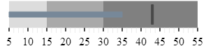
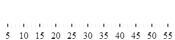
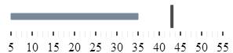

<!--
|metadata|
{
    "fileName": "igbulletgraph-adding-using-the-mvc-helper",
    "controlName": "igBulletGraph",
    "tags": ["Application Scenarios","Charting","Getting Started","How Do I"]
}
|metadata|
-->

# Adding igBulletGraph to an ASP.NET MVC application


## Topic Overview

#### Purpose

This topic demonstrates, with code examples, how to add the `igBulletGraph`™ to an ASP.NET MVC application using the ASP.NET MVC helper.

### Required background

The following table lists the concepts and topics required as a prerequisite to understanding this topic.

- Concepts
	-   jQuery
	-   jQuery UI
	-   ASP.NET MVC
	-   ASP.NET MVC HTML Helpers

- Topics
	- [Adding Controls to an MVC Project](Adding-NetAdvantage-Controls-to-an-MVC-Project.html): This topic explains how to get started with %%ProductName%%™ components in an 	ASP.NET MVC application.
	- [*igBulletGraph* Overview](igBulletGraph-Overview.html): This topic provides conceptual information about the `igBulletGraph` control including its main features, minimum requirements, and user functionality.


 


### In this topic

This topic contains the following sections:

-   [**Adding *igBulletGraph* to an ASP.NET MVC Application – Conceptual Overview**](#overview)
    -   [Requirements](#requirements)
    -   [Steps](#steps)
-   [**Adding *igBulletGraph* to an ASP.NET MVC Application – Procedure**](#procedure)
    -   [Introduction](#procedure-introduction)
    -   [Preview](#preview)
    -   [Prerequisites](#prerequisites)
    -   [Steps](#steps)
    -   [Full code](#full-code)
-   [**Related Content**](#related-content)
    -   [Topics](#topics)
    -   [Samples](#samples)


## <a id="overview"></a>Adding igBulletGraph to an ASP.NET MVC Application – Conceptual Overview

The `igBulletGraph` control can be added to an ASP.NET MVC view using the ASP.NET MVC helper. In order to successfully display the bullet graph, the dimensions of the control should be specified. When instantiating the `igBulletGraph` control, there are several **helper methods** that should be set for basic rendering including the following:


- [`Width()`](Infragistics.Web.Mvc~Infragistics.Web.Mvc.BulletGraphModel_members.html): Sets the width of the igBulletGraph.

- [`Height()`](Infragistics.Web.Mvc~Infragistics.Web.Mvc.BulletGraphModel_members.html): Sets the height of the igBulletGraph.

- [`MinimumValue()`](Infragistics.Web.Mvc~Infragistics.Web.Mvc.BulletGraphModel_members.html): Sets the start value for the scale’s range.

- [`MaximumValue()`](Infragistics.Web.Mvc~Infragistics.Web.Mvc.BulletGraphModel_members.html): Sets the end value for the scale’s range.

- [`Value()`](Infragistics.Web.Mvc~Infragistics.Web.Mvc.BulletGraphModel_members.html): Sets the value which determines the end position of the performance bar.

- [`TargetValue()`](Infragistics.Web.Mvc~Infragistics.Web.Mvc.BulletGraphModel_members.html): Sets the value indicated by the comparative marker.

- [`Ranges()`](Infragistics.Web.Mvc~Infragistics.Web.Mvc.BulletGraphModel_members.html): Instantiates range objects for the `igBulletGraph`.

Apart from its [`startValue`](%%jQueryApiUrl%%/ui.igBulletGraph#options:ranges) and [`endValue`](%%jQueryApiUrl%%/ui.igBulletGraph#options:ranges), a [`name`](%%jQueryApiUrl%%/ui.igBulletGraph#options:ranges) must be assigned to the individual range, so that its extent is specified.


### <a id="requirements"></a>Requirements

To complete the procedure, you need the following:

-   **An ASP.NET MVC application**
-   **A reference to the *Infragistics.Web.Mvc.dll* assembly** added to the application project. For details, refer to the [Adding Controls to an MVC Project](Adding-NetAdvantage-Controls-to-an-MVC-Project.html) topic.
-   The dependencies of the View:

    -   **The `Infragistics.Web.Mvc` namespace added** to the ASP.NET MVC View

	    **In ASPX:**
	
	    ```csharp
	    <%@ Import Namespace="Infragistics.Web.Mvc" %>
	    ```

    -   **References to the combined Java Script files** for all data visualization controls and to the required CSS files added to  the `<head>` tag of the ASP.NET MVC View

    **In ASPX:**

    ```csharp
    <link href="<%=Url.Content("~/Scripts/css/themes/infragistics/infragistics.theme.css")%>" rel="stylesheet"></link>
    <link href="<%=Url.Content("~/Scripts/css/structure/infragistics.css")%>" rel="stylesheet"></link>
    <script src="<%=Url.Content("~/Scripts/jquery.min.js")%>" type="text/javascript"></script>
    <script src="<%=Url.Content("~/Scripts/jquery-ui.min.js")%>" type="text/javascript"></script>
    <script src="<%=Url.Content("~/Scripts/js/infragistics.core.js")%>" type="text/javascript"></script>
    <script src="<%=Url.Content("~/Scripts/js/infragistics.dv.js")%>" type="text/javascript"></script>
    ```

    Alternatively, you can use the Infragistics Loader (the igLoader
    component) or explicitly include all igBulletGraph-related files as
    explained in the [Adding *igBulletGraph* to an HTML
    Page](igBulletGraph-Adding-to-an-HTML-Page.html) topic.

### <a id="steps"></a>Steps

1. Adding the ASP.NET MVC Helper
2. Instantiating the `igBulletGraph` control configuring its basic rendering options
3. Configuring the scale
4. Adding performance bar
5. Configuring the comparative marker
6. Adding comparative ranges

## <a id="procedure"></a>Adding igBulletGraph to an ASP.NET MVC Application – Procedure

#### <a id="procedure-introduction"></a> Introduction

This procedure adds an instance of `igBulletGraph` to an ASP.NET MVC application using the ASP.NET MVC helper for the control and configures its basic options - `width` and `height`. It also configures its scale and adds a performance bar, comparative marker and three comparative ranges to it. The procedure presumes that a reference to the *Infragistics.Web.Mvc.dll* assembly has been added to project and the control is rendered to the View with the ASP.NET MVC helper’s `Render()` method.

#### <a id="preview"></a>Preview

The following screenshot is a preview of the result.



### <a id="prerequisites"></a>Prerequisites

An ASP.NET MVC application configured with the required JavaScript files, CSS files and ASP.NET MVC assembly as defined in the Prerequisites of the Adding `igBulletGraph` to an ASP.NET MVC Application procedure.

### <a id="steps"></a>Steps

The following steps demonstrate how to instantiate `igBulletGraph` in an ASP.NET MVC application using the ASP.NET MVC helper.

​ **1. Add the ASP.NET MVC Helper**.

Add the ASP.NET MVC helper to the body of your ASP.NET page.

**In ASPX:**

```csharp
<body>
<%=(Html.Infragistics().BulletGraph()
.Render())%>
</body>
```

​**2. Instantiate the *igBulletGraph* control** configuring its basic rendering options.

Instantiate the `igBulletGraph` control. As with all %%ProductName%% ASP.NET MVC helpers, you must call the Render method to render the HTML and JavaScript to the View.

**In ASPX:**

```csharp
<body>
    <%= Html.Infragistics().BulletGraph()
                    .Width("300px")
                    .Height("70px").Render()%>
</body>
```

​**3. Configure the scale.**

In order to customize the values of the scale, you need to supply values for the [`MinimumValue()`](Infragistics.Web.Mvc~Infragistics.Web.Mvc.BulletGraphModel_members.html) and [`MaximumValue()`](Infragistics.Web.Mvc~Infragistics.Web.Mvc.BulletGraphModel_members.html) methods. In this example, the scale will start at 5 and end at 55.

**In ASPX:**

```csharp
<%= Html.Infragistics().BulletGraph()
                .Width("300px")
                .Height("70px")
                .MinimumValue(5)
                .MaximumValue(55).Render()%>
```

The changed scale is shown on the following screenshot:

****

​**4. Add performance bar.**

Add the performance bar by setting the igBulletGraph's `Value()` method. For this example, set this value to 35.

**In ASPX:**

```csharp
<%= Html.Infragistics().BulletGraph()
				...
                .Value(35)
                .Render()%>
```

​**5. Configure the comparative marker.**

To position the comparative measure marker on the scale, set the `TargetValue()` method value. For this example, set the value to 43.

**In ASPX:**

```csharp
<%= Html.Infragistics().BulletGraph()
				...
                .TargetValue(43)
                .Render()%>
```

The following screenshot displays what the `igBulletGraph` control would look so far in the procedure.



​**6. Add comparative ranges.**

Within the `Ranges()` method, define the individual comparative ranges. The starting and ending values are configured individually for each range ( parameters of `StartValue()` and `EndValue()`) and color (`Brush()`).

For this example, configure 3 comparative ranges, each of a different shade of gray, starting at the 0, 15, and 30 tick marks of the scale, respectively.

**In ASPX:**

```csharp
<%= Html.Infragistics().BulletGraph()
				...
                .Ranges(range =>
                    {
                        range.Range("range1").StartValue(0).EndValue(15).Brush("#DCDCDC");
                        range.Range("range2").StartValue(15).EndValue(30).Brush("#A9A9A9");
                        range.Range("range3").StartValue(30).EndValue(55).Brush("#808080");
                    })
                .Render()%>
```

The final look of the graph is presented below.


### <a id="full-code"></a>Full code

Following is the full code for this procedure.

**In ASPX:**

```csharp
<%@ Import Namespace="Infragistics.Web.Mvc" %>
<!DOCTYPE html>
<html>
<head>
<title>BulletGraph</title>
<link href="<%=Url.Content("~/Scripts/css/themes/infragistics/infragistics.theme.css")%>" rel="stylesheet"></link>
<link href="<%=Url.Content("~/Scripts/css/structure/infragistics.css")%>" rel="stylesheet"></link>
<script src="<%=Url.Content("~/Scripts/jquery.min.js")%>" type="text/javascript"></script>
<script src="<%=Url.Content("~/Scripts/jquery-ui.min.js")%>" type="text/javascript"></script>
<script src="<%=Url.Content("~/Scripts/js/infragistics.core.js")%>" type="text/javascript"></script>
<script src="<%=Url.Content("~/Scripts/js/infragistics.dv.js")%>" type="text/javascript"></script>
</head>
<body>
    <%= Html.Infragistics().BulletGraph()
                    .Width("300px")
                    .Height("70px")
                    .MinimumValue(5)
                    .MaximumValue(55)
                    .Value(35)
                    .TargetValue(43)
                    .Ranges(range =>
                        {
                            range.Range("range1").StartValue(0).EndValue(15).Brush("#DCDCDC");
                            range.Range("range2").StartValue(15).EndValue(30).Brush("#A9A9A9");
                            range.Range("range3").StartValue(30).EndValue(55).Brush("#808080");
                        })
                    .Render()%>
</body>
</html>
```


## <a id="related-content"></a>Related Content

### <a id="topics"></a>Topics
The following topics provide additional information related to this topic.

- [Adding *igBulletGraph* to an HTML Page](igBulletGraph-Adding-to-an-HTML-Page.html): This topic demonstrates, with code examples, how to add the `igBulletGraph` control to an HTML page.

- [jQuery and ASP.NET MVC Helper API Links (*igBulletGraph*)](igBulletGraph-API-Links.html): This topic provides links to the API reference documentation about the `igBulletGraph` control and its ASP.NET MVC Helper.


### <a id="samples"></a>Samples

The following sample provides additional information related to this topic.

- [MVC Initialization](%%SamplesUrl%%/bullet-graph/mvc-initialization): This sample demonstrates how to use the ASP.NET MVC helper for the bullet graph.


 

 


