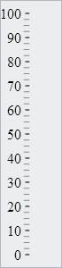
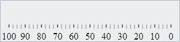
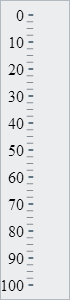
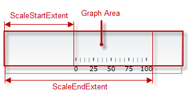
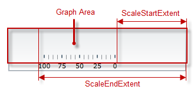
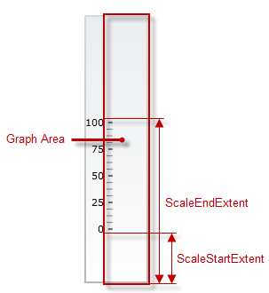

<!--
|metadata|
{
    "fileName": "igbulletgraph-configuring-the-orientation-and-direction",
    "controlName": "igBulletGraph",
    "tags": ["Charting","How Do I"]
}
|metadata|
-->

# Configuring the Orientation and Direction (igBulletGraph)

## Topic Overview

#### Purpose

This topic explains how to configure the `igBulletGraph`™ control with vertical scale and/or inverted scale direction.

### Required background

The following topics are prerequisites to understanding this topic:

- [*igBulletGraph* Overview](igBulletGraph-Overview.html): This topic provides conceptual information about the igBulletGraph control including its main features, minimum requirements, and user functionality.

- [Adding *igBulletGraph*](igBulletGraph-Adding.html): This is a group of topics explaining how to add the igBulletGraph control to an HTML page and an ASP.NET MVC application.


### In this topic

This topic contains the following sections:

-   [**Introduction**](#introduction)
    -   [Scale orientation and direction configuration summary](#scale-orientation-summary)
    -   [Scale orientation and direction configuration summary chart](#scale-orientation-summary-chart)
-   [**Configuring the Scale Orientation**](#scale-orientation)
    -   [Property settings](#scale-orientation-property-settings)
    -   [Example](#scale-orientation-example)
-   [**Configuring the Scale Direction (Scale Inversion)**](#scale-direction)
    -   [Overview](#scale-direction-overview)
    -   [Property settings](#scale-direction-property-settings)
    -   [Example – inverted direction at horizontal orientation](#scale-direction-example-horizontal)
    -   [Example – inverted direction at vertical orientation](#scale-direction-example-vertical)
-   [**Related Content**](#related-content)
    -   [Topics](#topics)
    -   [Samples](#samples)


## <a id="introduction"></a> Introduction

###  <a id="scale-orientation-summary"></a>Scale orientation and direction configuration summary

The `igBulletGraph` control supports vertical and horizontal orientations of the scale. By default, the scale orientation is horizontal. In vertical orientation, the scale values increase in upward direction and the numbering labels are positioned on its left.

**

It is defined by the [`orientation`](%%jQueryApiUrl%%/ui.igBulletGraph#options:orientation) property of the control.

The scale direction is the direction in which the performance bar extends and the values of the scale increase. It can be standard (left-to-right or at horizontal orientation and bottom-to-top at vertical orientation) or inverted (right-to-left or at horizontal orientation and top-to-bottom or at vertical orientation).

*Inverted direction at horizontal orientation* | *Inverted direction at vertical orientation*
-----------------------------------------------|---------------------------------------------
 | 


Scale direction is defined by the [`isScaleInverted`](%%jQueryApiUrl%%/ui.igBulletGraph#options:isScaleInverted) property of the control. The default orientation is standard.

###  <a id="scale-orientation-summary-chart"></a>Scale orientation and direction configuration summary chart

The following table explains briefly the configurable aspects of the `igBulletGraph`’s control orientation and scale inversion and maps them to properties that configure them.

Configurable aspect | Details | Properties
---|---|---
Scale orientation | Horizontal or vertical orientation of the bullet graph scale inside the control. | [orientation](%%jQueryApiUrl%%/ui.igBulletGraph#options:orientation)
Scale direction | Direction of the bullet graph, standard or inverted. | [isScaleInverted](%%jQueryApiUrl%%/ui.igBulletGraph#options:isScaleInverted)


## <a id="scale-orientation"></a> Configuring the Scale Orientation

The orientation (horizontal or vertical) of the bullet graph is specified by the [`orientation`](%%jQueryApiUrl%%/ui.igBulletGraph#options:orientation) property of the control.

### <a id="scale-orientation-property-settings"></a>Property settings

The following table maps the desired configuration to its respective property settings.

In order to: | Use this property: | And set it to:
--------------|--------------------|--------------
Specify horizontal orientation | [`orientation`](%%jQueryApiUrl%%/ui.igBulletGraph#options:orientation) | *horizontal*
Specify vertical orientation | `orientation` | *vertical*


### <a id="scale-orientation-example"></a>Example

The screenshot below demonstrates how the `igBulletGraph` looks as a result of the following settings:

Property | Value
---|---
[orientation](%%jQueryApiUrl%%/ui.igBulletGraph#options:orientation) | “vertical”


Following is the code that implements this example.

**In JavaScript:**

```js
$('#igBulletGraph').igBulletGraph({
    width: ”70”,
    height: ”300”,
    orientation: "vertical"
});
```


## <a id="scale-direction"></a> Configuring the Scale Direction (Scale Inversion)

### <a id="scale-direction-overview"></a> Overview

With horizontal orientation, the standard (default) direction of the scale is left-to-right, which means that the scale begins at the left edge of the [**Graph area**](igBulletGraph-Overview.html#logical-areas) and ends at its right edge (the [`scaleStartExtent`](%%jQueryApiUrl%%/ui.igBulletGraph#options:scaleStartExtent) indicates an outset from the left edge of the Graph area and the [`scaleEndExtent`](%%jQueryApiUrl%%/ui.igBulletGraph#options:scaleEndExtent) – the distance from the left edge of the Graph area to the end of the scale):



When the direction is inverted, the scale begins at the right edge of the Graph area and ends at its left edge (the `scaleStartExtent` indicates an outset from the right edge of the Graph area and the `scaleEndExtent` – the distance from the right edge of the Graph area to the end of the scale):



With vertical orientation, the standard (default) direction of the scale is bottom-to-top, which means that the scale begins at the bottom of the Graph area and ends at its top (the `scaleStartExtent` indicates an outset from the bottom edge of the Graph area and the `scaleEndExtent` – the distance from the bottom edge of the Graph area to the end of the scale):



When the direction is inverted, the scale begins at the top edge of the Graph area and ends at its bottom edge (the `scaleStartExtent` indicates an outset from the top edge of the Graph area and the `scaleEndExtent` – the distance from the top edge of the Graph area to the end of the scale):


### <a id="scale-direction-property-settings"></a> Property settings

The following table maps the desired <configuration/behaviors> to its respective property settings.

In order to: | Use this property: | And set it to:
---|---|---
Configure standard direction | [`isScaleInverted`](%%jQueryApiUrl%%/ui.igBulletGraph#options:isScaleInverted) | “false”
Configure inverted direction | `isScaleInverted` | “true”


### <a id="scale-direction-example-horizontal"></a> Example – inverted direction at horizontal orientation

The screenshot below demonstrates how the igBulletGraph looks as a result of the following settings:

Property | Value
---|---
[`isScaleInverted`](%%jQueryApiUrl%%/ui.igBulletGraph#options:isScaleInverted) | “true”
[`orientation`](%%jQueryApiUrl%%/ui.igBulletGraph#options:orientation) | “horizontal”


Following is the code that implements this example.

**In JavaScript:**

```js
$('#igBulletGraph').igBulletGraph({
    width: “70”,
    height: “300”,
    isScaleInverted: "true"
});
```

### <a id="scale-direction-example-vertical"></a> Example – inverted direction at vertical orientation

The screenshot below demonstrates how the `igBulletGraph` looks as a
result of the following settings:

Property | Value
---|---
[`isScaleInverted`](%%jQueryApiUrl%%/ui.igBulletGraph#options:isScaleInverted) | “true”
[`orientation`](%%jQueryApiUrl%%/ui.igBulletGraph#options:orientation) | “vertical”


Following is the code that implements this example.

**In JavaScript:**

```js
$('#igBulletGraph').igBulletGraph({
    width: '70',
    height: '400',
    orientation: "vertical", 
    isScaleInverted: "true"
});
```


## <a id="related-content"></a> Related Content

### <a id="topics"></a>Topics
- [Configuring the Visual Elements (*igBulletGraph*)](igBulletGraph-Configuring-the-Visual-Elements.html): This is a group of topics covering in detail the visual elements the igBulletGraph control (like the scale elements, performance bar, comparative marker and ranges, etc.) and explaining, with code examples, how to configure them.


### <a id="samples"></a> Samples

The following samples provide additional information related to this topic.

- [Vertical Orientation](%%SamplesUrl%%/bullet-graph/vertical-orientation): This sample demonstrates how to change the orientation of the bullet graph and how to invert the scale.


 

 


