<!--
|metadata|
{
    "fileName": "igbulletgraph-configuring-the-scale",
    "controlName": "igBulletGraph",
    "tags": ["Charting","How Do I"]
}
|metadata|
-->

# Configuring the Scale (igBulletGraph)

## Topic Overview

#### Purpose

This topic explains, with examples, how to customize the scale of the `igBulletGraph`™ control. This includes positioning the scale inside the control and configuring the scale tick marks and labels. (For the default settings, see the [*igBulletGraph* Overview](igBulletGraph-Overview.html) topic.)

### Required background

The following topics are prerequisites to understanding this topic:

- [*igBulletGraph* Overview](igBulletGraph-Overview.html): This topic provides conceptual information about the `igBulletGraph` control including its main features, minimum requirements, and user functionality.

- [Adding *igBulletGraph*](igBulletGraph-Adding.html): This is a group of topics explaining how to add the `igBulletGraph` control to an HTML page and an ASP.NET MVC application.


### In this topic

This topic contains the following sections:

-   [**Introduction**](#introduction)
    -   [Scale configuration summary](#configuration-summary)
    -   [Scale configuration summary chart](#configuration-summary-chart)
-   [**Configuring the Scale’s Size and Position**](#size-and-position)
    -   [Overview](#size-and-position-overview)
    -   [Property settings](#size-and-position-properties)
    -   [Example](#size-and-position-example)
-   [**Configuring the Scale’s Range**](#range)
    -   [Overview](#range-overview)
    -   [Property settings](#range-properties)
    -   [Example](#range-example)
-   [**Configuring the Scale’s Major Tick Marks**](#major-tick-marks)
    -   [Overview](#major-tick-marks-overview)
    -   [Configuring the position along the scale, count, and spacing](#major-tick-marks-position-count-spacing)
    -   [Configuring the position across the scale and the length of the segments](#major-tick-marks-segments)
    -   [Property settings](#major-tick-marks-properties)
    -   [Example](#major-tick-marks-example)
-   [**Configuring the Scale’s Minor Tick Marks**](#minor-tick-marks)
    -   [Overview](#minor-tick-marks-overview)
    -   [Configuring the position along the scale, count, and spacing](#minor-tick-marks-position-count-spacing)
    -   [Configuring the position across the scale and the length of the segments](#minor-tick-marks-segments)
    -   [Property settings](#minor-tick-marks-properties)
    -   [Example](#minor-tick-marks-example)
-   [**Configuring the Scale’s Labeling**](#labeling)
    -   [Overview](#labeling-overview)
    -   [Event handling](#labeling-event-handling)
    -   [Property settings](#labeling-property-settings)
    -   [Example – horizontal orientation](#labeling-example-horizontal)
    -   [Example – vertical orientation](#labeling-example-vertical)
-   [**Related Content**](#related-content)
    -   [Topics](#topics)
    -   [Samples](#samples)


## <a id="introduction"></a> Introduction

#### <a id="configuration-summary"></a>Scale configuration summary

The scale of the `igBulletGraph` control is a logical entity formed by the tick marks and the (numbering) labels. The size and position of the tick marks is configured relative to the [Graph area](igBulletGraph-Overview.html#logical-areas) and the position of the numbering labels – relative to the inner edge of the control (the bottom edge at horizontal orientation).

The tick marks of the `igBulletGraph` control identify equal intervals of measure along the graph. Two types of tick marks are supported – major and minor. Both can be positioned along the scale by adjusting the values of the respective extent-related properties which are measured against the Graph area. The tick marks’ exact count, position, look, and frequency of occurrence can be customized by property settings.

As far as the labels are concerned, various aspects of them can be configured such as position, text, format, etc..

### <a id="configuration-summary-chart"></a>Scale configuration summary chart

The following table explains briefly the configurable aspects of `igBulletGraph` control’s scale and maps them to properties that configure them.

<table class="table table-bordered">
    <tbody>
        <tr>
            <th colspan="4">
Configurable aspects
            </th>
            <th>
Property
            </th>
            <th>
Default value
            </th>
        </tr>
        <tr>
            <th rowspan="2" colspan="4">
**Position**
            </th>
            <td>
[scaleStartExtent](%%jQueryApiUrl%%/ui.igBulletGraph#options:scaleStartExtent)
            </td>
            <td>
*0.05*
            </td>
        </tr>
        <tr>
            <td>
[scaleEndExtent](%%jQueryApiUrl%%/ui.igBulletGraph#options:scaleEndExtent)
            </td>
            <td>
*0.95*
            </td>
        </tr>
        <tr>
            <th rowspan="2" colspan="2">
**Range and Values**
            </th>
            <th colspan="2">
**Max value**
            </th>
            <td>
[minimumValue](%%jQueryApiUrl%%/ui.igBulletGraph#options:minimumValue)
            </td>
            <td>
*0*
            </td>
        </tr>
        <tr>
            <th colspan="2">
**Min value**
            </th>
            <td>
[maximumValue](%%jQueryApiUrl%%/ui.igBulletGraph#options:maximumValue)
            </td>
            <td>
*100*
            </td>
        </tr>
        <tr>
            <th rowspan="12">
**Tick marks**
            </th>
            <th rowspan="7">
**Major tick marks**
            </th>
            <th rowspan="5" colspan="2">
**Position** (within the scale)**, spacing, and length**
            </th>
            <td>
[interval](%%jQueryApiUrl%%/ui.igBulletGraph#options:interval)
            </td>
            <td>
Not set
            </td>
        </tr>
        <tr>
            <td>
[ticksPostInitial](%%jQueryApiUrl%%/ui.igBulletGraph#options:ticksPostInitial)
            </td>
            <td>
*0*
            </td>
        </tr>
        <tr>
            <td>
[ticksPreTerminal](%%jQueryApiUrl%%/ui.igBulletGraph#options:ticksPreTerminal)
            </td>
            <td>
*0*
            </td>
        </tr>
        <tr>
            <td>
[tickStartExtent](%%jQueryApiUrl%%/ui.igBulletGraph#options:tickStartExtent)
            </td>
            <td>
*0.02*
            </td>
        </tr>
        <tr>
            <td>
[tickEndExtent](%%jQueryApiUrl%%/ui.igBulletGraph#options:tickEndExtent)
            </td>
            <td>
*0.2*
            </td>
        </tr>
        <tr>
            <th rowspan="2">
**Look-and-feel**
            </th>
            <th>
Color
            </th>
            <td>
[tickBrush](%%jQueryApiUrl%%/ui.igBulletGraph#options:tickBrush)
            </td>
            <td>
Defined in the default theme
            </td>
        </tr>
        <tr>
            <th>
Width
            </th>
            <td>
[tickStrokeThickness](%%jQueryApiUrl%%/ui.igBulletGraph#options:tickStrokeThickness)
            </td>
            <td>
*2.0*
            </td>
        </tr>
        <tr>
            <th rowspan="5">
**Minor tick marks**
            </th>
            <th colspan="2">
**Number** (between two adjacent major tick marks)
            </th>
            <td>
[minorTickCount](%%jQueryApiUrl%%/ui.igBulletGraph#options:minorTickCount)
            </td>
            <td>
*3.0*
            </td>
        </tr>
        <tr>
            <th rowspan="2" colspan="2">
**Position**
            </th>
            <td>
[minorTickStartExtent](%%jQueryApiUrl%%/ui.igBulletGraph#options:minorTickStartExtent)
            </td>
            <td>
*0.06*
            </td>
        </tr>
        <tr>
            <td>
[minorTickEndExtent](%%jQueryApiUrl%%/ui.igBulletGraph#options:minorTickEndExtent)
            </td>
            <td>
*0.2*
            </td>
        </tr>
        <tr>
            <th rowspan="2">
**Look-and-feel**
            </th>
            <th>
Color
            </th>
            <td>
[minorTickBrush](%%jQueryApiUrl%%/ui.igBulletGraph#options:minorTickBrush)
            </td>
            <td>
Defined in the default theme
            </td>
        </tr>
        <tr>
            <th>
Width
            </th>
            <td>
[minorTickStrokeThickness](%%jQueryApiUrl%%/ui.igBulletGraph#options:minorTickStrokeThickness)
            </td>
            <td>
*1.0*
            </td>
        </tr>
        <tr>
            <th rowspan="7">
**Labels**
            </th>
            <th rowspan="4" colspan="3">
**Position and spacing**
            </th>
            <td>
[labelExtent](%%jQueryApiUrl%%/ui.igBulletGraph#options:labelExtent)
            </td>
            <td>
*0*
            </td>
        </tr>
        <tr>
            <td>
[labelInterval](%%jQueryApiUrl%%/ui.igBulletGraph#options:labelInterval)
            </td>
            <td>
Not set
            </td>
        </tr>
        <tr>
            <td>
[labelsPostInitial](%%jQueryApiUrl%%/ui.igBulletGraph#options:labelsPostInitial)
            </td>
            <td>
*0*
            </td>
        </tr>
        <tr>
            <td>
[labelsPreTerminal](%%jQueryApiUrl%%/ui.igBulletGraph#options:labelsPreTerminal)
            </td>
            <td>
*0*
            </td>
        </tr>
        <tr>
            <th rowspan="2" colspan="2">
**Look-and-feel**
            </th>
            <th>
Color
            </th>
            <td>
[fontBrush](%%jQueryApiUrl%%/ui.igBulletGraph#options:fontBrush)
            </td>
            <td>
Defined in the default theme
            </td>
        </tr>
        <tr>
            <th>
Font
            </th>
            <td>
[font](%%jQueryApiUrl%%/ui.igBulletGraph#options:font)
            </td>
            <td>
Defined in the default theme
            </td>
        </tr>
    </tbody>
</table>

## <a id="size-and-position"></a> Configuring the Scale’s Size and Position

### <a id="size-and-position-overview"></a> Overview

The scale’s size and position within the `igBulletGraph` control in the along-the scale-dimension is determined relative the [Graph area](igBulletGraph-Overview.html#logical-areas). This is done through a pair of properties ([`scaleStartExtent`](%%jQueryApiUrl%%/ui.igBulletGraph#options:scaleStartExtent) and [`scaleEndExtent`](%%jQueryApiUrl%%/ui.igBulletGraph#options:scaleEndExtent)).

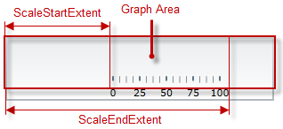

The positioning of the scale in the other (across-the-scale) dimension of the Graph area is not configurable by itself; instead, all elements comprising the scale are configured individually.

>**Note:** The value of the `LabelExtent` property, which controls the positioning of the numbering labels, is measured relative to the height of the control when its orientation is horizontal and to its width otherwise. (For details, see [Configuring the Orientation and Direction (*igBulletGraph*)](igBulletGraph-Configuring-the-Orientation-and-Direction.html).)

###  <a id="size-and-position-properties"></a> Property settings 

The following table maps the desired behavior to its respective property settings. For an illustration of the configurable aspects, see the [Example](#size-and-position-example).

<table class="table table-bordered">
    <tbody>
        <tr>
            <th colspan="3">
In order to configure:
            </th>
            <th rowspan="2">
Use this property:
            </th>
            <th rowspan="2">
And set it to:
            </th>
        </tr>
        <tr>
            <th colspan="2">
**Aspect**
            </th>
            <th>
**Details**
            </th>
        </tr>
        <tr>
            <th rowspan="2">
Dimension along the scale – size and position
            </th>
            <th>
Starting position
            </th>
            <td>
**The starting position of the** **scale** relative to the left edge of the [Graph area](igBulletGraph-Overview.html#logical-areas) at horizontal orientation or to the bottom edge at vertical orientation.
                (When the direction of the scale is inverted, these become, respectively, the right edge at horizontal orientation and top edge at vertical orientation. For details, see [Configuring the Orientation and Direction (*igBulletGraph*)](igBulletGraph-Configuring-the-Orientation-and-Direction.html).)
            </td>
            <td>
[scaleStartExtent](%%jQueryApiUrl%%/ui.igBulletGraph#options:scaleStartExtent)
            </td>
            <td>
The desired value as a relative part the width/height of the control (depending on the orientation) presented as a fraction of 1 (e.g. *0.2*)
            </td>
        </tr>
        <tr>
            <th>
Ending position
            </th>
            <td>
**The ending position of the scale** relative to the left edge of the Graph area relative to the left edge of the control in horizontal orientation or to the bottom edge in vertical orientation. (When the direction of the scale is inverted, these become,
                respectively, the right edge at horizontal orientation and top edge at vertical orientation. For details, see [Configuring the Orientation and Direction (*igBulletGraph*)](igBulletGraph-Configuring-the-Orientation-and-Direction.html).)
            </td>
            <td>
[scaleEndExtent](%%jQueryApiUrl%%/ui.igBulletGraph#options:scaleEndExtent)
            </td>
            <td>
The desired value as a relative part the width/height of the control width/height (depending on the orientation) presented as a fraction of 1 (e.g. *0.8*)
            </td>
        </tr>
    </tbody>
</table>


###  <a id="size-and-position-example"></a> Example

The screenshot below demonstrates how the `igBulletGraph` would look as a result of the following settings:

Property | Value
---|---
[`scaleStartExtent`](%%jQueryApiUrl%%/ui.igBulletGraph#options:scaleStartExtent) | 0.2
[`scaleEndExtent`](%%jQueryApiUrl%%/ui.igBulletGraph#options:scaleEndExtent) | 0.9


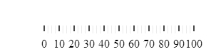

Following is the code that implements this example.

**In JavaScript:**

```js
$('#igBulletGraph').igBulletGraph({
    width: 300,
    height: 70,
    scaleStartExtent: 0.2,
    scaleEndExtent: 0.9});
```


## <a id="range"></a> Configuring the Scale’s Range

#### <a id="range-overview"></a> Overview

The values of the scale are defined by specifying its value range, that is, its minimum and maximum values. This is done with the [`minimumValue`](%%jQueryApiUrl%%/ui.igBulletGraph#options:minimumValue) and [`scaleEndExtent`](%%jQueryApiUrl%%/ui.igBulletGraph#options:scaleEndExtent) properties.

Setting the minimum and maximum values implicitly defines all values within the scale; all values are meant as evenly distributed between the minimum and maximum values. However, only those values are displayed for which there is a numbering label, placed on the scale. (The scale’s values can be displayed only through the numbering labels. The labels display the respective values based on the label’s position on the scale, i.e. the labels’ values are configured through the positioning of the labels along the scale and not set explicitly.) There is no requirement to have labels at the positions of the minimum and maximum values which means that the minimum and maximum values may not be indicated visually on the scale and the scale can look something like this:

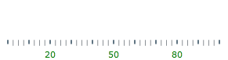

Having the scales’ range defined also enables the positioning of the other value-based visual elements on the scale, namely the performance bar, comparative ranges, comparative marker, and the performance bar. Note that because these elements are value-based, when the scale’s range changes (i.e. when either its minimum or maximum value (or both) changes), these visual elements are re-positioned spatially together with the scale’s values keeping their position on the scale. (To see this effect in action, refer to the [Range Settings](%%SamplesUrl%%/bullet-graph/range-settings) sample.)

### <a id="range-properties"></a> Property settings

The following table maps the desired behavior to its respective property settings. For an illustration of the configurable aspects, see the [Example](#size-and-position-example).

<table class="table table-bordered">
	<tbody>
		<tr>
            <th colspan="2">
In order to configure:
			</th>
            <th rowspan="2">
Use this property:
			</th>
            <th rowspan="2">
And set it to:
			</th>
        </tr>
        <tr>
            <th>
**Aspect**
			</th>
            <th>
**Details**
			</th>
        </tr>
        <tr>
            <td>
The minimum value of the scale
			</td>
            <td>
The value at which the scale starts.
			</td>
            <td>
[minimumValue](%%jQueryApiUrl%%/ui.igBulletGraph#options:minimumValue)
			</td>
            <td>
The desired value in the measures of the scale
			</td>
        </tr>
        <tr>
            <td>
The maximum value of the scale
			</td>
            <td>
The value at which the scale ends.
			</td>
            <td>
[maximumValue](%%jQueryApiUrl%%/ui.igBulletGraph#options:maximumValue)
			</td>
            <td>
The desired value in the measures of the scale
			</td>
        </tr>
    </tbody>
</table>

### <a id="range-example"></a> Example

The screenshot below demonstrates how the `igBulletGraph` would look as a result of the following settings:

Property | Value
---|---
[minimumValue](%%jQueryApiUrl%%/ui.igBulletGraph#options:minimumValue) | 60
[maximumValue](%%jQueryApiUrl%%/ui.igBulletGraph#options:maximumValue) | 70


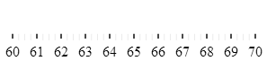

Following is the code that implements this example.

**In JavaScript:**

```js
$('#igBulletGraph').igBulletGraph({
    width: 300,
    height: 70,
    minimumValue: 60,
    maximumValue: 70});
```


## <a id="major-tick-marks"></a> Configuring the Scale’s Major Tick Marks

#### <a id="major-tick-marks-overview"></a>  Overview

The major tick marks of the `igBulletGraph` control can be customized in terms of position and interval at which they occur. The height, thickness, and color of the line segments that forms the major tick marks are configurable as well.

### <a id="major-tick-marks-position-count-spacing"></a> Configuring the position along the scale, count, and spacing

The major tick marks are defined in terms of starting and ending points (the positions of the first and the last tick marks relative to the edges of the [Graph area](igBulletGraph-Overview.html#logical-areas) and the interval (the distance from each other) at which they occur. (This is done through the [`ticksPostInitial`](%%jQueryApiUrl%%/ui.igBulletGraph#options:ticksPostInitial), [`ticksPreTerminal`](%%jQueryApiUrl%%/ui.igBulletGraph#options:ticksPreTerminal), and [`interval`](%%jQueryApiUrl%%/ui.igBulletGraph#options:interval) properties.) This way, defining the starting and ending points of the major tick marks essentially defines the position and length of the scale.

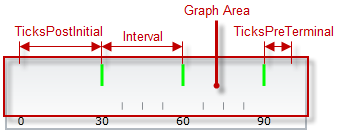

### <a id="major-tick-marks-segments"></a> Configuring the position across the scale and the length of the segments

In the across-the-scale dimension, the length and position of the line segments that form the major tick marks is configured relative to the edges of the [Graph area](igBulletGraph-Overview.html#logical-areas). (This is done through the [`tickStartExtent`](%%jQueryApiUrl%%/ui.igBulletGraph#options:tickStartExtent) and [`tickEndExtent`](%%jQueryApiUrl%%/ui.igBulletGraph#options:tickEndExtent) properties.)

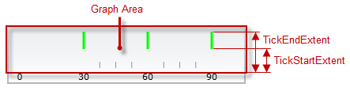

### <a id="major-tick-marks-properties"></a> Property settings

The following table maps the desired behavior to its respective property settings. For an illustration of the configurable aspects, see the [Example](#major-tick-marks-example).

<table class="table table-bordered">
	<tbody>
		<tr>
            <th colspan="3">
In order to configure:
			</th>
            <th rowspan="2">
Use this property:
			</th>
            <th rowspan="2">
And set it to:
			</th>
        </tr>
        <tr>
            <th colspan="2">
**Aspect**
			</th>
            <th>
**Details**
			</th>
        </tr>
        <tr>
            <th rowspan="3">
**Position along the scale, count, and spacing**
			</th>
            <th>
Starting point
			</th>
            <td>
The distance at which the major tick marks begin relative to the [starting position](#size-and-position-properties) of the scale
			</td>
            <td>
[ticksPostInitial](%%jQueryApiUrl%%/ui.igBulletGraph#options:ticksPostInitial)
			</td>
            <td>
The desired distance (in the measures of the scale) from scale start position
			</td>
        </tr>
        <tr>
            <th>
Ending point
			</th>
            <td>
The distance at which the major tick marks end relative to the [ending position](#size-and-position-properties) of the scale
			</td>
            <td>
[ticksPreTerminal](%%jQueryApiUrl%%/ui.igBulletGraph#options:ticksPreTerminal)
			</td>
            <td>
The desired distance (in the measures of the scale) from the scale end position
			</td>
        </tr>
        <tr>
            <th>
Interval
			</th>
            <td>
The interval at which to place the major tick marks (Interval is the distance – in the measures of the scale – between two adjacent major tick marks.)
			</td>
            <td>
[interval](%%jQueryApiUrl%%/ui.igBulletGraph#options:interval)
			</td>
            <td>
The desired value in measures of the scale
			</td>
        </tr>
        <tr>
            <th rowspan="2">
**Position across the scale and length of the segments**
			</th>
            <th>
Starting point
			</th>
            <td>
The starting point of the line segments that form the major tick marks. (The starting point is defined relative to the bottom of the Graph area in horizontal orientation or to the left edge of the Graph area in vertical orientation.) Negative values are
                supported as well, indicating positions beneath/ on the left of the Graph area.
			</td>
            <td>
[tickStartExtent](%%jQueryApiUrl%%/ui.igBulletGraph#options:tickStartExtent)
			</td>
            <td>
The desired value (in the measures of the scale) as a relative part the height/width of the Graph area (depending on the orientation) presented as a fraction of 1 (e.g. *0.2*)
			</td>
        </tr>
        <tr>
            <th>
Ending point
			</th>
            <td>
The ending point of the line segments that form major tick marks relative to the bottom of the Graph area in horizontal orientation or to the left border of the Graph area in vertical orientation. Negative values are supported as well, indicating positions
                beneath/ on the left of the Graph area. (The difference between the starting and the ending points forms the length of the marks’ line segments.)
			</td>
            <td>
[tickEndExtent](%%jQueryApiUrl%%/ui.igBulletGraph#options:tickEndExtent)
			</td>
            <td>
The desired value as a relative part the height/width of the Graph area (depending on the orientation) presented as a fraction of 1 (e.g. *0.8*)
			</td>
        </tr>
        <tr>
            <th rowspan="2">
**Look-and-feel**
			</th>
            <th>
Thickness
			</th>
            <td>
The thickness of the major tick marks’ line segments.
			</td>
            <td>
[tickStrokeThickness](%%jQueryApiUrl%%/ui.igBulletGraph#options:tickStrokeThickness)
			</td>
            <td>
The desired value in pixels
			</td>
        </tr>
        <tr>
            <th>
Color
			</th>
            <td>
The color of the major tick marks
			</td>
            <td>
[tickBrush](%%jQueryApiUrl%%/ui.igBulletGraph#options:tickBrush)
			</td>
            <td>
The desired color
			</td>
        </tr>
    </tbody>
</table>


### <a id="major-tick-marks-example"></a> Example

The screenshot below demonstrates how the `igBulletGraph` looks as a result of the following settings:

Property | Value
---------|------
[interval](%%jQueryApiUrl%%/ui.igBulletGraph#options:interval) | 30
[tickBrush](%%jQueryApiUrl%%/ui.igBulletGraph#options:tickBrush) | "lime"
[tickEndExtent](%%jQueryApiUrl%%/ui.igBulletGraph#options:tickEndExtent) | 0.9
[ticksPostInitial](%%jQueryApiUrl%%/ui.igBulletGraph#options:ticksPostInitial) | 30
[ticksPreTerminal](%%jQueryApiUrl%%/ui.igBulletGraph#options:ticksPreTerminal) | 10
[tickStartExtent](%%jQueryApiUrl%%/ui.igBulletGraph#options:tickStartExtent) | 0.5
[tickStrokeThickness](%%jQueryApiUrl%%/ui.igBulletGraph#options:tickStrokeThickness) | 3


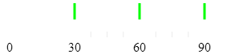

Following is the code that implements this example.

**In JavaScript:**

```js
('#igBulletGraph').igBulletGraph({
    width: 300,
    height: 70,
    interval: 30,
    tickBrush: 'lime',
    tickStartExtent: 0.5,
    tickEndExtent: 0.9,
    ticksPostInitial: 30,
    ticksPreTerminal: 10,
    tickStrokeThickness: 3 });
```


## <a id="minor-tick-marks"></a> Configuring the Scale’s Minor Tick Marks

#### <a id="minor-tick-marks-overview"></a> Overview

The minor tick marks of the `igBulletGraph` control can be explicitly disabled or customized in terms of number (between two major tick marks), positioning, size, and color.

### <a id="minor-tick-marks-position-count-spacing"></a>  Configuring the position along the scale, count, and spacing

The minor tick marks are defined as a count (the number of minor tick marks between two adjacent major tick marks). (This is done through the [`minorTickCount`](%%jQueryApiUrl%%/ui.igBulletGraph#options:minorTickCount) property; setting this property to *0* disables (hides) the minor tick marks.) When the count is set, the specified number of minor tick marks is placed evenly between every two adjacent major tick marks, from the first one, to the last.

### <a id="minor-tick-marks-segments"></a>  Configuring the position across the scale and the length of the segments

In the across-the-scale dimension, the minor tick marks length and position is configured relative to the edges of the [Graph area](igBulletGraph-Overview.html#logical-areas).

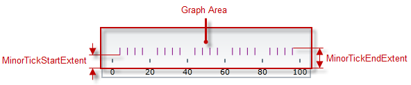

### <a id="minor-tick-marks-properties"></a> Property settings

The following table maps the desired behavior to its respective property settings. For an illustration of the configurable aspects, see the [Example](#minor-tick-marks-example).

<table class="table table-bordered">
    <tbody>
		<tr>
            <th colspan="4">
In order to configure:
            </th>
            <th rowspan="2">
Use this property:
            </th>
            <th rowspan="2">
And set it to:
            </th>
        </tr>
        <tr>
            <th colspan="3">
**Aspect**
            </th>
            <th>
**Details**
            </th>
        </tr>
        <tr>
            <th colspan="3">
**Number and spacing**
            </th>
            <td>
The number of minor tick marks between two adjacent major tick marks.
            </td>
            <td>
[minorTickCount](%%jQueryApiUrl%%/ui.igBulletGraph#options:minorTickCount)
            </td>
            <td>
The desired number; setting of *0* hides the minor tick marks
            </td>
        </tr>
        <tr>
            <th rowspan="4">
**Line segments**
            </th>
            <th rowspan="2">
**Length and position**
            </th>
            <th>
Starting point
            </th>
            <td>
The starting point of the line segments that form the minor tick marks. (The starting point is defined relative to the bottom of the [Graph area](igBulletGraph-Overview.html#logical-areas) in horizontal orientation or to the left edge of the Graph area in vertical orientation.) Negative values are supported as well, indicating positions beneath/ on the left of the Graph area.
            </td>
            <td>
[minorTickStartExtent](%%jQueryApiUrl%%/ui.igBulletGraph#options:minorTickStartExtent)
            </td>
            <td>
The desired value as a relative part the height/width of the control height/width (depending on the orientation) presented as a fraction of 1 (e.g. *0.2*)
            </td>
        </tr>
        <tr>
            <th>
**Ending point**
            </th>
            <td>
The ending point of the line segments that form minor tick marks relative to the bottom of the Graph area in horizontal orientation or to the left border of the Graph area in vertical orientation. Negative values are supported as well, indicating positions beneath/ on the left of the Graph area. (The difference between the starting and the ending points forms the length of the marks’ line segments.)
            </td>
            <td>
[minorTickEndExtent](%%jQueryApiUrl%%/ui.igBulletGraph#options:minorTickEndExtent)
            </td>
            <td>
The desired value as a relative part the height/width of the control height/width (depending on the orientation) presented as a fraction of 1 (e.g. *0.2**5*)
            </td>
        </tr>
        <tr>
            <th rowspan="2">
**Look-and-feel**
            </th>
            <th>
Thickness
            </th>
            <td>
The thickness of the minor tick marks
            </td>
            <td>
[minorTickStrokeThickness](%%jQueryApiUrl%%/ui.igBulletGraph#options:minorTickStrokeThickness)
            </td>
            <td>
The desired value in pixels
            </td>
        </tr>
        <tr>
            <th>
Color
            </th>
            <td>
The color of the minor tick marks
            </td>
            <td>
[minorTickBrush](%%jQueryApiUrl%%/ui.igBulletGraph#options:minorTickBrush)
            </td>
            <td>
The desired color
            </td>
        </tr>
    </tbody>
</table>


### <a id="minor-tick-marks-example"></a> Example

The screenshot below demonstrates how the `igBulletGraph` looks as a
result of the following settings:

<table class="table table-bordered">
	<tbody>
		<tr>
            <th colspan="4">
In order to configure:
			</th>
            <th rowspan="2">
Use this property:
			</th>
            <th rowspan="2">
And set it to:
			</th>
        </tr>
        <tr>
            <th colspan="3">
**Aspect**
			</th>
            <th>
**Details**
			</th>
        </tr>
        <tr>
            <th colspan="3">
**Number and spacing**
			</th>
            <td>
The number of minor tick marks between two adjacent major tick marks.
			</td>
            <td>
[minorTickCount](%%jQueryApiUrl%%/ui.igBulletGraph#options:minorTickCount)
			</td>
            <td>
The desired number; setting of *0* hides the minor tick marks
			</td>
        </tr>
        <tr>
            <th rowspan="4">
**Line segments**
			</th>
            <th rowspan="2">
**Length and position**
			</th>
            <th>
Starting point
			</th>
            <td>
The starting point of the line segments that form the minor tick marks. (The starting point is defined relative to the bottom of the [Graph area](igBulletGraph-Overview.html#logical-areas) in horizontal orientation
                or to the left edge of the Graph area in vertical orientation.) Negative values are supported as well, indicating positions beneath/ on the left of the Graph area.
			</td>
            <td>
[minorTickStartExtent](%%jQueryApiUrl%%/ui.igBulletGraph#options:minorTickStartExtent)
			</td>
            <td>
The desired value as a relative part the height/width of the control height/width (depending on the orientation) presented as a fraction of 1 (e.g. *0.2*)
			</td>
        </tr>
        <tr>
            <th>
**Ending point**
			</th>
            <td>
The ending point of the line segments that form minor tick marks relative to the bottom of the Graph area in horizontal orientation or to the left border of the Graph area in vertical orientation. Negative values are supported as well, indicating positions
                beneath/ on the left of the Graph area. (The difference between the starting and the ending points forms the length of the marks’ line segments.)
			</td>
            <td>
[minorTickEndExtent](%%jQueryApiUrl%%/ui.igBulletGraph#options:minorTickEndExtent)
			</td>
            <td>
The desired value as a relative part the height/width of the control height/width (depending on the orientation) presented as a fraction of 1 (e.g. *0.2**5*)
			</td>
        </tr>
        <tr>
            <th rowspan="2">
**Look-and-feel**
			</th>
            <th>
Thickness
			</th>
            <td>
The thickness of the minor tick marks
			</td>
            <td>
[minorTickStrokeThickness](%%jQueryApiUrl%%/ui.igBulletGraph#options:minorTickStrokeThickness)
			</td>
            <td>
The desired value in pixels
			</td>
        </tr>
        <tr>
            <th>
Color
			</th>
            <td>
The color of the minor tick marks
			</td>
            <td>
[minorTickBrush](%%jQueryApiUrl%%/ui.igBulletGraph#options:minorTickBrush)
			</td>
            <td>
The desired color
			</td>
        </tr>
    </tbody>
</table>

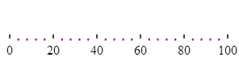

Following is the code that implements this example.

**In JavaScript:**

```js
('#igBulletGraph').igBulletGraph({
    width: 300,
    height: 70,
    minorTickCount: 4,
    minorTickBrush: 'purple',
    minorTickStartExtent: 0.05,
    minorTickEndExtent: 0.1,
    minorTickStrokeThickness: 2,
    interval: 20});
```


## <a id="labeling"></a> Configuring the Scale’s Labeling

### <a id="labeling-overview"></a> Overview

By default, the labels indicating the scale’s measures are enabled. The labels are defined in terms of the following factors:

-   **Starting and ending points** – the positions of the first and the last label relative to the edges of the scale
-   **Breadth of the label row** – relative to the height/width of the control, depending on the orientation (vertical/horizontal). The breadth can be controlled only indirectly by the font settings in the applied style template.
-   **The interval** (the distance from each other) at which they occur. (This is done through the [`labelsPostInitial`](%%jQueryApiUrl%%/ui.igBulletGraph#options:labelsPostInitial), [`labelsPreTerminal`](%%jQueryApiUrl%%/ui.igBulletGraph#options:labelsPreTerminal) and [`labelInterval`](%%jQueryApiUrl%%/ui.igBulletGraph#options:labelInterval) properties.)
-   **The position of the label row** in the across-the-scale dimension – the default is at the bottom / on the left of the control (for horizontal or vertical orientation, respectively); the entire row can be shifted vertically at horizontal scale orientation or the horizontally at vertical scale orientation. (This is done through the [`labelExtent`](%%jQueryApiUrl%%/ui.igBulletGraph#options:labelExtent) property.)

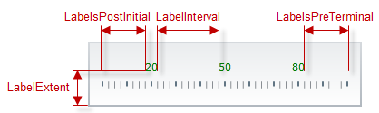

The value that each label displays is defined by the value represented by its position on the scale (This requires [**configuring the scale’s value range**](#range).) A string format can be applied to the labels so that their look is additionally customized. By default, a numeric label is displayed for each of the major tick marks and the labels are positioned beneath / on the left of the scale depending on the scale’s orientation (horizontal/vertical, respectively).

If you customize the labels and the major tick marks, you will more likely need to make sure they align to each other; to achieve alignment, set the same value for the tick marks interval ([`interval`](%%jQueryApiUrl%%/ui.igBulletGraph#options:interval) property) and the label interval (`labelInterval` property). (By default, they are aligned because the `labelInterval` property is not set and uses the value set for interval.)

### <a id="labeling-event-handling"></a> Event handling

The labels of `igBulletGraph` can be additionally formatted and aligned on handling the corresponding events.

The following table maps the desired behavior to its respective event.

In order to: | Handle this event:
---|---
Format the labels | [formatLabel](%%jQueryApiUrl%%/ui.igBulletGraph#events:formatLabel)
Align the labels | [alignLabel](%%jQueryApiUrl%%/ui.igBulletGraph#events:alignLabel)


### <a id="labeling-property-settings"></a> Property settings

The following table maps the desired behavior to its respective property settings. For an illustration of the configurable aspects, see [Example – horizontal orientation](#labeling-example-horizontal).

<table class="table table-bordered">
	<tbody>
		<tr>
            <th colspan="3">
In order to configure:
			</th>
            <th rowspan="2">
Use this property:
			</th>
            <th rowspan="2">
And set it to:
			</th>
        </tr>
        <tr>
            <th colspan="2">
**Aspect**
			</th>
            <th>
**Details**
			</th>
        </tr>
        <tr>
            <th>
**Label row**
			</th>
            <th>
Position
			</th>
            <td>
The positioning of the label row relative to bottom/left edge of the control (depending on the orientation – vertical/horizontal).
			</td>
            <td>
[labelExtent](%%jQueryApiUrl%%/ui.igBulletGraph#options:labelExtent)
			</td>
            <td>
The desired value presented as a relative part the height/width of the control (depending on the orientation – vertical/horizontal) presented as a fraction of 1 (e.g. *0.**8*).
			</td>
        </tr>
        <tr>
            <th rowspan="3">
**Number and spacing**
			</th>
            <th>
Starting point
			</th>
            <td>
Position (in the measures of the scale) of the first label along the scale
			</td>
            <td>
[labelsPostInitial](%%jQueryApiUrl%%/ui.igBulletGraph#options:labelsPostInitial)
			</td>
            <td>
The value (in the measures of the scale) at which the first label of the scale is to be displayed
			</td>
        </tr>
        <tr>
            <th>
Ending point
			</th>
            <td>
Position (in the measures of the scale) of the last label along the scale
			</td>
            <td>
[labelsPreTerminal](%%jQueryApiUrl%%/ui.igBulletGraph#options:labelsPreTerminal)
			</td>
            <td>
The value (in the measures of the scale) at which the last label of the scale is to be displayed
			</td>
        </tr>
        <tr>
            <th>
Interval
			</th>
            <td>
The interval at which to place the labels (Interval is the distance between two adjacent labels in the measures of the scale.)
			</td>
            <td>
[labelInterval](%%jQueryApiUrl%%/ui.igBulletGraph#options:labelInterval)
			</td>
            <td>
The desired value in the measure of the scale
			</td>
        </tr>
        <tr>
            <th>
**Look-and-feel**
			</th>
            <th>
Font color
			</th>
            <td>
Font color of the labels
			</td>
            <td>
[fontBrush](%%jQueryApiUrl%%/ui.igBulletGraph#options:fontBrush)
			</td>
            <td>
The desired color
			</td>
        </tr>
    </tbody>
</table>	

>**Note:** You can set the font-related properties in CSS through the `.ui-bulletgraph-label` and `.ui-bulletgraph` CSS classes.

### <a id="labeling-example-horizontal"></a> Example – horizontal orientation

The screenshot below demonstrates how the *igBulletGraph* looks as a result of the following settings with the default horizontal scale orientation:

Property | Value
---|---
[labelExtent](%%jQueryApiUrl%%/ui.igBulletGraph#options:labelExtent) | 0.5
[labelInterval](%%jQueryApiUrl%%/ui.igBulletGraph#options:labelInterval) |30
[labelsPostInitial](%%jQueryApiUrl%%/ui.igBulletGraph#options:labelsPostInitial) | 20
[labelsPreTerminal](%%jQueryApiUrl%%/ui.igBulletGraph#options:labelsPreTerminal) | 20
[fontBrush](%%jQueryApiUrl%%/ui.igBulletGraph#options:fontBrush) | 'green'

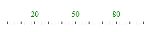

Following is the code that implements this example.

**In JavaScript:**

```js
('#igBulletGraph').igBulletGraph({
    width: 300,
    height: 70,
    labelExtent: 0.5,
    labelInterval: 30,
    labelsPostInitial: 20,
    labelsPreTerminal: 20,
    fontBrush: 'green'});
```

### <a id="labeling-example-vertical"></a> Example – vertical orientation

The screenshot below demonstrates how the `igBulletGraph` looks as a result of the following property settings (same as in [Example – horizontal orientation](#labeling-example-horizontal)) and vertical orientation:

Property | Value
---|---
[orientation](%%jQueryApiUrl%%/ui.igBulletGraph#options:orientation) | Vertical
[labelExtent](%%jQueryApiUrl%%/ui.igBulletGraph#options:labelExtent) |0.5
[labelInterval](%%jQueryApiUrl%%/ui.igBulletGraph#options:labelInterval) | 30
[labelsPostInitial](%%jQueryApiUrl%%/ui.igBulletGraph#options:labelsPostInitial) | 20
[labelsPreTerminal](%%jQueryApiUrl%%/ui.igBulletGraph#options:labelsPreTerminal) | 20
[fontBrush](%%jQueryApiUrl%%/ui.igBulletGraph#options:fontBrush) | 'green'


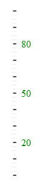

Following is the code that implements this example.

**In JavaScript:**

```js
('#igBulletGraph').igBulletGraph({
    height: 300,
    width: 70,
    orientation: 'vertical',
    labelExtent: 0.5,
    labelInterval: 30,
    labelsPostInitial: 20,
    labelsPreTerminal: 20,
    fontBrush: 'green'});
```


## <a id="related-content"></a> Related Content

###<a id="topics"></a> Topics

The following topics provide additional information related to this topic.

- [Configuring Orientation and Direction (*igBulletGraph*)](igBulletGraph-Configuring-the-Orientation-and-Direction.html) : This topic explains how to configure the igBulletGraph control with vertical scale and/or inverted scale direction.

- [Configuring the Performance Bar (*igBulletGraph*)](igBulletGraph-Configuring-the-Performance-Bar.html): This topic explains, with examples, how to configure the performance bar of the igBulletGraph control. This includes the value indicated by the bar, its width, position, and formatting.

- [Configuring the Comparative Marker (*igBulletGraph*)](igBulletGraph-Configuring-the-Comparative-Marker.html): This topic explains, with code examples, how to configure the comparative measure marker of the igBulletGraph control. This includes the marker’s value, width, and formatting.

- [Configuring Comparative Ranges (*igBulletGraph*)](igBulletGraph-Configuring-Comparative-Ranges.html): This topic explains, with code examples, how to configure ranges in the igBulletGraph control. This includes the number of ranges and their positions, lengths, widths, and formatting.

- [Configuring the Background (*igBulletGraph*)](igBulletGraph-Configuring-the-Background.html): This topic explains, with code examples, how to configure a background for the bullet graph. This includes setting the background’s size, position, color, and border.

- [Configuring the Tooltips (*igBulletGraph*)](igBulletGraph-Configuring-the-Tooltips.html): This topic explains, with code examples, how to enable the tooltips in the igBulletGraph control and configure the delay with which they are displayed.

###<a id="samples"></a> Samples

The following samples provide additional information related to this topic.

- [Tick Marks Settings](%%SamplesUrl%%/bullet-graph/tick-marks-settings) This sample demonstrates the supported tickmarks configuration of the `igBulletGraph` control.

- [Scale Labeling Settings](%%SamplesUrl%%/bullet-graph/scale-labeling-settings): This sample demonstrates the supported scale labeling configurations of the `igBulletGraph` control.


 

 


