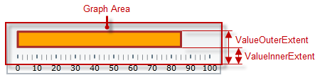
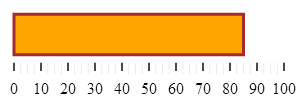

<!--
|metadata|
{
    "fileName": "igbulletgraph-configuring-the-performance-bar",
    "controlName": "igBulletGraph",
    "tags": ["Charting","How Do I"]
}
|metadata|
-->

# Configuring the Performance Bar (igBulletGraph)

## Topic Overview

#### Purpose

This topic explains, with code examples, how to configure the performance bar of the `igBulletGraph`™ control. This includes the value indicated by the bar, its width, position, and formatting.

### Required background

The following topics are prerequisites to understanding this topic:

- [*igBulletGraph* Overview](igBulletGraph-Overview.html): This topic provides conceptual information about the `igBulletGraph` control including its main features, minimum requirements, and user functionality.

- [Adding *igBulletGraph*](igBulletGraph-Adding.html): This is a group of topics explaining how to add the `igBulletGraph` control to an HTML page and an ASP.NET MVC application.


### In this topic

This topic contains the following sections:

-   [**Configuring the Performance Bar**](#configuring)
    -   [Performance bar appearance configuration summary](#appearance-summary)
    -   [Performance bar appearance configuration summary chart](#appearance-summary-chart)
    -   [Property settings](#property-settings)
    -   [Example](#example)
-   [**Related Content**](#related-content)
    -   [Topics](#topics)
    -   [Samples](#samples)


## <a id="configuring"></a> Configuring the Performance Bar

####<a id="appearance-summary"></a> Performance bar appearance configuration summary

The performance bar always starts at the beginning of the scale range. Only his ending position is configurable, which effectively configures the length of the bar. The ending position is managed by the [`value`](%%jQueryApiUrl%%/ui.igBulletGraph#options:value) property.

Its position in the across-the-scale dimension is configurable relative to the edges of the Graph area through the [`valueInnerExtent`](%%jQueryApiUrl%%/ui.igBulletGraph#options:valueInnerExtent) and [`valueOuterExtent`](%%jQueryApiUrl%%/ui.igBulletGraph#options:valueOuterExtent) properties. Configuring the position of the performance bar also defines its width.



The look-and-feel of the bar can be customized in terms of fill color, border color, and border thickness using the respective properties ([`valueBrush`](%%jQueryApiUrl%%/ui.igBulletGraph#options:valueBrush), [`valueOutline`](%%jQueryApiUrl%%/ui.igBulletGraph#options:valueOutline), and [`valueStrokeThickness`](%%jQueryApiUrl%%/ui.igBulletGraph#options:valueStrokeThickness)).

### <a id="appearance-summary-chart"></a> Performance bar appearance configuration summary chart

The following table explains briefly the configurable aspects of `igBulletGraph` control’s bar and maps them to  properties that configure them.

<table class="table table-bordered">
	<thead>
		<tr>
            <th colspan="2">
Configurable aspects
			</th>
            <th>
Property
			</th>
            <th>
Default value
			</th>
        </tr>
	</thead>
	<tbody>
        <tr>
            <th colspan="2">
**Name**
			</th>
            <td>
[valueName](%%jQueryApiUrl%%/ui.igBulletGraph#options:valueName)
			</td>
            <td>
Not set
			</td>
        </tr>
        <tr>
            <th colspan="2">
**Value to indicate**
			</th>
            <td>
[value](%%jQueryApiUrl%%/ui.igBulletGraph#options:value)
			</td>
            <td>
Not set
			</td>
        </tr>
        <tr>
            <th rowspan="2" colspan="2">
**Width and position** 
				<br />
(across the scale)
			</th>
            <td>
[valueInnerExtent](%%jQueryApiUrl%%/ui.igBulletGraph#options:valueInnerExtent)
			</td>
            <td>
*0.5*
			</td>
        </tr>
        <tr>
            <td>
[valueOuterExtent](%%jQueryApiUrl%%/ui.igBulletGraph#options:valueOuterExtent)
			</td>
            <td>
*0.65*
			</td>
        </tr>
        <tr>
            <th rowspan="3">
**Look-and-feel**
			</th>
            <th>
Fill color
			</th>
            <td>
[valueBrush](%%jQueryApiUrl%%/ui.igBulletGraph#options:valueBrush)
			</td>
            <td>
Defined in the default theme
			</td>
        </tr>
        <tr>
            <th>
Border thickness
			</th>
            <td>
[valueStrokeThickness](%%jQueryApiUrl%%/ui.igBulletGraph#options:valueStrokeThickness)
			</td>
            <td>
*1.0*
			</td>
        </tr>
        <tr>
            <th>
Border color
			</th>
            <td>
[valueOutline](%%jQueryApiUrl%%/ui.igBulletGraph#options:valueOutline)
			</td>
            <td>
Defined in the default theme
			</td>
        </tr>
        <tr>
            <th colspan="2">
Tooltip
			</th>
            <td>
[valueToolTipTemplate](%%jQueryApiUrl%%/ui.igBulletGraph#options:valueToolTipTemplate)
			</td>
            <td>
Depends on whether [valueName](%%jQueryApiUrl%%/ui.igBulletGraph#options:valueName) has been initialized
			</td>
        </tr>
    </tbody>
</table>

> **Note:** For details in configuring the tooltip, see [Configuring a Custom Tooltip for the Performance Bar](igBulletGraph-Configuring-the-Tooltips.html#performance-bar) in the [Configuring the Tooltips (*igBulletGraph*)](igBulletGraph-Configuring-the-Tooltips.html) topic.)

### <a id="property-settings"></a> Property settings

The following table maps the desired behavior to its respective property settings.

<table class="table table-bordered">
	<thead>
		<tr>
            <th colspan="3">
In order to configure:
			</th>
            <th rowspan="2">
Use this property:
			</th>
            <th rowspan="2">
And set it to:
			</th>
        </tr>
	</thead>
	<tbody>  
        <tr>
            <th colspan="2">
**Aspect**
			</th>
            <th>
**Details**
			</th>
        </tr>
        <tr>
            <th colspan="2">
**Name**
			</th>
            <td>
A name for the performance bar (for displaying in the [tooltip](igBulletGraph-Configuring-the-Tooltips.html#performance-bar))
			</td>
            <td>
[valueName](%%jQueryApiUrl%%/ui.igBulletGraph#options:valueName)
			</td>
            <td>
A string expressing the name of the performance bar
			</td>
        </tr>
        <tr>
            <th colspan="2">
**Value to indicate**
			</th>
            <td>
The value indicated by the performance bar
			</td>
            <td>
[value](%%jQueryApiUrl%%/ui.igBulletGraph#options:value)
			</td>
            <td>
The desired value in the measures of the scale
			</td>
        </tr>
        <tr>
            <th rowspan="2">
**Width and position**
				<br />
(across the scale)
			</th>
            <th>
Bottom / right edge position
			</th>
            <td>
The position of lower edge of the performance bar at horizontal orientation or the right edge at vertical orientation.
			</td>
            <td>
[valueInnerExtent](%%jQueryApiUrl%%/ui.igBulletGraph#options:valueInnerExtent)
			</td>
            <td>
The desired value as a relative part of the height/width of the [Graph area](igBulletGraph-Overview.html#logical-areas) (depending on the orientation) presented as a fraction of 1 (e.g. *0.2*)
			</td>
        </tr>
        <tr>
            <th>
Top / left edge position
			</th>
            <td>
The position of top edge of the performance bar at horizontal orientation or the left edge at vertical orientation. (The difference between the starting and the ending points forms the length of the marks’ line segments.)
			</td>
            <td>
[valueOuterExtent](%%jQueryApiUrl%%/ui.igBulletGraph#options:valueOuterExtent)
			</td>
            <td>
The desired value as a relative part of the height/width of the Graph area (depending on the orientation) presented as a fraction of 1 (e.g. *0.2*)
			</td>
        </tr>
        <tr>
            <th rowspan="3">
**Look-and-feel**
			</th>
            <th>
Fill color
			</th>
            <td>
Fill color of the bar
			</td>
            <td>
[valueBrush](%%jQueryApiUrl%%/ui.igBulletGraph#options:valueBrush)
			</td>
            <td>
The desired color
			</td>
        </tr>
        <tr>
            <th>
Border thickness
			</th>
            <td>
Thickness of the performance bar’s border
			</td>
            <td>
[valueStrokeThickness](%%jQueryApiUrl%%/ui.igBulletGraph#options:valueStrokeThickness)
			</td>
            <td>
The desired value in pixels
			</td>
        </tr>
        <tr>
            <th>
Border color
			</th>
            <td>
Color of the performance bar’s border
			</td>
            <td>
[valueOutline](%%jQueryApiUrl%%/ui.igBulletGraph#options:valueOutline)
			</td>
            <td>
The desired color
			</td>
        </tr>
        <tr>
            <th colspan="2">
**Tooltip**
			</th>
            <td>
Content of the performance bar’s tooltip
			</td>
            <td>
[valueToolTipTemplate](%%jQueryApiUrl%%/ui.igBulletGraph#options:valueToolTipTemplate)
			</td>
            <td>
The desired template(See [Configuring the Tooltips (*igBulletGraph*)](igBulletGraph-Configuring-the-Tooltips.html).)
			</td>
        </tr>
    </tbody>
</table>
### <a id="example"></a> Example

The screenshot below demonstrates how the `igBulletGraph` looks as a result of the following settings:

Property | Value
---|---
[value](%%jQueryApiUrl%%/ui.igBulletGraph#options:value) | *“85”*
[valueBrush](%%jQueryApiUrl%%/ui.igBulletGraph#options:valueBrush) | *'#FFA500'*
[valueInnerExtent](%%jQueryApiUrl%%/ui.igBulletGraph#options:valueInnerExtent) | *“0.3”*
[valueOuterExtent](%%jQueryApiUrl%%/ui.igBulletGraph#options:valueOuterExtent) | *“0.8”*
[valueOutline](%%jQueryApiUrl%%/ui.igBulletGraph#options:valueOutline) | *'#A52A2A'*
[valueStrokeThickness](%%jQueryApiUrl%%/ui.igBulletGraph#options:valueStrokeThickness) | *“3”*




Following is the code that implements this example.

**In JavaScript:**

 ```js
 $(function () {             
    $("#bulletGraph").igBulletGraph({
        width: "300",
        height: "100",
        value:"85",
        valueBrush: '#FFA500',
        valueInnerExtent:"0.3",
        valueOuterExtent:"0.8",
        valueOutline:'A52A2A',
        valueStrokeThickness:"3"
  });
 ```


## <a id="related-content"></a> Related Content

### <a id="topics"></a> Topics

The following topics provide additional information related to this topic.


- [Configuring the Scale (*igBulletGraph*)](igBulletGraph-Configuring-the-Scale.html): This topic explains, with examples, how to configure the scale of the `igBulletGraph` control. This includes positioning the scale inside the control and configuring the scale tick marks and labels.

- [Configuring the Comparative Marker (*igBulletGraph*)](igBulletGraph-Configuring-the-Comparative-Marker.html)

This topic explains, with code examples, how to configure the comparative measure marker of the `igBulletGraph` control. This includes the marker’s value, width, and formatting.

- [Configuring Comparative Ranges (*igBulletGraph*)](igBulletGraph-Configuring-Comparative-Ranges.html): This topic explains, with code examples, how to configure ranges in the `igBulletGraph` control. This includes the number of ranges and their positions, lengths, widths, and formatting.

- [Configuring the Background (*igBulletGraph*)](igBulletGraph-Configuring-the-Background.html): This topic explains, with code examples, how to configure a background for the bullet graph. This includes setting the background’s size, position, color, and border.

- [Configuring the Tooltips (*igBulletGraph*)](igBulletGraph-Configuring-the-Tooltips.html): This topic explains, with code examples, how to enable the tooltips in the `igBulletGraph` control and configure the delay with which they are displayed.


### <a id="samples"></a> Samples

The following samples provide additional information related to this topic.

- [Performance Bar Settings](%%SamplesUrl%%/bullet-graph/performance-bar-settings): This sample demonstrates configuring the performance (actual value) bar, the comparative measure (target value) marker, and the dimension of the scale of the `igBulletGraph` control.


 

 


