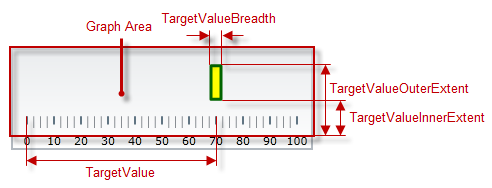
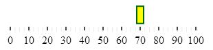

<!--
|metadata|
{
    "fileName": "igbulletgraph-configuring-the-comparative-marker",
    "controlName": "igBulletGraph",
    "tags": ["Charting","How Do I"]
}
|metadata|
-->

# Configuring the Comparative Marker (igBulletGraph)

## Topic Overview

#### Purpose

This topic explains, with code examples, how to configure the comparative measure marker of the `igBulletGraph`™  control. This includes the marker’s value, width, and formatting.

### Required background

The following topics are prerequisites to understanding this topic:

- [*igBulletGraph* Overview](igBulletGraph-Overview.html):  This topic provides conceptual information about the `igBulletGraph` control including its main features, minimum requirements, and user functionality.

- [Adding *igBulletGraph*](igBulletGraph-Adding.html): This is a group of topics explaining how to add the `igBulletGraph` control to an HTML page and an ASP.NET MVC application.


### In this topic

This topic contains the following sections:

-   [**Configuring the Comparative Marker**](#configuring)
    -   [Comparative marker configuration summary](#configuration-summary)
    -   [Comparative marker configuration summary chart](#configuration-summary-chart)
    -   [Property settings](#property-settings)
    -   [Example](#example)
-   [**Related Content**](#related-content)
    -   [Topics](#topics)
    -   [Samples](#samples)


##<a id="configuring"></a> Configuring the Comparative Marker

####<a id="configuration-summary"></a> Comparative marker configuration summary

The comparative marker indicates a mark on the scale against which the value denoted by the performance bar is compared. This comparative value can be some sort of a target to aim for (like target sales volume) or a limit that not to be exceeded (as the 98.6°F/37°C mark on a medical thermometer scale).

The value indicated by the comparative marker (and its position on the scale, respectively) is set by the [`targetValue`](%%jQueryApiUrl%%/ui.igBulletGraph#options:targetValue) property. The comparative marker is customizable in terms of position and size across the scale ([`targetValueInnerExtent`](%%jQueryApiUrl%%/ui.igBulletGraph#options:targetValueInnerExtent) and [`targetValueOuterExtent`](%%jQueryApiUrl%%/ui.igBulletGraph#options:targetValueOuterExtent)), breadth ([`targetValueBreadth`](%%jQueryApiUrl%%/ui.igBulletGraph#options:targetValueBreadth)) and look-and-feel (fill color – [`targetValueBrush`](%%jQueryApiUrl%%/ui.igBulletGraph#options:targetValueBrush), border thickness – [`targetValueStrokeThickness`](%%jQueryApiUrl%%/ui.igBulletGraph#options:targetValueStrokeThickness), border color – [`targetValueOutline`](%%jQueryApiUrl%%/ui.igBulletGraph#options:targetValueOutline)) using the respective properties.



####<a id="configuration-summary-chart"></a> Comparative marker configuration summary chart

The following table explains briefly the configurable aspects of `igBulletGraph` control’s comparative marker and maps them to properties that configure them.

<table class="table table-bordered">
	<thead>
		<tr>
            <th colspan="2">
Configurable aspects
			</th>
            <th>
Property
			</th>
            <th>
Default value
			</th>
        </tr>
	</thead>
	<tbody>
        <tr>
            <th colspan="2">
**Name**
			</th>
            <td>
[targetValueName](%%jQueryApiUrl%%/ui.igBulletGraph#options:targetValueName)
			</td>
            <td>
Not set
			</td>
        </tr>
        <tr>
            <th colspan="2">
**Value indicated**
			</th>
            <td>
[targetValue](%%jQueryApiUrl%%/ui.igBulletGraph#options:targetValue)
			</td>
            <td>
Not set
			</td>
        </tr>
        <tr>
            <th colspan="2">
**Breadth**
			</th>
            <td>
[targetValueBreadth](%%jQueryApiUrl%%/ui.igBulletGraph#options:targetValueBreadth)
			</td>
            <td>
*3.0*
			</td>
        </tr>
        <tr>
            <th rowspan="2">
**Position across the scale**
			</th>
            <th>
**Inner edge**
			</th>
            <td>
[targetValueInnerExtent](%%jQueryApiUrl%%/ui.igBulletGraph#options:targetValueInnerExtent)
			</td>
            <td>
*0.3*
			</td>
        </tr>
        <tr>
            <th>
**Outer edge**
			</th>
            <td>
[targetValueOuterExtent](%%jQueryApiUrl%%/ui.igBulletGraph#options:targetValueOuterExtent)
			</td>

            <td>
*0.85*
			</td>
        </tr>
        <tr>
            <th rowspan="3">
**Look-and-feel**
			</th>
            <th>
Fill color
			</th>
            <td>
[targetValueBrush](%%jQueryApiUrl%%/ui.igBulletGraph#options:targetValueBrush)
			</td>
            <td>
Defined in the default theme
			</td>
        </tr>
        <tr>
            <th>
Border thickness
			</th>
            <td>
[targetValueStrokeThickness](%%jQueryApiUrl%%/ui.igBulletGraph#options:targetValueStrokeThickness)
			</td>
            <td>
*1.0*
			</td>
        </tr>
        <tr>
            <th>
Border color
			</th>
            <td>
[targetValueOutline](%%jQueryApiUrl%%/ui.igBulletGraph#options:targetValueOutline)
			</td>
            <td>
Defined in the default theme
			</td>
        </tr>
        <tr>
            <th colspan="2">
**Tooltip**
			</th>
            <td>
[targetValueToolTipTemplate](%%jQueryApiUrl%%/ui.igBulletGraph#options:targetValueToolTipTemplate)
			</td>
            <td>
The value indicated by the comparative marker
			</td>
        </tr>
    </tbody>
</table>


#### <a id="property-settings"></a> Property settings

The following table maps the desired behavior to its respective property settings.

<table class="table table-bordered">
	<tbody>    
		<tr>
            <th colspan="3">
In order to configure:
			</th>
            <th rowspan="2">
Use this property:
			</th>
            <th rowspan="2">
And set it to:
			</th>
        </tr>   
		<tr>
            <th colspan="2">
**Aspect**
			</th>
            <th>
**Details**
			</th>
        </tr>
        <tr>
            <th colspan="2">
**Name**
			</th>
            <td>
A name for the comparative marker (for displaying in the [tooltip)](igBulletGraph-Configuring-the-Tooltips.html#comparative-marker)
			</td>
            <td>
[targetValueName](%%jQueryApiUrl%%/ui.igBulletGraph#options:targetValueName)
			</td>
            <td>
A string expressing the name of the comparative marker
			</td>
        </tr>
        <tr>
            <th colspan="2">
**Value to indicate**
			</th>
            <td>
The value to indicate
			</td>
            <td>
[targetValue](%%jQueryApiUrl%%/ui.igBulletGraph#options:targetValue)
			</td>
            <td>
The desired value in the measures of the scale
			</td>
        </tr>
        <tr>
            <th colspan="2">
**Breadth**
			</th>
            <td>
The breadth of the marker
			</td>
            <td>
[targetValueBreadth](%%jQueryApiUrl%%/ui.igBulletGraph#options:targetValueBreadth)
			</td>
            <td>
The desired value in pixels
			</td>
        </tr>
        <tr>
            <th rowspan="2">
**Position across the scale**
			</th>
            <th>
**Inner edge**
			</th>
            <td>
The position of lower edge of the comparative marker at horizontal orientation or the left edge at vertical orientation.
			</td>
            <td>
[targetValueInnerExtent](%%jQueryApiUrl%%/ui.igBulletGraph#options:targetValueInnerExtent)
			</td>
            <td>
The desired value as a relative part of the height/width of the [Graph area](igBulletGraph-Overview.html#logical-areas) (depending on the orientation) presented as a fraction of 1 (e.g. *0.2*)
			</td>
        </tr>
        <tr>
            <th>
**Outer edge**
			</th>
            <td>
The position of top edge of the comparative marker at horizontal orientation or the right edge at vertical orientation.
			</td>

            <td>
[targetValueOuterExtent](%%jQueryApiUrl%%/ui.igBulletGraph#options:targetValueOuterExtent)
			</td>
            <td>
The desired value as a relative part of the height/width of the Graph area (depending on the orientation) presented as a fraction of 1 (e.g. *0.2*)
			</td>
        </tr>
        <tr>
            <th rowspan="3">
**Look-and-feel**
			</th>
            <th>
Fill color
			</th>
            <td>
Fill color of the marker
			</td>
            <td>
[targetValueBrush](%%jQueryApiUrl%%/ui.igBulletGraph#options:targetValueBrush)
			</td>
            <td>
The desired color
			</td>
        </tr>
        <tr>
            <th>
Border thickness
			</th>
            <td>
Thickness of the marker’s border
			</td>
            <td>
[targetValueStrokeThickness](%%jQueryApiUrl%%/ui.igBulletGraph#options:targetValueStrokeThickness)
			</td>
            <td>
The desired value in pixels
			</td>
        </tr>
        <tr>
            <th>
Border color
			</th>
            <td>
Configure the color of the marker’s border
			</td>
            <td>
[targetValueOutline](%%jQueryApiUrl%%/ui.igBulletGraph#options:targetValueOutline)
			</td>
            <td>
The desired color
			</td>
        </tr>
        <tr>
            <th colspan="2">
Tooltip
			</th>
            <td>
Content of the comparative marker’s border
			</td>
            <td>
[targetValueToolTipTemplate](%%jQueryApiUrl%%/ui.igBulletGraph#options:targetValueToolTipTemplate)
			</td>
            <td>
The desired template(see [Configuring the Tooltips (*igBulletGraph*)](igBulletGraph-Configuring-the-Tooltips.html) topic).
			</td>
        </tr>
    </tbody>
</table>

#### <a id="example"></a>Example

The screenshot below demonstrates how the `igBulletGraph` looks as a result of the following settings:

Property | Value
---|---
[targetValue](%%jQueryApiUrl%%/ui.igBulletGraph#options:targetValue) | “70”
[targetValueBreadth](%%jQueryApiUrl%%/ui.igBulletGraph#options:targetValueBreadth) | “10”
[targetValueBrush](%%jQueryApiUrl%%/ui.igBulletGraph#options:targetValueBrush) | '#FFFF00'
[targetValueInnerExtent](%%jQueryApiUrl%%/ui.igBulletGraph#options:targetValueInnerExtent) | “0.2”
[targetValueOuterExtent](%%jQueryApiUrl%%/ui.igBulletGraph#options:targetValueOuterExtent) | “0.7”
[targetValueOutline](%%jQueryApiUrl%%/ui.igBulletGraph#options:targetValueOutline) | '#006400'
[targetValueStrokeThickness](%%jQueryApiUrl%%/ui.igBulletGraph#options:targetValueStrokeThickness) | “3”




Following is the code that implements this example.

**In JavaScript:**

```js
$(function () {             
$("#bulletGraph").igBulletGraph({
    height: "70",                
    width: "300",
    targetValue:"70",
    targetValueBreadth:"10",
    targetValueBrush: '#FFFF00',
    targetValueOutline:'#006400',
    targetValueStrokeThickness: "2",
    targetValueInnerExtent:"0.3",
    targetValueOuterExtent:"0.8"
});
```


## <a id="related-content"></a> Related Content

###<a id="topics"></a> Topics

The following topics provide additional information related to this topic.

- [Configuring the Scale (*igBulletGraph*)](igBulletGraph-Configuring-the-Scale.html): This topic explains, with examples, how to configure the scale of the `igBulletGraph` control. This includes positioning the scale inside the control and configuring the scale tick marks and labels.

- [Configuring the Performance Bar (*igBulletGraph*)](igBulletGraph-Configuring-the-Performance-Bar.html): This topic explains, with examples, how to configure the performance bar of the `igBulletGraph` control. This includes the value indicated by the bar, its width, position, and formatting.

- [Configuring Comparative Ranges (*igBulletGraph*)](igBulletGraph-Configuring-Comparative-Ranges.html): This topic explains, with code examples, how to configure ranges in the `igBulletGraph` control. This includes the number of ranges and their positions, lengths, widths, and formatting.

- [Configuring the Background (*igBulletGraph*)](igBulletGraph-Configuring-the-Background.html): This topic explains, with code examples, how to configure a background for the bullet graph. This includes setting the background’s size, position, color, and border.

- [Configuring the Tooltips (*igBulletGraph*)](igBulletGraph-Configuring-the-Tooltips.html): This topic explains, with code examples, how to enable the tooltips in the `igBulletGraph` control and configure the delay with which they are displayed.


###<a id="samples"></a> Samples

The following samples provide additional information related to this topic.

- [Performance Bar Settings](%%SamplesUrl%%/bullet-graph/performance-bar-settings): This sample demonstrates configuring the performance (actual value) bar, the comparative measure (target value) marker, and the dimension of the scale of the `igBulletGraph` control.

- [Basic Configuration](%%SamplesUrl%%/bullet-graph/basic-configuration): This sample demonstrates a simple configuration of the `igBulletGraph` control.


 

 


