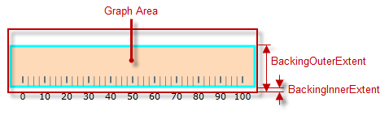
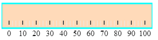

<!--
|metadata|
{
    "fileName": "igbulletgraph-configuring-the-background",
    "controlName": "igBulletGraph",
    "tags": ["Charting","How Do I","Styling"]
}
|metadata|
-->

# Configuring the Background (igBulletGraph)

## Topic Overview

#### Purpose


This topic explains, with code examples, how to configure a background for the bullet graph. This includes setting the background’s size, position, color, and border.

### Required background

The following topics are prerequisites to understanding this topic:

- [*igBulletGraph* Overview](igBulletGraph-Overview.html): This topic provides conceptual information about the `igBulletGraph`™ control including its main features, minimum requirements, and user functionality.

- [Adding *igBulletGraph*](igBulletGraph-Adding.html): This is a group of topics demonstrating how to add the `igBulletGraph` control to an HTML page and to an ASP.NET MVC application.

### In this topic

This topic contains the following sections:

-   [**Configuring the Background**](#configuring)
    -   [Background configuration summary](#configuration-summary)
    -   [Background configuration summary chart](#configuration-summary-chart)
    -   [Property settings](#property-settings)
    -   [Example](#example)
-   [**Related Content**](#related-content)
    -   [Topics](#topics)


## <a id="configuring"></a>Configuring the Background

#### <a id="configuration-summary"></a> Background configuration summary

The background of the `igBulletGraph` control is configurable in terms of spread and position and look-and-feel (fill and border). The spread and position are configurable in the dimension across the scale (through the [`backingInnerExtent`](%%jQueryApiUrl%%/ui.igBulletGraph#options:backingInnerExtent) and [`backingOuterExtent`](%%jQueryApiUrl%%/ui.igBulletGraph#options:backingOuterExtent) properties); along the scale, the background always spreads from one edge of the control to the other. The fill color and the border are managed by a set of properties available in the style template.

The following picture demonstrates a background color of a variety of orange and a cyan border with a thickness of 3 pixels. The background extent is made smaller by providing values for its [`backingInnerExtent`](%%jQueryApiUrl%%/ui.igBulletGraph#options:backingInnerExtent) and [`backingOuterExtent`](%%jQueryApiUrl%%/ui.igBulletGraph#options:backingOuterExtent) properties.



### <a id="configuration-summary-chart"></a> Background configuration summary chart

The following table explains briefly the configurable aspects of `igBulletGraph` control’s background and maps them to properties that configure them.

<table class="table table-bordered">
	<thead>
		<tr>
            <th colspan="2">
Configurable aspects
			</th>
            <th>
Property
			</th>
            <th>
Default value
			</th>
        </tr>
	</thead>
	<tbody>
        <tr>
            <th rowspan="2" colspan="2">
**Spread and position** 
				<br />
(across the scale)
			</th>
            <td>
[backingInnerExtent](%%jQueryApiUrl%%/ui.igBulletGraph#options:backingInnerExtent)
			</td>
            <td>
*0*
			</td>
        </tr>
        <tr>
            <td>
[backingOuterExtent](%%jQueryApiUrl%%/ui.igBulletGraph#options:backingOuterExtent)
			</td>
            <td>
*1.0*
			</td>
        </tr>
        <tr>
            <th rowspan="3">
**Look-and-feel**
			</th>
            <th>
Fill color
			</th>
            <td>
[backingBrush](%%jQueryApiUrl%%/ui.igBulletGraph#options:backingBrush)
			</td>
            <td>
Defined in the default theme
			</td>
        </tr>
        <tr>
            <th>
Border color
			</th>
            <td>
[backingOutline](%%jQueryApiUrl%%/ui.igBulletGraph#options:backingOutline)
			</td>
            <td>
Defined in the default theme
			</td>
        </tr>
        <tr>
            <th>
Border thickness
			</th>
            <td>
[backingStrokeThickness](%%jQueryApiUrl%%/ui.igBulletGraph#options:backingStrokeThickness)
			</td>
            <td>
*2.0*
			</td>
        </tr>
    </tbody>
</table>


### <a id="property-settings"></a> Property settings

The following table maps the desired behavior to its respective property settings.

<table class="table table-bordered">
	<tbody>
		<tr>
            <th colspan="3">
In order to configure:
			</th>
            <th rowspan="2">
Use this property:
			</th>
            <th rowspan="2">
And set it to:
			</th>
        </tr>     
		 <tr>
            <th colspan="2">
**Aspect**
			</th>
            <th>
**Details**
			</th>
        </tr>
        <tr>
            <th rowspan="2">
**Spread and position**
				<br />
(across the scale)
			</th>
            <th>
Bottom / left edge position
			</th>
            <td>
The position of lower edge of the background (at horizontal orientation) or the left edge (at vertical orientation) relative to the bottom edge of the [Graph area](igBulletGraph-Overview.html#logical-areas) at horizontal orientation or to its left edge – at vertical orientation.
			</td>
            <td>
[backingInnerExtent](%%jQueryApiUrl%%/ui.igBulletGraph#options;backingInnerExtent)
			</td>
            <td>
The desired value as a relative part of the height/width of the Graph area (depending on the orientation) presented as a fraction of 1 (e.g. *0.2)*
			</td>
        </tr>
        <tr>
            <th>
Top / right edge position
			</th>
            <td>
The position of top edge of the background at horizontal orientation or the right edge at vertical orientation relative to the lower edge of the Graph area at horizontal orientation or to its left edge – at vertical orientation.
			</td>
            <td>
[backingOuterExtent](%%jQueryApiUrl%%/ui.igBulletGraph#options:backingOuterExtent)
			</td>
            <td>
The desired value as a relative part of the height/width of the Graph area (depending on the orientation) presented as a fraction of 1 (e.g. *0.2*)
			</td>
        </tr>
        <tr>
            <th rowspan="3">
**Look-and-feel**
			</th>
            <th>
Fill color
			</th>
            <td>
Fill color of the background
			</td>
            <td>
[backingBrush](%%jQueryApiUrl%%/ui.igBulletGraph#options:backingBrush)
			</td>
            <td>
The desired color
			</td>
        </tr>
        <tr>
            <th>
Border thickness
			</th>
            <td>
Border thickness of the background
			</td>
            <td>
[backingStrokeThickness](%%jQueryApiUrl%%/ui.igBulletGraph#options:backingStrokeThickness)
			</td>
            <td>
The desired value in pixels
			</td>
        </tr>
        <tr>
            <th>
Border color
			</th>
            <td>
Border color of the background
			</td>

            <td>
[backingOutline](%%jQueryApiUrl%%/ui.igBulletGraph#options:backingOutline)
			</td>

            <td>
The desired color
			</td>
        </tr>
    </tbody>
</table>

### <a id="example"></a> Example

The screenshot below demonstrates how the `igBulletGraph` looks as a result of the following settings:

Property | Value
---|---
[backingBrush](%%jQueryApiUrl%%/ui.igBulletGraph#options:backingBrush) | '#FFDAB9'
[backingOutline](%%jQueryApiUrl%%/ui.igBulletGraph#options:backingOutline) | '#00FFFF'
[backingStrokeThickness](%%jQueryApiUrl%%/ui.igBulletGraph#options:backingStrokeThickness) | “3”
[backingInnerExtent](%%jQueryApiUrl%%/ui.igBulletGraph#options:backingInnerExtent) | “0.2”
[backingOuterExtent](%%jQueryApiUrl%%/ui.igBulletGraph#options:backingOuterExtent) | “0.7”




Following is the code that implements this example.

**In JavaScript:**

 ```js
 $(function () {             
    $("#bulletGraph").igBulletGraph({
        width: "300px",
        height: "100px",
        backingBrush:'#FFDAB9',
        backingOutline: '#00FFFF',
        backingStrokeThickness: "3",
        backingInnerExtent:"0.2",
        backingOuterExtent:"0.7"
  });
 ```


## <a id="related-content"></a> Related Content

### <a id="topics"></a> Topics

The following topics provide additional information related to this topic.


- [Configuring the Scale (*igBulletGraph*)](igBulletGraph-Configuring-the-Scale.html): This topic explains, with examples, how to configure the scale of the `igBulletGraph` control. This includes positioning the scale inside the control and configuring the scale tick marks and labels.

- [Configuring the Performance Bar (*igBulletGraph*)](igBulletGraph-Configuring-the-Performance-Bar.html): This topic explains, with examples, how to configure the performance bar of the `igBulletGraph` control. This includes the value indicated by the bar, its width, position, and formatting.

- [Configuring the Comparative Marker (*igBulletGraph*)](igBulletGraph-Configuring-the-Comparative-Marker.html): This topic explains, with code examples, how to configure the comparative measure marker of the `igBulletGraph` control. This includes the marker’s value, width, and formatting.

- [Configuring Comparative Ranges (*igBulletGraph*)](igBulletGraph-Configuring-Comparative-Ranges.html): This topic explains, with code examples, how to configure ranges in the `igBulletGraph` control. This includes the number of ranges and their positions, lengths, widths, and formatting.

- [Configuring the Tooltips (*igBulletGraph*)](igBulletGraph-Configuring-the-Tooltips.html): This topic explains, with code examples, how to enable the topoltips in the `igBulletGraph` control and configure the delay with which they are displayed.


 

 


