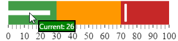
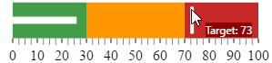

<!--
|metadata|
{
    "fileName": "igbulletgraph-configuring-the-tooltips",
    "controlName": "igBulletGraph",
    "tags": ["Charting","How Do I"]
}
|metadata|
-->

# Configuring the Tooltips (igBulletGraph)

## Topic Overview

#### Purpose

This topic explains, with code examples, how to enable the tooltips in the `igBulletGraph`™ control and configure the delay with which they are displayed as well as creating custom tooltips templates and a code sample ilustrating it.

### Required background

The following topics are prerequisites to understanding this topic:

- [*igBulletGraph* Overview](igBulletGraph-Overview.html): This topic provides conceptual information about the `igBulletGraph` control including its main features, minimum requirements, and user functionality.

- [Adding *igBulletGraph*](igBulletGraph-Adding.html): This is a group of topics demonstrating how to add the `igBulletGraph`™ control to an HTML page and to an ASP.NET MVC application.


### In this topic

This topic contains the following sections:

-   [**Introduction**](#introduction)
    -   [Tooltips configuration summary](#configuration-summary)
    -   [Tooltips configuration summary chart](#configuration-summary-chart)
-   [**Enabling/Disabling Tooltips**](#enabling-disabling)
    -   [Property settings](#enabling-disabling-property)
    -   [Code Example](#enabling-disabling-example)
-   [**Configuring the Tooltip Delay**](#delay)
    -   [Property settings](#delay-property)
    -   [Code Example](#delay-example)
-   [**Configuring a Custom Tooltip for the Performance Bar**](#performance-bar)
    -   [Overview](#performance-bar-overview)
    -   [Property settings](#performance-bar-property)
    -   [Example](#performance-bar-example)
-   [**Configuring a Custom Tooltip for the Comparative Marker**](#comparative-marker)
    -   [Property settings](#comparative-marker-property)
    -   [Example](#comparative-marker-example)
-   [**Configuring a Custom Tooltip for the Comparative Ranges**](#comparative-ranges)
    -   [Property settings](#comparative-ranges-property)
    -   [Example](#comparative-ranges-example)
-   [**Configuring tooltips sample**](#configuring-tooltips-sample)
-   [**Related Content**](#related-content)
    -   [Topics](#topics)


## <a id="introduction"></a> Introduction

#### <a id="configuration-summary"></a> Tooltips configuration summary

The `igBulletGraph` control supports tooltips. They are pre-configured to show the values indicated by the performance bar, comparative marker, and comparative ranges. The tooltip for each of these visual elements is configured individually by a property setting. 

Tooltips are configurable in terms of visibility (can be enabled/disabled), delay (the timeout with which the tooltip appears is configurable), and value. Because the value of the tooltips can be set to a custom template, you have a wide array of possibilities to present the information relevant for the specific use case in the most appropriate manner.

By default, tooltips are disabled.

### <a id="configuration-summary-chart"></a> Tooltips configuration summary chart

The following table maps the configurable aspects of the `igBulletGraph` control related to tooltips to the properties that manage them.

<table class="table table-bordered">
	<thead>
		<tr>
            <th>
Configurable aspect
			</th>
            <th colspan="2">
Details
			</th>
            <th>
Properties / Events
			</th>
            <th>
Default value
			</th>
        </tr>
	</thead>
	<tbody>
        <tr>
            <th>
[**Visibility**](#enabling-disabling)
			</th>
            <td colspan="2">
You can enable/disable tooltips for the *igBulletGraph* control.
			</td>
            <td>
[showToolTip](%%jQueryApiUrl%%/ui.igBulletGraph#options:showToolTip)
			</td>
            <td>
*False*
			</td>
        </tr>
        <tr>
            <th>
[**Delay**](#delay)
			</th>
            <td colspan="2">
The timeout before the tooltip appears upon the visual element at mouse hovering is configurable in milliseconds.
			</td>
            <td>
[showToolTipTimeout](%%jQueryApiUrl%%/ui.igBulletGraph#options:showToolTipTimeout)
			</td>
            <td>
*500*
			</td>
        </tr>
        <tr>
            <th rowspan="3">
Value
			</th>
            <td rowspan="3">
You can provide a custom value for the respective tooltip template property.
			</td>
            <td>
[**Performance bar**](#performance-bar)
			</td>
            <td>
[valueToolTipTemplate](%%jQueryApiUrl%%/ui.igBulletGraph#options:valueToolTipTemplate)
			</td>
            <td>
Depends on whether [valueName](%%jQueryApiUrl%%/ui.igBulletGraph#options:valueName) has been initialized (see [**Configuring a Custom Tooltip for the Performance Bar**](#performance-bar))
			</td>
        </tr>
        <tr>
            <td>
[**Comparative marker**](#comparative-marker)
			</td>
            <td>
[targetValueToolTipTemplate](%%jQueryApiUrl%%/ui.igBulletGraph#options:targetValueToolTipTemplate)
			</td>
            <td>
The value indicated by the comparative marker
			</td>
        </tr>
        <tr>
            <td>
[**Comparative Range(s)**](#comparative-ranges)
			</td>
            <td>
[rangeToolTipTemplate](%%jQueryApiUrl%%/ui.igBulletGraph#options:rangeToolTipTemplate)
			</td>
            <td>
The start and end values of the range separated by a hyphen
			</td>
        </tr>
    </tbody>
</table>


> **Note:** In order to bind to different values of the respective visual element when you change the default tooltip template, you must use the ${Item.Property} syntax from within the template.


## <a id="enabling-disabling"></a> Enabling/Disabling Tooltips

You can show or hide (default setting) the tooltips on a `igBulletGraph`.

### <a id="enabling-disabling-property"></a> Property settings

The following table maps the desired behavior to property settings.

In order to: | Use this property: | And set it to:
---|---|---
Enable tooltips | [showToolTip](%%jQueryApiUrl%%/ui.igBulletGraph#options:showToolTip) | true
Disable tooltips | [showToolTip](%%jQueryApiUrl%%/ui.igBulletGraph#options:showToolTip) | false


### <a id="enabling-disabling-example"></a> Code Example

The following code example enables the tooltips:

**In JavaScript:**

```js
$("#bulletgraph").igBulletGraph({
                …
                showToolTip: true
});
```


## <a id="delay"></a> Configuring the Tooltip Delay
It is possible to specify a delay by which a tooltip is displayed after the respective visual element has been hovered. The default value is 500 milliseconds.

### <a id="delay-property"></a> Property settings

The following table maps the desired behavior to property settings.

In order to: | Use this property: | And set it to:
---|---|---
Configure the initial delay before the tooltip is displayed | [showToolTipTimeout](%%jQueryApiUrl%%/ui.igBulletGraph#options:showToolTipTimeout) | The desired value in milliseconds


### <a id="delay-example"></a> Code Example

The following code example sets the tooltip delay to 2000 milliseconds:

**In JavaScript:**

```js
$("#bulletgraph").igBulletGraph({
                …
                showToolTip: true,
                showToolTipTimeout: 2000
});
```


## <a id="performance-bar"></a> Configuring a Custom Tooltip for the Performance Bar

### <a id="performance-bar-overview"></a> Overview

The default value of the tooltip is pre-configured depending on whether the [`valueName`](%%jQueryApiUrl%%/ui.igBulletGraph#options:valueName) property has been initialized.

If the `valueName` property has been initialized, the default format of the tooltip property would be:

```
<valueName> : <value>
```

If the `valueName` property has not been initialized, the default format of the tooltip would be:

```
<value>
```

To change the data (and/or its look-and-feel) presented by the tooltip, you can set it to a custom template.

### <a id="performance-bar-property"></a> Property settings

The following table maps the desired behavior to its respective property settings.

In order to: | Use this property: | And set it to:
---|---|---
Set a custom tooltip for the performance bar | [valueToolTipTemplate](%%jQueryApiUrl%%/ui.igBulletGraph#options:valueToolTipTemplate) | The id of the desired template.


### <a id="performance-bar-example"></a> Example

The screenshot below demonstrates how the tooltip of the `igBulletGraph`’s performance bar looks as a result of the following settings:

Property | Value
---|---
[valueToolTipTemplate](%%jQueryApiUrl%%/ui.igBulletGraph#options:valueToolTipTemplate) | "valueToolTipTemplate" 
Where "valueToolTipTemplate" is the id of the template:

**In HTML:**

```html
<script id="valueToolTipTemplate" type="text/x-jquery-tmpl">
    <span style="background: green; border:black solid 2px; color:white">Current: ${item.value}</span>
</script>
```




Following is the code that implements this example.

**In HTML:**

```html
<script id="valueToolTipTemplate" type="text/x-jquery-tmpl">
    <span style="background: green; border:black solid 2px; color:white">Current: ${item.value}</span>
</script>
<script type="text/javascript">
    $(function () {
        $("#bulletgraph").igBulletGraph({
            showToolTip: true,
            valueToolTipTemplate: "valueToolTipTemplate"
            …
        });
    });
</script>
```


## <a id="comparative-marker"></a> Configuring a Custom Tooltip for the Comparative Marker

The tooltip for the comparative marker displays the value set for the marker using the default system font and styled by default in accordance with the look of the control. To specify custom settings, set the tooltip value to a custom template.

### <a id="comparative-marker-property"></a> Property settings

The following table maps the desired behavior to its respective property
settings.

In order to: | Use this property: | And set it to:
---|---|---
Set a custom tooltip for the comparative marker | [targetValueToolTipTemplate](%%jQueryApiUrl%%/ui.igBulletGraph#options:targetValueToolTipTemplate) | The id of the desired template


### <a id="comparative-marker-example"></a> Example

The code below illustrates displaying the value presented in the tooltip of the comparative marker as a result of the following settings:

Property | Value
---|---
[targetValueToolTipTemplate](%%jQueryApiUrl%%/ui.igBulletGraph#options:targetValueToolTipTemplate) | "targetValueToolTipTemplate" 

Where "targetValueToolTipTemplate" is the id of the template:

**In HTML:**

```html
<script id="targetValueToolTipTemplate" type="text/x-jquery-tmpl">
    <span style="background: darkred;color:white">Target: ${item.value}</span>
</script>
```




Following is the code that implements this example.

**In HTML:**

```html
<script id="targetValueToolTipTemplate" type="text/x-jquery-tmpl">
    <span style="background: darkred;color:white">Target: ${item.value}</span>
</script>
<script type="text/javascript">
    $(function () {
        $("#bulletgraph").igBulletGraph({
            showToolTip: true,
            targetValueToolTipTemplate: "targetValueToolTipTemplate",
            …
        });
    });
</script>
```


## <a id="comparative-ranges"></a> Configuring a Custom Tooltip for the Comparative Ranges

By default, the tooltips for the comparative ranges display the starting and ending values of the range, separated by a hyphen (i.e. 0 - 34), no matter where exactly over the range the mouse is being hovered. To change these pre-configured settings, you can set a custom template.


### <a id="comparative-ranges-property"></a> Property settings

The following table maps the desired behavior to its respective property
settings.

In order to: | Use this property: | And set it to:
--|--|--
Set a custom tooltip for the comparative range(s) | [rangeToolTipTemplate](%%jQueryApiUrl%%/ui.igBulletGraph#options:rangeToolTipTemplate) | The id of the desired template


### <a id="comparative-ranges-example"></a> Example

The screenshot below demonstrates displaying the value presented in the tooltip of the comparative range as a result of the following settings:

Property | Value
---|---
[rangeToolTipTemplate](%%jQueryApiUrl%%/ui.igBulletGraph#options:rangeToolTipTemplate) | "rangeToolTipTemplate" 

Where "rangeToolTipTemplate" is the id of the template:

**In HTML:**

```html
<script id="rangeToolTipTemplate" type="text/x-jquery-tmpl">
    <span style="padding:5px; background: grey;color: white">Range: ${item.startValue} to ${item.endValue}</span>
</script>
```


Following is the code that implements this example.

**In HTML:**

```html
<script id="rangeToolTipTemplate" type="text/x-jquery-tmpl">
    <span style="padding:5px; background: grey;color: white">Range: ${item.startValue} to ${item.endValue}</span>
</script>
<script type="text/javascript">
    $(function () {
        $("#bulletgraph").igBulletGraph({
            showToolTip: true,
            targetValueToolTipTemplate: "targetValueToolTipTemplate",
            valueToolTipTemplate: "valueToolTipTemplate",
            rangeToolTipTemplate: 'rangeToolTipTemplate',
            value: 26,
            targetValue: 73,
            height: "70px",
            width: "300px",
            ranges: [
                {
                    name: 'bad',
                    startValue: 0,
                    endValue: 30
                },
                {
                    name: 'acceptable',
                    startValue: 30,
                    endValue: 70
                },
                {
                    name: 'good',
                    startValue: 70,
                    endValue: 100
                }]
        });
    });
</script>
```

## <a id="configuring-tooltips-sample"></a> Configuring tooltips sample 

This sample demonstrates what can be achieved when combining all of the custom tooltips mentioned above. It includes templates for all of the configurable areas where you can have a tooltip - the [performance bar](%%jQueryApiUrl%%/ui.igbulletgraph#options:valueToolTipTemplate), [comparative marker](%%jQueryApiUrl%%/ui.igbulletgraph#options:targetValueToolTipTemplate) and [ranges](%%jQueryApiUrl%%/ui.igbulletgraph#options:rangeToolTipTemplate). 
While the first `igBulletGraph` used for visualizing the Development Task and has default tooltips enabled and configured only via the options API, the second one illustrating the Quality Assurance Task is taking advantage of the custom tooltip templates used and has more unique look when key areas are hovered.

In the sample's context, even though these tasks are executed simultaneously at the course of three weeks, initially more time has been spent on development. This is demonstrated by the progress bars’ placement amongst the three different ranges (“Low, “Medium” and “High”), that represent the level of confidence for delivering the needed results.

<div class="embed-sample">
   [%%SamplesEmbedUrl%%/bullet-graph/tooltip-settings](%%SamplesEmbedUrl%%/bullet-graph/tooltip-settings)
</div>

## <a id="related-content"></a> Related Content

### <a id="topics"></a> Topics

The following topics provide additional information related to this topic.

- [Configuring the Scale (*igBulletGraph*)](igBulletGraph-Configuring-the-Scale.html): This topic explains, with examples, how to configure the scale of the igBulletGraph control. This includes positioning the scale inside the control and configuring the scale tick marks and labels.

- [Configuring the Performance Bar (*igBulletGraph*)](igBulletGraph-Configuring-the-Performance-Bar.html): This topic explains, with examples, how to configure the performance bar of the igBulletGraph control. This includes the value indicated by the bar, its width, position, and formatting.

- [Configuring the Comparative Marker (*igBulletGraph*)](igBulletGraph-Configuring-the-Comparative-Marker.html): This topic explains, with code examples, how to configure the comparative measure marker of the `igBulletGraph` control. This includes the marker’s value, width, and formatting.

- [Configuring Comparative Ranges (*igBulletGraph*)](igBulletGraph-Configuring-Comparative-Ranges.html): This topic explains, with code examples, how to configure ranges in the `igBulletGraph` control. This includes the number of ranges and their positions, lengths, widths, and formatting.

- [Configuring the Background (*igBulletGraph*)](igBulletGraph-Configuring-the-Background.html): This topic explains, with code examples, how to configure a background for the bullet graph. This includes setting the background’s size, position, color, and border.


