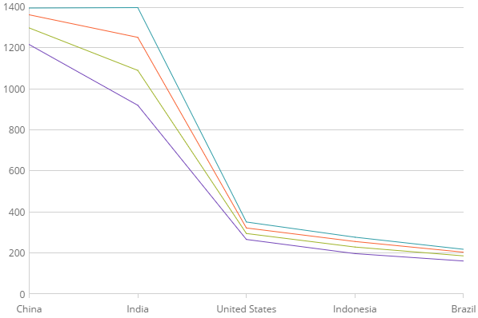

<!--
|metadata|
{
    "fileName": "categorychart-walkthrough",
    "controlName": "igCategoryChart",
    "tags": ["API", "CategoryChart", "Axes"]
}
|metadata|
-->

# Adding igCategoryChart

### Purpose

This topic explains using a code example how to add the  igCategoryChart™ control to your applications.

### In this topic

This topic contains the following sections:

-   [Adding Category Chart control to your application](#Adding)
    -   [Introduction](#Introduction)
    -   [Preview](#Preview)
    -   [Requirements](#Prerequisites)
    -   [Overview](#Overview)
    -   [Steps](#Steps)
-   [**Related Content**](#RelatedContent)

<a id="Adding"/>
## Adding  igCategoryChart control to your application

<a id="Introduction"/>

### Introduction

The following procedure demonstrates adding the igCategoryChart to your applications.

<a id="Preview"/>

### Preview

The following is a screenshot of the igCategoryChart.


<a id="Prerequisites"/>
### Requirements


<a id="Overview"/>

### Overview

Following is a conceptual overview of the process:

1. Adding the igCategoryChart control to your application

2. Verifying the results

<a id="Steps"/>

### Steps

The following procedure takes you through the steps necessary for adding the igCategoryChart control to a page.

1. Add a data source
In order to create an igCategoryChart control, you must first have data to bind it to. The following code snippet demonstrates how to create a simple data source. For more information on binding to other data sources, please refer to the following topic, Binding to Data](categorychart-binding-to-data.html).

**In HTML:**
```
var data = [
 { "CountryName": "China", "Pop1995": 1216, "Pop2005": 1297, "Pop2015": 1361, "Pop2025": 1394 },
 { "CountryName": "India", "Pop1995": 920, "Pop2005": 1090, "Pop2015": 1251, "Pop2025": 1396 },
 { "CountryName": "United States", "Pop1995": 266, "Pop2005": 295, "Pop2015": 322, "Pop2025": 351 },
 { "CountryName": "Indonesia", "Pop1995": 197, "Pop2005": 229, "Pop2015": 256, "Pop2025": 277 },
 { "CountryName": "Brazil", "Pop1995": 161, "Pop2005": 186, "Pop2015": 204, "Pop2025": 218 }
;

```

2. Add the igCategoryChart control to the page and bind it to the above data.

The following code demonstrates adding the igCategoryChart control with the minimum code and property settings required for display:

**In HTML:**

```html
 $(function () {
    $("#chart").igCategoryChart({ dataSource: data});
});
```

3. Verify the results.

Build and run your project to verify the result. If you have implemented the steps correctly, the displayed igCategoryChart should look like the one in the Preview section above.


<a id="RelatedContent"/>

## Related Content

### Topics

- [Why Use the Category Chart instead of the Data Chart](categorychart-why-use.html)

- [Extending the Category Chart](categorychart-extending-category-chart.html)

- [Binding to Data](categorychart-binding-to-data.html)

- [Axes](categorychart-axes.html)