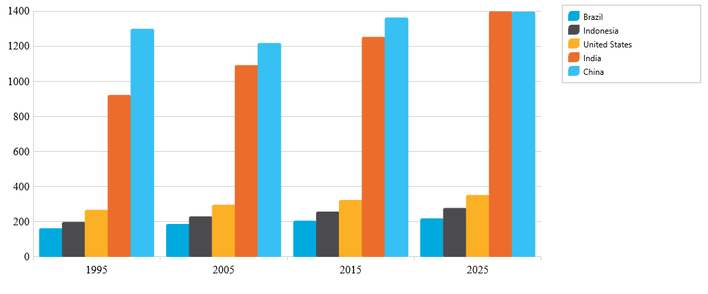
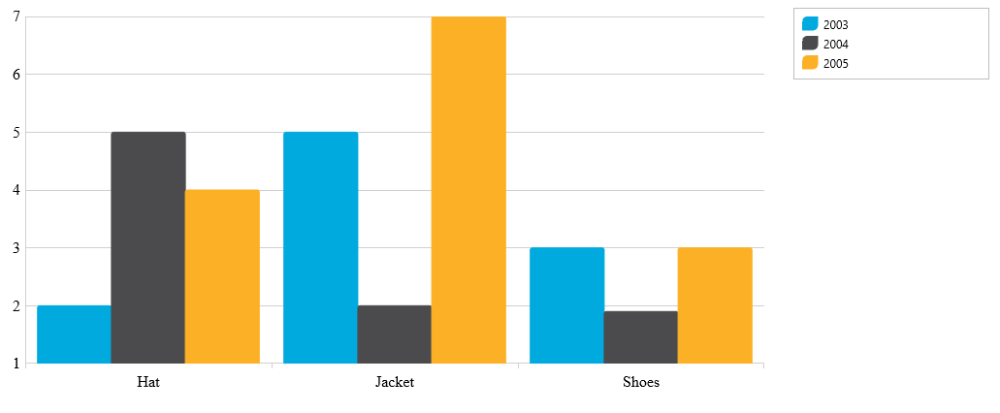

<!--
|metadata|
{
    "fileName": "categorychart-binding-to-data",
    "controlName": "igCategoryChart",
    "tags": ["API", "CategoryChart", "Axes"]
}
|metadata|
-->

# Binding to Data

### Topic Overview

This topic demonstrates how to bind both flat and hierarchical data to the igCategoryChart™ control. At the end of each section, a complete code sample is provided. 

### Purpose
The procedure below demonstrates how to bind the igCategoryChart control to a data collection. The igCategoryChart allows you to bind to JavaScript arrays. Nested collections are also supported. 
In this topic you will define two sets of data collection (flat and hierarchical), add the Category Chart control to your application, and bind the control’s DataSource to an instance of the designated data collection. 


### In this topic
This topic contains the following sections:
This topic contains the following sections:

- [Binding to Data Sources](#BindingtoDataSources)
    - [Supported data sources](#Supporteddatasources)
    -  [Requirements for binding](#Requirementsforbinding)
- [Binding a JavaScript Array](#BindingaJavaScriptArray)
    - [Introduction](#Introduction)
    - [Prerequisites](#Prerequisites)
    - [Preview](#Preview)
    - [Steps](#Steps)
- [Binding a Hierarchical JavaScript Array](#BindingaHierarchicalJavaScriptArray)
    - [Introduction](#HIntroduction)
    - [Prerequisites](#HPrerequisites)
    - [Preview](#HPreview)
    - [Steps](#HSteps)
- [Related Topics](#relatedcontent)

### <a id="BindingtoaJavaScriptArray"/> Binding to a JavaScript Array

#### <a id="Introduction"/> Introduction
This procedure demonstrates how to bind the igCategoryChart control to a JavaScript data array.

#### <a id="Prerequisites"/> Prerequisites
To complete the procedure, you need the following:

-	An HTML5 web page
-	All required JavaScript and CSS files added to your web site or web application project.

For detailed information on instantiation and configuration of an igCategoryChart see - - [Adding igCategoryChart](igcategorychart-adding.html). 

#### <a id="Preview"/> Preview





#### <a id="Steps"/> Steps 
The following steps demonstrate how to bind the igCategoryChart control to a JavaScript data array.

**Define the data array**

*In Javascript*
```
<script type="text/javascript">
   var data = [
      { "Label": "1995", "Brazil": 161, "Indonesia": 197, "United States": 266, "India": 920, "China": 1297 },
      { "Label": "2005", "Brazil": 186, "Indonesia": 229, "United States": 295, "India": 1090, China": 1216 },
      { "Label": "2015", "Brazil": 204, "Indonesia": 256, "United States": 322, "India": 1251, "China": 1361 },
      { "Label": "2025", "Brazil": 218, "Indonesia": 277, "United States": 351, "India": 1396, "China": 1394 }];
</script>
```

**Add and configure igCategoryChart control**

Add the chart div element to the web page. In the body of the web page, add a div element for the igCategoryChart control.

*In  HTML*
```     
<body>
   …
   <div id=”theChart”></div>
   <div id=”theLegend”></div>
   …
</body>
```

**Instantiate igCategoryChart control and configure the data source**

To do this, assign the data array defined in the previous step to the dataSource options of the igCategoryChart control.

*In  HTML*
```  
<script type="text/javascript">
$(function() {
            $("#theChart").igCategoryChart({
                chartType: "column",
	   dataSource: data,
                legend: { element: "theLegend" }
            });
          });
</script>
```

### <a id="BindingtoaHierarchicalJavaScriptArray"/> Binding to a Hierarchical JavaScript Array

#### <a id="HIntroduction"/> Introduction
This procedure demonstrates how to bind the igCategoryChart control to a “semi-nested” hierarchical JavaScript data array.

#### <a id="HPrerequisites"/> Prerequisites

To complete the procedure, you need the following:
- An HTML5 web page
- All required JavaScript and CSS files added to your web site or web application project.

For detailed information on instantiation and configuration of an igCategoryChart see [Adding igCategoryChart](igcategorychart-adding.html). 

#### <a id="HPreview"/> Preview





#### <a id="Steps"/> Steps 
The following steps demonstrate how to bind the igCategoryChart control to a JavaScript data array.

**Define the data array**

*In Javascript*
```
<script>
var data = [
 [
    [
       { "AmountSold": 2, "Item": "Hat" },
       { "AmountSold": 5, "Item": "Jacket" },
       { "AmountSold": 3, "Item": "Shoes" }
 	]
 ],
 [
    [
        { "AmountSold": 5, "Item": "Hat" },
        { "AmountSold": 2, "Item": "Jacket" },
        { "AmountSold": 1.9, "Item": "Shoes" }
   ]
 ],
 [
    [
        { "AmountSold": 4, "Item": "Hat" },
        { "AmountSold": 7, "Item": "Jacket" },
        { "AmountSold": 3, "Item": "Shoes" }
    ]
 ]
];
</script>

```

**Add and configure igCategoryChart control**

Add the chart div element to the web page. In the body of the web page, add a div element for the igCategoryChart control.

*In  HTML*
```     
<body>
   …
   <div id=”theChart”></div>
   <div id=”theLegend”></div>
   …
</body>
```

**Instantiate igCategoryChart control and configure the data source and xAxis labels**

To do this, assign the data array defined in the previous step to the dataSource options of the igCategoryChart control.

*In  HTML*
```  
<script type="text/javascript">
  $(function() {
    data[0].Label = "2003";
	data[1].Label = “2004";
	data[2].Label = "2005";

    $("#theChart").igCategoryChart({
       chartType: "column",
	   dataSource: data,
       legend: { element: "theLegend" }
    });
  });
</script>

```

## <a id="relatedcontent"/>Related Topics:

- [Walkthrough](igcategorychart-adding.html)

- [Axes](categorychart-axes.html)