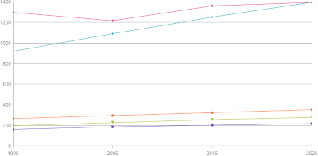
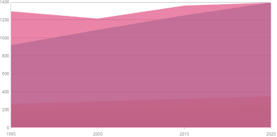
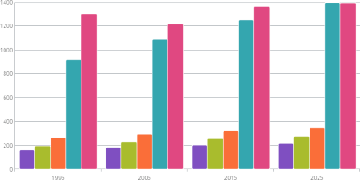
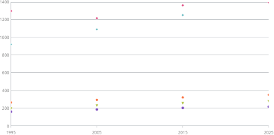
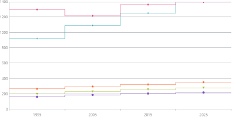
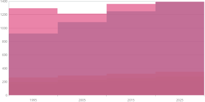
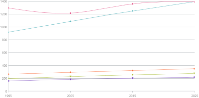
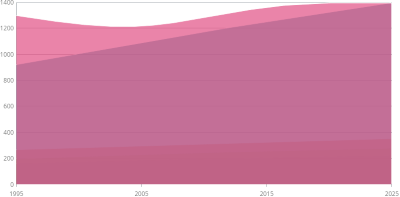
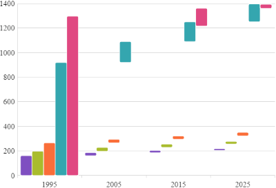

<!--
|metadata|
{
    "fileName": "categorychart-chart-types",
    "controlName": "igCategoryChart",
    "tags": ["API", "CategoryChart", "Axes"]
}
|metadata|
-->

# Chart Types

## Overview

The Category Chart simplifies assignment of the type of rendering compared to the Data Chart.
In order to select how data should be displayed it is enough to set the `chartType` property of this chart.
Below listed all of the types that the Category Chart supports.

Special case is the `auto` setting of that property. If `auto` is used the chart will analyze assigned data and will assign the most suitable chart type.

Default value of that property is `line`.

## Supported chart types

Property Value|Description|Example
---|---|---
`line`|Specifies category line series with markers at each data point|
`area`|Specifies category area series|
`column`|Specifies category column chart with vertical rectangles at each data point|
`point`|Specifies category point chart with markers at each data point|
`stepLine`|Specifies category step line chart|
`stepArea`|Specifies category step area chart|
`spline`|Specifies category spline line series with markers at each data point|
`splineArea`|Specifies category spline area series|
`waterfall`|Specifies category waterfall chart|
`auto`|Specifies automatic selection of chart type based on suggestions from Data Adapter

## Related topics

- [Walkthrough](igcategorychart-adding.html)

- [Configuring Chart Types](categorychart-configuring-chart-types.html)