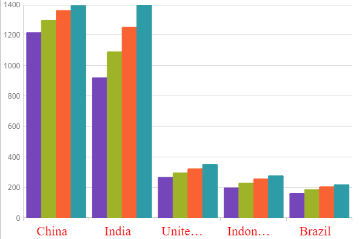

<!--
|metadata|
{
    "fileName": "igcategorychart-axis-label",
    "controlName": "igCategoryChart",
    "tags": ["API", "CategoryChart", "Axes"]
}
|metadata|
-->

# Configuring Axis Label 

The igCategoryChart control allows you full control over configuring, formatting and styling the labels displayed on your chart. By default, you do not need to explicitly set the labels. The Category Chart will use the first appropriate string property that it finds within the data you provided and will use that for the labels. 

### In this topic

This topic contains the following sections:

- [Label Settings](#labelsettings)
- [Label Styling](#labelstyling)
- [Code Snippet](#codesnippet)
- [Related Topics](#relatedtopics)

### <a id="labelsettings"/>Label Settings

In the igCategoryChart™ control, you can change the rotation angle, margin, horizontal/vertical alignment, opacity, padding and visibility, of the x-axis and y-axis labels using the following properties:

Property Name|Property Type|Description
---|---|---
`xAxisLabelAngle`, `yAxisLabelAngle` | double |Determines angle rotation of x-axis or y-axis labels 
`xAxisLabelHorizontalAlignment`, `yAxisLabelHorizontalAlignment` |HorizontalAlignment |Determines horizontal alignment of the x-axis or y-axis labels 
`xAxisLabelVerticalAlignment`, `yAxisLabelVerticalAlignment`|VerticalAlignment|Determines vertical alignment of the x-axis or y-axis labels
`xAxisLabelVisibility`, `yAxisLabelVisibility`|Visibility bool|Determines whether or not x-axis or y-axis labels are visible
`xAxisLabelLeftMargin`, `yAxisLabelLeftMargin`, `xAxisLabelRightMargin`, `yAxisLabelRightMargin`|Number|Determines the margin applied to each x-axis or y-axis labels


### <a id="labelstyling"/>Label Styling
The look and feel of the category chart's x-axis and y-axis labels can be styled in many aspects, the main of which are applying different font styles such as font type, font size and text color. This can be achieved through the following properties:

Property Name|Property Type|Description
---|---|---
`xAxisLabelTextStyle`,`yAxisLabelTextStyle`|object|Determines the font family, size, style to be used for the x-axis or y-axis labels
`xAxisLabelTextColor`,`yAxisLabelTextColor`|Brush|Determines the text color of the x-axis or y-axis labels


### <a id="codesnippet"/>Code Snippet
The following code example shows how to style labels on the x-axis using style properties:

*In HTML:*

```html
$(function () {
            $("#chart").igCategoryChart({
                dataSource: data,
                xAxisLabelTextStyle: "16pt Verdana",
                xAxisLabelRightMargin: "14",
                xAxisLabelTextColor: "red"
            });
        });
```


The following screenshot demonstrates the igCategoryChart control with the x-axis label styled.



## <a id="relatedtopics"/>Related Topics:

- [Walkthrough](igcategorychart-adding.html)

- [Binding to Data](categorychart-binding-to-data.html)

- [Configuring Axis Gap and Overlap](categorychart-configuring-axis-gap-and-overlap.html)

- [Configuring Axis Intervals](igcategorychart-axis-intervals.html)

- [Configuring Axis Range](categorychart-configuring-axis-range.html)

- [Configuring Axis Tickmarks](igcategorychart-axis-tickmarks.html)

- [Configuring Axis Titles](categorychart-configuring-axis-titles.html)