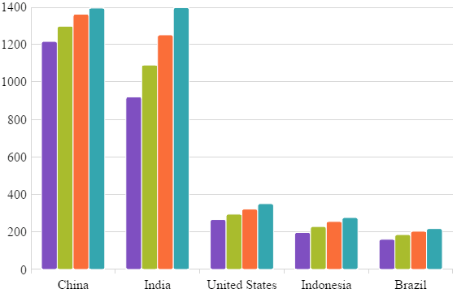
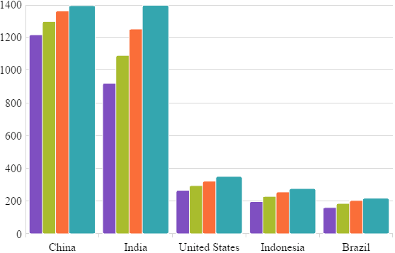
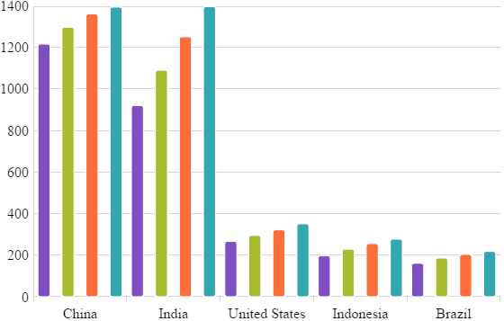

<!--
|metadata|
{
    "fileName": "igcategorychart-configuring-axis-gap-and-overlap",
    "controlName": "igCategoryChart",
    "tags": ["API", "CategoryChart", "Axes"]
}
|metadata|
-->

# Configuring Axis Gap and Overlap on {CategoryChartName}

## Topic Overview

### Purpose

This topic provides information on configuring axis gap and axis overlap in the `igCategoryChart`™ control.

### Required background

The following topic is a prerequisite to understanding this topic:
- [Walkthrough](categorychart-walkthrough.html)

This topic demonstrates how to add the `igCategoryChart`™ control to the page and bind it to data.

## Axis Gap

### Overview

The Axis Gap feature of the `igCategoryChart`™ control allows setting the gap between series of the chart.

### Property

Property name: `xAxisGap`.

Can be set either during the widget initialization, or as an option after the widget was initialized:
```javascript
$("#chart").igCategoryChart("option", "xAxisGap", 0.5);
```

The property accepts a numeric float value between 0 and 1. The value represents a relative width of the gap out of the available number of pixels between series. 0 - no gap is rendered between series; 1 - maximum available gap is rendered between series.

For the example, `xAxisGap` of 0.5 is a half of the available space is used to draw the gap:<br>
 

### Example

To initialize `igCategoryChart` with `xAxisGap` of `0.5` the following code can be used:

```javascript
$("#chart").igCategoryChart({
    title: "Countries population",
    xAxisTitle: "Countries",
    yAxisTitle: "Millions of people",
    dataSource: data,
    chartType: "column",
    xAxisGap: 0.5
});
```

## Axis Overlap

### Overview

The Axis Overlap feature of the `igCategoryChart`™ control allows setting overlap of rendered categories.

### Property

Property name: `xAxisOverlap`.

Can be set either during the widget initialization, or as an option after the widget was initialized:
```javascript
$("#chart").igCategoryChart("option", "xAxisOverlap", 0.5);
```

The property accepts a numeric float value between -1 and 1. The value represents a relative overlap out of the available number of pixels dedicated to each series.

Negative value (up to -1): the categories are pushed away from each other producing a gap between themselves.

Positive value (up to 1): the categories are overlaping each other. Value of 1 directs the chart to render categories on top of each other.

For the example, `xAxisOverlap` of 0.5 is a half of the available space is used to draw categories overlapping each other:<br>
 

`xAxisOverlap` of -1 pushes categories from each other as far as possible:<br>


### Example

To initialize `igCategoryChart` with `xAxisOverlap` of `0.5` the following code can be used:

```javascript
$("#chart").igCategoryChart({
    title: "Countries population",
    xAxisTitle: "Countries",
    yAxisTitle: "Millions of people",
    dataSource: data,
    chartType: "column",
    xAxisOverlap: 0.5
});
```

## Related Topics:

- [Walkthrough](categorychart-walkthrough.html)

- [Binding to Data](categorychart-binding-to-data.html)