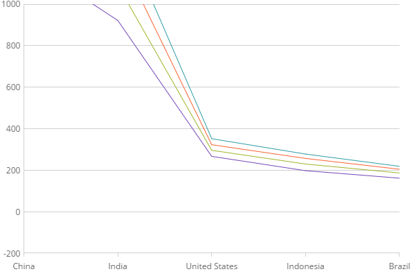

<!--
|metadata|
{
    "fileName": "categorychart-configuring-axis-range",
    "controlName": "igCategoryChart",
    "tags": ["API", "CategoryChart", "Axes"]
}
|metadata|
-->

# Axis Range

In the igCategoryChart™ control, the range on numeric axes is the difference in numeric values from the beginning of the axis to the end or from the smallest to largest values in the data. The range minimum is the lowest value of the axis. The range maximum is the highest value of the axis.

### In this topic

This topic contains the following sections:

- [Overview](#overview)
- [Code Snippet](#codesnippet)
- [Related Topics](#relatedtopics)

### <a id="overview"/>Overview
By default, the igDataChart control will calculate the minimum and maximum values for the y-axis range based on the lowest and highest data points in order to maximize the chart plot area. The automatic calculation of an axis' minimum and maximum values may not be appropriate for your set of data points. For example, if your data has a minimum value of 850, you may want to set the minimum value of the axis using y-axis’s `yAxisMinimumValue` property to 800 so that there will be a space value of 50 between the axis minimum and the lowest value of data points. The same can be applied to the axis maximum value and the highest value of data points using y-axis’s `yAxisMaximumValue` property.

### <a id="codesnippet"/>Code Snippet
The following sample code demonstrates how to change the axis range on the y-axis.

*In HTML:*

```html
$(function () {
            $("#chart").igCategoryChart({
                dataSource: data,
                yAxisMinimumValue: -200,
                yAxisMaximumValue: 1600
            });
        });
```



### <a id="relatedtopics"/> Related Topics:

- [Adding igCategoryChart](categorychart-walkthrough.html)

- [Binding to Data](categorychart-binding-to-data.html)

- [Configuring Axis Gap and Overlap](configuring-axis-gap-and-overlap.html)

- [Configuring Axis Labels](configuring-axis-labels.html)

- [Configuring Axis Intervals](configuring-axis-intervals.html)

- [Configuring Axis Tickmarks](configuring-axis-tickmarks.html)

- [Configuring Axis Titles](configuring-axis-titles.html)