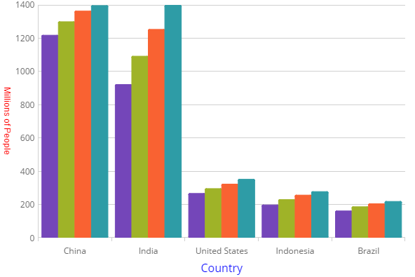

<!--
|metadata|
{
    "fileName": "categorychart-configuring-axis-titles",
    "controlName": "igCategoryChart",
    "tags": ["API", "CategoryChart", "Axes"]
}
|metadata|
-->

# Axis Titles
The axis title feature of the igCategoryChart control allows you to add contextual information to the x and y axes of the chart.

### In this topic

This topic contains the following sections:

- [Property Settings](#propertysettings)
- [Code Snippet](#codesnippet)
- [Related Topics](#relatedtopics)

### <a id="propertysettings"/>Property Settings
You can customize the look and feel of the category chart's x-axis and y-axis titles in many different ways such as applying different font styles, margins, and alignment. This can be achieved through the following properties:

Property Name|Property Type|Description
---|---|---
`xAxisTitle`,`yAxisTitle`|string|Determines the text to be used for the x-axis and y-axis title
`xAxisTitleAlignment`, `yAxisTitleAlignment`|enumeration|Determines the horizontal alignment of the x-axis and the vertical alignment of the y-axis 
`xAxisTitleAngle`,`yAxisTitleAngle`|number|Determines the angle rotation for the x-axis and y-axis titles
`xAxisTitleBottomMargin`,`yAxisTitleBottomMargin`|number|Determines the margin to be applied to the bottom of the x-axis or y-axis title
`xAxisTitleExtent`,`yAxisTitleExtent`|number|Determines the extent to be applied to the x-axis or y-axis title
`xAxisTitleLeftMargin`,`yAxisTitleLeftMargin`|number|Determines the margin to be applied to the left of the x-axis or y-axis title
`xAxisTitleMargin`,`yAxisTitleMargin`|number|Determines the margin to be applied to the x-axis or y-axis title
`xAxisTitleRightMargin`,`yAxisTitleRightMargin`|number|Determines the margin to be applied to the right of the x-axis or y-axis title
`xAxisTitleTextColor`, `yAxisTitleTextColor`|string|Determines the color for the x-axis or y-axis title
`xAxisTitleTextStyle`,`yAxisTitleTextStyle`|string|Determines the font styles to be applied to the x-axis or y-axis title
`xAxisTitleTopMargin`,`yAxisTitleTopMargin`|number|Determines the margin to be applied to the top of the x-axis or y-axis title

### <a id="codesnippets"/>Code Snippet
The following code example shows how to customize the titles on the x-axis and y-axis:

*In HTML:*

```html
$(function () {
   $("#chart").igCategoryChart({
      dataSource: data,
      chartType: "auto",
      xAxisTitle: "Country",
      xAxisTitleTextColor: "blue",
      xAxisTitleTextStyle: "20pt Times New Roman|Georgia|Serif",
      yAxisTitle: "Millions of People",
      yAxisTitleAngle: 90,
      yAxisTitleTextColor: "red"
   });
});
```



## <a id="relatedtopics"/>Related Topics:

- [Walkthrough](categorychart-walkthrough.html)

- [Binding to Data](categorychart-binding-to-data.html)

- [Configuring Axis Gap and Overlap](configuring-axis-gap-and-overlap.html)

- [Configuring Axis Labels](configuring-axis-labels.html)

- [Configuring Axis Intervals](configuring-axis-intervals.html)

- [Configuring Axis Range](configuring-axis-range.html)

- [Configuring Axis Tickmarks](configuring-axis-tickmarks.html)