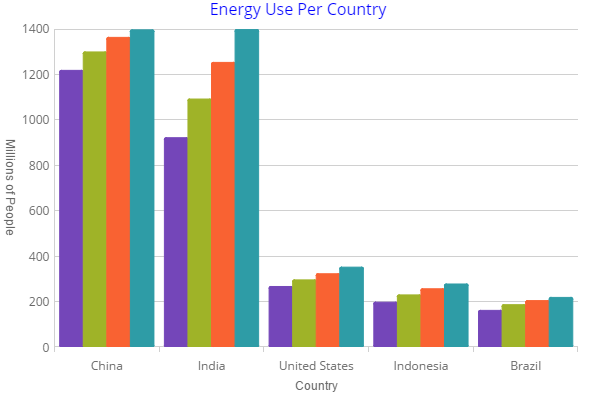

<!--
|metadata|
{
    "fileName": "categorychart-chart-title-subtitle",
    "controlName": "igCategoryChart",
    "tags": ["API", "CategoryChart", "Axes"]
}
|metadata|
-->

# Chart Title and Subtitle

The title and subtitle feature of the igCategoryChart control allows you to add information to the top section of the chart control.

When adding a title or subtitle to the chart control, the content of the chart automatically resizes allowing for the title and subtitle information.
### In this topic

This topic contains the following sections:

- [Property Settings](#propertysettings)
- [Code Snippet](#codesnippet)
- [Related Topics](#relatedtopics)

### <a id="propertysettings"/>Property Settings
You can customize the look and feel of the category chart's subtitle and title in many different ways such as applying different font styles, margins, and alignment. This can be achieved through the following properties:

Property Name|Property Type|Description
---|---|---
`title`|string|Determines the text to be used for the title
`titleTextColor`|string|Determines the color for the title
`titleTextStyle`|string|Determines the font styles to be applied to the title
`titleAlignment`|enumeration|Determines the alignment of the title 
`titleTopMargin`|number|Determines the margin to be applied to the top of title
`titleRightMargin`|number|Determines the margin to be applied to the right of the title
`titleBottomMargin`|number|Determines the margin to be applied to the bottom of the title
`titleLeftMargin`|number|Determines the margin to be applied to the left of the title
`subtitle`|string|Determines the text to be used for the subtitle
`subtitleTextColor`|string|Determines the color for the subtitle
`subtitleTextStyle`|string|Determines the font styles to be applied to the subtitle
`subtitleAlignment`|enumeration|Determines the alignment of the subtitle 
`subtitleTopMargin`|number|Determines the margin to be applied to the top of subtitle
`subtitleRightMargin`|number|Determines the margin to be applied to the right of the subtitle
`subtitleBottomMargin`|number|Determines the margin to be applied to the bottom of the subtitle
`subtitleLeftMargin`|number|Determines the margin to be applied to the left of the subtitle

### <a id="codesnippet"/>Code Snippet
The following code example shows how to customize the title and subtitle:

*In HTML:*

```html
$(function () {
   $("#chart").igCategoryChart({
      dataSource: data,
      chartType: "auto",
      xAxisTitle: "Country",
      yAxisTitle: "Millions of People",
      yAxisTitleAngle: 90,
      title: "Energy Use Per Country",
      subtitle: "Results over a two year period",
      titleTextColor: "blue",
      titleTextStyle: "20pt Times New Roman|Georgia|Serif",
      titleAlignment: "center",
    });
});
```



## <a id="relatedtopics"/>Related Topics:

- [Adding igCategoryChart](igcategorychart-adding.html)

- [Binding to Data](categorychart-binding-to-data.html)
