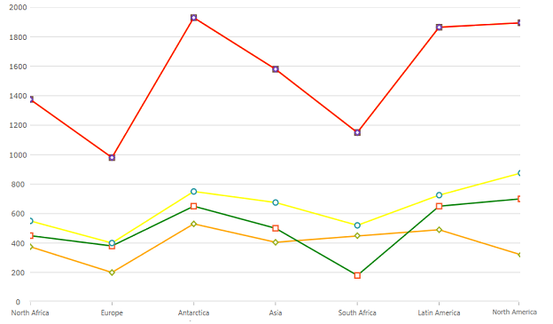
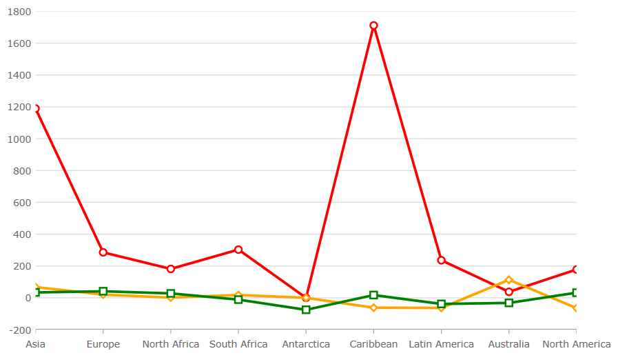

<!--
|metadata|
{
    "fileName": "categorychart-configuring-chart-markers",
    "controlName": "igCategoryChart",
    "tags": ["API", "CategoryChart", "Axes"]
}
|metadata|
-->

# Configuring Chart Markers

Markers are visual elements that display the values of data points in the igCategoryChart™ control's plot area. Markers help your end-users immediately identify a data point's value even if the value falls between major or minor grid lines.
This section provides you with useful information about working with the igCategoryChart control's Markers.

- [Marker Appearance](#markerappearance)
- [Marker Types](#markertypes)
- [Marker Brushes and Outlines](#markerbrushesandoutlines)

The appearance of chart markers is managed through the marker properties of the igCategoryChart class.

#### <a id="markerappearance"/> Marker Appearance
The following table lists all marker appearance properties.


Property Name|Property Type|Description
---|---|---
`markerTypes`| MarkerType |Determines type of markers displayed by the all series in the chart
`markerBrushes` |Brush |Determines fill color of markers
`markerOutlines`|Brush|Determines outline color of markers


#### <a id="markertypes"/> Marker Types
Property Name|Property Type|Description
---|---|---
`circleMarker`|MarkerType|Displays the Circle marker type.
`diamondMarker`|MarkerType|Displays the Diamond marker type.
`hexagonMarker`|MarkerType|Displays the Hexagon marker type.
`hexagramMarker`|MarkerType|Displays the Hexagram marker type.
`pentagramMarker`|MarkerType|Displays the Pentagram marker type.
`pentagonMarker`|MarkerType|Displays the Pentagon marker type.
`pyramidMarker`|MarkerType|Displays the Pyramid marker type.
`squareMarker`|MarkerType|Displays the Square marker type.
`tetragramMarker`|MarkerType|Displays the Tetragram marker type.
`triangleMarker`|MarkerType|Displays the Triangle marker type.


The code snippets below demonstrate how to change the marker type for the igCategoryChart.

*In HTML:*

```html
$(function () {
     $(“chart1”).igCategoryChart({
	     markerTypes: [“diamond, "circle”, "square"]
     });
});
```

The following screenshot displays the igCategoryChart control using the Line chart type with Diamond markers.




#### <a id="markerbrushesandoutlines"/> Marker Brush and Outline

The code snippets below demonstrate how to change the markerBrushes and markerOutlines for the igCategoryChart.

*In HTML:*

```html
$(function () {
     $(“chart1”).igCategoryChart({
	    markerBrushes: [“White”],
	    markerOutlines: [“Red”, “Orange”, “Green”]
     });
});
```

The following screenshot displays the igCategoryChart control using the Line chart type with customized markers.



## <a id="relatedtopics"/>Related Topics:

- [Adding igCategoryChart](categorychart-walkthrough.html)

- [Binding to Data](categorychart-binding-to-data.html)