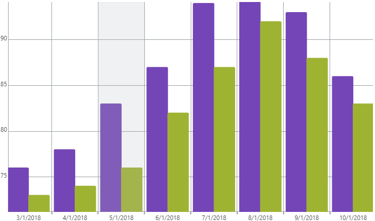

<!--
|metadata|
{
    "fileName": "igcategorychart-category-highlight-layer",
    "controlName": "igCategoryChart",
    "tags": ["API", "CategoryChart"]
}
|metadata|
-->

# Category Highlight Layer

The Category Highlight Layer highlights a category of the chart when hovering your pointer over the category.

## Enabling the Category Highlight Layer

The Category Highlight Layer is enabled by setting the `isCategoryHighlightingEnabled` option to true.

The code snippet below demonstrates how to enable the Category Highlight Layer for the `igCategoryChart`.

*In HTML:*

```html
$(function () {
     $("chart1").igCategoryChart({
	     isCategoryHighlightingEnabled: true
     });
});
```

The following screenshot displays the igCategoryChart control using the Category Highlight Layer.




## <a id="relatedtopics"/>Related Topics:

- [Item Highlight Layer](igcategorychart-item-highlight-layer.html)

- [Category Tooltip Layer](igcategorychart-category-tooltip-layer.html)