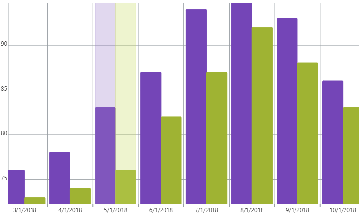

<!--
|metadata|
{
    "fileName": "igcategorychart-item-highlight-layer",
    "controlName": "igCategoryChart",
    "tags": ["API", "CategoryChart"]
}
|metadata|
-->

# Item Highlight Layer

The Item Highlight Layer highlights background of items in a category of the chart when hovering your pointer over the category.

## Enabling the Item Highlight Layer

The Item Highlight Layer is enabled by setting the `isItemHighlightingEnabled` option to true.

The code snippet below demonstrates how to enable the Item Highlight Layer for the `igCategoryChart`.

*In HTML:*

```html
$(function () {
     $("chart1").igCategoryChart({
	     isItemHighlightingEnabled: true
     });
});
```

The following screenshot displays the igCategoryChart control using the Item Highlight Layer.




## <a id="relatedtopics"/>Related Topics:

- [Category Highlight Layer](igcategorychart-category-highlight-layer.html)

- [Item Tooltip Layer](igcategorychart-item-tooltip-layer.html)