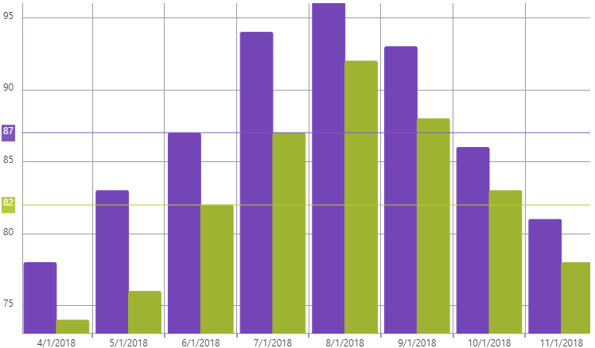

<!--
|metadata|
{
    "fileName": "igcategorychart-crosshairs-layer",
    "controlName": "igCategoryChart",
    "tags": ["API", "CategoryChart"]
}
|metadata|
-->

# Crosshairs Layer

The Crosshairs Layer renders a vertical and/or horizontal line where your pointer intersects with the data points on the igCategoryChart.

## Options

Below is a list of options that can be used to configure the Crosshairs Layer.

Option Name|Value Type|Description
---|---|---
`crosshairsDisplayMode`      | enumeration | Determines type of crosshairs displayed by the chart.<br>Values: "default", "none", "horizontal", "vertical", "both"
`crosshairsSnapToData`       | boolean     | Determines if crosshairs will interpolate between data points
`crosshairsAnnotationEnabled`| boolean     | Determines if the crosshair value will render in an annotation in the axis

## Enabling the Crosshairs Layer

The Crosshairs Layer is enabled by setting the `crosshairsDisplayMode` option to either "horizontal", "vertical", or "both".

The code snippet below demonstrates how to enable both horizontal and vertical crosshairs for the `igCategoryChart`.

*In HTML:*

```html
$(function () {
     $("chart1").igCategoryChart({
	     crosshairsDisplayMode: "both"
     });
});
```

## Configuring the Crosshairs Layer

### Snap to Data

Setting the `crosshairsSnapToData` option to true will snap the crosshairs to your data points in the `igCategoryChart`.  If set to false, the crosshair will interpolate between data points while hovering your pointer.

The code snippet below demonstrates how enable to crosshairs to snap to data points.

*In HTML:*

```html
$(function () {
     $("chart1").igCategoryChart({
	     crosshairsSnapToData: true
     });
});
```

### Enable Axis Annotations

Enabling axis annotations for the Crosshairs Layer will render the crosshair's value as an annotation label in the axis.

The code snippet below demonstrates how to enable axis annotation for the Crosshair Layer.

*In HTML:*

```html
$(function () {
     $("chart1").igCategoryChart({
	     crosshairsAnnotationEnabled: true
     });
});
```

The following screenshot displays the igCategoryChart control using horizontal crosshairs with axis annotations.




## <a id="relatedtopics"/>Related Topics:

- [Final Value Layer](igcategorychart-final-value-layer.html)