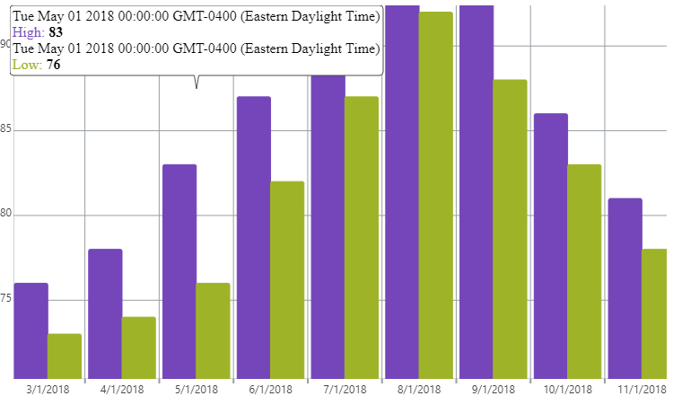

<!--
|metadata|
{
    "fileName": "igcategorychart-category-tooltip-layer",
    "controlName": "igCategoryChart",
    "tags": ["API", "CategoryChart"]
}
|metadata|
-->

# Category ToolTip Layer

The Category ToolTip Layer displays tooltips in a single tooltip for the category where your pointer is hovering in the igCategoryChart.

## Enabling the Category ToolTip Layer

The Category ToolTip Layer is enabled by setting the `toolTipType` option to "category".

The code snippet below demonstrates how to enable the Category ToolTip Layer for the `igCategoryChart`.

*In HTML:*

```html
$(function () {
     $("chart1").igCategoryChart({
	     toolTipType: "category"
     });
});
```

The following screenshot displays the igCategoryChart control using the Category ToolTip Layer.




## <a id="relatedtopics"/>Related Topics:

- [Item Tooltip Layer](igcategorychart-item-tooltip-layer.html)

- [Category Highlight Layer](igcategorychart-category-highlight-layer.html)