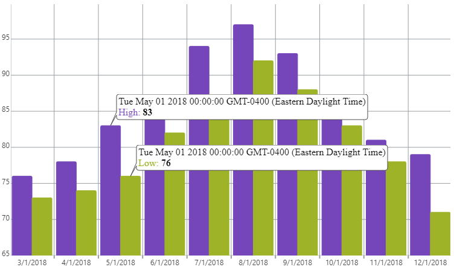

<!--
|metadata|
{
    "fileName": "igcategorychart-item-tooltip-layer",
    "controlName": "igCategoryChart",
    "tags": ["API", "CategoryChart"]
}
|metadata|
-->

# Item ToolTip Layer

The Item ToolTip Layer displays tooltips for each item in the category where your pointer is hovering in the igCategoryChart.

## Enabling the Item ToolTip Layer

The Item ToolTip Layer is enabled by setting the `toolTipType` option to "item".

The code snippet below demonstrates how to enable the Item ToolTip Layer for the `igCategoryChart`.

*In HTML:*

```html
$(function () {
     $("chart1").igCategoryChart({
	     toolTipType: "item"
     });
});
```

The following screenshot displays the igCategoryChart control using the Item ToolTip Layer.




## <a id="relatedtopics"/>Related Topics:

- [Category Tooltip Layer](igcategorychart-category-tooltip-layer.html)

- [Item Highlight Layer](igcategorychart-item-highlight-layer.html)