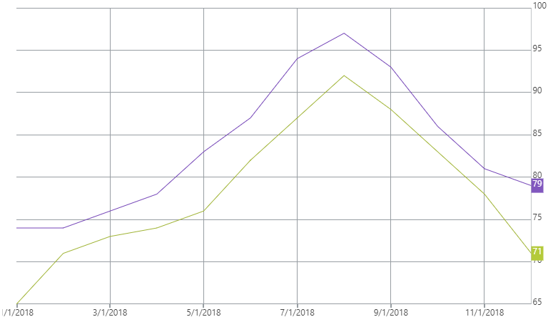

<!--
|metadata|
{
    "fileName": "igcategorychart-final-value-layer",
    "controlName": "igCategoryChart",
    "tags": ["API", "CategoryChart"]
}
|metadata|
-->

# Final Value Layer

The Final Value Layer displays an annotation along the axis where the final value of your data is shown.

## Enabling the Final Value Layer

The Final Value Layer is enabled by setting the `finalValueAnnotationsVisible` option to true.

The code snippet below demonstrates how to enable the Final Value Layer for the `igCategoryChart`.

*In HTML:*

```html
$(function () {
     $("chart1").igCategoryChart({
	     finalValueAnnotationsVisible: true
     });
});
```

The following screenshot displays the igCategoryChart control using the Final Value Layer.




## <a id="relatedtopics"/>Related Topics:

- [Crosshairs Layer](igcategorychart-crosshairs-layer.html)

- [Callouts Layer](igcategorychart-callouts-layer.html)