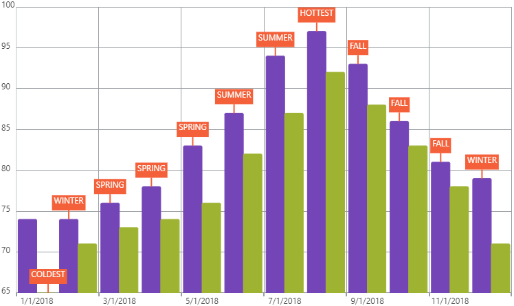

<!--
|metadata|
{
    "fileName": "igcategorychart-callouts-layer",
    "controlName": "igCategoryChart",
    "tags": ["API", "CategoryChart"]
}
|metadata|
-->

# Callouts Layer

The Callouts Layer displays an annotation at the given position.  This can be used to draw a user's attention to certain data points and provide additional information.

## Options

Below is a list of options that can be used to configure the Callouts Layer.

Option Name|Value Type|Description
---|---|---
`calloutsVisible`         | boolean | Determines if callout annotations will render on the chart
`calloutsItemsSource`     | object  | Datasource where callout data is stored
`calloutsLabelMemberPath` | string  | The path for your data that will be used as the annotation label
`calloutsXMemberPath`     | string  | The path for your data that will be used as the annotation's x position
`calloutsYMemberPath`     | string  | The path for your data that will be used as the annotation's y position

## Enabling the Callouts Layer

The Callouts Layer is enabled by setting the `calloutsVisible` option to true.

The code snippet below demonstrates how to enable the Callouts Layer for the `igCategoryChart`.

*In HTML:*

```html
$(function () {
    $("chart1").igCategoryChart({
	    calloutsVisible: true,
	    calloutsItemsSource: data,
		calloutsXMemberPath: "calloutIndex",
		calloutsYMemberPath: "calloutValue",
		calloutsLabelMemberPath: "calloutContent"
     });
});
```

The following screenshot displays the igCategoryChart control using the Callouts Layer.




## <a id="relatedtopics"/>Related Topics:

- [Final Value Layer](igcategorychart-final-value-layer.html)

- [Item ToolTips Layer](igcategorychart-item-tooltip-layer.html)