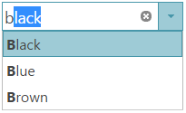
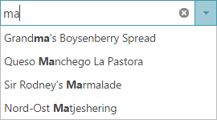
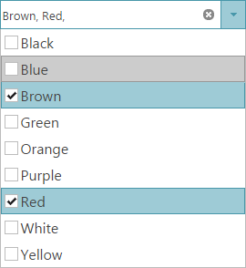

<!--
|metadata|
{
    "fileName": "igcombo-overview",
    "controlName": "igCombo",
    "tags": ["Editing","Getting Started"]
}
|metadata|
-->

# igCombo Overview

##Topic Overview

###Purpose

This topic provides conceptual information for the `igCombo`™ control including information regarding: features, binding to data sources, requirements, and templates.

###In this topic

This topic contains the following sections:

- [Main Features](#main-features)

- [Binding to Data Sources](#binding-to-data-source)

- [Minimum Requirements](#minimum-requirements)

- [Template Use and Selection](#template-use-and-selection)

### Required background

The table below lists the required background you need for fully understanding the information in this topic.

**Topics**

You need to first read the following topics:

-	[Ignite UI Overview](NetAdvantage-for-jQuery-Overview.html)

-	[Using JavaScript Resources in Ignite UI](Deployment-Guide-JavaScript-Resources.html)

-	[Styling and Theming in Ignite UI](Deployment-Guide-Styling-and-Theming.html)

-	[igGrid/igDataSource Architecture Overview](igGrid-igDataSource-Architecture-Overview.html), The Data Source Control section

**External Resources**

You need to first read the following article: [Working with jQuery Widgets](http://learn.jquery.com/jquery-ui/getting-started/)

##Main Features

###Features overview

The table below briefly explains the main features of the `igCombo`.

<table class="table">
    <tbody>
        <tr>
            <th>Feature</th>

            <th>Description</th>
        </tr>
        <tr>
            <td>Virtualization</td>

            <td>The igCombo control can re-use HTML elements when binding large amounts of data to improve performance.</td>
        </tr>
		<tr>
            <td>Auto-complete</td>

            <td>Enabling this allows the igCombo control to automatically fill in the remaining input text based off of the first match in the list of choices.</td>
        </tr>
        <tr>
            <td>Auto-suggest</td>

            <td>The igCombo control can filter the list of choices based of the text entered in the input box.</td>
        </tr>
        <tr>
            <td>Multiple selection</td>

            <td>Users can select single items or multiple items and can perform multiple selections using checkboxes.</td>
        </tr>
        <tr>
            <td>Keyboard navigation</td>

            <td>Users can easily and quickly navigate through items or change the selected/highlighted items thanks to the rich keyboard navigation that igCombo supports.</td>
        </tr>

        <tr>
            <td>Load-on-Demand</td>

            <td>The igCombo control supports Load-on-Demand feature. Enabling Load-on-Demand significantly reduces the bandwidth and processing overhead on both the server and the client.</td>
        </tr>
        <tr>
            <td>Highlighting</td>

            <td>When a user type a text in igCombo input the matching results in the dropdown items are displayed with a visual highlighting of the matching text.</td>
        </tr>
        <tr>
            <td>ASP.NET MVC helper</td>

            <td>You can use managed .NET code to configure the igCombo control.</td>
        </tr>
    </tbody>
</table>

### Virtualization

Virtualization allows the `igCombo` control to bind to hundreds of items while keeping the memory profile concise. The combo creates only the amount of HTML elements necessary to fill the scrollable area of the combo and then reuses those elements as the user scrolls through the data.

#### Related Topics

-	[Optimizing Performance (igCombo)](igCombo-Optimize-Performance.html)

#### Related Sample

- [igCombo Virtualization](%%SamplesUrl%%/combo/virtualization)

### Auto-Complete

The auto-complete feature helps users select content that is already in a list of choices. After the first character is entered, the combo prefills the remaining text of the first matching item in the list.

#### Related Topics

-	[Adding igCombo](igCombo-Getting-Started.html)

### Auto-suggest

To help the user find a specific value in the dropdown list, enable the Auto-Suggest feature. The dropdown list filters based off of the text entered in the input box. Different filtering conditions are available that include ‘contains’ or ‘startsWith’ operators.

#### Related Topics

-	[Configuring Auto-Suggest (igCombo)](igCombo-Configure-Auto-Suggest.html)

### Multiple selection

The `igCombo` control supports single and multiple selection. With multiple selection enabled the user can select multiple items from the dropdown list. During data entry users can also use a comma (,) to select multiple values while typing in the input box.

#### Related Topics

-	[Configuring Selection (igCombo)](igCombo-Configure-Selection.html)

#### Related Sample

- [igCombo Multiple selection](%%SamplesUrl%%/combo/selection-and-checkboxes)

### Load-on-Demand

If Load-on-Demand is enabled, the user should first be able to see a scrollbar in the drop-down container, and the first page of list items. If the user scrolls to the end of the list, the next page of items are fetched and appended at the bottom of the list through asynchronous callbacks.

#### Related Topics
- [Configuring Load-on-Demand ](igCombo-Load-on-Demand.html)

#### Related Sample

- [Load-On-Demand](%%SamplesUrl%%/combo/load-on-demand)

### Keyboard navigation

The combo provides very important accessibility feature, which is the ability to navigate by using the keyboard. This feature improves the User
Experience by saving time and allowing the end-user to easily and quickly navigate through dropdown items.

#### Related Topics
- [igCombo Keyboard Navigation](igCombo-Keyboard-Navigation.html)

#### Related Sample

- [Keyboard navigation](%%SamplesUrl%%/combo/keyboard-navigation)

### ASP.NET MVC Helper

You can use the ASP.NET MVC Helper to use managed code languages to configure the `igCombo` control. You can create re-usable Views or ViewModels in your ASP.NET MVC applications to interface with the combo. You can also bind to an IQueryable object in ASP.NET and the helper will generate the JSON data for the `igCombo` control to use on the client.

### Related Topics

-	[Adding igCombo](igCombo-Getting-Started.html)

-	[Configuring Auto-Suggest (igCombo)](igCombo-Configure-Auto-Suggest.html)

#### Related Sample

- [igCombo ASP.NET MVC Helper](%%SamplesUrl%%/combo/aspnet-mvc-helper)

##Minimum Requirements

###Introduction

The `igCombo` control is a jQuery UI Widget and therefore is dependent upon the jQuery core and jQuery UI JavaScript libraries. In addition, there are several Ignite UI™ JavaScript resources that the `igCombo` control uses for shared functionality and data binding. These JavaScript references are required whether the `igCombo` control is used in a pure JavaScript context or in ASP.NET MVC. When using the `igCombo` in ASP.NET MVC, the Infragistics.Web.Mvc assembly is required to configure the `igCombo` with .NET languages.

###Requirements

The table below lists the requirements for the `igCombo` control.

<table class="table">
	<thead>
		<tr>
			<th>Requirement</th>
			<th>Description</th>
		</tr>
	</thead>
	<tbody>
		<tr>
			<td>jQuery and jQuery UI JavaScript resources</td>
			<td>Ignite UI is built on top of these frameworks:
				<ul>
					<li>[jQuery](http://jquery.com) (The required jQuery version for igCombo is 1.8.3)</li>
					<li>[jQuery UI](http://jqueryui.com/) (The required jQuery UI version for igCombo is 1.9.2)</li>
				</ul>
			</td>
		</tr>
		<tr>
			<td>Shared Ignite UI JavaScript resources</td>
			<td>There are several shared JavaScript resources in Ignite UI that most widgets use:
				<ul>
					<li>infragistics.util.js</li>
				</ul>
			</td>
		</tr>
		<tr>
			<td>igDataSource JavaScript Resources</td>
			<td>The igCombo uses the igDataSource internally for data operations:
				<ul>
					<li>infragistics.dataSource.js</li>
				</ul>
			</td>
		</tr>
		<tr>
			<td>igTemplating JavaScript Resources</td>
			<td>The igCombo uses the igTemplating internally for the rendering of items.
				<ul>
					<li>infragistics.templating.js</li>
				</ul>
			</td>
		</tr>
		<tr>
			<td>igCombo JavaScript resources</td>
			<td>The JavaScript file for the igCombo widget:
				<ul>
					<li>infragistics.ui.combo.js</li>
				</ul>
			</td>
		</tr>
		<tr>
			<td>IG Theme</td>
			<td>This theme contains custom visual styles created especially for Ignite UI</td>
		</tr>
		<tr>
			<td>Base Theme</td>
			<td>The base theme contains styles that primarily define the form and function for each widget.</td>
		</tr>
	</tbody>
</table>

##Binding to Data Sources

The following table lists the requirements for binding the `igCombo` control to data sources grouped by requirement category.

<table class="table">
    <tbody>
        <tr>
            <th>Requirement category</th>

            <th>Requirements listing</th>
        </tr>

        <tr>
            <td>Data structure</td>

            <td>
               Can be any of the following:
				<ul>
                <li>Well-formed JSON or XML supplied locally or from a web server</li>

                <li>JavaScript array</li>

                <li>HTML SELECT element</li>

                <li>KnockoutJS</li>

                <li>JSONP</li>

                <li>IQueryable in ASP.NET MVC</li>
				</ul>
            </td>
        </tr>

        <tr>
            <td>Data types</td>

            <td><ul>
                <li>String</li>
				<li>Number</li>
				<li>Boolean</li>
				<li>Date</li>
				</ul>
            </td>
        </tr>
    </tbody>
</table>

###Supported data sources

The following table lists the supported data sources and some basic specifics for their binding

<table class="table">
	<thead>
		<tr>
            <th>
Data Source
			</th>
            <th>
Binding
			</th>
        </tr>
	</thead>
	<tbody>
        <tr>
            <td>
igDataSource
			</td>
            <td>
The `igDataSource` is used internally by the `igCombo` control to manage data operations for the control. The data source accepts many different types of local and remote data.
			</td>
        </tr>
        <tr>
            <td>
[Binding igCombo to Data](igCombo-Binding-to-Data.html)
			</td>
            <td>
You can point to a SELECT element in the jQuery selector for `igCombo` control and it will convert the SELECT element to the `igCombo` control automatically inheriting the options of the base element.
			</td>
        </tr>
        <tr>
            <td>
IQueryable
			</td>
            <td>
In ASP.NET MVC, supply an IQueryable as the igCombo’s datasource and the collection is serialized to JSON and returned with the View for use in the browser.
			</td>
        </tr>
        <tr>
            <td>
[KnockoutJS](igcombo-knockoutjs-support.html)
			</td>
            <td>
The support for the Knockout library in the `igCombo` control is intended to provide easy means for developers to use the Knockout library and its declarative syntax to instantiate and configure combo controls.
			</td>
        </tr>
    </tbody>
</table>

### Binding to data sources overview

In most cases, you will use the `dataSource` or `dataSourceUrl` options of the `igCombo` to bind to data. This option provides your data to the `igDataSource` which can handle the various data formats that are supported. The one main exception to using this option is when the `igCombo` is instantiated using a SELECT element. The `igCombo` inherits the data and options of its base SELECT element in this case. In ASP.NET MVC, supplying an IQueryable to the ASP.NET MVC Helper facilitates the serialization of the data from the server and passes it to the client with the View. Once the page is received by the browser, the `dataSource` option of the `igCombo` is set for client-side operation.

##Template Use and Selection

###Introduction

There are several places where a template can be used to customize the layout of the `igCombo` control. A header and/or footer can appended to the top and/or bottom of the dropdown list respectively to provide greater context to the user’s choices. In addition, an item template can be defined which allows each choice to have multiple pieces of information shown in a customized layout.

###Template use chart

The table bellows lists the `igCombo` templates and their possible uses.

<table class="table">
    <tbody>
        <tr>
            <th>Template</th>

            <th>Use with igCombo</th>
        </tr>

        <tr>
            <td>Header</td>

            <td>By setting the headerTemplate option, you can define custom HTML which displays at the top of the dropdown list.</td>
        </tr>

        <tr>
            <td>Footer</td>

            <td>Setting the footerTemplate option appends custom HTML at the bottom of the dropdown list. If the list is large enough to require a scrollbar, the footer template is always shown below the scrollable area.</td>
        </tr>

        <tr>
            <td>Item</td>

            <td>You can set custom HTML to the itemTemplate option and each bound item uses the template to display its data. Images and custom layouts can be displayed for each item.</td>
        </tr>
    </tbody>
</table>

###Template selection chart

The table below maps some of your possible needs to the appropriate templates.

<table class="table">
	<thead>
		<tr>
			<th>If you need to</th>
			<th>Then use this template:</th>
		</tr>
	</thead>
	<tbody>
		<tr>
			<td>Display a header at the top of the dropdown list</td>
			<td>headerTemplate</td>
		</tr>
		<tr>
			<td>Display a footer at the bottom of the dropdown list</td>
			<td>footerTemplate</td>
		</tr>
		<tr>
			<td>Display an image or icon for each item choice</td>
			<td>itemTemplate</td>
		</tr>
		<tr>
			<td>Show multiple pieces of information for each item in a custom layout</td>
			<td>itemTemplate</td>
		</tr>
	</tbody>
</table>

##Related Topics

Following are some other topics you may find useful.

- [Ignite UI Overview](NetAdvantage-for-jQuery-Overview.html)

- [Using JavaScript Resources in Ignite UI](Deployment-Guide-JavaScript-Resources.html)

- [Styling and Theming in Ignite UI](Deployment-Guide-Styling-and-Theming.html)

- [igGrid/igDataSource Architecture Overview](igGrid-igDataSource-Architecture-Overview.html)

- [Adding igCombo](igCombo-Getting-Started.html)

- [Binding igCombo to Data](igCombo-Binding-to-Data.html)

- [Configuring igCombo](igCombo-Configuring.html)

- [Styling igCombo](igCombo-Using-Themes.html)

- [Keyboard Navigation](igCombo-Keyboard-Navigation.html)

- [Accessibility Compliance (igCombo)](igCombo-Accessibility-Compliance.html)

- [Known Issues and Limitations (igCombo)](igCombo-Known-Limitations.html)

- [jQuery and ASP.NET MVC Helper API Links (igCombo)](igCombo-jQuery-And-ASP-NET-MVC-Helper-API-Links.html)

