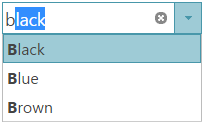

<!--
|metadata|
{
    "fileName": "igcombo-getting-started",
    "controlName": "igCombo",
    "tags": ["Editing","Getting Started"]
}
|metadata|
-->

# Adding igCombo


##Topic Overview


###Purpose


The `igCombo`™ can be configured to run using jQuery or using the ASP.NET MVC Helper. This help topic demonstrates how to setup a basic `igCombo` control in each of these environments binding to JSON data on the client and a collection of business object on the server.

###Required background


You need to first read the following topics:

-   [Using JavaScript Resources in Ignite UI](Deployment-Guide-JavaScript-Resources.html)
-   [Styling and Theming in Ignite UI](Deployment-Guide-Styling-and-Theming.html)

##Create a basic igCombo implementation


###Introduction


The following steps demonstrate how to configure basic options and bind to data using both jQuery and the ASP.NET MVC Helper.

###Preview


Following is a preview of the final result.



###Requirements

To complete the procedure, you need the following:

-   A website and web page on which to add this example
-   The required JavaScript resources and jQuery themes in your website
-   References to the required JavaScript files and CSS files on your web page
-   (ASP.NET MVC) A reference to the `Infragistics.Web.Mvc.dll` assembly

###Overview


Following is a conceptual overview of the process:

1.  Instantiating the `igCombo`
2.  Binding to data
3.  (Optional) Configuring the width
4.  (Optional) Enabling auto-complete

###Steps

1. **Instantiate the `igCombo`.**

 a. **Define a target element.**

	On your web page, define a target HTML element which serves as the base object for the `igCombo` control and set its ID. This is an optional step for ASP.NET MVC
	
	**In HTML:**
	
	```html
	<div id="comboTarget"></div>
	```
	
	Instantiate the `igCombo`. In jQuery, you can use the document ready JavaScript event to instantiate the combo. In ASP.NET MVC, use the ASP.NET MVC helper to bind to an `IQueryable` datasource.
	
	**In HTML:**
	
	```html
	<script type="text/javascript">
	     $(function () {
	          $("#comboTarget").igCombo({
	 
	          });
	      });
	</script>
	```
	
	 **In ASPX:**
	
	```csharp
	<%= Html.
	    Infragistics().
	    Combo().
	    ID("comboTarget").
	    Render() 
	%>
	```

2.  **Bind to data.**

	**a. Define the data.**
	
	In jQuery, this example binds to a simple JSON array. This data could be passed as part of the page request or could be returned from a web service. In ASP.NET MVC, this example binds to a collection of Color objects defined in the controller class on the server and returned as the model with the View.
	
	**In HTML:**
	
	```html
	var colors = [{ "Name": "Black" },{ "Name": "Blue" },{ "Name": "Brown" },{ "Name": "Red" },{ "Name": "White" },{ "Name": "Yellow" }];
	```
	
	**In C#:**
	
	```csharp
	public class DefaultController : Controller
	{
	     public ActionResult Index()
	     {
	        List<Color> colors = new List<Color>();
	        colors.Add(Color.Black);
	        colors.Add(Color.Blue);
	        colors.Add(Color.Brown);
	        colors.Add(Color.Red);
	        colors.Add(Color.White);
	        colors.Add(Color.Yellow);
	 
	        return View("default", colors.AsQueryable());
	     }
	}
	```

   **b. Set the data source.**

	Use the dataSource option to supply the data to the combo. In ASP.NET MVC, Use the DataSource method of the helper to bind to the data passed in as part of the Model.
	
	**In HTML:**
	
	```html
	dataSource: colors
	```
	
	**In ASPX:**
	
	```csharp
	DataSource(this.Model as IQueryable<System.Drawing.Color>)
	```
	
	**c. Configure the text and value fields.**
	
	Set the `textKey` and `valueKey` options of the `igCombo`. In this simple example, the `textKey` and `valueKey` are both set to the same object value of ‘Name’. However, the `textKey` and `valueKey` could be set as two different fields. The `valueKey` has to be unique value in order to select items properly. For instance, the `valueKey` could point to an ID field for each color object. The `textKey` determines which field is used to display the text which represents the bound items in the dropdown list.
	
	>**Note:** The “key” properties designate which properties on the data source of the combo are used as the selected value and selected text of the combo.
	
	**In HTML:**
	
	```html
	textKey: "Name",
	valueKey: "Name",
	```
	
	**In ASPX:**
	
	```csharp
	TextKey("Name").
	ValueKey("Name").  
	```
	
	**d. (ASP.NET MVC) Call Render().**
	
	When instantiating the `igCombo` with the ASP.NET MVC Helper, call the Render method last after all other options have been configured. This is the method that renders the HTML and JavaScript necessary to instantiate the `igCombo` on the client
	
	**In ASPX:**
	
	```csharp
	Render()
	```

3.  **(Optional) Configure the width.**

    The width option accepts a string value that configures the width attribute of the igCombo’s base DOM element. The value can be set to any HTML size unit supported by the target web browser.

    **In HTML:**

    ```html
    width: "200px"
    ```

    **In ASPX:**

    ```csharp
    Width("200px")
    ```

4.  **(Optional) Enabling auto-complete.**

    Use the autoComplete option to enable auto-complete in the `igCombo`

    **In HTML:**

    ```html
    autoComplete: true
    ```

    **In ASPX:**

    ```csharp
    AutoComplete(true)
    ```

##Code Examples


###Examples overview


The following table lists the code examples provided below.

<table class="table">
    <tbody>
        <tr>
            <th>Example</th>

            <th>Description</th>
        </tr>

        <tr>
            <td>Basic jQuery Implementation</td>

            <td>Shows how to bind to data and set basic options in jQuery</td>
        </tr>

        <tr>
            <td>Basic ASP.NET MVC Implementation</td>

            <td>Shows how to bind to data and set basic options using the ASP.NET MVC Helper</td>
        </tr>
    </tbody>
</table>

###Code Example: Basic jQuery implementation

The code below demonstrates how to create and configure the `igCombo` control using jQuery with the following parameters:


<table class="table">
	<thead>
		<tr>
			<th>Data Source</th>
			<th>JSON data</th>
		</tr>
	</thead>
	<tbody>
		<tr>
			<td>Text Key</td>
			<td>Name</td>
		</tr>
		<tr>
			<td>Value Key</td>
			<td>Name</td>
		</tr>
		<tr>
			<td>Width</td>
			<td>200px</td>
		</tr>
		<tr>
			<td>AutoComplete</td>
			<td>true</td>
		</tr>
	</tbody>
</table>


**In HTML:**


```html
<script type="text/javascript">
    $(function () {
        var colors = [
            { "Name": "Black" },
            { "Name": "Blue" },
            { "Name": "Brown" },
            { "Name": "Red" },
            { "Name": "White" },
            { "Name": "Yellow" }
        ];
        $("#comboTarget").igCombo({
            dataSource: colors,
            textKey: "Name",
            valueKey: "Name",
            width: "200px",
			autoComplete: true
        });
    });
</script>
```

###Code Example: Basic ASP.NET MVC implementation


The code below demonstrates how to create and configure the `igCombo` control using the ASP.NET MVC Helper with the following parameters:

<table class="table">
	<thead>
		<tr>
			<th>Property</th>
			<th>Value</th>
		</tr>
	</thead>
	<tbody>
		<tr>
			<td>Data Source</td>
			<td>IQueryable</td>
		</tr>
		<tr>
			<td>Script files</td>
			<td>Name</td>
		</tr>
		<tr>
			<td>Value Key</td>
			<td>Name</td>
		</tr>
		<tr>
			<td>Width</td>
			<td>300px</td>
		</tr>
		<tr>
			<td>AutoComplete</td>
			<td>true</td>
		</tr>
	</tbody>
</table>


**In ASPX:**

```csharp
<%= Html.
    Infragistics().
    Combo().
    ID("comboTarget").
    DataSource(this.Model as IQueryable<System.Drawing.Color>).
    ValueKey("Name").
    TextKey("Name").
    Width("300px").
	AutoComplete(true).   
    Render()
%>
```

**In C#:**

```csharp
public class DefaultController : Controller{ 
   public ActionResult Index()    {      
  		List<Color> colors = new List<Color>(); 
    colors.Add(Color.Black);
    colors.Add(Color.Blue);
    colors.Add(Color.Brown);
    colors.Add(Color.Red);  
    colors.Add(Color.White); 
    colors.Add(Color.Yellow);
    return View("default", colors.AsQueryable());   
 }}
```

##Related Topics


Following are some other topics you may find useful.

-   [Using JavaScript Resources in Ignite UI](Deployment-Guide-JavaScript-Resources.html)
-   [Styling and Theming in Ignite UI](Deployment-Guide-Styling-and-Theming.html)

 

 


