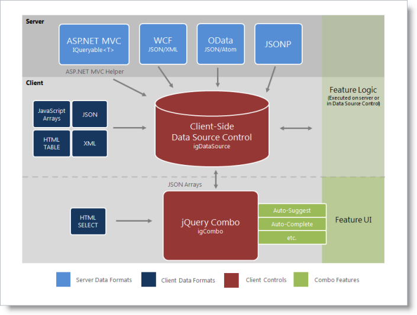
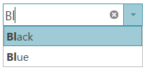

<!--
|metadata|
{
    "fileName": "igcombo-data-binding",
    "controlName": "igCombo",
    "tags": ["Data Binding"]
}
|metadata|
-->

# Binding igCombo to Data Overview


## Topic Overview


### Purpose


This topic discusses the different ways to data bind the `igCombo` control as well as other details related to data binding.

### In this topic


This topic contains the following sections:

-   [Binding igCombo Data – Conceptual Overview](#binding-to-data-sources)
-   Requirements for binding
-   Supported data sources
-   Binding to data sources overview
-   Class diagram for binding to data sources
-   [Binding igCombo Data – Procedure](#basicig-combo-data-binding)
-	[Demos](#demos)
	-	[JSON Binding](#json-binding)
	-	[HTML Binding](#html-binding)
	-	[XML Binding](#xml-binding)
-   [Related Topics](#related-topics)

### Required background


You need to first read the following topics:

-   [igCombo Overview](igCombo-Overview.html)
-   [Getting Started with igCombo](igCombo-Getting-Started.html)

## <a id="BindingtoDataSources"></a>Binding igCombo Data – Conceptual Overview


### Requirements for binding


The following  lists the requirements for binding the `igCombo` control to data sources grouped by requirement category.

***Data structure***

Can be any of the following:

-   Well-formed JSON or XML supplied locally or from a web server
-   JavaScript array or HTML TABLE element
-   SELECT element
-   OData services
-   JSONP
-   `IQueryable<T>` in ASP.NET MVC

***Data types***

-   String
-   Number
-   Boolean
-   Date

### Supported data sources


The following lists the supported data sources and some basic specifics for their binding

-	**igDataSource**: The `igDataSource` is used internally by the `igCombo` to manage data operations for the control. The data source accepts many different types of local and remote data.

-	**HTML SELECT element**: This element is specific to the `igCombo` control. You can point to this element in the jQuery selector for `igCombo` and it converts the SELECT element to the `igCombo` control automatically inheriting the options of the base element.

-	**`IQueryable<T>`**: In ASP.NET MVC, supply an `IQueryable<T>` as the igCombo’s datasource and the collection is serialized to JSON and returned with the View for use in the browser.

## <a id="binding-to-data-sources"></a>Binding to data sources to overview


In most cases, you will use the `dataSource` or `dataSourceUrl` options of the `igCombo` to bind to data. This option provides your data to the `igDataSource` which can handle the various supported data formats. The one main exception to using this option is when the `igCombo` is instantiated using a SELECT element. The `igCombo` will inherit the data and options of its base SELECT element in this case. In ASP.NET MVC, supplying an `IQueryable<T>` to the ASP.NET MVC Helper facilitates the serialization of the data from the server and passes it to the client with the View. Once the page is received by the browser, the `dataSource` option of the `igCombo` is set for client-side operation.

### Class diagram for binding to data sources


The following class diagram demonstrates how data binding works.



## <a id="basicig-combo-data-binding"></a>Binding igCombo Data – Procedure


### Introduction


The following steps demonstrate how to configure basic options and bind to data using both jQuery and the ASP.NET MVC Helper.

### Preview


Following is a preview of the final result.



### Requirements


To complete the procedure, you need the following:

-   A website and web page on which to add this example
-   The required JavaScript resources and jQuery themes in your website
-   References to the required JavaScript files and CSS files on your web page
-   (ASP.NET MVC) A reference to the `Infragistics.Web.Mvc.dll` assembly

### Overview


Following is a conceptual overview of the process:

**1. Instantiating the `igCombo`**

**2. Binding to data**

### Steps

1. **Instantiate the `igCombo`.**

	**a. Define a target element.**

	On your web page, define a target HTML element which will serve as the base object for the `igCombo` and set its ID. This is an optional step for ASP.NET MVC

	**In HTML:**

	```html
	<select id="comboTarget"></select>
	```

	**b. Instantiate the `igCombo`.**  In jQuery, you can use the document ready JavaScript event to instantiate the combo. In ASP.NET MVC, use the ASP.NET MVC helper to bind to an `IQueryable` datasource.

	**In HTML:**

	```html
	<script type="text/javascript">
	     $(function () {
	          $("#comboTarget").igCombo({

	          });
	      });
	</script>
	```

	**In ASPX:**

	```csharp
	<%= Html.
	    Infragistics().
	    Combo().
	    ID("comboTarget")
	%>
	```

2. **Bind to data.**

	**a. Define the data.**

	In jQuery, this example binds to a simple JSON array. This data could be passed as part of the page request or could be returned from a web service. In ASP.NET MVC, this example binds to a collection of Color objects defined in the controller class on the server and returned as the model with the View.

	**In HTML:**

	```html
	var colors = [
	     { "Name": "Black" },
	     { "Name": "Blue" },
	     { "Name": "Brown" },
	     { "Name": "Red" },
	     { "Name": "White" },
	     { "Name": "Yellow" }
	];
	```

	**In C#:**

	```csharp
	public class DefaultController : Controller
	{
	     public ActionResult Index()
	     {
	        List<Color> colors = new List<Color>();
	        colors.Add(Color.Black);
	        colors.Add(Color.Blue);
	        colors.Add(Color.Brown);
	        colors.Add(Color.Red);
	        colors.Add(Color.White);
	        colors.Add(Color.Yellow);

	        return View("default", colors.AsQueryable());
	     }
	}
	```

	**b. Set the data source.**

	Use the `dataSource` option to supply the data to the combo. In ASP.NET MVC, Use the DataSource method of the helper to bind to the data passed in as part of the Model.

	**In HTML:**

	```html
	$("#comboTarget").igCombo({
	    dataSource: colors});
	```

	**In ASPX:**

	```csharp
	<%= Html.
	    Infragistics().
	    Combo().
	    ID("comboTarget").
	    DataSource(this.Model as IQueryable<System.Drawing.Color>)
	%>
	```

	**c. Configure the text and value fields.**

	Set the `textKey` and `valueKey` options of the `igCombo`. In this simple example, the `textKey` and `valueKey` are both set to the same object value of ‘Name’. However, the `textKey` and `valueKey` could be set as two different fields. For instance, the `valueKey` could point to an ID field for each color object.

	**In HTML:**

	```html
	$("#comboTarget").igCombo({
	    dataSource: colors,    textKey: "Name",
	    valueKey: "Name",
	});
	```

	**In ASPX:**

	```csharp
	<%= Html.
	    Infragistics().
	    Combo().
	    ID("comboTarget").
	    TextKey("Name").
	    ValueKey("Name").
	    DataSource(this.Model as IQueryable<System.Drawing.Color>)
	%>
	```

	**d. (ASP.NET MVC) Call DataBind() and Render().**

	When instantiating the `igCombo` with the ASP.NET MVC Helper, call the DataBind method to bind to the data and call the Render method last after all other options have been configured. This is the method that renders the HTML and JavaScript necessary to instantiate the `igCombo` on the client

	**In ASPX:**

	```csharp
	<%= Html.
	    Infragistics().
	    Combo().
	    ID("comboTarget").
	    TextKey("Name").
	    ValueKey("Name").
	    DataSource(this.Model as IQueryable<System.Drawing.Color>).
	    DataBind().
	    Render() %>
	```

## <a id="demos"></a>Demos
Online Combo binding examples

### <a id="json-binding"></a>JSON Binding
The combo easily binds to a JavaScript array or JSON data. This sample contains a basic example of client-side binding.

<div class="embed-sample">
   [%%SamplesEmbedUrl%%/combo/json-binding](%%SamplesEmbedUrl%%/combo/json-binding)
</div>

### <a id="html-binding"></a>HTML Binding

igCombo can bind directly to an HTML SELECT element.

<div class="embed-sample">
   [%%SamplesEmbedUrl%%/combo/html-binding](%%SamplesEmbedUrl%%/combo/html-binding)
</div>

### <a id="xml-binding"></a>XML Binding
igCombo supports binding to XML data. This sample shows a basic example of binding to an XML string.

<div class="embed-sample">
   [%%SamplesEmbedUrl%%/combo/xml-binding](%%SamplesEmbedUrl%%/combo/xml-binding)
</div>

## <a id="related-topics"></a>Related Topics

Following are some other topics you may find useful.

-   [Binding igCombo to Data Overview](igCombo-Binding-to-Data.html)
-   [Binding Cascading igCombo Controls to Data](igCombo-Cascading.html)


