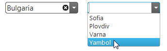

<!--
|metadata|
{
    "fileName": "igcombo-cascading",
    "controlName": "igCombo",
    "tags": ["Data Binding","Editing","How Do I"]
}
|metadata|
-->

# Creating Cascading igCombos


##Topic Overview


### Purpose

This topic explains how to implement igCombos in a cascading manner where the selection of one combo filters the data that is availble for selection in the next combo.

### Required background

The following topics are prerequisites to understanding this topic:


-	[igCombo Overview](igCombo-Overview.html): This topic provides an overview of the `igCombo` control including its features, binding to data sources, requirements, and templates.

-	[Binding igCombo to Data](igCombo-Data-Binding.html): This topic discusses the different ways to data bind the `igCombo` control, as well as some other details related to data binding.

-   [Configuring Selection](igCombo-Configure-Selection.html): This topic discusses how to implement selection, including information on how to handle selection events.

### In this topic

This topic contains the following sections:

-   [Creating Cascading Combos](#creating-cascading-combos)
  -   [Introduction](#introduction)
  -   [Preview](#preview)
  -   [Prerequisites](#prerequisites)
  -   [Steps](#steps)
  -   [Finished Example](#finished-example)
-   [Related Content](#related-content)

##<a id="creating-cascading-combos"></a>Creating Cascading Combos
### <a id="introduction"></a>Introduction

In this example two igCombos are created and bound to different data sources. Then, the selection of the first igCombo will filter the data that is available in the second igCombo.

### <a id="preview"></a>Preview

The following screenshot is a preview of the final result.



### <a id="prerequisites"></a>Prerequisites

To comple the procedure you need the following:

- A standard HTML page opened for editing. 

### <a id="steps"></a>Steps

The following steps demonstrate how to bind the parent and child `igCombo` controls to different data sources.

1. Add the HTML placeholders for parent and child `igCombo` controls.

	For this procedure, define the SPAN element to store the drop-downs. The HTML placeholder can be a DIV element, but in this procedure we use SPAN because we want the both combo boxes on the same row.
	
	**In HTML:**
	
	```html
	<span id="comboCountry"></span>
	<span id="comboDistrict"></span>
	```

2. Add the data source for the parent `igCombo` control.

	For this procedure, define the parent `igCombo` data source as an array of objects.
	
	**In JavaScript:**
	
	```js
	var dsCountry = [
	      { txtCountry: 'United States', valCountry: "US" },
	      { txtCountry: 'Bulgaria', valCountry: "BG" }
	];
	```

3. Add the parent `igCombo` control.

	Add the parent `igCombo` defining the required properties.
	
	**In JavaScript:**
	
	```js
	$("#comboCountry").igCombo({
	      textKey: "txtCountry",
	      valueKey: "valCountry",
	      dataSource: dsCountry
	});
	```

4. Add the data source for the child `igCombo` control.

	For this procedure, define the child `igCombo` data source as an array of objects. Note the additional key (`keyCountry`) holding the relation to the parent.
	
	**In JavaScript:**
	
	```js
	var dsCascDistrict = [
	      { keyCountry: "US", txtDistrict: "New Jersey", valDistrict: "NJ" },
	      { keyCountry: "US", txtDistrict: "California", valDistrict: "CA" },
	      { keyCountry: "US", txtDistrict: "Illinois", valDistrict: "IL" },
	      { keyCountry: "US", txtDistrict: "New York", valDistrict: "NY" },
	      { keyCountry: "US", txtDistrict: "Florida", valDistrict: "FL" },
	      { keyCountry: "BG", txtDistrict: "Sofia", valDistrict: "SA" },
	      { keyCountry: "BG", txtDistrict: "Plovdiv", valDistrict: "PV" },
	      { keyCountry: "BG", txtDistrict: "Varna", valDistrict: "V" },
	      { keyCountry: "BG", txtDistrict: "Yambol", valDistrict: "Y" }
	];
	```

5. Add the child `igCombo` control.

	Add the child `igCombo` control. Do not set the dataSource property yet.
	
	**In JavaScript:**
	
	```js
	$("#comboDistrict").igCombo({
	      valueKey: "valDistrict",
	      textKey: "txtDistrict"
	});
	```

6. Add the selectionChanged event handler to the parent `igCombo`. 

	Add the selectionChanged event handler to to parent `igCombo`. Create an empty array and then use the selected value of the parent `igCombo` to filter the data source for the child `igCombo`, storing the filtered results in the empty array.

	**In JavaScript:**

	```js
	selectionChanged: function (evt, ui) {
        var filteredCascDistrict = [];
        if (ui.items && ui.items[0]) {
            var itemData = ui.items[0].data;
            
            filteredCascDistrict = dsCascDistrict.filter(function (district) {
                return district.keyCountry == itemData.valCountry;
            });
        }
    }
    ```

7. Bind the child `igCombo`.

	In the parent `igCombo` selectionChanged event bind the child `igCombo` to the filtered data. Take note of the call to deselectAll here; this is needed to clear the previous selection of the child `igCombo`, if any, in the instance that the new filtered set of data does not contain the previous selected values.

	**In JavaScript:**
	```js
	var $comboDistrict = $("#comboDistrict");
    $comboDistrict.igCombo("deselectAll", {}, true);
    $comboDistrict.igCombo("option", "dataSource", filteredCascDistrict);
    $comboDistrict.igCombo("dataBind");
    ```

8. (Optional) Verify the result.

	Open the HTML page in your browser to view the result. If you have completed the procedure correctly, you will have two functional drop-downs aligned horizontally as shown in the [Preview](#preview).

### <a id="finished-example"></a>Finished Example

The following is the full code that was created for this sample to demonstrate what your page should look like when complete:

	**In HTML and JavaScript:**
	```html
	<span id="comboCountry"></span>
	<span id="comboDistrict"></span>

	<script>
		var dsCountry = [
			{ txtCountry: 'United States', valCountry: "US" },
			{ txtCountry: 'Bulgaria', valCountry: "BG" }
		];

		var dsCascDistrict = [
			{ keyCountry: "US", txtDistrict: "New Jersey", valDistrict: "NJ" },
			{ keyCountry: "US", txtDistrict: "California", valDistrict: "CA" },
			{ keyCountry: "US", txtDistrict: "Illinois", valDistrict: "IL" },
			{ keyCountry: "US", txtDistrict: "New York", valDistrict: "NY" },
			{ keyCountry: "US", txtDistrict: "Florida", valDistrict: "FL" },
			{ keyCountry: "BG", txtDistrict: "Sofia", valDistrict: "SA" },
			{ keyCountry: "BG", txtDistrict: "Plovdiv", valDistrict: "PV" },
			{ keyCountry: "BG", txtDistrict: "Varna", valDistrict: "V" },
			{ keyCountry: "BG", txtDistrict: "Yambol", valDistrict: "Y" }
		];

		$(function () {
			$("#comboCountry").igCombo({
				textKey: "txtCountry",
				valueKey: "valCountry",
				dataSource: dsCountry,
				selectionChanged: function (evt, ui) {
                    var filteredCascDistrict = [];
                    if (ui.items && ui.items[0]) {
                        var itemData = ui.items[0].data;
                        filteredCascDistrict = dsCascDistrict.filter(function (district) {
                            return district.keyCountry == itemData.valCountry;
                        });
                    }

                    var $comboDistrict = $("#comboDistrict");
                    $comboDistrict.igCombo("deselectAll", {}, true);
                    $comboDistrict.igCombo("option", "dataSource", filteredCascDistrict);
                    $comboDistrict.igCombo("dataBind");
                }
			});

			$("#comboDistrict").igCombo({
                valueKey: "valDistrict",
                textKey: "txtDistrict"
            });
		});
	</script>
	```

##<a id="related-content"></a>Related Content

### <a id="samples"></a> Samples

The following samples provide additional information related to this topic.

-	[Cascading Combo](%%SamplesUrl%%/combo/cascading-combos): This sample demonstrates three cascading `igCombo` controls.


 

 


