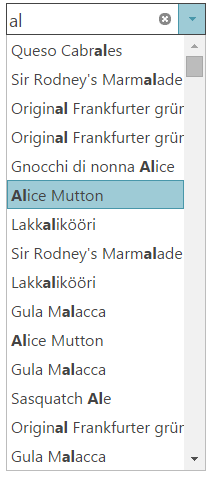
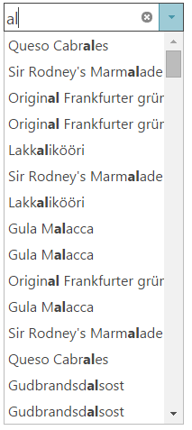
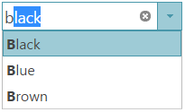

<!--
|metadata|
{
    "fileName": "igcombo-configure-auto-suggest",
    "controlName": "igCombo",
    "tags": ["Filtering"]
}
|metadata|
-->

# Configuring Auto-Suggest (igCombo)

##Topic Overview
###Purpose

This topic explains how to configure auto-suggest and different filtering options of the `igCombo`™ control.

###In this topic

This topic contains the following sections:

-   [igCombo Configuration Overview](#control_configuration_overview)
-   [Configure Auto-Suggest](#configure_auto_suggest)
    -   [Auto-Suggest details](#configure_auto_suggest_details)
    -   [Auto-Suggest property settings](#configure_auto_suggest_property_settings)
    -   [Example: auto-suggest with local filtering](#auto_suggest_example)
    -   [Example: case-sensitive auto-suggest with local filtering](#auto_suggest_case_sensitive_example)
    -   [Auto-suggest property reference](#auto_suggest_property_reference)
-   [Related Topics](#related_topics)

###Required background

The list below lists the background you need for fully understanding the information in this topic.

**Concepts**

You need to be familiar with the following concepts:

-   ASP.NET MVC Only
    -   [ASP.NET MVC Routing](http://www.asp.net/mvc/tutorials/older-versions/controllers-and-routing/asp-net-mvc-routing-overview-cs)

**Topics**

You need to first read the following topics:

-   [igCombo Overview](igCombo-Overview.html) 
-   [Adding igCombo](igCombo-Getting-Started.html)
-   [Binding igCombo to Data](igCombo-Binding-to-Data.html)

##igCombo Configuration Overview 

###Control configuration chart

The table below lists the configurable behaviors of the `igCombo` control.

###Auto-suggest

The auto-suggest feature is the combination of dropdown list filtering and match-highlighting to suggest possible choices to the user.The configuration properties are:

- [filteringType](%%jQueryApiUrl%%/ui.igCombo#options:filteringType)

- [highlightMatchesMode](%%jQueryApiUrl%%/ui.igCombo#options:highlightMatchesMode)

- [caseSensitive](%%jQueryApiUrl%%/ui.igCombo#options:caseSensitive)

- [filteringCondition](%%jQueryApiUrl%%/ui.igCombo#options:filteringCondition)

##Configure Auto-Suggest 

###Auto-Suggest details 

The `igCombo` auto-suggest feature is the combination of drop-down list filtering and match-highlighting to suggest possible choices to the user. Setting the filteringType to ‘local’ enables list filtering and setting highlightMatchesMode allows for matching text in the dropdown to be highlighted.

Whether the `igCombo` control is bound on the client or the server, filtering on the list is performed locally to reduce the amount of server requests for filtered data. Using the local filtering type requires all of the data for the `igCombo` control is provided to the client.

>**Note:** If the amount of choices is too large for a single request, consider using remote filtering.

Additionally, the filtering and highlighting behaviors can be customized to change which criterion triggers a match. The most common settings are listed in the property settings table. Conditions can customize filtering using the `filteringCondition` option and similar behavior can be customized for highlighting using the `highlightMatchesMode` option. Making filtering case sensitive is achieved by setting the `caseSensitive` option to true.

###Auto-Suggest property settings 

The following table maps the desired behaviors to property settings. The properties are accessed through the `igCombo` control’s options.

<table class="table">
	<thead>
		<tr>
			<th>In order to</th>
			<th>Use this property</th>
			<th>And set it to</th>
		</tr>
	</thead>
	<tbody>
		<tr>
			<td>Enable auto-suggest filtering</td>
			<td>[filteringType](%%jQueryApiUrl%%/ui.igCombo#options:filteringType)</td>
			<td>local</td>
		</tr>
		<tr>
			<td>Enable match highlighting for all instances within a single item</td>
			<td>[highlightMatchesMode](%%jQueryApiUrl%%/ui.igCombo#options:highlightMatchesMode)</td>
			<td>multi</td>
		</tr>
		<tr>
			<td>Configure the filtering to find only items that start with the entered text</td>
			<td>[filteringCondition](%%jQueryApiUrl%%/ui.igCombo#options:filteringCondition)</td>
			<td>startsWith</td>
		</tr>
		<tr>
			<td>Configure the filtering to find all items that contain the entered text</td>
			<td>[filteringCondition](%%jQueryApiUrl%%/ui.igCombo#options:filteringCondition)</td>
			<td>contains</td>
		</tr>
		<tr>
			<td>Configure match highlighting to match only items that start with the entered text</td>
			<td>[highlightMatchesMode](%%jQueryApiUrl%%/ui.igCombo#options:highlightMatchesMode)</td>
			<td>startsWith</td>
		</tr>
		<tr>
			<td>Configure match highlighting to match only one instance of the entered text within each item</td>
			<td>[highlightMatchesMode](%%jQueryApiUrl%%/ui.igCombo#options:highlightMatchesMode)</td>
			<td>contains</td>
		</tr>
		<tr>
			<td>Make filtering case sensitive</td>
			<td>[caseSensitive](%%jQueryApiUrl%%/ui.igCombo#options:caseSensitive)</td>
			<td>true</td>
		</tr>
		<tr>
			<td>Enable auto-complete</td>
			<td>[autoComplete](%%jQueryApiUrl%%/ui.igCombo#options:autoComplete)</td>
			<td>true</td>
		</tr>
	</tbody>
</table>

###Example: auto-suggest with local filtering 

The following settings demonstrate how to configure the auto-suggest behavior to match list values from local data.

<table class="table">
	<thead>
		<tr>
			<th>Property</th>
			<th>Setting</th>
			<th>Preview</th>
		</tr>
	</thead>
	<tbody>
		<tr>
			<td>[filteringType](%%jQueryApiUrl%%/ui.igCombo#options:filteringType)</td>
			<td>local</td>
			<td rowspan="4"></td>
		</tr>
		<tr>
			<td>[highlightMatchesMode](%%jQueryApiUrl%%/ui.igCombo#options:highlightMatchesMode)</td>
			<td>multi</td>
		</tr>
		<tr>
			<td>[filteringCondition](%%jQueryApiUrl%%/ui.igCombo#options:filteringCondition)</td>
			<td>contains</td>
		</tr>
	</tbody>
</table>

##Example: case-sensitive auto-suggest with local filtering

The following settings demonstrate how to configure the auto-suggest behavior to match list values from local data that match the exact case of the entered text.

<table class="table">
	<thead>
		<tr>
			<th>Property</th>
			<th>Setting</th>
			<th>Preview</th>
		</tr>
	</thead>
	<tbody>
		<tr>
			<td>[filteringType](%%jQueryApiUrl%%/ui.igCombo#options:filteringType)</td>
			<td>local</td>
			<td rowspan="4"></td>
		</tr>
		<tr>
			<td>[highlightMatchesMode](%%jQueryApiUrl%%/ui.igCombo#options:highlightMatchesMode)</td>
			<td>contains</td>
		</tr>
		<tr>
			<td>[filteringCondition](%%jQueryApiUrl%%/ui.igCombo#options:filteringCondition)</td>
			<td>contains</td>
		</tr>
		<tr>
			<td>[caseSensitive](%%jQueryApiUrl%%/ui.igCombo#options:caseSensitive)</td>
			<td>true</td>
		</tr>
	</tbody>
</table>

###Example: auto-suggest with auto-complete and local filtering

<table class="table">
	<thead>
		<tr>
			<th>Property</th>
			<th>Setting</th>
			<th>Preview</th>
		</tr>
	</thead>
	<tbody>
		<tr>
			<td>[filteringType](%%jQueryApiUrl%%/ui.igCombo#options:filteringType)</td>
			<td>local</td>
			<td rowspan="4"></td>
		</tr>
		<tr>
			<td>[highlightMatchesMode](%%jQueryApiUrl%%/ui.igCombo#options:highlightMatchesMode)</td>
			<td>startsWith</td>
		</tr>
		<tr>
			<td>[filteringCondition](%%jQueryApiUrl%%/ui.igCombo#options:filteringCondition)</td>
			<td>startsWith</td>
		</tr>
		<tr>
			<td>[autoComplete](%%jQueryApiUrl%%/ui.igCombo#options:autoComplete)</td>
			<td>true</td>
		</tr>
	</tbody>
</table>

###Auto-suggest property reference 

For detailed information about these properties, refer to their listing in the property reference section:

-   [igCombo Options](%%jQueryApiUrl%%/ui.igcombo#options)

###Related Topics 

Following are some other topics you may find useful.

-   [Configure Remote Filtering (igCombo) ](igCombo-Configure-Remote-Filtering.html) 

 

 

