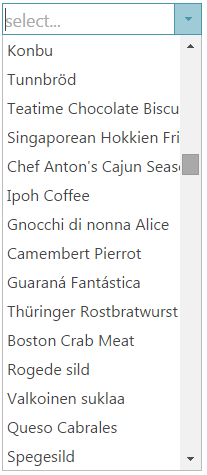

<!--
|metadata|
{
    "fileName": "igcombo-optimize-performance",
    "controlName": "igCombo",
    "tags": ["Performance","Virtualization"]
}
|metadata|
-->

# Optimizing Performance (igCombo)


##Topic Overview


###Purpose


This topic demonstrates how to enable item virtualization for maximum performance while scrolling the `igCombo`™ control.

###Required background


You need to first read the [igCombo Overview](igCombo-Overview.html) and [Adding igCombo](igCombo-Getting-Started.html) topic.

##Infragistics Combo Configuration Overview


###Control configuration 


Enable the `virtualization` option to make the igCombo’s dropdown scroll quickly even with large amounts of data.


###Virtualization details


The `virtualization` option enables the `igCombo` control to re-use HTML elements for each list item. The data is stored locally in a compact JSON format. When scrolling the igCombo’s dropdown, the HTML elements are re-used but different data is bound to the dropdown as the scrollbar’s position changes.



###Virtualization property settings


The table below maps the desired configurations to property settings. The properties are accessed through the `igCombo` control’s options.

<table class="table">
    <thead>
        <tr>
            <th>In order to…</th>

            <th>Use this property:</th>

            <th>And set it to…</th>
        </tr>
    </thead>
    <tbody>
        <tr>
            <td>Enable virtualization</td>

            <td>virtualization</td>

            <td>true</td>
        </tr>
    </tbody>
</table>


###Example: enabling virtualization


**In HTML:**

```html
$("#combo").igCombo({
    virtualization: true,
});
```

**In ASPX:**

```csharp
<%= Html.
    Infragistics().
    Combo().
    ID("combo").
    Virtualization(true).
    Render() %>
```

###Virtualization property reference


For detailed information about these properties, refer to their listing in the property reference section:

-	[igCombo Options](%%jQueryApiUrl%%/ui.igcombo#options)

##Related Topics


Following are some other topics you may find useful.

-	[Configuring igCombo](igCombo-Configuring.html)

 

 


