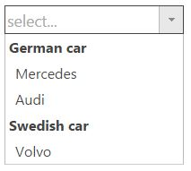

<!--
|metadata|
{
    "fileName": "igCombo-grouping",
    "controlName": "igCombo",
    "tags": ["Grouping", "How do I", "Unite", "Order"]
}
|metadata|
-->

# Configuring Grouping (igCombo)

Grouping functionality will allow you to unite items into groups by certain criteria or common category.

##Topic overview
### Purpose
This topic explains how to use grouping functionality, possible configuration and briefly explanation of the main `Grouping` widget properties.
### In this topic

This topic contains the following sections:

-   [Introduction](#introduction)
-   [Grouping overview](#groupingOverview)
-   [Related content](#relatedContent)

## <a id="introduction"></a> Introduction
The `igCombo` supports Grouping functionality that will enable the user to group together related items. This feature is included in version 15.2. The picture below demonstrate `igCombo` in which the items are grouped by car `type`  in ascending order.
> **Note:** By default the sort order is set to be `ascending` 



##<a id="groupingOverview"></a>Grouping overview
In order to enable combo `grouping` [`key`](%%jQueryApiUrl%%/ui.igcombo#options:grouping.key) property should be set. This property represents the `name of column` by which the records to be grouped. When combo is initialized all items will be grouped by that key in ascending order. `Sort direction` can be changed by using [`dir`](%%jQueryApiUrl%%/ui.igcombo#options:grouping.dir) property as swhown in the code snippet below:
**In JavaScript:**

```js

$(".selector").igCombo({
	dataSource: data,
	textKey: 'name',
	valueKey: 'id',
	closeDropDownOnBlur: false,
	grouping: {
		key: 'carType',
		dir: 'desc'
	}
});
```

**In ASPX:**

```csharp
@(Html.Infragistics().ComboFor(item => item.ID)
        .Width("400px")
        .DataSourceUrl(Url.Action("ComboDataLocation"))
        .ValueKey("ID")
        .TextKey("CarName")
        .CompactData(false)
        .Grouping(gr =>
        {
            gr.Key("Country");
            gr.Dir(ComboGroupingDirection.Desc);
        })
        .DataBind()
        .Render()
)
```

> **Note:** When Load On Demand and Grouping are used it is recommended all datasource items to be sorted by the key which is used for grouping.

##<a id="relatedContent"></a> Related content
###API help

-[Grouping api help](%%jQueryApiUrl%%/ui.igcombo#options:grouping)
### Samples
The following samples provide additional information related to this topic.
-[Grouping with header and footer templates](%%SamplesUrl%%/combo/grouping):This sample demonstrates how grouping can be used with Header and Footer templates efficiently.