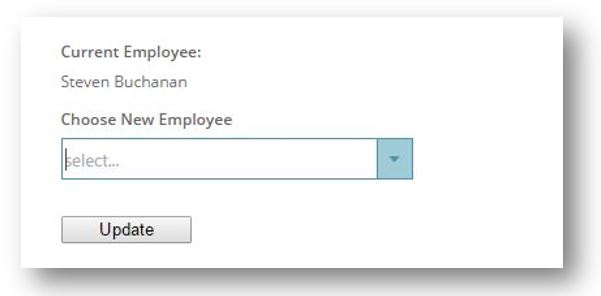
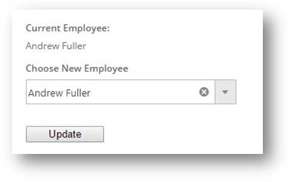

<!--
|metadata|
{
    "fileName": "configuring-asp.net-mvc",
    "controlName": [],
    "tags": []
}
|metadata|
-->

# Configuring ASP.NET MVC Combo

## Topic Overview
This topic shows how to use the igCombo in a basic ASP.NET MVC scenario.

### Purpose

The igCombo ASP.NET MVC helper is used to instantiate the combo in the View. In addition, the `ComboDataSourceAction` attribute is used to process the remote request for the collection of employees as well as process the remote filtering parameters. Finally, you can see how the combo is used in a form to update a field in the model.

#### Concepts

-   Using igCombo as ASP.NET MVC Helper


### In this topic

This topic contains the following sections:

-   [Preview](#_Preview)
-	[Requirements](#_Requirements)
-   [Overview](#_Requirements_Overview)
-   [Steps](#_Steps)
	-	[Create a Order class](#_create_order_class)
	-	[Add the Controller and View](#_add_controler_and_view)
	-	[Run the sample](#_run_the_sample)
-   [Related Content](#_Related_Content)


### <a id="_Preview"></a>Preview

The following screenshot is a preview of the final result.



### <a id="_Requirements"></a> Requirements

To complete the procedure, you need an ASP.NET MVC Project with the following:

-   The required Ignite UI JavaScript and CSS files
-   The Infragistics.Web.Mvc.dll assembly referenced

### <a id="_Requirements_Overview"></a> Overview

This topic takes you step-by-step toward creating a Model, View and Controller.

1.  Creating the `Order` class
2.  Creating the Controller and the View

### <a id="_Steps"></a>Steps

​<a id="_create_order_class"></a>Create an `Order` class

1. Add the `Order` class

	Add the `Order` class to your `Models` folder.

2. Create class members

	Open the `Order.cs` file and add the following members to the class:

	**In C#:**

	```csharp
	public class Order
    {
        public int OrderID { get; set; }
        public string CustomerID { get; set; }
        public Nullable<int> EmployeeID { get; set; }
        public Nullable<System.DateTime> OrderDate { get; set; }
        public Nullable<System.DateTime> RequiredDate { get; set; }
        public Nullable<System.DateTime> ShippedDate { get; set; }
        public Nullable<int> ShipVia { get; set; }
        public Nullable<decimal> Freight { get; set; }
        public string ShipName { get; set; }
        public string ShipAddress { get; set; }
        public string ShipCity { get; set; }
        public string ShipRegion { get; set; }
        public string ShipPostalCode { get; set; }
        public string ShipCountry { get; set; }
        public string ContactName { get; set; }
        public string EmployeeName { get; set; }
        public int ShipperID { get; set; }
        public string ShipperName { get; set; }
        public decimal TotalPrice { get; set; }
        public int TotalItems { get; set; }
    }
	```

​<a id="_add_controler_and_view"></a>Add the Controller and the View

1. Create a `ComboController`

	Create a new controller in the `Controllers` folder of your ASP.NET MVC application named `ComboController.cs`

2. Create the Action methods

	Add two Action methods to the Controller for the purposes of creating an `Order`.

	**In C#:**

	```csharp
	public class ComboController : Controller
    {
        //
        // GET: /Combo/

        [ComboDataSourceAction]
        [ActionName("employee-combo-data")]
        public ActionResult ComboData()
        {
            IEnumerable<Employee> employees = RepositoryFactory.GetEmployeeRepository().Get();
            return View(employees);
        }

        [ActionName("aspnet-mvc-helper")]
        public ActionResult UsingAspNetMvcHelper()
        {
            Order order = RepositoryFactory.GetOrderRepository().Get().First();
            return View("aspnet-mvc-helper", order);
        }

        [HttpPost]
        [ActionName("aspnet-mvc-helper")]
        public ActionResult UsingAspNetMvcHelper(Order updatedOrder)
        {
            ItemRepository<Order> orderRepository = RepositoryFactory.GetOrderRepository();
            ItemRepository<Employee> employeeRepository = RepositoryFactory.GetEmployeeRepository();

            Order existingOrder = orderRepository.Get(o => o.OrderID == updatedOrder.OrderID);
            Employee newEmployee = employeeRepository.Get(e => e.ID == updatedOrder.EmployeeID);

            if (existingOrder != null && newEmployee != null)
            {
                existingOrder.EmployeeID = newEmployee.ID;
                existingOrder.EmployeeName = newEmployee.Name;

                orderRepository.Update(existingOrder, o => o.OrderID == existingOrder.OrderID);
                orderRepository.Save();
            }

            return View("aspnet-mvc-helper", existingOrder);
        }

    }
	```
3. Create the View

	Create a strongly-typed View and use the `Order` class as the Model.

	**In ASPX:**

	```csharp
	@using Infragistics.Web.Mvc
	@using IgniteUI.SamplesBrowser.Models
	@model IgniteUI.SamplesBrowser.Models.Northwind.Order
	```

4. Add the JavaScript and CSS references.

	In this example, use the combined JavaScript and CSS files referenced locally in the ASP.NET MVC application.

	**In ASPX:**

	```csharp
	<link href="/Content/css/themes/infragistics/infragistics.theme.css" rel="stylesheet" type="text/css" />
	<link href="/Content/css/structure/infragistics.css" rel="stylesheet" type="text/css" />
	<script src="/Scripts/jquery.js" type="text/javascript"></script>
	<script src="/Scripts/jquery-ui.js" type="text/javascript"></script>
	<script src="/Scripts/js/infragistics.core.js" type="text/javascript"></script>
	<script src="/Scripts/js/infragistics.lob.js" type="text/javascript"></script>

	...

	<style>

        .sample-ui div {
            margin-bottom: 1em;
        }

        .sample-ui h4 {
            margin-bottom: .5em;
        }

        .sample-ui #submitBtn {
            width: 100px;
        }

    </style>
	```

5. Create a form for the `Order` object.

	**In ASPX:**

	```csharp
	@using (Html.BeginForm())
    {
        <div class="sample-ui">
            @Html.HiddenFor(item => item.OrderID)

            <div>
                <h4>Current Employee:</h4>
                @Html.DisplayFor(item => item.EmployeeName)
            </div>

            <div>
                <h4>Choose New Employee</h4>

                @(Html.Infragistics().ComboFor(item => item.EmployeeID)
                    .Width("270px")
                    .DataSource(Url.Action("employee-combo-data"))
                    .ValueKey("ID")
                    .TextKey("Name")
                    .DataBind()
                    .Render()
                )
            </div>

            <input id="submitBtn" type="submit" value="Update" />
        </div>
    }
    ```

​<a id="_run_the_sample"></a>Run the sample.


Run the sample and select an item from the dropdown. After that click on "Update" button in order to update the current employee value.



### <a id="_Related_Content"></a>Related Content

-	[Binding igCombo to Data Overview](igCombo-Data-Binding.html): This topic discusses the different ways to data bind the `igCombo` control as well as other details related to data binding.
