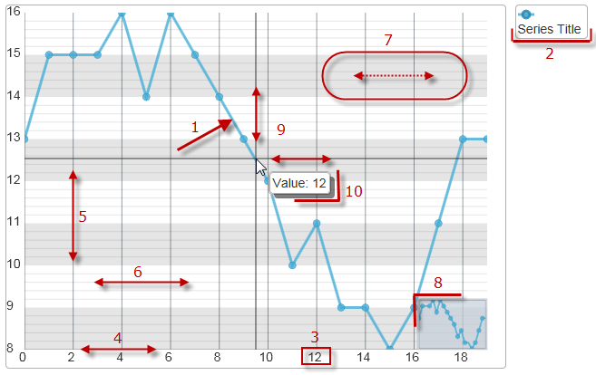

<!--
|metadata|
{
    "fileName": "igdatachart-visual-elements",
    "controlName": "igDataChart",
    "tags": ["Charting","Getting Started"]
}
|metadata|
-->

# Configurable Visual Elements (igDataChart)

##Topic Overview

### Purpose

This topic lists all configurable visual elements of the `igDataChart`™ control and the properties that manage them.

### Required Background

The following topics are prerequisite to understanding this topic:

-	[igDataChart Overview](igDataChart-Overview.html)

This topic provides conceptual information about the `igDataChart` control including its main features, minimum requirements for using charts and user functionality.

Configurable Visual Elements of the `igDataChart` Control and Related Properties

### Configurable visual elements summary

The following picture demonstrates the configurable visual elements of the `igDataChart` control. A listing of the properties that manage them is available in the [Configurable visual elements and related properties](#configuring-visual-elements-properties) block below.

**Configurable Visual Elements:**

​1) Data series

​2) Legend

​3) Axis label

​4) Axis line

​5) Axis major line

​6) Axis minor line

​7) Axis strip

​8) Overview plus detail panel

​9) Cross-hairs and cross-hair point

​10) Tooltip

### Configurable visual elements and related properties

The following table maps the visual elements of the `igDataChart` control and the properties that configure them.

<table class="table table-striped">
	<thead>
		<tr>
            <th colspan="">
Visual Element
			</th>
            <th>
Property
			</th>
        </tr>
	</thead>
	<tbody>
        <tr>
            <td>
Data Series
			</td>
            <td>
[series[]](%%jQueryApiUrl%%/ui.igDataChart#options:series)
			</td>
        </tr>
        <tr>
            <td>
Legend
			</td>
            <td>
[series["key"].legend](%%jQueryApiUrl%%/ui.igDataChart#options:series.legend)
			</td>
        </tr>
        <tr>
            <td>
Axis Labels
			</td>
            <td>
[axes["key"].labelVisibility](%%jQueryApiUrl%%/ui.igDataChart#options:axes.labelVisibility)
                 
[axes["key"].labelLocation](%%jQueryApiUrl%%/ui.igDataChart#options:axes.labelLocation)
                 
[axes["key"].labelExtent](%%jQueryApiUrl%%/ui.igDataChart#options:axes.labelExtent)
                 
[axes["key"].labelHorizontalAlignment](%%jQueryApiUrl%%/ui.igDataChart#options.labelHorizontalAlignment)
                 
[axes["key"].labelVerticalAlignment](%%jQueryApiUrl%%/ui.igDataChart#options:axes.labelVerticalAlignment)
                 
[axes["key"].labelTopMargin](%%jQueryApiUrl%%/ui.igDataChart#options:axes.labelTopMargin)
                 
[axes["key"].labelRightMargin](%%jQueryApiUrl%%/ui.igDataChart#options:axes.labelRightMargin)
                 
[axes["key"].labelBottomMargin](%%jQueryApiUrl%%/ui.igDataChart#options:axes.labelBottomMargin)
                 
[axes["key"].labelLeftMargin](%%jQueryApiUrl%%/ui.igDataChart#options:axes.labelLeftMargin)
			</td>
        </tr>
        <tr>
            <td>
Axis Lines
			</td>
            <td>
[axes["key"].stroke](%%jQueryApiUrl%%/ui.igDataChart#options:axes.stroke)
			</td>
        </tr>
        <tr>
            <td>
Axis Major Lines
			</td>
            <td>
[axes["key"].majorStroke](%%jQueryApiUrl%%/ui.igDataChart#options:axes.majorStroke)
			</td>
        </tr>
        <tr>
            <td>
Axis Minor Lines
			</td>
            <td>
[axes["key"].minorStroke](%%jQueryApiUrl%%/ui.igDataChart#options:axes.minorStroke)
			</td>
        </tr>
        <tr>
            <td>
Axis Stripes
			</td>
            <td>
[axes["key"].strip](%%jQueryApiUrl%%/ui.igDataChart#options:axes.strip)
			</td>
        </tr>
        <tr>
            <td>
Axis Ticks
			</td>
            <td>
[axes["key"].tickLength](%%jQueryApiUrl%%/ui.igDataChart#options:axes.tickLength)
                 
[axes["key"].tickStroke](%%jQueryApiUrl%%/ui.igDataChart#options:axes.tickStroke)
                 
[axes["key"].tickStrokeThickness](%%jQueryApiUrl%%/ui.igDataChart#options:axes.tickStrokeThickness)
                 
[axes["key"].tickStrokeDashArray](%%jQueryApiUrl%%/ui.igDataChart#options:axes.tickStrokeDashArray)
			</td>
        </tr>
        <tr>
            <td>
Overview Plus Detail window
			</td>
            <td>
[overviewPlusDetailPaneVisibility](%%jQueryApiUrl%%/ui.igDataChart#options:overviewPlusDetailPaneVisibility)
			</td>
        </tr>
        <tr>
            <td>
Cross-hairs
			</td>
            <td>
[crosshairVisibility](%%jQueryApiUrl%%/ui.igDataChart#options:crosshairVisibility)
                 
[crosshairPoint](%%jQueryApiUrl%%/ui.igDataChart#options:crosshairPoint)
			</td>
        </tr>
        <tr>
            <td>
Tooltip
			</td>

            <td>
[series["key"].showTooltip](%%jQueryApiUrl%%/ui.igDataChart#options:series.showTooltip)
                 
[series["key"].tooltipTemplate](%%jQueryApiUrl%%/ui.igDataChart#options:series.tooltipTemplate)
			</td>
        </tr>
    </tbody>
</table>

###  Samples

This sample configures several of the elements, available in the `igDataChart` control.
Chart elements such as axis, labels, grid lines, grid stripes, zoom bars, series, trend lines, indicators and crosshairs are all available to enhance the control's presentation.

   [Chart Elements](%%SamplesEmbedUrl%%/data-chart/chart-elements)

In addition to the settings above, the sample below demonstrates both enabling the default tooltip for the Chart’s series and configuring a custom tooltip template for the "United States" series.

   [Series Tooltips](%%SamplesEmbedUrl%%/data-chart/series-tooltips)

##Related Content

### Topics

The following topics provide additional information related to this topic.

-	[Adding igDataChart](igDataChart-Adding.html): This topic demonstrates how to create add the `igDataChart`™ control and bind it to data.

-	[jQuery and ASP.NET MVC Helper API Reference Links (igDataChart)](igDataChart-API-Links.html): This topic provides links to the API documentation for jQuery and ASP.NET MVC helper class for `igDataChart`™ control.

 

 

