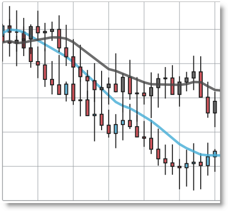
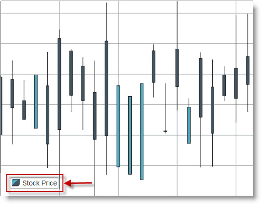
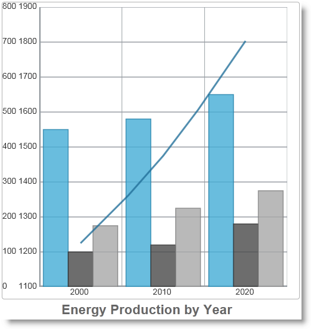
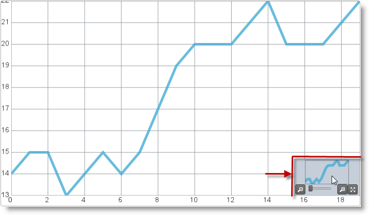
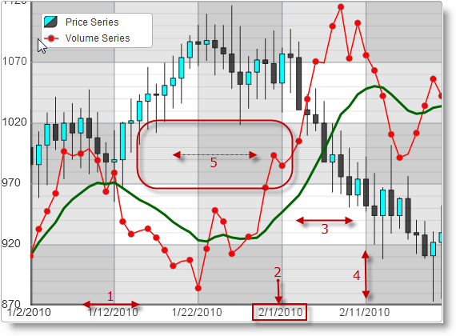
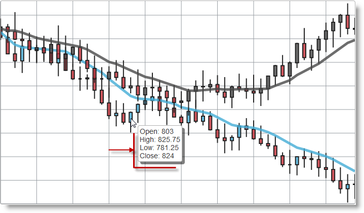
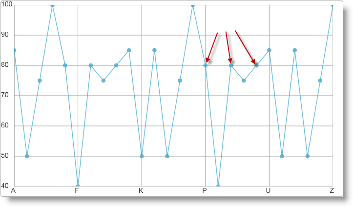
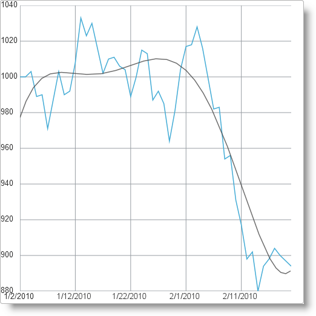

<!--
|metadata|
{
    "fileName": "igdatachart-overview",
    "controlName": "igDataChart",
    "tags": ["Charting","Data Presentation","Getting Started"]
}
|metadata|
-->

# Overview (igDataChart)

### Purpose

This topic provides conceptual information about the `igDataChart`™ control including its main features, minimum requirements for using charts and user functionality.

### Required Background

The following table lists the materials required as a prerequisite to understanding this topic.

**Concepts**

-   Charting
-   Chart types
-   Data visualization

**Topics**

-	[Ignite UI Overview](NetAdvantage-for-jQuery-Overview.html)

General information on the Ignite UI™ library.

### In This Topic

This topic contains the following sections:

-   [Introduction](#introduction)
-   [Supported Chart Types](#supported-chart-types)
-   [Minimum Requirements](#min-requirements)
-   [Main Features](#main-features)
   -   [Features Overview](#features-overview)
    -   [Legend](#legend)
    -   [Composite charts](#composite-charts)
    -   [Navigation](#navigation)
    -   [Axes](#axis-options)
    -   [Tooltips](#tooltips)
    -   [Cross-hairs](#crosshairs)
    -   [Markers](#markers)
    -   [Trend Lines](#trend-lines)
-   [User Interaction and Usability](#user-interaction)
-   [Related Content](#related-content)
   -   [Topics](#topics)
    -   [Samples](#samples)

##Introduction

### Introduction to the igDataChart

The igDataChart is a charting control for rendering various kinds of charts into HTML5 Web applications and sites. It uses the new Canvas tag in HTML5 to plot data series on web pages.

The `igDataChart` control allows many different series types to be rendered like bar/column, financial, category (line, spline, are, etc.), polar, radial, scatter (scatter and scatter line) and others. A chart can be configured with one or more legends which mark the meaning of each data series. In addition other visual and user interaction elements can be configured like cross-hairs, the overview plus detail (OPD) panel, axis major/minor lines, axis range and others. For details see the [Main Features](#main-features) section.

##Supported Chart Types

### Supported chart types summary

The `igDataChart` control allows for a variety of series types to be implemented for different visualization purposes.

See the [Supported chart types table](#supported-chart-types) block for detailed information on supported series types and basic configuration information.

>**Note:** Pie charts are created using a separate control, `igPieChart`™. For details, see [igPieChart Overview](igPieChart-Overview.html).

### Supported chart types table

The following table displays the supported chart types.

<table class="table">
	<thead>
		<tr>
            <th>
Chart type
			</th>
            <th>
Series type
			</th>
            <th>
Description
			</th>
            <th>
Series.type property setting
			</th>
            <th>
Data binding properties
			</th>
        </tr>
	</thead>
	<tbody>
        <tr>
            <td>
Bar and Column
			</td>
            <td>
Bar
			</td>
            <td>
Visualizes categorized data with horizontal bars.
			</td>
            <td>
bar
			</td>
            <td>
[valueMemberPath](%%jQueryApiUrl%%/ui.igDataChart#options:valueMemberPath)
			</td>
        </tr>
        <tr>
            <td>

			</td>
            <td>
Column
			</td>
            <td>
Visualizes categorized data with vertical columns.
			</td>
            <td>
column
			</td>
            <td>
[valueMemberPath](%%jQueryApiUrl%%/ui.igDataChart#options:valueMemberPath)
			</td>
        </tr>
        <tr>
            <td>
Category
			</td>
            <td>
Line
			</td>
            <td>
Visualizes categorized data with a line with sharp edges on data points.
			</td>
            <td>
line
			</td>
            <td>
[valueMemberPath](%%jQueryApiUrl%%/ui.igDataChart#options:valueMemberPath)
			</td>
        </tr>
        <tr>
            <td>

			</td>
            <td>
Area
			</td>
            <td>
Visualizes categorized data with colored area below a line with sharp edges on data points.
			</td>
            <td>
area
			</td>
            <td>
[valueMemberPath](%%jQueryApiUrl%%/ui.igDataChart#options:valueMemberPath)
			</td>
        </tr>
        <tr>
            <td>

			</td>
            <td>
Spline
			</td>
            <td>
Visualizes categorized data with a line with smooth edges on data points.
			</td>
            <td>
spline
			</td>
            <td>
[valueMemberPath](%%jQueryApiUrl%%/ui.igDataChart#options:valueMemberPath)
			</td>
        </tr>
        <tr>
            <td>

			</td>
            <td>
Spline Area
			</td>
            <td>
Visualizes categorized data with colored area below a line with smooth edges on data points.
			</td>
            <td>
splineArea
			</td>
            <td>
[valueMemberPath](%%jQueryApiUrl%%/ui.igDataChart#options:valueMemberPath)
			</td>
        </tr>
        <tr>
            <td>

			</td>
            <td>
Waterfall
			</td>
            <td>
Visualizes categorized data with vertical columns where the first column for the first category starts from the x-axis and each next category starts where the previous one ends.
			</td>
            <td>
waterfall
			</td>
            <td>
[valueMemberPath](%%jQueryApiUrl%%/ui.igDataChart#options:valueMemberPath)
			</td>
        </tr>
        <tr>
            <td>
Financial
			</td>
            <td>
Candlestick
			</td>
            <td>
Displays opening, closing, highest and lowest value of a financial (investment) instrument in the form of a candlestick.
			</td>
            <td>
candlestick
			</td>
            <td>
                <ul>
                    <li>
[openMemberPath](%%jQueryApiUrl%%/ui.igDataChart#options:openMemberPath)
					</li>

                    <li>
[closeMemberPath](%%jQueryApiUrl%%/ui.igDataChart#options:closeMemberPath)
					</li>

                    <li>
[highMemberPath](%%jQueryApiUrl%%/ui.igDataChart#options:highMemberPath)
					</li>

                    <li>
[lowMemberPath](%%jQueryApiUrl%%/ui.igDataChart#options:lowMemberPath)
					</li>
                </ul>
            </td>
        </tr>
        <tr>
            <td>

			</td>
            <td>
OHLC
			</td>
            <td>
Abbreviation for Open, High, Low, Close. Displays opening, closing, highest and lowest value of a financial (investment) instrument in the form of vertical lines with markings for opening and closing values.
			</td>
            <td>
ohlc
			</td>
            <td>
                <ul>
                    <li>
[openMemberPath](%%jQueryApiUrl%%/ui.igDataChart#options:openMemberPath)
					</li>

                    <li>
[closeMemberPath](%%jQueryApiUrl%%/ui.igDataChart#options:closeMemberPath)
					</li>

                    <li>
[highMemberPath](%%jQueryApiUrl%%/ui.igDataChart#options:highMemberPath)
					</li>

                    <li>
[lowMemberPath](%%jQueryApiUrl%%/ui.igDataChart#options:lowMemberPath)
					</li>
                </ul>
            </td>
        </tr>
        <tr>
            <td>
Polar
			</td>
            <td>
Polar Scatter
			</td>
            <td>
Visualizes data with dots (or other types of markers) in a polar coordinate system.
			</td>
            <td>
polarScatter
			</td>
            <td>
                <ul>
                    <li>
[angleMemberPath](%%jQueryApiUrl%%/ui.igDataChart#options:angleMemberPath)
					</li>

                    <li>
[radiusMemberPath](%%jQueryApiUrl%%/ui.igDataChart#options:radiusMemberPath)
					</li>
                </ul>
            </td>
        </tr>
        <tr>
            <td>

			</td>
            <td>
Polar Line
			</td>
            <td>
Visualizes data with a line with sharp edges on data points in a polar coordinate system.
			</td>
            <td>
polarLine
			</td>
            <td>
                <ul>
                    <li>
[angleMemberPath](%%jQueryApiUrl%%/ui.igDataChart#options:angleMemberPath)
					</li>

                    <li>
[radiusMemberPath](%%jQueryApiUrl%%/ui.igDataChart#options:radiusMemberPath)
					</li>
                </ul>
            </td>
        </tr>
        <tr>
            <td>

			</td>
            <td>
Polar Area
			</td>
            <td>
Visualizes data with colored area below a line with sharp edges on data points in a polar coordinate system.
			</td>
            <td>
polarArea
			</td>
            <td>
                <ul>
                    <li>
[angleMemberPath](%%jQueryApiUrl%%/ui.igDataChart#options:angleMemberPath)
					</li>

                    <li>
[radiusMemberPath](%%jQueryApiUrl%%/ui.igDataChart#options:radiusMemberPath)
					</li>
                </ul>
            </td>
        </tr>
        <tr>
            <td>
Radial
			</td>
            <td>
Radial Line
			</td>
            <td>
Visualizes categorized data with a line with sharp edges on data points with all categories distributed in a circle.
			</td>
            <td>
radialLine
			</td>
            <td>
[valueMemberPath](%%jQueryApiUrl%%/ui.igDataChart#options:valueMemberPath)
			</td>
        </tr>
        <tr>
            <td>

			</td>
            <td>
Radial Column
			</td>
            <td>
Visualizes categorized data with columns starting from a common center and turned on different angles.
			</td>
            <td>
radialColumn
			</td>
            <td>
[valueMemberPath](%%jQueryApiUrl%%/ui.igDataChart#options:valueMemberPath)
			</td>
        </tr>
        <tr>
            <td>

			</td>
            <td>
Radial Pie
			</td>
            <td>
Visualizes categorized data with pie-slice shaped elements starting from a common center and turned on different angles.
			</td>
            <td>
radialPie
			</td>
            <td>
[valueMemberPath](%%jQueryApiUrl%%/ui.igDataChart#options:valueMemberPath)
			</td>
        </tr>
        <tr>
            <td>
Range Category
			</td>
            <td>
Range Area
			</td>
            <td>
Visualizes categorized data in ranges between two values with colored area between two lines with sharp edges on data points.
			</td>
            <td>
rangeArea
			</td>
            <td>
                <ul>
                    <li>
[lowMemberPath](%%jQueryApiUrl%%/ui.igDataChart#options:lowMemberPath)
					</li>

                    <li>
[highMemberPath](%%jQueryApiUrl%%/ui.igDataChart#options:highMemberPath)
					</li>
                </ul>
            </td>
        </tr>
        <tr>
            <td>

			</td>
            <td>
Range Column
			</td>
            <td>
Visualizes categorized data in ranges between two values with columns.
			</td>
            <td>
rangeColumn
			</td>
            <td>
                <ul>
                    <li>
[lowMemberPath](%%jQueryApiUrl%%/ui.igDataChart#options:lowMemberPath)
					</li>

                    <li>
[highMemberPath](%%jQueryApiUrl%%/ui.igDataChart#options:highMemberPath)
					</li>
                </ul>
            </td>
        </tr>
        <tr>
            <td>
Bubble
			</td>
            <td>
Bubble
			</td>
            <td>
Visualizes data described by multiple parameters with colored circles with different diameter.
			</td>
            <td>
bubble
			</td>
            <td>
                <ul>
                    <li>
[xMemberPath](%%jQueryApiUrl%%/ui.igDataChart#options:xMemberPath)
					</li>

                    <li>
[yMemberPath](%%jQueryApiUrl%%/ui.igDataChart#options:yMemberPath)
					</li>

                    <li>
[radiusMemberPath](%%jQueryApiUrl%%/ui.igDataChart#options:radiusMemberPath)
					</li>

                    <li>
[fillMemberPath](%%jQueryApiUrl%%/ui.igDataChart#options:fillMemberPath)
					</li>

                    <li>
[labelMemberPath](%%jQueryApiUrl%%/ui.igDataChart#options:labelMemberPath)
					</li>
                </ul>
            </td>
        </tr>
        <tr>
            <td>
Scatter
			</td>
            <td>
Scatter
			</td>
            <td>
Visualizes data with dots in Cartesian coordinate system.
			</td>
            <td>
scatter
			</td>
            <td>
                <ul>
                    <li>
[xMemberPath](%%jQueryApiUrl%%/ui.igDataChart#options:xMemberPath)
					</li>

                    <li>
[yMemberPath](%%jQueryApiUrl%%/ui.igDataChart#options:yMemberPath)
					</li>
                </ul>
            </td>
        </tr>
        <tr>
            <td>

			</td>
            <td>
Scatter Line
			</td>
            <td>
Visualizes data with a line with sharp edges on data points in Cartesian coordinate system.
			</td>
            <td>
scatterLine
			</td>
            <td>
                <ul>
                    <li>
[xMemberPath](%%jQueryApiUrl%%/ui.igDataChart#options:yMemberPath)
					</li>

                    <li>
[yMemberPath](%%jQueryApiUrl%%/ui.igDataChart#options:yMemberPath)
					</li>
                </ul>
            </td>
        </tr>
    </tbody>
</table>

##Minimum Requirements

### Minimum requirements summary

The `igDataChart` control is a jQuery UI widget and therefore depends on the jQuery and jQuery UI libraries. The Modernzr library is also used internally for detecting browser and device capabilities. The control uses several Ignite UI™ shared resources for functionality and data binding. References to these resources are needed nevertheless, in spite of pure jQuery or ASP.NET MVC helpers being used. The `Infragistics.Web.Mvc` assembly is required when the control is used in the context of ASP.NET MVC.

### Minimum requirements summary chart

The following table summarizes the requirements for using the `igDataChart` control.

<table class="table table-bordered">
	<thead>
		<tr>
            <th>
Requirement
			</th>

            <th>
Description
			</th>
        </tr>
	</thead>
	<tbody>
        

        <tr>
            <td>
HTML5 canvas API
			</td>

            <td>
The functionality of the charting library is based on the HTML5 Canvas tag and its related API. Any web browser that supports these will be able to render and display charts generated by the igDataChart control. No other HTML5 features are required for the operation of the igDataChart control. The topic [Canvas Element: Support](http://en.wikipedia.org/wiki/Canvas_element#Support) from [Wikipedia™](http://en.wikipedia.org/wiki/Main_Page) details which versions of the most popular desktop and mobile web browsers support the HTML5 Canvas API.
			</td>
		</tr>

		<tr>
			<td>
jQuery and jQuery UI JavaScript resources
			</td>

			<td>
				Ignite UI is built on top of these frameworks:

				<ul>
					<li>
[jQuery](http://docs.jquery.com/Main_Page)
					</li>

					<li>
[jQuery UI](http://jqueryui.com/)
					</li>
				</ul>
			</td>
		</tr>

		<tr>
			<td>
Modernizr
			</td>

			<td>
				The Modernizr library is used by the igDataChart to detect browser and device capabilities. It is not mandatory and if not included the control will behave as if it works in a normal desktop environment with HTML5 compatible browser.

				<ul>
					<li>
[Modernizr](http://modernizr.com/docs/)
					</li>
				</ul>
			</td>
		</tr>

		<tr>
			<td>
General charting JavaScript resources
			</td>

			<td>
				The charting functionality of the Ignite UI library is distributed across several files depending on the series type.

				In case you wish to include resources manually, you need to use the dependencies listed in the following tables.

				<table class="table table-bordered">
	<thead>
		<tr>
							<th>
JS Resource
			</th>

							<th>
Description
			</th>
						</tr>
	</thead>
	<tbody>
						

						<tr>
							<td>
infragistics.util.js
			</td>

							<td>
Ignite UI utilities
			</td>
						</tr>

						<tr>
							<td>
infragistics.datasource.js
			</td>

							<td>
The igDataSource control.
			</td>
						</tr>

						<tr>
							<td>
infragistics.ext_core.js 
infragistics.ext_collections.js 
infragistics.ext_ui.js 
infragistics.dv_core.js 
infragistics.dv_geometry.js 
infragistics.datachart_core.js
							</td>

							<td>
								Data visualization core functionality
							</td>
						</tr>

						<tr>
							<td>
infragistics.dvcommonwidget.js
			</td>

							<td>
Chart and map common widget
			</td>
						</tr>

						<tr>
							<td>
infragistics.ui.chart.js
			</td>

							<td>
Chart UI widget
			</td>
						</tr>

						<tr>
							<td>
infragistics.legend.js 
infragistics.ui.chartlegend.js
			</td>

							<td>
Chart legend functionality and UI widget
			</td>
						</tr>

						<tr>
							<td>
infragistics.dv_opd.js
			</td>

							<td>
Chart Overview Plus Detail Pane functionality
			</td>
						</tr>
					</tbody>
</table>
			</td>
		</tr>

		<tr>
			<td>
Chart-type-specific JavaScript resources
			</td>

			<td>
				In addition to the general charting resources listed above, you need to include references related to the respective chart type in use.

<table class="table table-bordered">
	<thead>
		<tr>
			<th>
				Chart Series Type
			</th>
			<th>
				JS Resource
			</th>
		</tr>
	</thead>
	<tbody>
		<tr>
			<td>
				Common category functionality
			</td>
			<td>
				infragistics.datachart_categorycore.js
			</td>
		</tr>

		<tr>
			<td>
				Area, Column, Line, all Spline charts, Waterfall
			</td>
			<td>
				infragistics.datachart_category.js
			</td>
		</tr>

		<tr>
			<td>
				Bar
			</td>
			<td>
				infragistics.datachart_verticalcategory.js
			</td>
		</tr>

		<tr>
			<td>
				Financial, Typical Price Indicator
			</td>
			<td>
				infragistics.datachart_financial.js 
				infragistics.datachart_extendedfinancial.js
			</td>
		</tr>

		<tr>
			<td>
				Polar Area, Polar Line, all Polar charts
			</td>
			<td>
				infragistics.datachart_polar.js (dendends on: infragistics.datachart_extendedaxes.js)
			</td>
		</tr>

		<tr>
			<td>
				all Radial charts
			</td>
			<td>
				infragistics.datachart_radial.js (dendends on: infragistics.datachart_extendedaxes.js)
			</td>
		</tr>

		<tr>
			<td>
				all Range charts
			</td>
			<td>
				infragistics.datachart_rangecategory.js
			</td>
		</tr>

		<tr>
			<td>
				all Scatter charts
			</td>
			<td>
				infragistics.datachart_scatter.js
			</td>
		</tr>
	
		<tr>
			<td>
				all Stacked charts
			</td>
			<td>
				infragistics.datachart_stacked.js (dendends on: infragistics.datachart_verticalcategory.js, infragistics.datachart_extendedaxes.js)
			</td>
		</tr>
	
		<tr>
			<td>
				Tooltips, highlights, and other annotations
			</td>
			<td>
				infragistics.datachart_annotation.js
			</td>
		</tr>
	
		<tr>
			<td>
				DateTime Axis
			</td>
			<td>
				infragistics.datachart_extendedaxes.js
			</td>
		</tr>
	</tbody>
</table>
			</td>
		</tr>

		<tr>
			<td>
IG theme
			</td>

			<td>
				This theme contains custom visual styles created for the Ignite UI library. It is contained in the following file:

				<ul>
					<li>
{IG CSS root}/themes/Infragistics/infragistics.theme.css
					</li>
				</ul>
			</td>
		</tr>

		<tr>
			<td>
Chart structure
			</td>

			<td>
				This CSS resource is used by the charting components for rendering different elements of the controls:

				<ul>
					<li>
{IG CSS root}/structure/modules/infragistics.ui.chart.css
					</li>
				</ul>
			</td>
		</tr>
	</tbody>
</table>

>**Note:**To learn about the different ways to reference JavaScript resources in Ignite UI, see the [Using JavaScript Resources in Ignite UI](Deployment-Guide-JavaScript-Resources.html) topic.

##Main Features

### Features Overview

The following table summarizes the main features of the `igDataChart` control. Additional details are available after following the summary table.

<table class="table table-striped">
	<tbody>
		<tr>
			<th>
				Feature
			</th>

			<th>
				Description
			</th>
		</tr>

		<tr>
			<td>
				[Series type selection](#supported-chart-types)
			</td>

			<td>
				A chart can render multiple different series types (see [Composite charts](#composite-charts) ) and the series type is determined by the type option of each series object. Depending on the series type different types of x- and y-axes must be selected, and different data binding options must be set.
			</td>
		</tr>

		<tr>
			<td>[Composite charts](#composite-charts)</td>

			<td>
				Composite charts have multiple series of different type or multiple y-axes with different range.
			</td>
		</tr>

		<tr>
			<td>
				[Legend](#legend)
			</td>

			<td>
				A chart can have a legend configured to display the title of every data series visualized.
			</td>
		</tr>

		<tr>
			<td>
				[Navigation](#navigation)
			</td>

			<td>
				Interactive features like drag-to-zoom, drag-to-pan, and the Overview Plus Detail (OPD) panel allow easy magnification on details and navigation across different areas of a chart.
			</td>
		</tr>

		<tr>
			<td>
				[Axes](#axis-options)
			</td>

			<td>
				An initial range can be defined on every axis and later the range can be changed at runtime by user interaction with external controls. Additionally, there are configurable axis labels, axis lines, major and minor lines, and axis stripes.
			</td>
		</tr>

		<tr>
			<td>
				[Tooltips](#tooltips)
			</td>

			<td>
				Tooltips can be displayed by hovering over the chart. Tooltips are based on templates that define the concrete structure and data displayed in the tooltip.
			</td>
		</tr>

		<tr>
			<td>
				[Cross-hairs](#crosshairs)
			</td>

			<td>
				Cross-hairs follow the movement of the mouse pointer on the chart and designate the location of the tip of the mouse pointer by two lines crossed at right angle.
			</td>
		</tr>

		<tr>
			<td>
				[Markers](#markers)
			</td>

			<td>
				Different markers can be used to designate data points on the charts. These markers can be of various type like triangle, diamond, square, etc.
			</td>
		</tr>

		<tr>
			<td>[Trend Lines](#trend-lines)</td>

			<td>
				Various data series allow trend line for the depicted data to be calculated and displayed by the control. Trend lines allow a trend or similarity with known mathematical functions to be visually identified in the visualized data.
			</td>
		</tr>
	</tbody>
</table>

### Legend

The legend is a visual panel that shows an icon and a title for each data series in the chart.

Legends are implemented with a separate control from the Ignite UI library called `igChartLegend` and require a separate div element on the page. The div element is referred in each series object so that it is included in the legend. The `igChartLegend` is a very simple control covered in the topic referred below.

### Composite charts

A chart can combine multiple series of different type or have series with different y-axis range. That means that two data series can be depicted by two different graphs like bars and lines, for example, or data in different range of values can be depicted on the same chart.

On the picture below a composite chart combining column and line category series is shown where the columns represent individual values and the line shows the sum of these values and having the form of a line it implies a trend.

### Navigation

Navigation in a chart is possible with the help of zooming, panning, and the Overview Plus Detail (OPD) window. Zooming is done by mouse scroll or by dragging a rectangle over an area that you want to magnify. Panning is done by dragging with the mouse when the chart is zoomed in.

The OPD window is a separate navigation tool. It is a smaller image of the chart with the active view marked so that the user can figure out where in the chart sits the active view.

The OPD window is that can be configured to appear by default or switched on by API method and serves to display. Since both zooming and panning rely on a drag action, i.e. holding mouse button down and moving the mouse, it is configurable what the default drag action will do and what modifier key (Ctrl, Alt, Shift) will be used for alternative drag actions.

### Axes

Axes are a key feature of all charts and they have a variety of settings. The range of every axis can be defined and changed by API call and define the range of values displayed by the chart in the active view. Besides the main axis lines charts also can display titles for key values, major and minor gridlines, and axis stripes that make easier to differentiate between areas on the chart.

You can see the axis elements in the figure below:

**Legend:**

1.  Axis line
2.  Axis label
3.  Minor line
4.  Major line
5.  Axis stripe

### Tooltips

Tooltips are small panels that appear on the current mouse position and display information predefined in a tooltip template. Usually that is the numeric value depicted on the chart on the particular point and/or some other related information.

Tooltip templates can be defined in HTML script tags of the “`text/x-jquery-tmpl`” type or can be just strings with HTML markup. Tooltips essentially define HTML markup with parameters that is to be rendered on screen. Values to be substituted are defined with the jQuery templating syntax, e.g.` ${item.Price}`.

### Cross-hairs

Cross-hairs are two lines crossed at right angle that are displayed on the current mouse position when the mouse pointer is over the chart. Crosshairs can help visually align data in the chart series with the equivalent position on the associated axes.

On the figure below you can see the cross-hairs lines marked with two double-headed red arrows.

### Markers

Markers are small figures that are displayed for each data point in the data series. There are a plenty of marker types available like circle, triangle, diamond, pyramid, square, pentagon, hexagon, etc.

On the figure below you can see a chart with circle markers (some markers are designated by red arrows).

### Related Topics:

-   [Adding igDataChart](igDataChart-Adding.html)

### Trend Lines

Trend lines allow a trend or similarity with known mathematical functions to be visually identified in the visualized data. This allows characteristics of the data to be identified like “this system is linear”, or “this value grows exponentially”. Trend lines are usually applied to financial and category data series.

On the picture below you can see a line category series with a trend line of the “quintic fit” type which indicates how closely the data matches a quintic function (a polynomial of degree five).

##User Interaction and Usability

###User interactions summary

The following table summarizes the user interaction capabilities of the `igDataChart` control. Additional details are available in the topics referred in the Configurable? column.

<table class="table table-striped">
	<thead>
		<tr>
            <th>
The user can…
			</th>
            <th>
Using…
			</th>
            <th>
Configurable?
			</th>
        </tr>
	</thead>
	<tbody>
        <tr>
            <td>
Zoom
			</td>
            <td>
                <ul>
                    <li>
Drag
					</li>

                    <li>
Mouse scroll
					</li>
                    <li>
Dual tap
					</li>
                </ul>
            </td>

            <td>

			</td>
        </tr>

        <tr>
            <td>
Pan
			</td>
            <td>
                <ul>
                    <li>
Drag
					</li>
                    <li>
Ctrl/Alt/Shift + Drag
					</li>
                </ul>
            </td>
            <td>

			</td>
        </tr>

        <tr>
            <td>
Navigate
			</td>
            <td>
OPD window
			</td>
            <td>

			</td>
        </tr>

        <tr>
            <td>
Hover
			</td>
            <td>
Mouse hover
			</td>
            <td>

			</td>
        </tr>

        <tr>
            <td>
Switch On/Off axis lines
			</td>
            <td>
External checkbox
			</td>
            <td>

			</td>
        </tr>

        <tr>
            <td>
Switch On/Off axis major and minor lines
			</td>
            <td>
External checkbox
			</td>
            <td>

			</td>
        </tr>

        <tr>
            <td>
Switch On/Off axis stripes
			</td>
            <td>
External checkbox
			</td>
            <td>

			</td>
        </tr>

        <tr>
            <td>
Switch On/Off axis labels
			</td>
            <td>
External checkbox
			</td>
            <td>

			</td>
        </tr>

        <tr>
            <td>
Switch On/Off data series
			</td>
            <td>
External checkbox
			</td>
            <td>

			</td>
        </tr>

        <tr>
            <td>
Switch On/Off legend
			</td>
            <td>
External checkbox
			</td>
            <td>

			</td>
        </tr>

        <tr>
            <td>
Switch On/Off markers
			</td>
            <td>
External checkbox
			</td>
            <td>

			</td>
        </tr>
    </tbody>
</table>

##Related Content

### Topics

The following topics provide additional information related to this topic.

-	[igPieChart Overview](igPieChart-Overview.html)

Contains basic information about the related `igPieChart` control for displaying pie charts in web pages.

-	[Series Types (igDataChart)](igDataChart-Series-Types.html): This topic shows all kinds of charts that can be produced with the help of the `igDataChart` control.

-	[Configurable Visual Elements (igDataChart)](igDataChart-Visual-Elements.html): This topic lists all configurable visual elements of the `igDataChart` control and the properties that manage them.

-	[jQuery and ASP.NET MVC Helper API Reference Links (igDataChart)](igDataChart-API-Links.html): References to the jQuery API reference of `igDataChart` and contains a reference table with all MVC helper properties with code snippets.

-	[Binding igDataChart to Data](igDataChart-DataBinding.html): Shows how to bind data from various data sources to a chart control. This includes JavaScript arrays, JSON, WCF service. Shows how a big volume of data can be data bound to a chart control.

-	[Styling igDataChart](igDataChart-Styling-Themes.html):  Shows how to apply different styles and themes to a chart control and how to alter elements of standard themes.

### Samples

The following samples provide additional information related to this topic.

-	[JSON Binding](%%SamplesUrl%%/data-chart/json-binding): This sample shows how the `igDataChart` binds to JSON data.

-	[Bar and Column Series](%%SamplesUrl%%/data-chart/bar-and-column-series): Demonstrates how bar and column charts can be implemented using the `igDataChart` control.

-	[Chart Navigation](igDataChart-Configuring-Navigation-Features.html#example): Demonstrates user interaction with a chart including zoom, panning, dragging, and how these can be controlled from the API.

-	[Binding Real-Time Data](%%SamplesUrl%%/data-chart/binding-real-time-data): Demonstrates how real-time data can by dynamically bound to a data chart.

 

 

